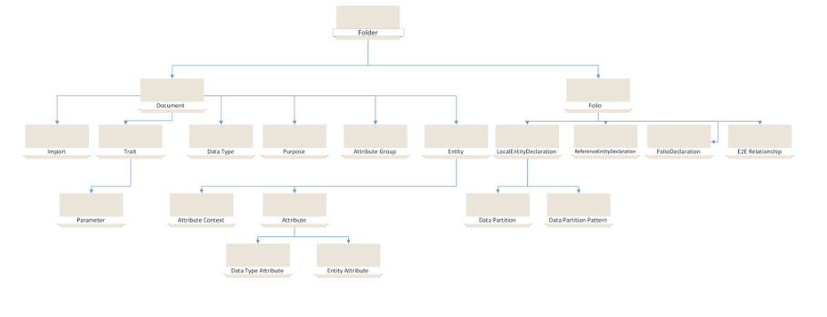

# OM Reference

Hierarchical structure of the CDM OM:

The CDM object model provides two types of classes - definition classes and reference classes. Since the OM is heavily interconnected and different concepts have different interactions among each other, in order to be able to easily reference different concepts without actually encapsulating them, the OM introduces the reference classes. Every reference class has its own corresponding definition class, and they are closely correlated. 

## Definitions

### Corpus (ICdmCorpusDef extends ICdmFolderDef)

Corpus is a top-level folder which provides the most important basic functionality to deal with the object model. Since there will usually be only one corpus when dealing with the OM, the most important APIs can be found by looking at ICdmCorpusDef in the API Reference section).

|Property|Description|
|---|---|
|DefaultNamespace *(getter/setter)*|The namespace that will be used when one is not explicitly provided.|

### Folder (ICdmFolderDef extends ICdmObjectDef, ICdmContainerDef)

Folder is a concept that provides hierarchical structure of the OM for organizing documents. Folders can contain other folders or documents.

|Property|Description|
|---|---|
|Schema *(getter/setter)*|The schema link that points to a validating schema.|
|JsonSchemaSemanticVersion *(getter/setter)*|Identifies the version of the OM that supports the file shape.|
|LastModifiedTime *(getter/setter)*|An ISO date-time-offset value to indicate the last time the folder's content was modified and persisted.|
|Name *(getter/setter)*|The name of the folder.|
|Imports *(getter/setter)*|The list of imports (similar as a Document contains).|
|ChildFolders *(getter/setter)*|The direct children for the directory folder.|
|Documents *(getter/setter)*|The child documents for the directory folder.|

### Document  (ICdmDocumentDef extends ICdmContainerDef)

Document is a concept which enables the OM to have a persisted state. Every document can contain different CDM definitions such as entities, data partitions or attributes.

|Property|Description|
|---|---|
|Definitions *(getter)*|The document's definitions - can be any object that implements *ICdmObjectDef*.|
|Folder *(getter/setter)*|The document's folder. This property will eventually be replaced by *ICdmObject*'s *Owner* property.|
|Imports *(getter)*|The list of corpus paths / monikers that denote CDM objects that need to be imported in order to use the document.|
|Name *(getter/setter)*|The name of the folder.|
|Imports *(getter/setter)*|The document's name.|
|Schema *(getter/setter)*|The schema link that points to a validating schema.|
|JsonSchemaSemanticVersion *(getter/setter)*|Identifies the version of the OM that supports this file shape.|

### Folio (ICdmFolioDef extends ICdmObjectDef, ICdmDocumentDef, ICdmFileStatusExtended)

Folio is a top-level document with the new extension '.folio.cdm.json'. Folio can reference different documents (e.g. referencing the documents containing entities with the extension '.cdm.json').

|Property|Description|
|---|---|
|FolioName *(getter/setter)*|The folio's name.|

### Entity (ICdmEntityDef extends ICdmObjectDef, ICdmReferenceEntities)

Entity is a basic building block of the OM and as a concept it provides a concrete placeholder for a user to attach certain information to the concept. It is a collection of attributes that create some semantic meaning why these attributes exist together. Since entities can inherit from other entities, this makes possible for entities to represent a hierarchical structure. The hierarchical structure can be removed from the entities by resolving them (see ResolvedModel section).

|Property|Description|
|---|---|
|AttributeContext *(getter/setter)*|See *AttributeContext*.|
|CdmSchemas *(getter/setter)*|The list of the CDM entities that the described entity "contains" or implements (a set of contracts or interfaces).|
|Description *(getter/setter)*|The entity's description.|
|DisplayName *(getter/setter)*|The entity's display name.|
|EntityName *(getter/setter)*|The entity's name.|
|ExtendsEntity *(getter/setter)*|The entity extended by this entity.|
|HasAttributes *(getter)*|The list of entity attributes.|
|SourceName *(getter/setter)*|The entity's source name, the original entity name from another source system (e.g. *Dynamics*).|
|Version *(getter/setter)*|The entity's version.|

### Trait (ICdmTraitDef extends ICdmObjectDef)

Trait is a concept that helps in expressing semantic meaning and structural guidance. Traits are essentially metadata's metadata. Traits can extend other traits and have format that is easy to understand and follow. (E.g. *is.partition.format.CSV* trait describes data partition CSV format and has parameters which can provide additional information such as which character to use as a delimiter). 

|Property|Description|
|---|---|
|AssociatedProperties *(getter/setter)*|The properties for the entity or attribute that the trait contributes to (using trait2propertyMap).|
|Elevated *(getter/setter)*|Denotes whether a trait is elevated, e.g. if an attribute has an elevated trait, that trait should also be applied to the outer entity.|
|ExtendsTraits *(getter/setter)*|The trait extended by this trait.|
|HasParameters *(getter)*|The trait's parameters.|
|TraitName *(getter/setter)*|The trait's name.|
|Ugly *(getter/setter)*|False if the trait is user facing, true otherwise.|

### Import (ICdmImportDef extends ICdmObject)

Import is a concept used by documents to provide files/documents which need to be imported first.

|Property|Description|
|---|---|
|CorpusPath *(getter/setter)*|The import's corpus path.|
|Moniker *(getter/setter)*| A nickname used for imports to specify which document to import in the case of duplicate symbols (e.g. we might have multiple Account documents, but by specifying a moniker 'base_Account', we can pinpoint the exact document).|
|ResolvedDocument *(getter)*|The document that has been resolved for this import.|

### Data Type (ICdmDataTypeDef extends ICdmObjectDef)

Data type is a concept to provides ability to assign different data types to attributes such as string, boolean, etc.

|Property|Description|
|---|---|
|DataTypeName *(getter/setter)*|The data type's name.|
|ExtendsDataType *(getter/setter)*|The data type extended by this data type.|

### Purpose (ICdmPurposeDef extends ICdmObjectDef)

Purpose is a concept that provides to an attribute what it does for an entity (e.g. *SortedBy*, *NamedBy*). 

|Property|Description|
|---|---|
|ExtendsPurpose *(getter/setter)*|The reference to the purpose extended by this purpose.|
|PurposeName *(getter/setter)*|The purpose name.|

### Parameter (ICdmParameterDef extends ICdmObject)

Parameter is a concept that provides ability to specify parameters that should a trait contain. By providing name, default values and supported data types, trait references are being restricted in which arguments they can contain. Parameters are defined for traits in the *CDM.SchemaDocuments* repository.

|Property|Description|
|---|---|
|Explanation *(getter/setter)*|The parameter's explanation.|
|Name *(getter/setter)*|The parameter's name.|
|DefaultValue  *(getter/setter)*|The parameter's default value.|
|Required *(getter/setter)*|Whether the parameter is required.|
|DataTypeRef *(getter/setter)*|The data type's reference.|

### Attribute (ICdmAttributeDef extends ICdmAttributeItem)

Attribute definition is a definition that only happens inside other definitions and unlike references it has applied traits instead of exhibit traits. Attributes can either be entity attributes or data type attributes. Entity attributes have references to another entity while data type attributes represent a specific data type (See *ICdmDataTypeDef*).

|Property|Description|
|---|---|
|Explanation *(getter/setter)*|The attribute's explanation.|
|Name *(getter/setter)*|The attribute's name.|
|Purpose  *(getter/setter)*|See *Purpose*.|
|Resolution Guidance *(getter/setter)*|The properties that guide the resolution of this attribute and interact with directives (see *ICdmAttributeResolutionGuidanceDef*).|

### Attribute Group (ICdmAttributeGroupDef extends ICdmObjectDef, ICdmReferencesEntities)

Attribute group is a concept which represents a group of attribute items (See ICdmAttributeItem) that provide similar role. 

|Property|Description|
|---|---|
|AttributeContext *(getter/setter)*|The attribute group context.|
|AttributeGroupName *(getter/setter)*|The attribute group name.
|Members  *(getter/setter)*|The list of attribute group items for the attribute group.|

### Attribute Item (ICdmAttributeItem extends ICdmObjectDef, ICdmReferencesEntities)

Attribute item is a concept which represents the base class for the attribute.

|Property|Description|
|---|---|
|AppliedTraits *(getter/setter)*|The attribute's applied traits.|

### Type Attribute (ICdmTypeAttributeDef extends ICdmAttributeDef)

Type attribute is a concept which defines data type attributes alongside with supported functionality such as custom default values and description. Model.JSON attributes are converted into CDM type attributes.

|Property|Description|
|---|---|
|AttributeContext *(getter/setter)*|The attribute context of the attribute.|
|DataFormat *(getter/setter)*|The attribute's data format in a string format derived from traits (string, int, etc).|
|DataType *(getter/setter)*|The attributes' data type, a CDM reference object (See *ICdmDataTypeRef*).|
|DefaultValue *(getter/setter)*|The type attribute's default value.|
|Description *(getter/setter)*|The type attribute's description.|
|DisplayName *(getter/setter)*|The type attribute's display name.|
|IsNullable? *(getter/setter)*|Whether the type attribute can be null or not.|
|IsPrimaryKey? *(getter/setter)*|Whether the type attribute is the primary key.|
|MaximumLength *(getter/setter)*|The type attribute's maximum length.|
|MaximumValue *(getter/setter)*|The type attribute's maximum value (for data types that makes sense like integers).|
|SourceName *(getter/setter)*|The type attribute's source name.|
|SourceOrdering? *(getter/setter)*|An integer which denotes in which order do attributes exist in some underlying source system.|
|ValueConstrainedToList? *(getter/setter)*|Whether the type attribute's value is constrained to a list, the values can only be from enums.|
|MinimumValue *(getter/setter)*|The type attribute's minimum value (for data types that makes sense like integers).|