# The Dynamics 365 Nonprofit Accelerator

The Dynamics 365 Nonprofit Accelerator and Common Data Model for Nonprofits help organizations eliminate data silos, enabling powerful insights into their data. Microsoft is dedicated to working with nonprofits and partners to develop solutions based on entities and attributes that nonprofits commonly use for constituent management, fundraising, awards, program delivery, and impact tracking. 

These entities include, donor commitments, designations, transactions, awards, disbursements, delivery frameworks, results, indicators, benefit recipients, and more. The Nonprofit Accelerator provides a uniform platform for customers who wish to connect, embed, or extend the Dynamics 365 platform and Power Platform and benefit from integration with the Common Data Model for Nonprofits.

Since the initial release in November 2018 at the NetHope Global Summit we've had additional extensions and enhancements in 5 updated releases; 

- April 2019 
- July 2019
- November 2019 
- January 2020
- June 2020

The Nonprofit Accelerator provides the following to partners and nonprofit organizations:
- Extensions to the Common Data Model for Nonprofits that include industry-standard definitions of constituent management, fundraising, awards, program delivery, and impact tracking data. The model includes 90+ entity data definitions and relationships.
- A Program Design template application that partners can evolve to help nonprofit program and country managers to: 
  - Create and browse logframes (logical frameworks, the building blocks of effective program design).
- Connect logframes to internal, external, and standard indicators like the United Nations Sustainable Development Goals (SDGs) in order improve program measurement and outcome tracking.
- Eight unique sample model-driven applications to help partners rapidly develop UI, workflows, and business logic to automate the management of: 

  - Awards
  - Case Management
  - Constituents
  - Delivery frameworks
  - Fundraising
  - IATI Hub
  - Project Management and Program Design
  - Volunteer Management

- Support for extending the model with custom entities, forms, and relationships that meet nonprofit needs.
- Support for building canvas apps in Power Apps.
- Sample dashboards featuring fundraising and program delivery analytics that can be extended.
- Deployable sample data to bring the sample apps to life.
- A test drive experience through AppSource with walkthroughs, reference guides, mapping guides, entity-relationship diagrams, and metadata documentation on the data model.
- Data integrator templates and mappings to integrate data from the Nonprofit Accelerator in Dynamics 365.
- Volunteer Management and IATI add-on common data models, sample model-driven apps, sample data, flows, and documentation.

## What's new?

As part of the June 2020 v2.3 release, the Nonprofit Accelerator is enhanced in three critical nonprofit areas: Case Management, Project Management & Program Design (PMPD), and Operations.  Our Case Management and PMPD enhancements include CDM extensions, sample applications, and supporting sample data to enable partners to develop and launch solutions with ease.  These extensions come at a critical time when nonprofits are under increasing pressure to handle larger volumes of beneficiaries and cases and are tackling complex projects like pivoting to delivering services via supply chain automation. Our Nonprofit Operations Toolkit application will be a lifesaver for small nonprofits looking to move their project, award, cost center, and time and expense management from spreadsheets to a modern, automated experience.

This includes:

- **Case Management data model extensions, new sample app, and sample data** – Provides building blocks for partners to implement solutions to aid nonprofit program staff in tracking clients and cases and ties cases to specific program goals by: 
  - Configure work items and work item types based on the types of clients and cases they manage.
  - Establish a workflow to help case managers enter, track, and manage each stage of a case
  - Allow case managers to tie work items and needs to indicator values, tying cases to specific program goals.
  - Track and evaluate program goals and indicators using the Work Item Dashboard.

- **Project Management & Program Design data model extensions, new sample app, and sample data** – Provides a complete delivery framework that assures delivery of programs are aligned to indicators and program objectives, budgets, and results by: 
  - Creating and tracking a theory of change that ties to the program and objectives in the delivery framework.
  - Tracks observations, decisions, deliverables, assumptions, and risks associated to the program and the theory of change. 

- **Nonprofit Operations Toolkit** – Comprehensive solution that enables delivery of a supported operation solution to help small nonprofits implement effective project and awards management processes that reduce costs and build trust with funders. With this application, nonprofits can: 
  - Manage the core records that describe your organization such as business units, currencies, offices, and planning periods.  
  - Create and manage detailed information about your workers, vendors, funders, awards, and projects. 
  - Create and manage financial plans for projects and indirect costs or plan how your workers’ time will be allocated across efforts. 
  - Collect, track and compile time and reimbursable expenses associated with projects or indirect costs. 
  - Setup integrated document storage with SharePoint, use the Excel add-in to interact directly with your data or enable data auditing

*As part of the v2.3 release, and going forward, unmanaged solutions are no longer published or available for any Microsoft Industry Accelerator, including the Nonprofit Accelerator. If you have questions, contact dynindaccsupport@microsoft.com. 

## Site-map extensions

With the Dynamics 365 Nonprofit Accelerator, nonprofits can streamline their operational management of constituents, fundraising, grant and award management, program delivery, and impact tracking. The Nonprofit Accelerator can be used with Microsoft Dynamics 365 or independently with the Common Data Model for Nonprofits core solution layer that is not dependent on Microsoft Dynamics 365. This independent solution layer can be leveraged to build Power Apps and Power BI visualizations, or to serve as a foundational layer to Modern Workplace and Azure solutions.

Nonprofits, ISVs, and others in the nonprofit sector can build their solutions and business processes on top of the new and existing entities and templates found within the Nonprofit Accelerator. The current data model supports common nonprofit activities but has been designed to allow flexibility to support other use cases and extensions.

The Nonprofit Accelerator and Common Data Model for Nonprofits are developed in collaboration with nonprofits, partners, industry experts, and open initiatives to ensure interoperability and accelerate impact to the nonprofit sector.

<!--todo: What are these photos for in the word doc?-->

## Entities and workflows

The solutions in the Nonprofit Accelerator leverage the Common Data Model for Nonprofits and can be leveraged to build solutions on the Microsoft Power Platform and/or Microsoft Dynamics 365.  Depending on the partner and organization needs, the Nonprofit Accelerator can be implemented in multiple ways with dependencies to consider with each solution. These solution packages can be referenced on [GitHub](https://github.com/microsoft/Industry-Accelerator-Nonprofit/releases) and below explains the differences:

### Data schema

- Nonprofit Core – This contains the essentials for the nonprofit accelerator including views, forms, and data entities. It has no dependency on Microsoft Dynamics 365 and is only dependent on Microsoft’s Common Data Service.
- Nonprofit Measurement – This data schema improves the way of measuring nonprofit programs and depends on the Nonprofit Core data schema. 
- MicrosoftDynamics365VolunteerManagement – This data schema supports volunteer management scenarios and depends on the Nonprofit Core, Nonprofit Sale, Dynamics 365 Sales data, and Dynamics 365 Project Service Automation data schemas. 
- MicrosoftDynamics365IATI – This data schema creates efficiencies in IATI reporting compliance and depends on Nonprofit Core, Nonprofit Sale, and Dynamics 365 Sales data schemas. 
- Nonprofit Sale – This data schema utilizes the campaign, lead, opportunity, and product entities and depends on Nonprofit Core, Nonprofit Sale and Dynamics 365 Sales data schemas. 

### Functionality

- Program Design – In order to support this application, this solution depends on Nonprofit Core and Nonprofit Measurement data schemas. 
- Nonprofit Operations Toolkit - In order to support this application, this solution depends on the Nonprofit Core data schemas. 
- Common Data Model for Nonprofits Sample Apps - In order to support this application, this solution depends on the Nonprofit Core data schema.

The following illustration explains the solution layer dependencies. 

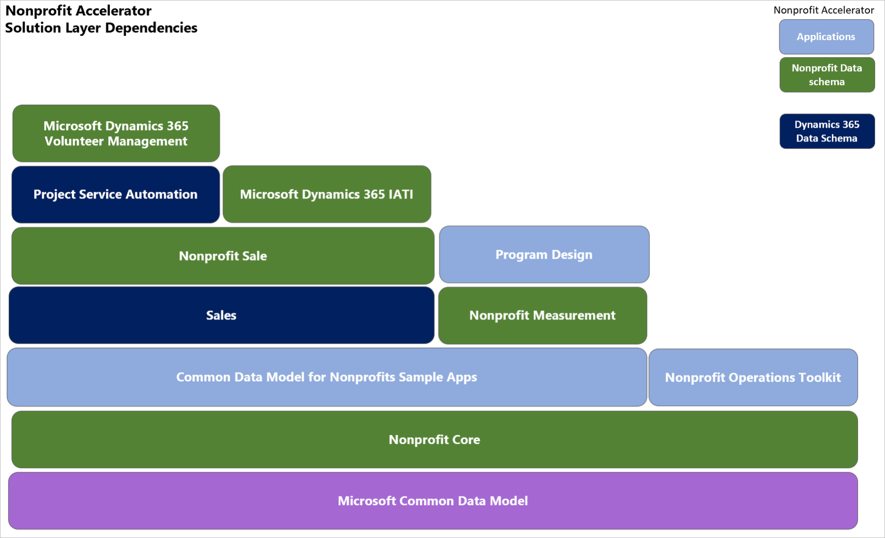

This table shows the data entities that are available in each solution package.

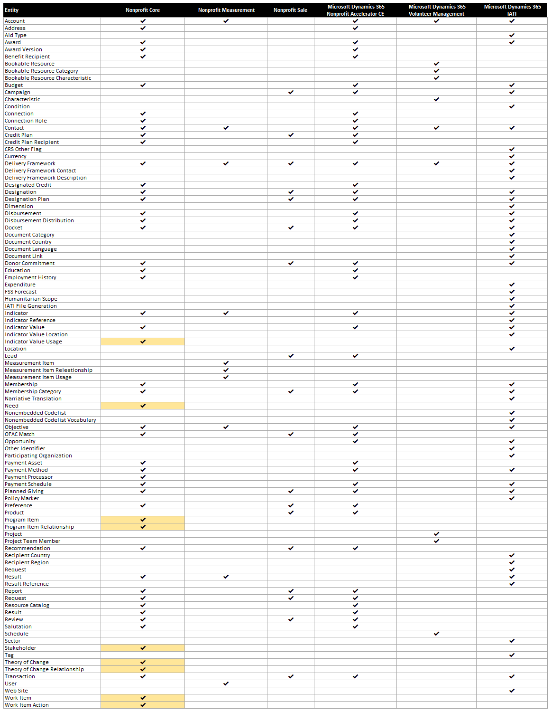

## Forms, dashboards, and applications

The Nonprofit Accelerator combines standard Microsoft Common Data Model entities with customized nonprofit entities. This section describes the forms, views, and dashboards that demonstrate the entities in the data model as well as applications that build out business rules.

This includes the following: 

Entities shown in the sample model-driven applications:

- Constituent management 
- Donation management 
- Fundraising 
- Awards management 
- Program Delivery 
- Volunteer management  
- Membership management 
- IATI processes  
- Finance and CRM data integrator 
- Case management 
- Project management and program design

Applications using entities with built-out process and business rules:

- Program Design application 
- Nonprofit Operations Toolkit

### Constituent management

Complete constituent profiles for individuals, households, and organizations, including biographical details, communication methods, preferences, relationships, salutations, employment and education history, donations, and awards Management.

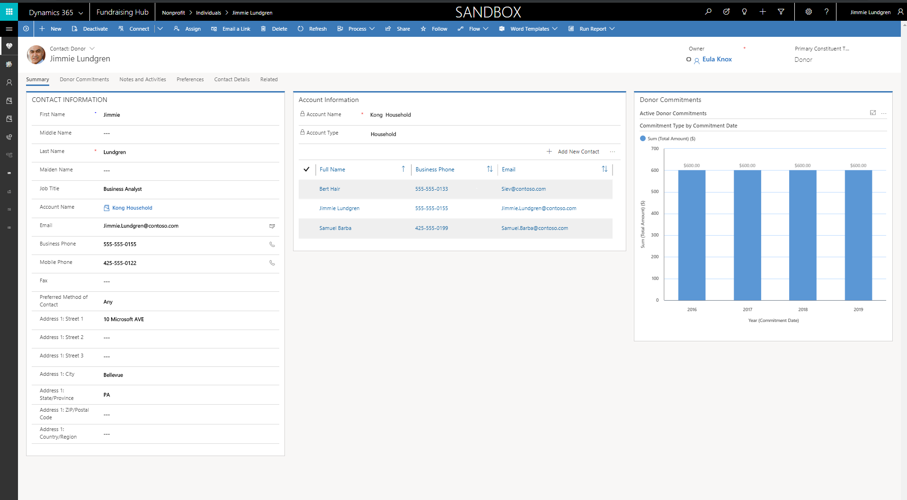

### Donation management

The sample dashboard for donations includes gift acknowledgements, tracking of individual and organizational pledges and gifts, one-time and recurring gifts, gifts in kind, and grant disbursements.

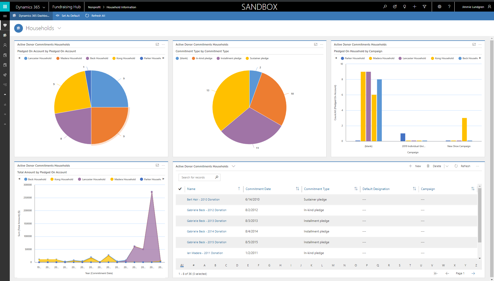

### Fundraising

The Nonprofit Accelerator can track all major stages of high-touch fundraising. 

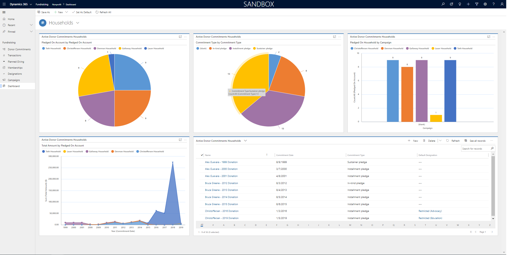

### Awards management

Awards management data model and sample application including dockets, inquiries, requests, awards recommendations, reviews, reports, budgets, and disbursements.

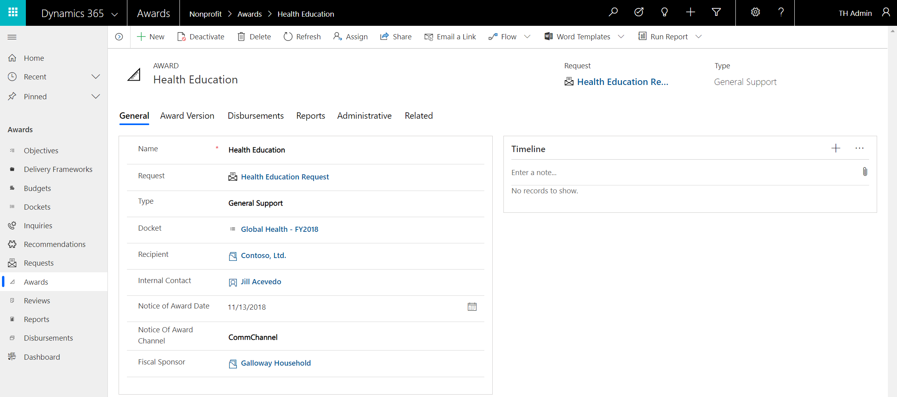

### Program delivery 

Outcome and result model enables nonprofits to efficiently deliver on their missions, measure results, and communicate impact that includes aligning beneficiaries and funds to the results framework.

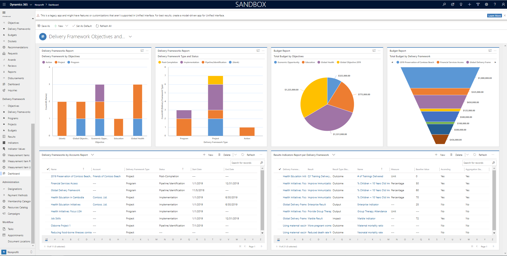

### Volunteer management

Track volunteer preferences, skills, availability, and establish Volunteer Projects leveraging Dynamics 365 Project Service Automation.

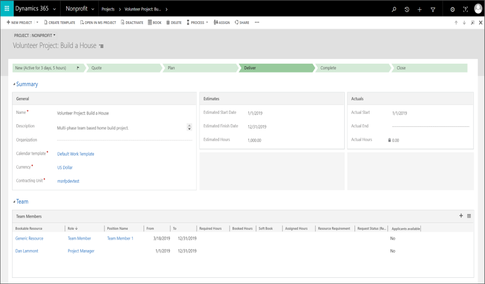

### Membership management

The Membership Category entity establishes membership levels and Membership entity that links Constituents to Membership Category, enabling the creation and tracking of membership over time.

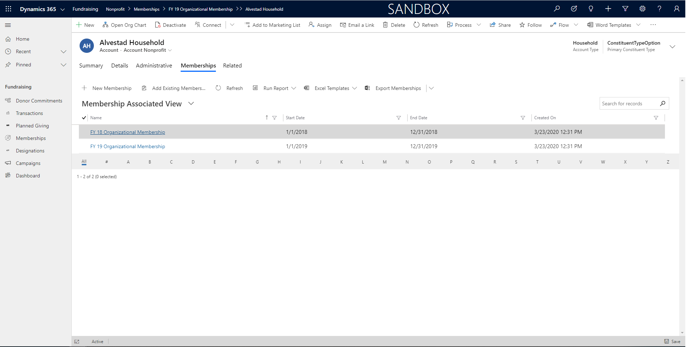

## IATI processes

[IATI](https://iatistandard.org) is a global campaign to create transparency in the records of how aid money is spent. The initiative hopes to ensure that aid money reaches its intended recipients with goals of improving standards of living worldwide and reducing poverty globally. Nonprofits can now record their fundraising and programmatic activities according to the IATI Organizational and Activity Standards, sync IATI non-embedded code lists with the Nonprofit Accelerator, and generate IATI Organization and Activity XML files from the Nonprofit Accelerator.  

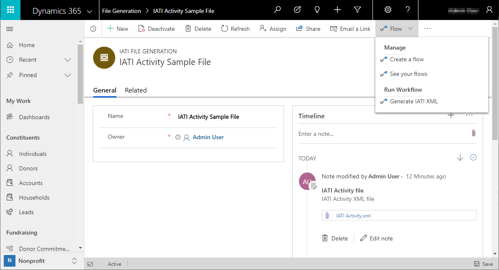

### Finance and CRM data integrator

Template data integrator tasks to connect Nonprofit Accelerator Constituents, Donations, Awards, and Programs to Finance and Operations.

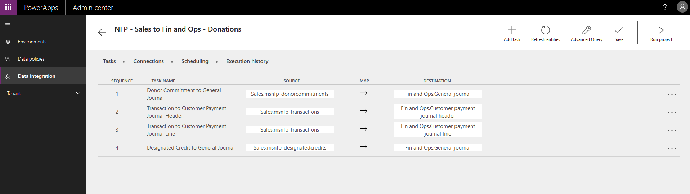

### Case management

Provides building blocks for partners to aid program staff in tracking clients and cases tying cases to specific program goals. 

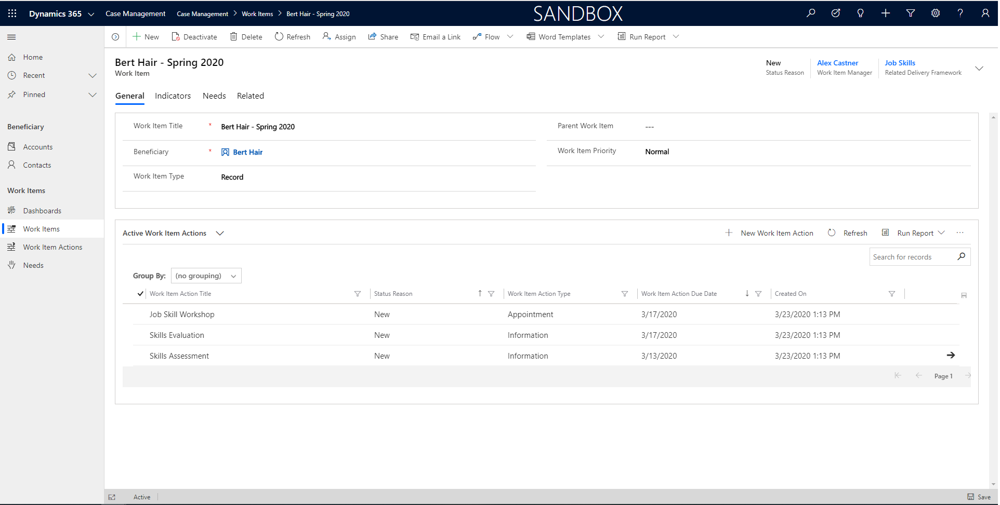

### Project management and program design

Build a complete delivery framework that tracks activities and progress to a theory of change assuring delivery of programs aligned to indicators and program objectives, budgets, and results.

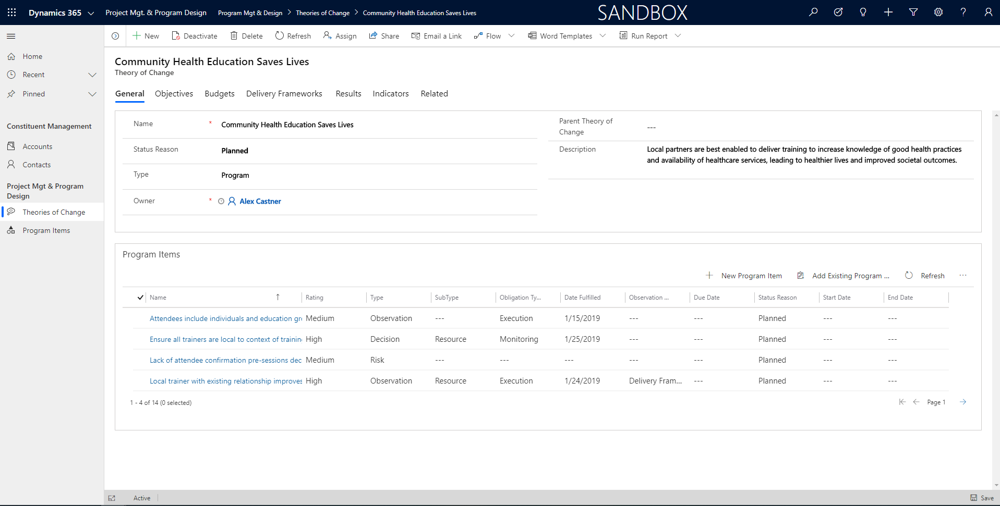

### Program design application

Workflows build on Program Delivery and Results entities that allow a program officer to build, edit, or delete a logframe (logical framework), associate it with an internal, external, or standard indicator set like the United Nations Sustainable Development Goals (SDGs), browse the logframe library, collaborate on logframe development through Microsoft Teams, Outlook, and Word, and track the status and delivery milestones of the logframe.

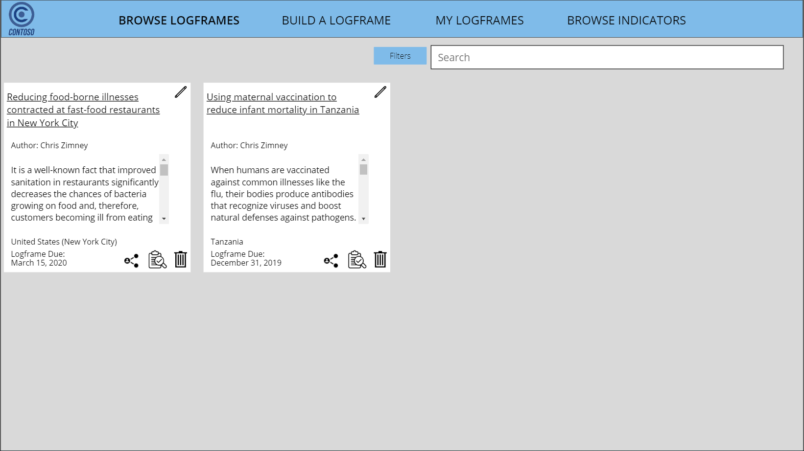

## Nonprofit operations toolkit

Small nonprofits are able to centrally manage their award budgets, have workers enter time and expenses through a mobile application, approve submitted time and expenses, and track costs to the budget.

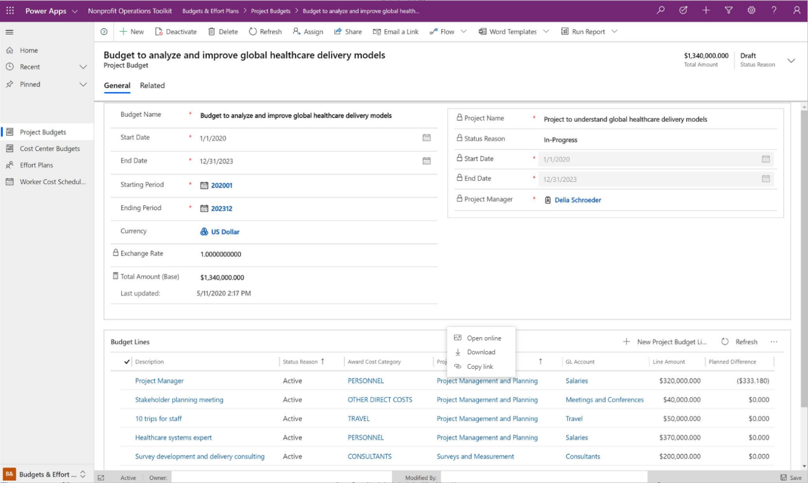

Mobile application

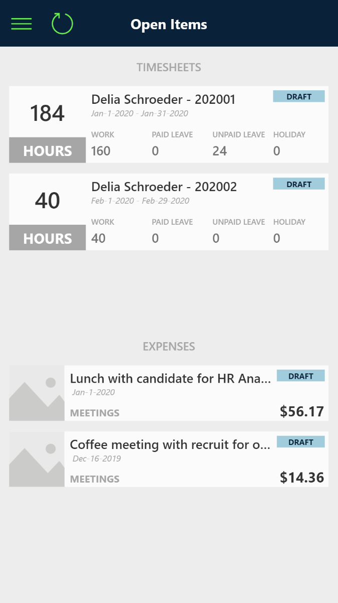

## Additional resources

<!--Is there a way to open links in a new tab?-->
- Download the [Dynamics 365 Nonprofit Accelerator](https://appsource.microsoft.com/product/dynamics-365/msnfp.msftnonprofitcommondatamodel?src=office&tab=Overview) from AppSource.
- The Nonprofit data model, solutions, data samples, data samples, SDK extensions, and more are provided as part of the open-source creative license and available on [Github](https://github.com/microsoft/Industry-Accelerator-Nonprofit/releases).
- [Additional topics](https://community.dynamics.com/365/b/dynamics365isvsuccess/archive/2018/08/01/dynamics-365-brings-industry-focus-through-the-microsoft-power-platform-and-solution-accelerators) about the accelerators.

