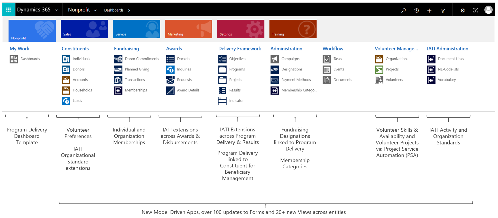
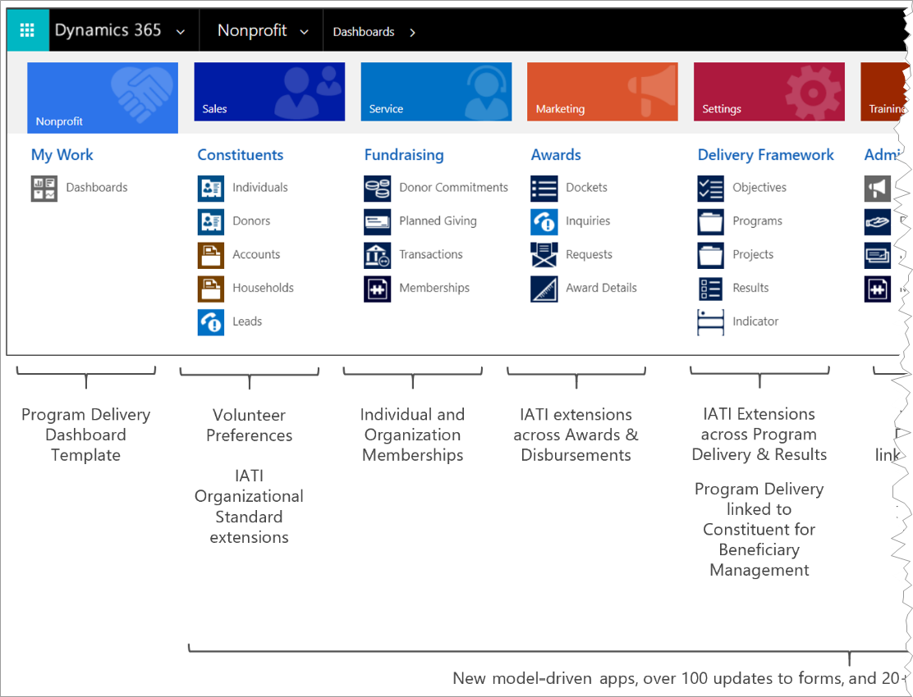
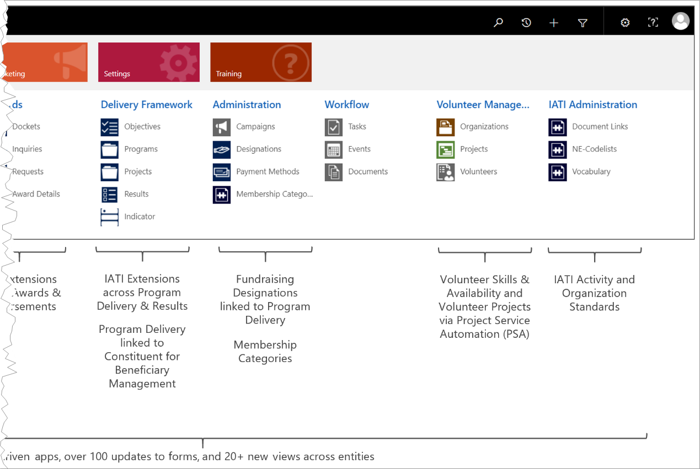
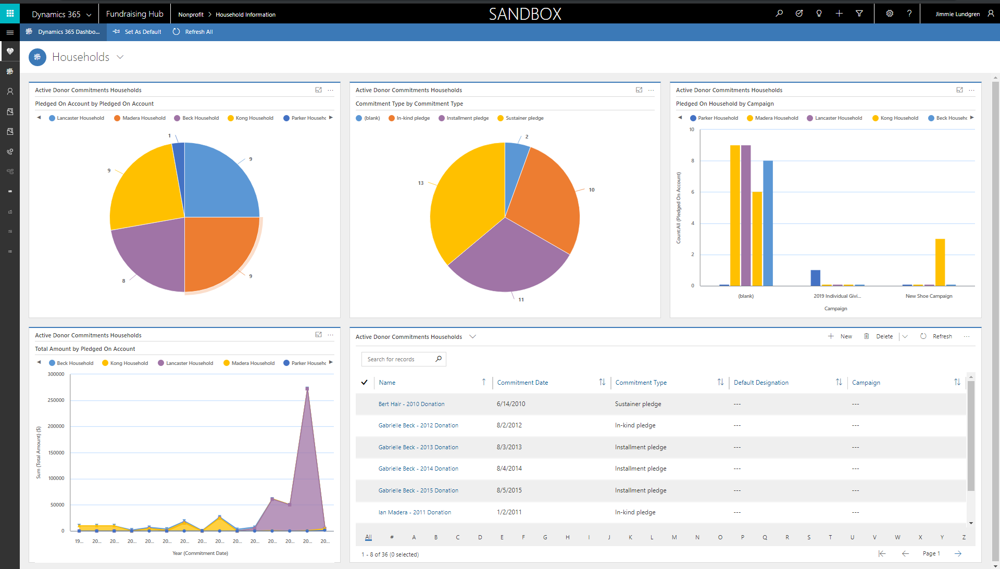
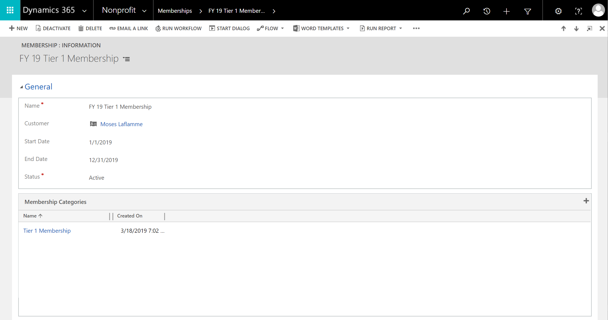
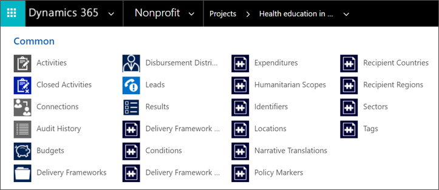
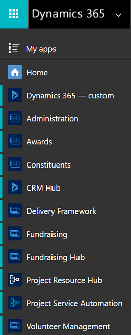

# The Dynamics 365 Nonprofit Accelerator

This accelerator was announced at the initial Microsoft CXO Summit in [April 2018](https://blogs.microsoft.com/on-the-issues/2018/04/20/new-solutions-to-help-nonprofits-drive-impact) and released in [November 2018](https://blogs.microsoft.com/on-the-issues/2018/11/08/new-dynamics-365-nonprofit-accelerator-supports-organizations-with-end-to-end-solutions)
at the [NetHope Global Summit](https://youtu.be/eV4N0mK0-so?t=2169). The initial release includes these features:

- Extension of the Common Data Model (CDM) to include concepts for managing constituents, raising funds, grants/awards, program delivery, and tracking impact, including entity definitions and relationships.

- Individual, Household and Organization customer-engagement forms that you
    can enhance or use out of the box.

- A sample app for managing constituents that demonstrates some possibilities of
    the Unified Interface.

- Support for building canvas and model-driven apps in PowerApps.

- Support for extending the model with custom entities, forms, and
    relationships that meet your nonprofit needs.

- Support for analytics.

- A solution that's based on Common Data Service and that you can install from AppSource.

- Documentation that helps you adopt the accelerator.

## Sitemap extensions

With the Nonprofit Accelerator plugged in to the Dynamics 365 platform, you can optimize individual aspects of nonprofit business processes, including raising funds, managing grants and awards, program delivery, and tracking impact. You can also leverage the entire constituent-engagement solution within Dynamics 365.

This accelerator adds a nonprofit layer to the rich feature set of the base Dynamics 365 functionality by adding nonprofit entities to record detailed constituent profiles for individuals, households, and organizations. The current data model supports end-to-end fundraising, grants/awards lifecycles, standards-based program delivery, and impact tracking based on the [IATI
standard](https://iatistandard.org/en/).

## Entities and workflows

These entities are built in to the Nonprofit Accelerator (\*New with version 2.0 - released March 2019):

| **Constituent**  | **Fundraising**   | **Grants/Awards**         | **Program Delivery & Impact Tracking** | **Optional IATI Add-On**         |
|------------------|-------------------|---------------------------|----------------------------------------|----------------------------------|
| Account          | Lead              | Lead                      | Objective                              | Condition                        |
| Contact          | Opportunity       | Opportunity               | Delivery Framework                     | Participating Org                |
| Address          | Campaign          | Campaign                  | Budget                                 | Location                         |
| Connection       | Designation       | OFAC Match                | Result                                 | Delivery Framework Contact       |
| Salutation       | Designation Plan  | Docket                    | Indicator                              | Identifier                       |
| Employment       | Credit Plan       | Recommendation            | Indicator Value                        | Delivery Framework Description   |
| Education        | Credit Recipient  | Request                   |                                        | Recipient Country                |
| Preference       | Designated Credit | Report                    |                                        | Recipient Region                 |
| Volunteers*      | Donor Commitment  | Award                     |                                        | Sector                           |
| Membership*      | Planned Giving    | Award Version             |                                        | Expenditure                      |
| Connection*      | Payment Schedule  | Review                    |                                        | Humanitarian Scope               |
| Connection Role* | Payment Asset     | Disbursement              |                                        | Policy Marker                    |
|                  | Transaction       | Objective                 |                                        | Result Reference                 |
|                  | Payment Method    | Delivery Framework        |                                        | Indicator Reference              |
|                  | Payment Processor | Budget                    |                                        | Indicator Value Location         |
|                  |                   | Disbursement Distribution |                                        | Dimension                        |
|                  |                   |                           |                                        | Narrative Translation            |
|                  |                   |                           |                                        | Non-Embedded Codelist            |
|                  |                   |                           |                                        | Non-Embedded Codelist Vocabulary |
|                  |                   |                           |                                        | Document Link                    |
|                  |                   |                           |                                        | Document Category                |
|                  |                   |                           |                                        | Document Language                |
|                  |                   |                           |                                        | Document Country                 |
|                  |                   |                           |                                        | Tag                              |

## Forms and dashboards

The Nonprofit Accelerator combines standard Dynamics 365 entities with entities that are customized specifically for nonprofit use cases to help you build nonprofit industry solutions. This section provides examples of the forms and dashboards that demonstrate the entities in the Dynamics 365 Nonprofit Common Data Model.

### Constituent management

Complete constituent profiles for individuals, households, and organizations, including biographical details, communication methods, preferences, relationships, salutations, employment and education history, donations, and grants/awards.

### Donation management

The sample dashboard for donations includes gift acknowledgement, tracking of individual and organizational pledges and gifts, one-time and recurring gifts, gifts in kind, and grant disbursements.

### Indicators and indicator values

Program Delivery & Results entity that details what will be measured to track evidence of impact and qualitative or quantitative measurements of evidence of impact.

### Volunteer preferences, skills, and availability

Track volunteer preferences, skills and availability and establish Volunteer Projects leveraging Dynamics 365 Project Service Automation

### Membership

Membership Category entity that establishes membership levels and Membership entity that links Constituents to Membership Category, enabling the creation and tracking of membership over time.

### IATI (optional add-on)

[IATI](https://iatistandard.org/en/) is a global campaign to create transparency in the records of how aid money is spent. The initiative hopes to ensure that aid money reaches its intended recipients with the goal of improving standards of living worldwide and globally reduce poverty.  Nonprofits can now record their fundraising and programmatic activities according to the IATI Organizational and Activity Standards.

### Model-driven apps

New with Version 2.0 are model-driven apps for Constituents, Fundraising, Awards, Delivery Frameworks, Volunteer Management, and Administration.

## More resources

- Download the Dynamics 365 Nonprofit Accelerator from
    [AppSource](https://appsource.microsoft.com/product/dynamics-365/msnfp.msftnonprofitcommondatamodel?src=office&tab=Overview).

- The nonprofit Common Data Model, solutions, data samples, Power BI examples,
    SDK extensions, and more are provided as part of the open-source creative
    license available on
    [GitHub](https://github.com/Microsoft/Industry-Accelerator-Nonprofit).

- First look at the [Nonprofit
    Accelerator](https://community.dynamics.com/365/b/dynamics365isvsuccess/archive/2018/11/08/a-first-look-at-the-dynamics-365-nonprofit-accelerator).

- [Additional
    topics](https://community.dynamics.com/365/b/dynamics365isvsuccess/archive/2018/08/01/dynamics-365-brings-industry-focus-through-the-microsoft-power-platform-and-solution-accelerators) about the accelerators.
