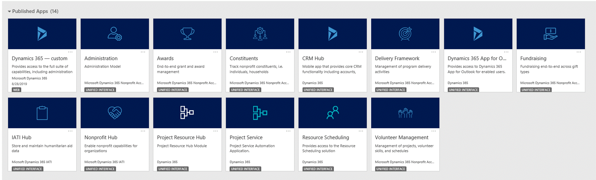
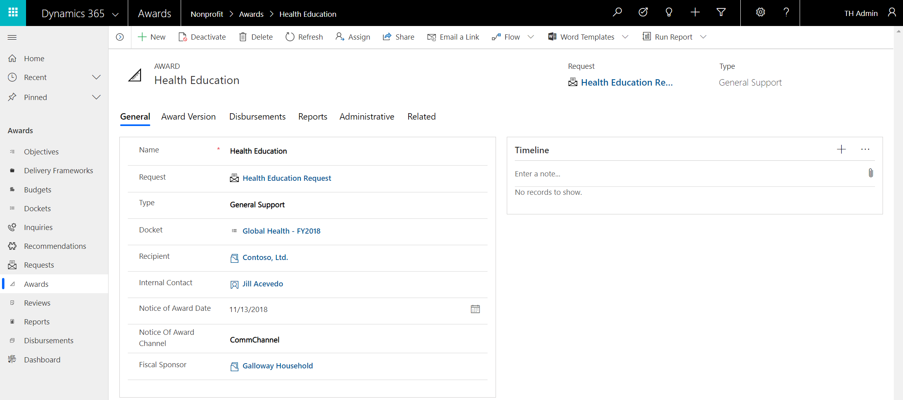
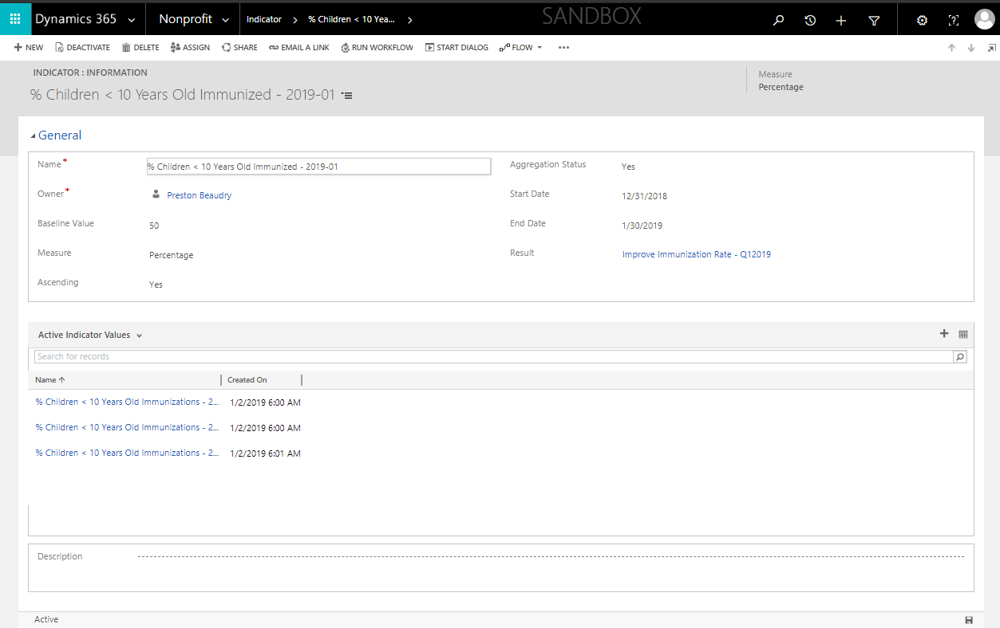
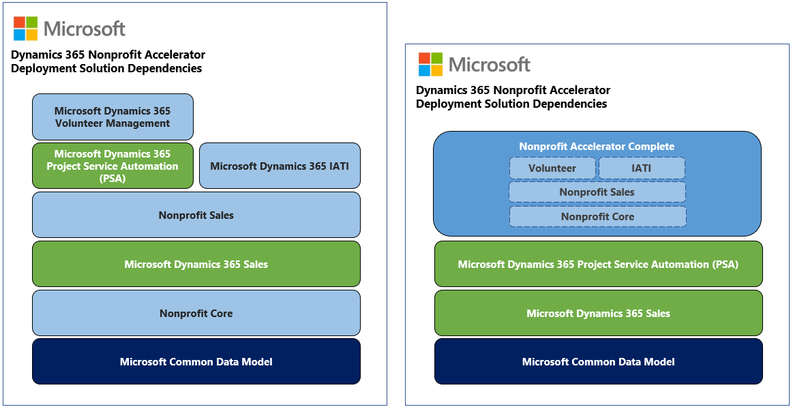
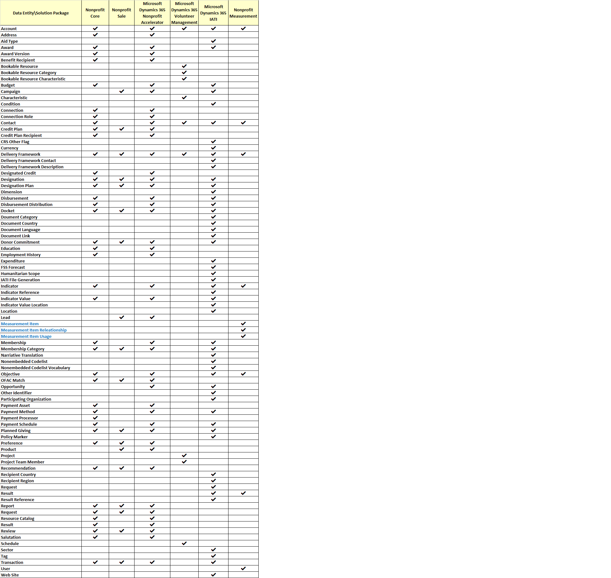

# The Dynamics 365 Nonprofit Accelerator

With the Dynamics 365 Nonprofit Accelerator, you can develop nonprofit solutions
based on entities and attributes that nonprofits commonly leverage for
constituent management, fundraising, awards, program delivery and impact
tracking. These entities include but are not limited to donor commitments,
designations, transactions, awards, disbursements, delivery frameworks, results,
indicators, benefit recipients and more. The Accelerator includes the Common
Data Model for Nonprofits, sample apps, sample data, dashboards and
documentation.

This accelerator was announced at the initial Microsoft CXO Summit in [April
2018](https://blogs.microsoft.com/on-the-issues/2018/04/20/new-solutions-to-help-nonprofits-drive-impact)
and initially released in [November
2018](https://blogs.microsoft.com/on-the-issues/2018/11/08/new-dynamics-365-nonprofit-accelerator-supports-organizations-with-end-to-end-solutions)
at the [NetHope Global Summit](https://youtu.be/eV4N0mK0-so?t=2169). Version 2.0
of the Accelerator was announced at the Microsoft CXO Summit in [April
2019.](https://cloudblogs.microsoft.com/dynamics365/bdm/2019/04/04/dynamics-365-nonprofit-accelerator-a-community-solution-to-drive-social-impact/)
and v2.1 in [July
2019](https://cloudblogs.microsoft.com/dynamics365/bdm/2019/07/11/accelerating-opportunities-for-isvs-with-new-programs-and-technology/).

The Nonprofit Accelerator provides the following to partners and customers:

-   Extension of the Common Data Model including concepts for constituent
    management, fundraising, awards, program delivery and impact tracking,
    including entity definitions and relationships.

-   Sample model-driven apps that show how Dynamics 365 and the nonprofit data
    model can be used including constituent management, fundraising, awards and
    delivery frameworks.

-   Support for extending the model with custom entities, forms, and
    relationships that meet your nonprofit needs.

-   Support for building canvas apps in PowerApps.

-   Sample dashboards that provide analytics around fundraising and program
    delivery.

-   A package that you can deploy and install including sample data.

-   Test drive experience through AppSource with walkthroughs, reference guides,
    mapping guides, entity-relationship diagrams and metadata documentation on
    the data model.

-   Optional data integrator templates and mappings for integrating data from
    the Nonprofit Accelerator in Dynamics 365

-   Optional volunteer management and IATI add-on common data models, sample
    model-driven apps, sample data, flows and documentation

## Sitemap extensions

When the Nonprofit Accelerator is installed into Dynamics 365, the experience is
transformed into one specifically built for nonprofits. It enables you to
optimize nonprofit operational processes including constituent management,
fundraising, awards, program delivery and impact tracking based on the [IATI
standard](https://iatistandard.org/en/). You can also leverage the entire
constituent-engagement solution within Dynamics 365.

Nonprofits, ISVs, and others in the nonprofit sector can build their solutions
and business processes on top of the new entities and templates found within the
Nonprofit Accelerator. The current data model supports common nonprofit
activities but has been designed to allow flexibility to support other use
cases.

The Nonprofit Accelerator and nonprofit common data model are developed in
collaboration with nonprofits, partners, industry experts and open initiatives
to ensure interoperability and accelerate nonprofit impact.

## Entities and workflows

These entities are built into the Nonprofit Accelerator (\*New with version 2.1
General Availability - released August 2019):

| **Constituent** | **Fundraising**   | **Awards**                | **Program Delivery & Impact Tracking** | **Optional IATI Add-On**         |
|-----------------|-------------------|---------------------------|----------------------------------------|----------------------------------|
| Account         | Campaign          | Award                     | Benefit Recipient\*                    | Aid Type\*                       |
| Address         | Credit Plan       | Award Version             | Budget                                 | Condition                        |
| Connection      | Credit Recipient  | Budget                    | Delivery Framework                     | CRS Other Flag\*                 |
| Connection Role | Designated Credit | Campaign                  | Indicator                              | Delivery Framework Contact       |
| Contact         | Designation       | Delivery Framework        | Indicator Value                        | Delivery Framework Description   |
| Education       | Designation Plan  | Disbursement              | Objective                              | Dimension                        |
| Employment      | Donor Commitment  | Disbursement Distribution | Resource Catalog\*                     | Document Category                |
| Membership      | Lead              | Docket                    | Result                                 | Document Country                 |
| Preference      | Opportunity       | Lead                      |                                        | Document Language                |
| Salutation      | Payment Asset     | Objective                 |                                        | Document Link                    |
| Volunteer       | Payment Method    | Opportunity               |                                        | Expenditure                      |
|                 | Payment Processor | Recommendation            |                                        | FSS Forecast\*                   |
|                 | Payment Schedule  | Report                    |                                        | Humanitarian Scope               |
|                 | Planned Giving    | Request                   |                                        | IATI File Generation\*           |
|                 | Transaction       | Review                    |                                        | Identifier                       |
|                 |                   | Award                     |                                        | Indicator Reference              |
|                 |                   |                           |                                        | Indicator Value Location         |
|                 |                   |                           |                                        | Location                         |
|                 |                   |                           |                                        | Narrative Translation            |
|                 |                   |                           |                                        | Non-Embedded Codelist            |
|                 |                   |                           |                                        | Non-Embedded Codelist Vocabulary |
|                 |                   |                           |                                        | Participating Org                |
|                 |                   |                           |                                        | Policy Marker                    |
|                 |                   |                           |                                        | Recipient Country                |
|                 |                   |                           |                                        | Recipient Region                 |
|                 |                   |                           |                                        | Result Reference                 |
|                 |                   |                           |                                        | Sector                           |

## Forms and dashboards

The Nonprofit Accelerator combines standard Dynamics 365 entities with entities
that are customized specifically for nonprofit use cases to help you build
nonprofit industry solutions. They include:

-   Constituent management 

-   Donation management 

-   Fundraising 

-   Grants/Awards management 

-   Program delivery 

-   Aligning beneficiaries to program delivery  

-   Aligning funds to results framework 

-   Volunteer management  

-   Membership management 

-   IATI processes  

This section provides examples of the forms and dashboards that demonstrate the
entities in the Common Data Model for Nonprofits.

### Constituent management

Complete constituent profiles for individuals, households, and organizations,
including biographical details, communication methods, preferences,
relationships, salutations, employment and education history, donations, and
grants/awards.

### Donation management

The sample dashboard for donations includes gift acknowledgement, tracking of
individual and organizational pledges and gifts, one-time and recurring gifts,
gifts in kind, and grant disbursements.

### Award management

End-to-end Award management data model and sample application including dockets,
inquiries, requests, awards recommendations, reviews, reports, budgets and
disbursements.

### Indicators and indicator values

Program Delivery and Results entities that detail what will be measured to track
evidence of output-outcome-impact and qualitative or quantitative point-in-time
measurements of evidence of output-outcome-impact.

### Volunteer Preferences, Skills and Availability

Track volunteer preferences, skills and availability and establish Volunteer
Projects leveraging Dynamics 365 Project Service Automation.

### Membership

Membership Category entity that establishes membership levels and Membership
entity that links Constituents to Membership Category, enabling the creation and
tracking of membership over time.

### IATI (Optional Add-On)

[IATI](https://iatistandard.org/en/) is a global campaign to create transparency
in the records of how aid money is spent. The initiative hopes to ensure that
aid money reaches its intended recipients with the goal of improving standards
of living worldwide and globally reduce poverty. Nonprofits can now record their
fundraising and programmatic activities according to the IATI Organizational and
Activity Standards, sync IATI non-embedded code lists with the Nonprofit
Accelerator and generate IATI Organization and Activity XML files from the
Nonprofit Accelerator.  

### Nonprofit Accelerator for Finance and Operations and PowerApps Data Integrator (Optional Add-On)

Template data integrator tasks to connect Nonprofit
Accelerator Constituents, Donations, Awards and Programs to Finance and
Operations.

## Solution options

Depending on the partner and organization needs, the Dynamics 365 Nonprofit
Accelerator can be implemented in multiple ways with dependencies to consider
with each solution. These solution packages can be referenced on
[GitHub](https://github.com/microsoft/Industry-Accelerator-Nonprofit/releases).
The solution package options include:

-   **NonprofitCore** – This contains the essentials for the nonprofit
    accelerator including views, forms and data entities and has no dependency
    on Microsoft Dynamics 365 and is only dependent on Microsoft’s Common Data
    Service.

- **NonprofitSales** – This solution contains the additions to the Nonprofit
Core solution that leverage Dynamics 365 Sales module, including campaign,
lead, opportunity and product. This solution depends on:

    -   **Nonprofit Accelerator** - NonprofitCore and NonprofitSales solution packages

    -   **Dynamics 365 modules** – Dynamics Sales

-   **MicrosoftDynamics365VolunteerManagement** – This solution contains
    additions to the NonprofitCore and NonprofitSales solutions and leverages
    Dynamics 365 Project Service Automation (PSA) to support volunteer
    management scenarios. This solution depends on:

    -   **Nonprofit Accelerator** – NonprofitCore, NonprofitSales, and
    MicrosoftDynamics365Volunteer Management solution packages

    -   **Dynamics 365 modules** – Dynamics Sales and Microsoft Dynamics 365 Project
    Service Automation (PSA)

-   **MicrosoftDynamics365IATI** – This solution additions to the NonprofitCore
    and NonprofitSales solutions to improve the IATI compliance, including: IATI
    xml file export and the non-embedded sync process features. This solution
    depends on:

    -   **Nonprofit Accelerator** – NonprofitCore and NonprofitSales solution
        packages

    -   **Dynamics 365 modules** – Dynamics Sales

This illustration visually explains the solution components and dependencies:

The table below shows the data entities available in each solution package:

*“Microsoft Dynamics 365 Nonprofit Accelerator” encompassing all of the nonprofit data entities.

## Additional resources

-   Download and test the Dynamics 365 Nonprofit Accelerator from
    [AppSource](https://appsource.microsoft.com/product/dynamics-365/msnfp.msftnonprofitcommondatamodel?src=office&tab=Overview).

-   The nonprofit Common Data Model, solutions, data samples, documentation, SDK
    extensions, and more are provided as part of the open-source creative
    license available on
    [GitHub](https://github.com/microsoft/Industry-Accelerator-Nonprofit/releases)

-   [Additional
    topics](https://community.dynamics.com/365/b/dynamics365isvsuccess/archive/2018/08/01/dynamics-365-brings-industry-focus-through-the-microsoft-power-platform-and-solution-accelerators)
    about the accelerators.
