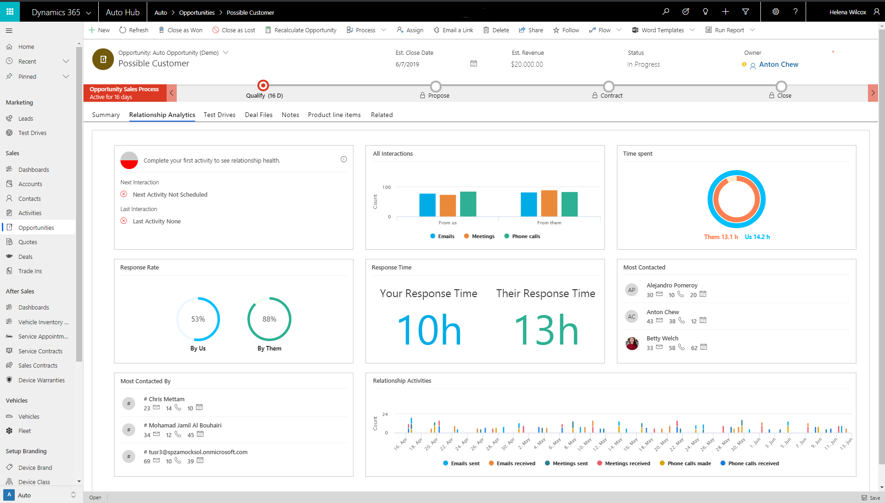
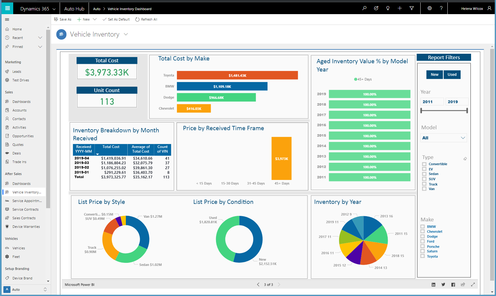

# The Dynamics 365 Automotive Accelerator

With the [Dynamics 365 Automotive Accelerator](https://appsource.microsoft.com/product/dynamics-365/msauto.msftautomotivecommondatamodel?tab=Overview), you can develop solutions based on entities and attributes that dealerships and OEMs commonly leverage for customer experience and other business processes. These entities include deals, sales contracts, specifications, fleet, warranties, inspection, test drives, branding, business, customer-vehicle relationship, vehicle and equipment, lead, service and after-sales management, and more. The accelerator includes an automotive data model, PowerBI apps, canvas and model-driven sample apps based on connected experiences.

The automotive accelerator provides the following to partners and customers:

-   Extensions to Common Data Model to include a data model that supports customer experiences, including entity definitions and relationships.
-	Sample model-driven apps to show some possibilities of how Dynamics 365 and the automotive data model can be used, including customer experience management, customer 360, connected field service, and DMS.
-	Sample canvas apps for the Fleet Manager to quickly and pro-actively schedule service appointments with service centers to show how anyone can quickly develop new apps with the Power Platform using the Automotive Accelerator.
-	Sample Power BI dashboards that provide analytics around vehicle inventory, services, lead disposition, branding, and business operation. 
-	Sample "Model.json" file to implement the automotive data model as Common Data Model folders in Azure Data Lake Storage for analytics, AI, and Machine Learning.
-	Individual solutions for Sales, After Sales, Marketing and a package that you can deploy and install, including sample data. The Automotive Common Data Model extension can also be installed using a Power Platform SKU. 
-	Test drive experience through AppSource with walkthroughs, reference guides, entity-relationship diagrams, and metadata documentation on the data model.

## Sitemap extensions

With the Dynamics 365 Automotive Accelerator, you can optimize the customer experience, streamline OEM-to-dealer integration, and gain insights from analytics. When the accelerator is installed into Dynamics 365, the experience is transformed into one specifically built for automotive and it allows partners and customers to quickly build PowerApps and Power BI visualizations.
- [**Marketing**: Test Drives - Customer Segmentation]
- [**Sales**: Deals - Trade Ins - Quotes - Activities]
- [**After Sales**: Service Appointments - Service Contracts - Sales Contracts - Device Warranties]
- [**Vehicles**: Vehicles - Fleet]
- [**Setup Branding**: Device Brand - Device Class - Device Models - Device Model Codes - Device Variant - Device Type]
- [**Setup Business**: Business - Business Facility - Business Operation]

## Entities and workflows

These entities are built in to the Automotive Accelerator:

| **Business Management**                | **Sales and Marketing**      | **Customers**            | **Service and After-Sales** | **Vehicle and Equipment Management** |
|----------------------------------------|------------------------------|--------------------------|-----------------------------|--------------------------------------|
| Aggregate KPI                          | Deal                         | Account                  | Account                     | Attribute Group                      |
| Aggregate KPI Context                  | Deal Customer                | Contact                  | Contact                     | Attribute Option                     |
| Aggregate KPI Measurement              | Deal Device                  | Customer Attachment      | Service Appointment         | Attribute Type                       |
| Business                               | Deal Device Add On           | Customer Identifier      | Service Appointment Type    | Configuration Code                   |
| Business Facility                      | Deal File                    | Customer Identifier Type | Service Contract            | Configuration Option                 |
| Business Operation                     | Deal Terms                   | Lead                     | Service Contract Detail     | Dealer Plate                         |
| Business Operation Customer Preference | Deal Type                    |                          | Service Contract Terms      | Dealer Plate Device Assignment       |
| Business Type                          | Financing Opportunity        |                          | Service Contract Type       | Device                               |
| Dealer Plate                           | Financing Opportunity Detail |                          | Service Order               | Device Brand                         |
| Dealer Plate Device Assignment         | Lead                         |                          | Service Order Group         | Device Class                         |
| Operation Code                         | Lead Device                  |                          | Service Order Job           | Device Component                     |
| Operation Type                         | Lead Device Specification    |                          | Service Order Job Detail    | Device Generation                    |
| Lead                                   | Lead Disposition             |                          | Service Order Job Type      | Device Inspection                    |
|                                        | Lead Disposition Activity    |                          | Service Order Type          | Device Inspection Checklist          |
|                                        | Lead Price Type              |                          | Warranty                    | Device Inspection Checklist Type     |
|                                        | Lead Prospect                |                          | Warranty Limit              | Device License Plate                 |
|                                        | Lead Specification Type      |                          |                             | Device Measure                       |
|                                        | Opportunity                  |                          |                             | Device Measurement                   |
|                                        | Sales Contract               |                          |                             | Device Meter                         |
|                                        | Sales Contract Device        |                          |                             | Device Model                         |
|                                        | Sales Contract Payment       |                          |                             | Device Model Code                    |
|                                        | Sales Contract Terms         |                          |                             | Device Observation                   |
|                                        | Sales Contract Type          |                          |                             | Device Observation Type              |
|                                        | Test Drive                   |                          |                             | Device Registration                  |
|                                        | Trade In                     |                          |                             | Device Sensor                        |
|                                        |                              |                          |                             | Device State                         |
|                                        |                              |                          |                             | Device Style                         |
|                                        |                              |                          |                             | Device Type                          |
|                                        |                              |                          |                             | Device Variant                       |
|                                        |                              |                          |                             | Device Warranty                      |
|                                        |                              |                          |                             | Device Warranty Limit                |
|                                        |                              |                          |                             | Fleet                                |
|                                        |                              |                          |                             | Fleet Device                         |
|                                        |                              |                          |                             | Lead Device                          |
|                                        |                              |                          |                             | Specification                        |
|                                        |                              |                          |                             | Specification Accessory              |
|                                        |                              |                          |                             | Specification Attribute              |
|                                        |                              |                          |                             | Unit                                 |

## Forms and dashboards

The Dynamics 365 Automotive Accelerator can be used with Power Platform or combined with standard Dynamics 365 entities to make it easier to build solutions. This section describes just a few of the forms, views, and dashboards that demonstrate how the Automotive Accelerator extends the Microsoft Common Data Model, the Power Platform, and Dynamics 365.

### Lead disposition form
The Automotive CDM supports inbound lead data based on the STAR guidelines. The form below showcases a sample lead disposition process based on a consistent set of activities while highlighting native Dynamics 365 AI and Insight capabilities for Predictive Lead Scoring and Relationship Analytics.

### Opportunity form
The opportunity form shows key details, provides deep insights based Dynamics 365 Relationship Analytics, and presents users with relevant data associated with the opportunity (Test Drive activities, Deal Files, Product line items).

### Vehicle inventory dashboard
Example of Power BI dashboards embedded within Dynamics 365 in the Automotive Accelerator sample application. With the example vehicle inventiry dashboard, the inventory manager can quickly gain insights into total inventory/assets cost, number of available units, aged inventory value percentage  by model year, list price by model year or drill down into inventory breakdown by month received.

## Supported SKUs

| **-**                  | **Core CDM as CDM Folder**  | **Core CDM without Apps on CDS**                                                                                                                            | **Dynamics Sales**                | **Dynamics Service app**          | **Field Service**                 | **Project Service**               | **PowerApps & Office**                                                                                                                                                                |
|------------------------|------------------------------|-------------------------------------------------------------------------------------------------------------------------------------------------------------|-----------------------------------|-----------------------------------|-----------------------------------|-----------------------------------|---------------------------------------------------------------------------------------------------------------------------------------------------------------------------------------|
|                        | Azure Data lake Storage Gen2 | [PowerApps standalone Plan 1 and Plan 2](https://docs.microsoft.com/en-us/power-platform/admin/pricing-billing-skus#powerapps-standalone-plan-1-and-plan-2) | Dynamics Sales OR                 | Dynamics Service OR               | Dynamics Field Service OR         | Dynamics Project Service OR       | [PowerApps for Office 365/ PowerApps for Office 365 Enterprise F1](https://docs.microsoft.com/en-us/power-platform/admin/pricing-billing-skus#powerapps-for-office-365-enterprise-f1) |
|                        |                              |                                                                                                                                                             | Dynamics Customer Engagement plan | Dynamics Customer Engagement plan | Dynamics Customer Engagement plan | Dynamics Customer Engagement plan |                                                                                                                                                                                       |
| Automotive Accelerator | Yes                          | Yes                                                                                                                                                         | Yes                               | Yes                               | No                                | No                                | Yes - CDM Folder with Office Integration                                                                                                                                              |

## Additional resources

- Find the Automotive Accelerator here on [Microsoft AppSource](https://appsource.microsoft.com/en-us/product/dynamics-365/msauto.msftautomotivecommondatamodel?tab=Overview).

- The Automotive Accelerator is provided as part of the open-source creative license and available on [GitHub](https://github.com/microsoft/Industry-Accelerator-Automotive).

