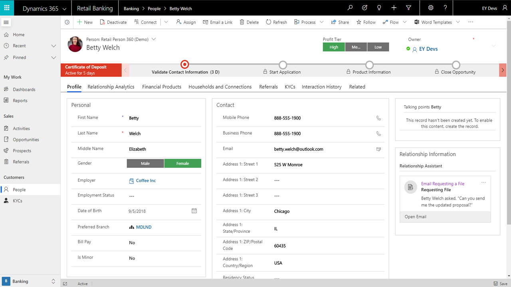
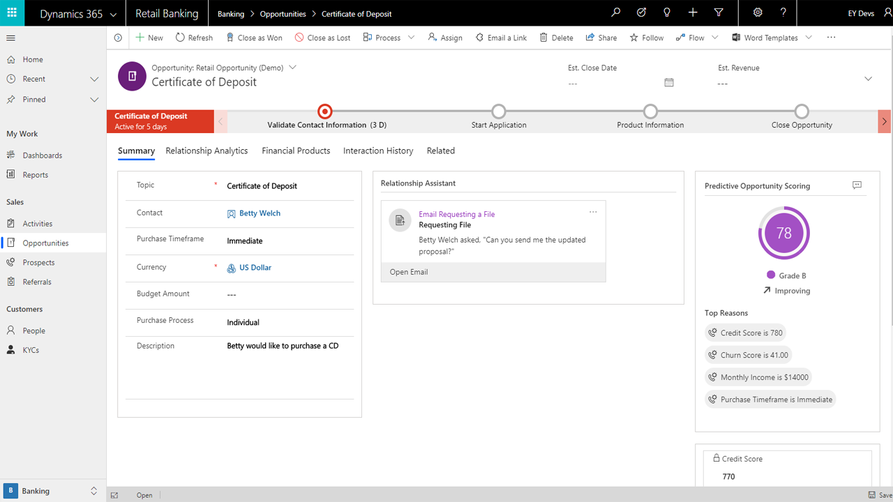
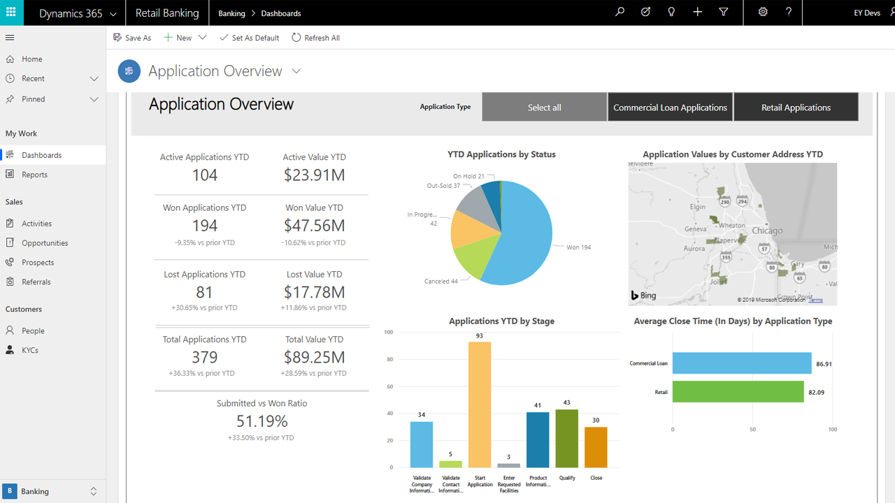

# Dynamics 365 financial services accelerator – banking

With the banking component in the [Dynamics 365 financial services accelerator](https://appsource.microsoft.com/product/dynamics-crm/msfsi.bankingcommondatamodel?tab=Overview), you can develop solutions based on entities and attributes that banks commonly leverage for customer experience and other business processes. These entities include banks, branches, financial products, loans, referrals, limits, requested facilities, and more. This component includes a banking data model, sample apps, dashboards, and connected experiences for both retail banking and commercial banking.

The banking component provides the following to partners and customers:

- Extensions to Common Data Model to include a data model to support banking, including entity definitions and relationships.
- Sample model-driven apps that show a few examples of how Dynamics 365 and the banking data model can be used with customer engagement, know your customer (KYC), referral sharing, and onboarding.
- Sample canvas apps for the relationship manger to quickly see appointments and create referrals to show how anyone can quickly develop apps with Power Platform.
- Sample Power BI dashboards that provide analytics around loans, applications, referrals, and the bank's customers, with drill downs into retail, commercial, or see unified visuals and dashboard spanning both lines of business.
- Sample files to implement the banking data model in Azure Data Lake Storage for analytics, AI, and Machine Learning.
- Individual solutions for retail and commercial banking and a package that you can deploy and install including sample data. 
- Test drive experiences through AppSource with walkthroughs, reference guides, entity-relationship diagrams and metadata documentation on the data model.

## Sitemap extensions

With the banking component, you can optimize the customer experience, improve collaboration within banks, and gain insights from analytics. When this component is installed into Dynamics 365, the experience is transformed into one specifically built for banks, allowing institutions to quickly build Power Apps and Power BI visualizations.

Banks, ISVs, and others in financial services can build their solutions and business processes on top of the new entities found within the banking component. The current data model supports common banking activities but has been designed to allow flexibility for other use cases in financial services. The data model was developed in collaboration with [BIAN](https://www.bian.org/) and other open API initiatives to ensure interoperability to help unlock new open banking opportunities.

## Entities and workflows

This banking component provides the following entities and more to support the needs of banks and others in financial services:

| | | |
| ------- | -----------------|------------------|
|Companies |Financial Products |Banks |
|People |Commercial Loans |Branches |
|Prospects |Mortgages |Syndicates |
|Referrals |Home Equity  |Collateral |
|KYC |Checking Accounts | Limits |
|Opportunities |Deposit Accounts | Commercial Deals |

## Forms and dashboards

The financial services accelerator can be used with Power Platform or combined with standard Dynamics 365 entities to make it easier to build solutions. This section describes a few of the forms, views, and dashboards that demonstrate how it extends Common Data Model, Power Platform, and Dynamics 365 for Banking.

### Customer 360 form

This banking Customer 360 view shows everything about the person from their profit tier (segmentation), to interaction and activities, to KYC, what financial products they have, and members of their household. The person (or company) record becomes the source of truth and engagement to deliver the optimal customer experience.

### Opportunity and deal form

The opportunity and deal forms show the details of the opportunity, including products, requested facilities, limits, and the stages of the overall proposal.

### Branch Manager dashboard

Example dashboards in Dynamics 365 and Power BI are included. For example, in the Bank Branch Manager dashboard, the Bank Branch Manager gains analytics and insights into account applications, onboarding stage, referrals and prospects, and the popularity of products.

## Additional resources

- Find the [financial services accelerator](https://appsource.microsoft.com/en-us/product/dynamics-crm/msfsi.bankingcommondatamodel?tab=Overview) on Microsoft AppSource.

- The financial services accelerator is provided as part of the open-source creative license and available on [GitHub](https://github.com/microsoft/Industry-Accelerator-FinancialServices).

- Refer to this [blog post](https://https:/cloudblogs.microsoft.com/dynamics365/bdm/2019/07/17/microsoft-dynamics-365-banking-accelerator-is-now-generally-available/) to read more about the value of the banking component to ISVs, banks, and other financial services institutions.

