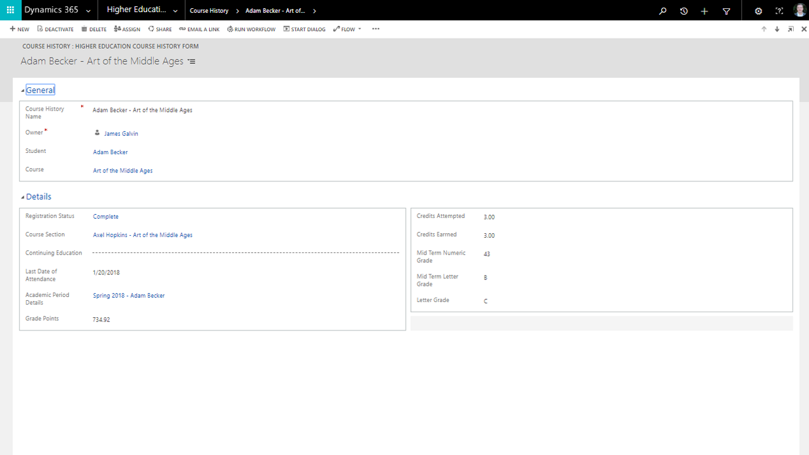

# The Microsoft 365 Banking Accelerator (preview)

With the [Dynamics 365 Banking Accelerator](https://https://appsource.microsoft.com/en-us/product/dynamics-crm/msfsi.bankingcommondatamodel?tab=Overview), you can develop solutions based on entities and attributes that banks commonly leverage for customer experience and other business processes. These entities include banks, branches, financial products, loans, referrals, limits, facilities, and more. The accelerator includes a banking data model, sample apps, dashboards, and connected experiences for both Retail Banking and Commercial Banking.

This Banking Accelerator provides the following to both partners and customers:

- extensions to the Common Data Model (CDM) to include a data model to support banking, including entity definitions and relationships
-	sample model-driven apps to show some possibilities of how Dynamics 365 and the banking data model can be used including customer engagement, know your customer, referral sharing, and onboarding
-	sample canvas apps for the Relationship Manger to quickly see appointments and create referrals to show how anyone can quickly develop new apps with the Power Platform using the Banking Accelerator
-	example Power BI dashboards which provide analytics around loans, applications, referrals, and its customers, with drill downs into Retail, Commercial, or see unified visuals and dashboard spanning both lines of business
-	sample file to implement the banking data model in Azure Data Lake Storage for analytics, AI, and Machine Learning
-	individual solutions for retail and commercial banking and a package that you can deploy and install including sample data 
-	Test Drive experience through AppSource with walk-throughs, reference guides, ERDs, and metadata documentation on the data model

## Sitemap extensions

With the Dynamics 365 Banking Accelerator, you can optimize the customer experience, improve collaboration within the bank, and gain insights from analytics. When the accelerator is installed into Dynamics 365, the experience is transformed into one specifically built for banks and allows institutions to quickly build PowerApps and Power BI visualizations.

Banks, ISVs, and others in Financial Services can build their solutions and business processes on top of the new entities in the Banking Accelerator. The current data model supports common banking activities but has been designed to allow flexibility for other use cases in Financial Services. The data model was developed in collaboration with [BIAN](https://www.bian.org/) and Open Banking to ensure interoperability to help unlock new Open Banking initiatives.

## Entities and workflows

This accelerator provides support for the following and more to support the needs of banks and others in Financial Services:

| | | | |
| Customers | Financial Products | Banking |
|Companies |Financial Products |Banks |
|Contacts |Course History |Program |
|Academic Period |Course Section |Program Level |
|Academic Period Detail |Education Level |Program Version |
|Area of Interest |Extra Curricular Activity| Program version Detail |
|Extra Curricular Participant |Registration Status |Commercial Deals |

## Forms and dashboards

The Dynamics 365 Higher-Education Accelerator combines standard Dynamics 365 entities with customized entities to make it easier to build solutions. This section describes some of the forms, views, and dashboards that demonstrate the new entities and the data model.

### Student form

This Dynamics 365 form shows student information (such as contact information, course load, areas of study, degree, course history, test scores) in the context of the app and the interface. The student record becomes the source of truth and engagement to deliver the best support throughout the student lifecycle.

### Course-history form

The course-history form shows the course name, the course section, the instructor, the credit, the grade, and more.

### Institutional dashboard

This accelerator includes a student dashboard in Dynamics 365 and an institutional dashboard in Power BI. With the institutional dashboard, you gain analytics and insights into students, classes, and key metrics such as students by program and demographics.

## Additional resources

- Download the Dynamics 365 Higher-Education Accelerator from [AppSource](https://appsource.microsoft.com/product/dynamics-365/mshied.highereducationcommondatamodel?tab=Overview)

- The higher-education data model, solutions, data samples, Power BI examples, SDK extensions, and more are provided as part of the open-source creative license and available on [GitHub](https://github.com/microsoft/Industry-Accelerator-Education/tree/master/samplecode/analytics).

- [Additional topics](https://community.dynamics.com/365/b/dynamics365isvsuccess/archive/2018/08/01/dynamics-365-brings-industry-focus-through-the-microsoft-power-platform-and-solution-accelerators) about the accelerators

- This [blog post](https://community.dynamics.com/365/b/dynamics365isvsuccess/archive/2018/10/30/early-isvs-building-on-the-new-higher-education-accelerator-and-the-microsoft-power-platform) shows some examples of ISVs building solutions on the Dynamics 365 Higher-Education Accelerator.
