# How to create schema documents for the Common Data Model

You have some data and want to start using the Common Data Model. To do so, you will need to create Common Data Model schema documents. As part of these schema documents, you will need to create entity schemas, which can either be logical representations of your existing physical entities or purely logical entity definitions. You will also need to create the manifest document, which is a collection of all your schema documents and acts as the “entry point” to your Common Data Model entities.

In this example, we will be creating entity schemas for our physical entities as well as logical entities. What is the difference between the two? Our physical entities are the entities that exist in our data, often as tables in a database. This means that the entity schemas that we will create for our physical entities will represent our data in the Common Data Model format. For instance, the attributes described in a Common Data Model entity schema are derived from the fields (or columns) of the corresponding physical entity. Purely logical entities, on the other hand, are not trying to describe an existing physical entity. Instead, they are used to encapsulate commonly used attributes (fields that appear across our physical entities) into meaningful groups. Logical entities allow us to define common attributes once and reuse these definitions, rather than re-defining the same attribute every time it is used in an entity definition. Therefore, the entity schemas for our logical entities will represent our logical entity definitions in the Common Data Model format, rather than our actual data. We will also be creating the manifest document and demonstrating two different ways to explore our schema documents at the end.

The documents mentioned in this example can be found [here]().

## Gathering Entity Definitions

To get started, we will need the entity definitions for our physical entities as well as logical entities, if we have created some. We will be converting these definitions into entity schemas.
Here is an entity definition for one of our existing physical entities, **Session**: 


When we create the entity schema for **Session**, we will be creating a logical representation of this physical entity. We will describe all the fields in **Session** using entity attributes in the schema. 

You will notice that **Session** has fields, such as “uaBrowserName” and “uaBrowserVersion”, that have a link to a logical entity (ex. **UserAgent**). These fields appear in many of our different entity definitions. To avoid having to define these fields as entity attributes every time they appear in an entity definition, we have grouped them into two logical entities, **UserAgent** and **ReverseIp**. This way, **Session** just takes fields from **UserAgent** and **ReverseIp**, and other entities that have fields like “uaBrowserName” and “ripContinent” can do the same. Remember that since **UserAgent** and **ReverseIp** are logical entities, they do not exist in the actual data, meaning that there is no physical entity in our data called “UserAgent”.

<br/>Our logical entity, **UserAgent**, is defined as the following:


<br/>As another example, here is the entity definition for the physical entity, **AggPageViewDetailDaily**, that also uses some fields from **UserAgent** and **ReverseIp** (as well as **Page**): 


*Note: There are more physical and logical entity definitions than what is mentioned above that will be used throughout this guide.*

Now that we have our entity definitions laid out, we can dive into creating the actual schema documents. 

## Creating the Entity Schemas

For the purpose of this example, we will be writing all of our schema documents right under the *CDM.SchemaDocuments* folder, in a sub-folder called *clickstream*:


We will be using some of the fundamental Common Data Model documents in this root folder (ex. *foundations.cdm.json*, *schema.cdm.json*) by importing them to our schema documents. Do note that all Common Data Model schema documents (including the ones we will write) end with the *.cdm.json* extension.

### Entity Schemas for Logical Entities

We will start off by creating an entity schema for our *logical* entity, **UserAgent**. We first create a file called *UserAgent.cdm.json* under the *clickstream* folder with the following content:

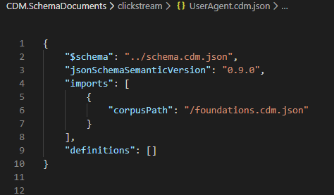

* **$schema** points to the *schema.cdm.json* file in the root *CDM.SchemaDocuments folder*. If you are using Visual Studio Code, doing this enables IntelliSense which is helpful when writing CDM schema documents by hand. 
* **jsonSchemaSemanticVersion** identifies the version of the Common Data Model object model that supports this file shape. We are using version 0.9.0.
* **imports** imports other schema documents that are needed for the current document. Here we have imported the *foundations.cdm.json* file, which itself imports *primitives.cdm.json* (containing fundamental data types, traits, and entities) and *meanings.cdm.json* (containing trait definitions and other convenient data types). Importing this *foundations.cdm.json* document will be enough to create our schema documents.
<br/><br/>*Note: The corpusPath is an absolute path to the document.* 

* **definitions** contains a list of the current document’s Common Data Model object definitions. This is where we will be describing our entity. 

<br/>We will add an object under **definitions** to define our **UserAgent** logical entity:

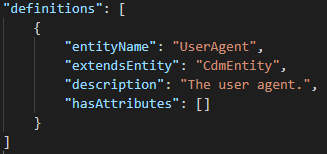

* **entityName** is the name of the current entity.
* **extendsEntity** denotes the entity that the current entity extends from. Here, we just extend from “CdmEntity”, which is the base Common Data Model entity. If we had a different entity that we wanted **UserAgent** to extend from, we would put that entity name instead. 
* **description** describes the current entity.
* **hasAttributes** contains the list of all the attributes that this entity has. This is where we will be defining our fields from the entity definitions as entity attributes. 

<br/>Going back to our entity definition for **UserAgent**, we see that we have 7 fields:


The first attribute we will create is "uaBrowserName", which is a string type. An attribute object can be defined as follows, under **hasAttributes**:

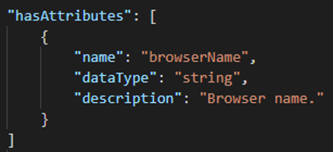

You will notice that we used the name “browserName” rather than “uaBrowserName” here. We will go into why we did this in the [Attribute Resolution Guidance](creating-schemas.md#attribute-resolution-guidance) section.

The data type for this attribute is “string”, since we have established that “uaBrowserName” is a string. Alternatively, we could have used the “name” data type, which describes a string that also has the trait "means.identity.name<no-link>". Traits are useful because they help express further semantic meaning. Using the “name” data type lets us know that this attribute is a name of some kind, which is more meaningful than just knowing that it is a string. 

How do we know what data types are available to use to describe an attribute? The complete list of all the data types we can use can be found under *primitives.cdm.json* and the various *meanings.cdm.json* files (ex. *meanings.identity.cdm.json*).

<br/>We will then create uaBrowserVersion, which is also a string type: 

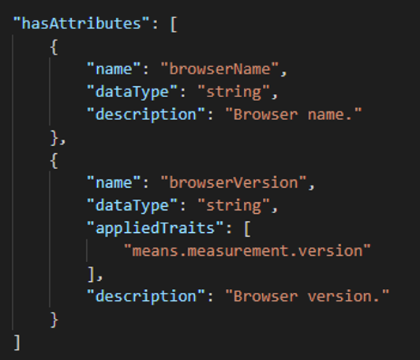

Here, we have applied the trait “means.measurement.version” to this attribute, which tells us that "uaBrowserVersion" measures a version of some kind. Again, having traits provides more insight to what an attribute is than if we were to just describe "uaBrowserVersion" as a string. 

The complete list of all the traits that are available to use can be found under the various *meanings.cdm.json* files. For instance, the trait “means.measurement.version” is defined under the *meanings.measurement.cdm.json* document. 

<br/>After creating attribute objects for each of our fields in our **UserAgent** entity definition, we end up with the following entity schema:

```
{
    "$schema": "../schema.cdm.json",
    "jsonSchemaSemanticVersion": "0.9.0",
    "imports": [
        {
            "corpusPath": "/foundations.cdm.json"
        }
    ],
    "definitions": [
        {
            "entityName": "UserAgent",
            "extendsEntity": "CdmEntity",
            "description": "The user agent.",
            "hasAttributes": [
                {
                    "name": "browserName",
                    "dataType": "string",
                    "description": "Browser name."
                },
                {
                    "name": "browserVersion",
                    "dataType": "string",
                    "appliedTraits": [
                        "means.measurement.version"
                    ],
                    "description": "Browser version."
                },
                {
                    "name": "osName",
                    "dataType": "string",
                    "description": "Operating system name."
                },
                {
                    "name": "osVersion",
                    "dataType": "string",
                    "appliedTraits": [
                        "means.measurement.version"
                    ],
                    "description": "Operating system version."
                },
                {
                    "name": "manufacturer",
                    "dataType": "string",
                    "description": "Device manufacturer."
                },
                {
                    "name": "device",
                    "dataType": "string",
                    "description": "Device."
                },
                {
                    "name": "platform",
                    "dataType": "string",
                    "description": "Platform."
                }
            ]
        }
    ]
}
```

<br/>As another example, here is the entity definition for our other logical entity, **ReverseIp**:


<br/>And here is the created entity schema, *ReverseIp.cdm.json*:

```
{
    "$schema": "../schema.cdm.json",
    "jsonSchemaSemanticVersion": "0.9.0",
    "imports": [
        {
            "corpusPath": "/foundations.cdm.json"
        }
    ],
    "definitions": [
        {
            "entityName": "ReverseIp",
            "extendsEntity": "CdmEntity",
            "description": "Reverse IP.",
            "hasAttributes": [
                {
                    "name": "ripContinent",
                    "dataType": "continent"
                },
                {
                    "name": "ripCountry",
                    "dataType": "country"
                },
                {
                    "name": "ripRegion",
                    "dataType": "region"
                },
                {
                    "name": "ripStateProvince",
                    "dataType": "stateOrProvince"
                },
                {
                    "name": "ripCity",
                    "dataType": "city"
                },
                {
                    "name": "isBot",
                    "dataType": "boolean"
                }
            ]
        }
    ]
}
```

You will notice that we used data types such as “continent” that are more specific than just “string”. These data types are defined in *meanings.location.cdm.json*. You will also notice that, unlike **UserAgent**, we named the attributes for **ReverseIp** exactly as they are in the entity definition. We will go into why we did this in the [Attribute Resolution Guidance](creating-schemas.md#attribute-resolution-guidance) section. 

### _allImports.cdm.json

Before we create entity schemas for our physical entities, we will create an *_allImports.cdm.json* document. This document contains a list of central imports that are needed for our other schema documents. Attribute groups, which we will go over in the [Attribute Groups](creating-schemas.md#attribute-groups) section, can also be defined in this document. Having an allImports document means that our schema documents can just import this file to import all the central documents and attribute group definitions, rather than having to import the individual schema documents directly.

For instance, since our physical entities use attributes defined in our logical entities, we will need to import the schemas for our logical entities to use in the schemas for our physical entities. We will put all the logical entities’ schemas in our allImports document and then have our physical entities’ schemas just import this document. 

Here is our *_allImports.cdm.json*: 

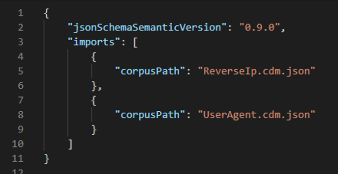

### Entity Schemas for Physical Entities

Creating the schemas for our physical entities will be similar to how we created the schemas for our logical entities.  

Here is the entity definition for our physical entity, **Session**, again:


**Session** uses attributes from **UserAgent** and **ReverseIp**, so we will need to import these entity schemas. Since we added **UserAgent** and **ReverseIp** to our allImports document, we can just import that instead.

<br/>Our *Session.cdm.json* document (without any attributes yet):

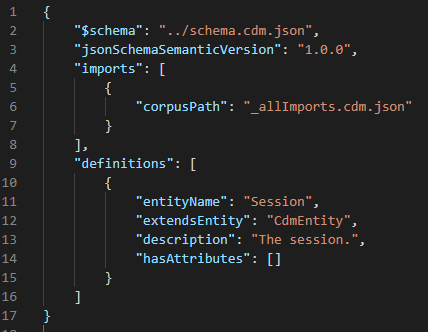

<br/>To use attributes defined in another entity schema (that we have imported), we will create an entity attribute object (an attribute that points to an entity) under **hasAttributes**:

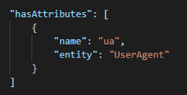

* **name** is the name of the entity attribute. We will go over why we use “ua” as the name in the [Attribute Resolution Guidance](creating-schemas.md#attribute-resolution-guidance) section.
* **entity** is a reference to the entity we are using as an attribute.

This entity attribute object will take all the attributes defined in **UserAgent**.

### Attribute Resolution Guidance

Attribute resolution guidance is a guidance on the process of resolving entities and attributes, compressing logical entity schemas into their physical forms. 

We have not specified attribute resolution guidance properties in this entity attribute object, so default resolution guidance will be used. By default, resolution guidance takes all the attributes defined in the referenced entity and applies them to the current entity. In our case, **Session** will take all 7 attributes defined inside **UserAgent**. When attributes are taken from **UserAgent**, the final resolved attribute names in **Session** will be in the format of “[name of entity attribute][name of attribute]”.

If you recall, we used “browserName” rather than “uaBrowserName” when defining the attribute in **UserAgent**. This is because all the attributes in **UserAgent** starts with “ua”. When using default resolution guidance, if we notice a common prefix, we can use that as the name of the entity attribute. Since we used “ua” as the name of the entity attribute in **Session**, the attribute “browserName” that we took from **UserAgent** becomes:

    “ua” + “BrowserName” = “uaBrowserName”

*Note: The first letter of the original attribute name becomes capitalized during this process (browserName -> BrowserName).*

<br/>This is done to all the attributes taken from **UserAgent**, so in **Session** we will have:

    uaBrowserName
	uaBrowserVersion
	…
	uaPlatform

<br/>Why does this matter? This becomes particularly useful when we want to use the same entity attributes from the same entity, but with slightly different attribute names:


Here, we use attributes from **UserAgent** twice, but the prefix differs slightly (“machine1UserAgent” vs. “machine2UserAgent”). Since we have defined our attributes in **UserAgent** without a prefix, we can do the following to generate resolved attribute names that match the entity definition above:

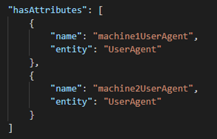

Remember, since **UserAgent** is a *logical* entity that we have created, the attribute names in the entity schema does not have to match up exactly with the field names in its original entity definition. What matters is that the attribute names for the physical entities match their entity definitions (and our data). 

<br/>We cannot do this when there is no common prefix in the attribute names. For instance, almost all the attributes taken from **ReverseIp** have the common prefix “rip”, but since the attribute “isBot” does not have it, we cannot use this. Instead, we named the attributes in **ReverseIp** as they appear in the entity definition, if you recall our *ReverseIp.cdm.json* document:

```
{
    "$schema": "../schema.cdm.json",
    "jsonSchemaSemanticVersion": "0.9.0",
    "imports": [
        {
            "corpusPath": "/foundations.cdm.json"
        }
    ],
    "definitions": [
        {
            "entityName": "ReverseIp",
            "extendsEntity": "CdmEntity",
            "description": "Reverse IP.",
            "hasAttributes": [
                {
                    "name": "ripContinent",
                    "dataType": "continent"
                },
                {
                    "name": "ripCountry",
                    "dataType": "country"
                },
                {
                    "name": "ripRegion",
                    "dataType": "region"
                },
                {
                    "name": "ripStateProvince",
                    "dataType": "stateOrProvince"
                },
                {
                    "name": "ripCity",
                    "dataType": "city"
                },
                {
                    "name": "isBot",
                    "dataType": "boolean"
                }
            ]
        }
    ]
}
```

<br/>Going back to **Session**. Since we want to use attributes in **ReverseIp**, we will create another entity attribute object, like we did for the attributes in **UserAgent**:

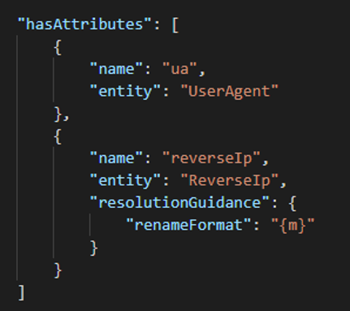

You will notice that this time we have specified a resolution guidance with a “renameFormat” property. This property is a format specifier for the final resolved attribute names. Here, we use “renameFormat”: “{m}” to specify that we want to use the attribute names exactly as they are named in the referenced entity. This means that in **Session**, the attributes that are taken from **ReverseIp** will look like:

	ripContinent
	ripCountry
	…
	isBot

If we did not specify a resolution guidance here, then the final attribute names in **Session** would have had the default format of “[entity attribute name][original attribute name]” (ex. “reverseIpContinent”).  

<br/>What if we only want to take a few attributes from an entity, rather than all the attributes? We can specify which attributes we want to use by using the “selectsSubAttribute” property in resolution guidance: 

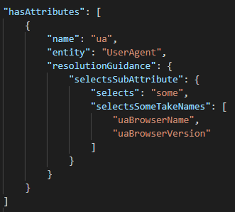

“selectsSomeTakeNames” is a list of attributes from the referenced entity that should be added our entity. There is also “selectsSomeAvoidNames”, which is a list of attributes that should not be added. Here, we only want to take “uaBrowserName” and “uaBrowserVersion” as attributes from **UserAgent**. You will notice that we used the expected resolved attribute names to populate this list. 

If we had a “renameFormat” as well, we would use the attribute names after the rename format specifier has been applied: 

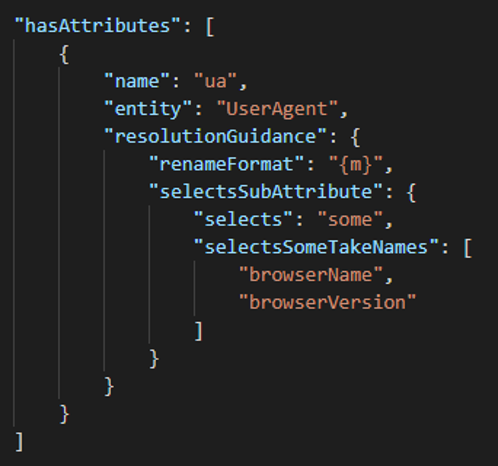

### Attribute Groups

Once again, here is the entity definition for **Session**:


Now, while we *could* define all the fields listed in gray (such as dateId, environmentId, sessionRevenue, etc.) as attributes inside of **Session**, many of these fields are also used in other physical entities. It would be useful to define these fields once somewhere and just reuse the attribute definitions, like we did with the attributes from our logical entities. 

However, instead of grouping these fields into logical entities, we can also use attribute groups. An attribute group is simply a group of attributes that provide a similar role. If we notice a grouping of attributes that always appear together across our physical entities, we can put them in an attribute group. We can have attribute groups that only contain a single attribute as well, if that attribute is used often in our entities but does not have other attributes it always appears with. It should make sense why the attributes in an attribute group are grouped together, rather than the grouping just being a mere coincidence. 

<br/>A helpful way to determine attribute groups is to lay out all the fields used in our entity definitions in a table with the entities on one axis and fields on the other:


From this table, we can see that there are several groups of attributes that always appear together. We will highlight a few notable attributes in red.


For instance, the attributes "orderId", "cartId", and "cartVersion" always appear together in **PageView**, **PageAction**, and **Event**. These can be put into an attribute group.

On the other hand, "pageViewCount" is used in **Session**, **AggPageView**, **AggPageViewDaily**, **AggPageViewDetailDaily**, and **AggSession** but does not have other attributes it always appears with. We can create an attribute group containing "pageViewCount" only. 

Lastly, we see that "sessionCount" is only used in **AggSession**. In this case, we will not create an attribute group and just define "sessionCount" as an attribute inside **AggSession**. 

<br/>Going back to our original example. After we have identified our attribute groups, we will define them inside our allImports document, since the attribute groups will be used in a lot of the schemas for our physical entities. 

Here is our *_allImports.cdm.json* with a couple of attribute group objects under **definitions**: 

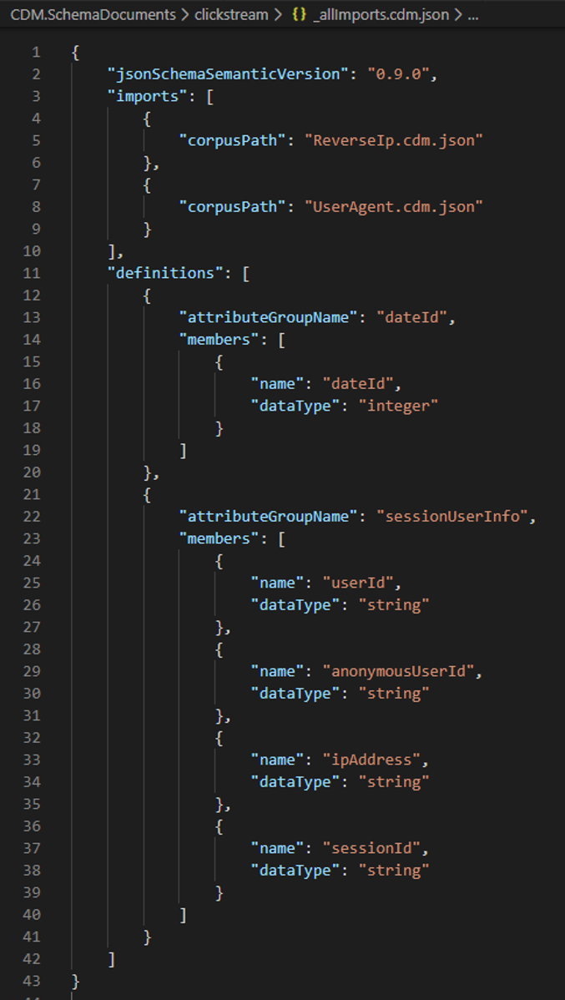

* **attributeGroupName** is the name of the attribute group.
* **members** is a list of attribute definitions for the attribute group.

<br/>Now that we have our attribute groups defined in our allImports document, we can use them in **Session** by creating an attribute group reference object under **hasAttributes**:

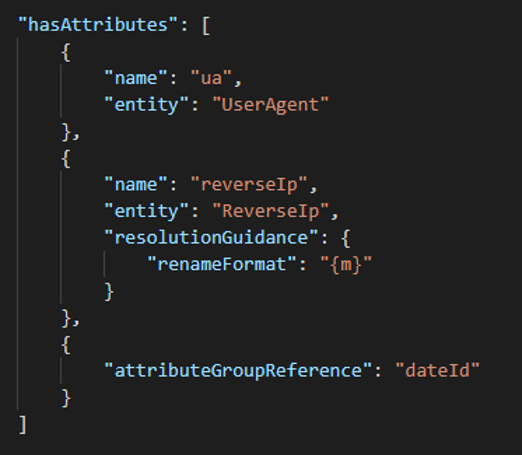

* **attributeGroupReference** points to the name of the attribute group that we want to use. 

<br/>We can also define attributes that are only used in **Session** right in its entity schema:


<br/>Our final entity schema for **Session** looks like this:

*Note: The order of the attribute objects has been shifted around so that this entity schema matches the order of the fields in the actual data.*

```
{
    "$schema": "../schema.cdm.json",
    "jsonSchemaSemanticVersion": "0.9.0",
    "imports": [
        {
            "corpusPath": "_allImports.cdm.json"
        }
    ],
    "definitions": [
        {
            "entityName": "Session",
            "extendsEntity": "CdmEntity",
            "description": "The session.",
            "hasAttributes": [
                {
                    "attributeGroupReference": "dateId"
                },
                {
                    "attributeGroupReference": "serverUtcDate"
                },
                {
                    "attributeGroupReference": "clientUtcDate"
                },
                {
                    "attributeGroupReference": "environmentId"
                },
                {
                    "attributeGroupReference": "sessionUserInfo"
                },
                {
                    "attributeGroupReference": "userSessionAuthInfo"
                },
                {
                    "attributeGroupReference": "browserSettings"
                },
                {
                    "attributeGroupReference": "sessionDuration"
                },
                {
                    "name": "totalEventCount",
                    "dataType": "integer",
                    "appliedTraits": [
                        "means.measurement.count"
                    ]
                },
                {
                    "attributeGroupReference": "pageViewCount"
                },
                {
                    "name": "pageContentUpdateCount",
                    "dataType": "integer",
                    "appliedTraits": [
                        "means.measurement.count"
                    ]
                },
                {
                    "attributeGroupReference": "pageActionCount"
                },
                {
                    "name": "purchaseEventCount",
                    "dataType": "integer",
                    "appliedTraits": [
                        "means.measurement.count"
                    ]
                },
                {
                    "attributeGroupReference": "customEventCount"
                },
                {
                    "attributeGroupReference": "orderCount"
                },
                {
                    "attributeGroupReference": "sessionRevenue"
                },
                {
                    "name": "ua",
                    "entity": "UserAgent"
                },
                {
                    "name": "reverseIp",
                    "entity": "ReverseIp",
                    "resolutionGuidance": {
                        "renameFormat": "{m}"
                    }
                }
            ]
        }
    ]
}
```

## Creating the Manifest

Now that we are done with our entity schemas, we are going to create our manifest document. The manifest will reference our entity schemas and act as the entry point to our entities. Do note that the manifest file should end with the *.manifest.cdm.json* extension.

Here is our *clickstream.manifest.cdm.json*, in the *clickstream* folder:

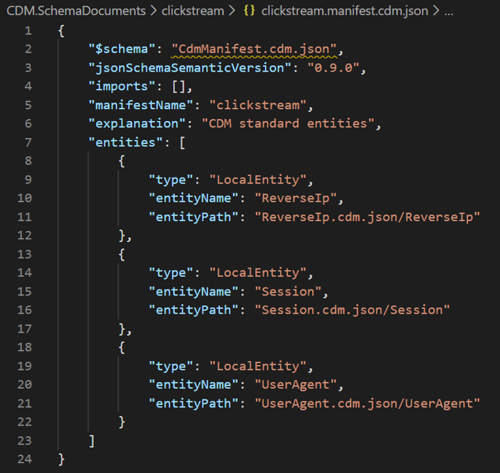

Most of the properties listed above are fairly self-explanatory. We will take a look at entities, which is a list of entity declaration objects. This is where we reference all our entity schemas (**ReverseIp**, **Session**, and **UserAgent**).

* **type** refers to the type of the entity declaration (local or referenced). Since our entity declarations reside locally, rather than at a remote location, we use “LocalEntity” as the type. 
* **entityName** is the name of the entity.
* **entityPath** is the corpus path to the entity definition in the entity schema. It is in the format of “[entity schema name][entity name]”. 

<br/>The manifest can reference sub-manifests as well. For example, if we had a sub-folder under *clickstream* called aggregations (that contained entity schemas relating to aggregated data), we could create an *aggregrations.manifest.cdm.json* document in that folder: 


<br/>We would then add the manifest declaration for *aggregrations.manifest.cdm.json* in *clickstream.manifest.cdm.json* under **subManifests**:

```
{
    "$schema": "CdmManifest.cdm.json",
    "jsonSchemaSemanticVersion": "0.9.0",
    "imports": [],
    "manifestName": "clickstream",
    "explanation": "CDM standard entities",
    "entities": [
        {
            "type": "LocalEntity",
            "entityName": "ReverseIp",
            "entityPath": "ReverseIp.cdm.json/ReverseIp"
        },
        {
            "type": "LocalEntity",
            "entityName": "Session",
            "entityPath": "Session.cdm.json/Session"
        },
        {
            "type": "LocalEntity",
            "entityName": "UserAgent",
            "entityPath": "UserAgent.cdm.json/UserAgent"
        }
    ],
    "subManifests": [
        {
            "manifestName": "aggregations",
            "definition": "aggregations/aggregations.manifest.cdm.json"
        }
    ]
}
```

Doing this will maintain our original folder structure in our schema documents. 

## Exploring Our Entities

To wrap up, we will explore our created Common Data Model schema documents. We will go over the two different tools we can use.

### Entity Navigator

We can use the [Entity Navigator](https://microsoft.github.io/CDM/) to view our created schema documents. 

We will need to load our manifest to explore our entities. First, we will click on “Load from files…”, upload the *clickstream* folder, and then select *clickstream.manifest.cdm.json* as the manifest:


<br/>The navigator will display the following after loading the manifest:


We can see all three entities that we created schemas for, under “clickstream”. We can also see all the entities that are referenced by the sub-manifest *aggregations.manifest.cdm.json*, under “aggregations”. Notice that the original folder structure of all these files is maintained. 

<br/>Lastly, we will click on the **Session** entity and compare the resolved entity to our original entity definition:


### Read Manifest Sample

We can also use the code sample, [1-read-manifest](https://github.com/microsoft/CDM/tree/master/samples/1-read-manifest), to explore our entities. This sample reads a manifest document and lists all the entities referenced in the manifest. You can then select an entity to list all its attributes, traits, properties, data partition file locations, and relationships. 

<br/>The sample originally points to a manifest called *default.manifest.cdm.json* in the *1-read-manifest* folder:

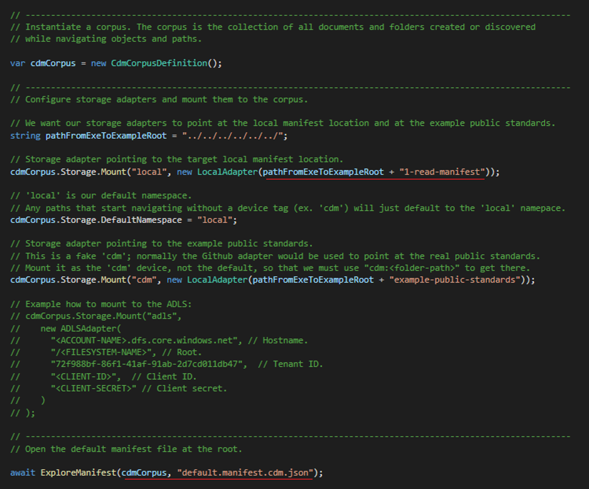

<br/>We will edit the sample so that it points to our clickstream.manifest.cdm.json document instead:

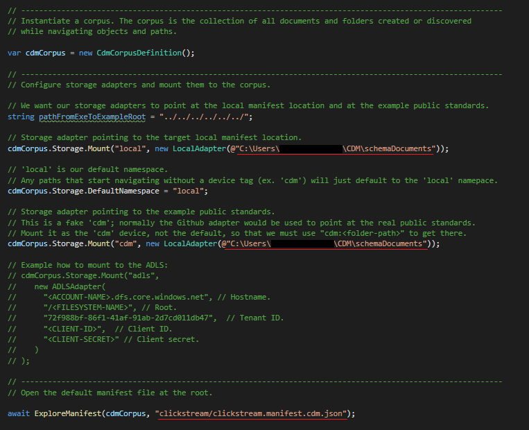

<br/>This sample works with resolved documents, so we need to resolve our manifest and entities. We can do this by adding the following line of code under `ExploreManifest(…)`:

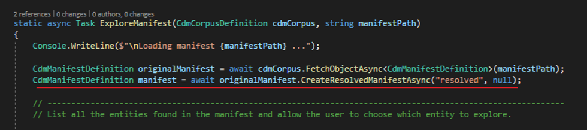

<br/>Now we can run the sample:


We can see that the program has read the manifest and listed all our entities.

<br/>We will explore our **Session** entity by entering ‘2’:


We can see that our **Session** entity schema has been read.

<br/>Lastly, we will explore the attributes in **Session** by entering '1':


*Note: There are more attributes listed by the program than what is shown in this image.*