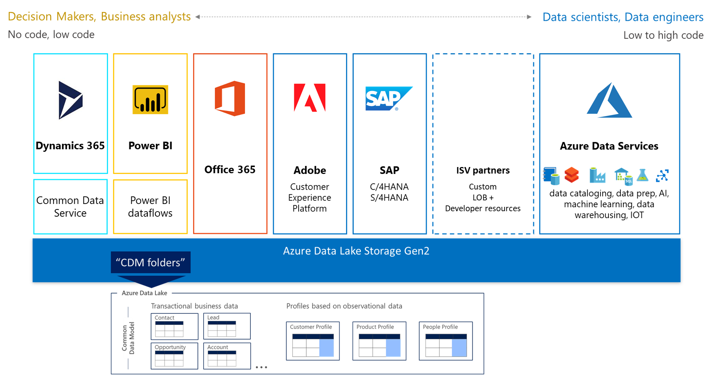
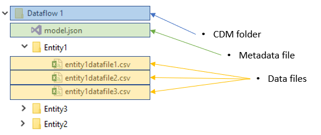
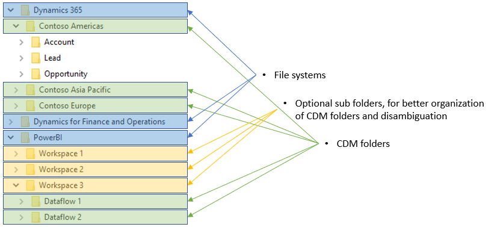

# The Common Data Model and Microsoft Azure Data Lake Storage Gen2

Data stored in the Common Data Model format provides semantic consistency across apps and deployments. With the evolution of the Common Data Model metadata system, the Common Data Model brings the same structural consistency and semantic meaning to the data stored in Azure Data Lake Storage Gen2 with hierarchical namespaces and folders that contain schematized data in standard Common Data Model format. The standardized metadata and self-describing data in an Azure data lake facilitates metadata discovery and interoperability between data producers and consumers such as Power BI, Azure Data Factory, Azure Databricks, and Azure Machine Learning service.

The previous graphic shows the wide spectrum of services and users that can contribute to and leverage data in Common Data Model folders in a data lake. The format of a shared folder helps each consumer avoid having to “relearn” the meaning of the data in the lake.

## Terminology

These terms are used throughout the documentation.

| Concept | Definition |
|--|--|
|    Common Data Model folder       |    A folder in a data lake that conforms to specific, well-defined, and standardized metadata structures and self-describing data. These folders facilitate metadata discovery and interoperability between data producers and data consumers.    |
|   model.json |    A metadata file in a folder in an Azure Data Lake Storage Gen2 instance that follows the Common Data Model metadata format. If this file exists in such a folder, it's a Common Data Model folder.   |
|    Data producer    |    A service or app that creates data in Common Data Model folders in Azure Data Lake Storage Gen2.  |
|    Data consumer    |    A service or app that consumes data in Common Data Model folders in Azure Data Lake Storage Gen2.      |

## Common Data Model folders

Each Common Data Model folder contains these elements:

- Model.json

    The Model.json metadata description file contains semantic information about entity records/attributes and links to underlying data files. The existence of this file indicates compliance with the Common Data Model metadata format, and the file may include standard entities that provide more built-in, rich semantic metadata that apps can leverage.

- Data files

    The data files in a Common Data Model folder have a well-defined structure and format (subfolders are optional, as this topic describes later) and are referenced in the model.json file. These files must be in .csv format, but we’re working to support other formats.

This diagram shows a sample of a Common Data Model folder that a Power BI dataflow created and that contains three entities:

The model.json metadata file provides pointers to the entity data files throughout the Common Data Model folder.

## Data producers

A data producer is a service or application, such as Dynamics 365 or Power BI dataflows, that creates data in Common Data Model folders in Azure Data Lake Storage Gen2. The data producer is responsible for creating the folder, the model.json file, and the associated data files. Because the data producer adds the relevant metadata, each consumer can more easily leverage the data that’s produced.

Each data producer stores its data in isolation from other data producers. The storage concept that isolates data producers from each other is an Azure Data Lake Storage Gen2 filesystem.

## Folder organization

Data producers can choose how to organize the Common Data Model folders within their own filesystem. You can create Common Data Model folders directly under the filesystem, but some services may require subfolders for disambiguation or better organization of data as it's presented in their own products. The folder naming and structure should be meaningful for customers who access the data lake directly.

This diagram showcases how a data lake that data producers share can be structured. Each service (Dynamics 365, Dynamics for Finance and Operation, and Power BI) creates and owns its own filesystem. Depending on the experience in each service, subfolders are created to better organize Common Data Model folders in the filesystem.

## Data consumers

Data consumers are services or applications, such as Power BI, that read data in Common Data Model folders in Azure Data Lake Storage Gen2. Other data consumers include Azure data-platform services (such as Azure Machine Learning, Azure Data Factory, and Azure Databricks) and turn-key SaaS applications (such as Dynamics 365 AI for Sales). A data consumer may have access to many Common Data Model folders to read content throughout the data lake. If a data consumer wants to write back data or insights that it has derived from a data producer, the data consumer should follow the pattern described of data producers above and write within its own filesystem.

## Authorization

Authorization is an important concept for both data producers and data consumers. Failure to set the right permissions for either scenario can lead to users or services having unrestricted access to all the data in the data lake.

Azure Data Lake Storage Gen2 supports a variety of authentication schemes, but Azure Active Directory bearer tokens and access control lists (ACLs) are recommended because they allow more granular scoping of permissions to resources in the lake. Full details of the available schemes are provided in the [Azure Storage security guide](https://docs.microsoft.com/azure/storage/common/storage-security-guide).

### Active Directory OAuth Bearer token and POSIX ACLs

The driver acquires and refreshes Azure Active Directory bearer tokens using either the identity of the end user or a configured Service Principal. After a token is acquired, all access is authorized on a per-call basis using the identity that's associated with the supplied token and evaluated against the assigned portable operating system interface (POSIX) ACL. This evaluation provides the authorized person or services full access to resources only within the scope for which they're authorized.

#### Authorizing data producers

Data producers require full create, read, update, and delete (CRUD) permissions to their file system, including the Common Data Model folders and files that they own. The identity of the data producer is given read and write permission to the specific file share that's associated with the data producer. This allows multiple data producers to easily share the same data lake without compromising security. In addition, it allows auditing of access to resources in the storage and authorizing individuals to access Common Data Model folders.

#### Authorizing data consumers

Sharing Common Data Model folders with data consumers (that is, people and services intended to read the data) is simplified with Active Directory OAuth Bearer tokens and POSIX ACLs. The only requirement is granting access to an Active Directory object of your choice to the Common Data Model folder. You should grant read-only access to any identity other than the data producer. This approach protects the integrity of the data that the producer generates and allows administrators to use audit logs to monitor who accesses the Common Data Model folder. 

### Alternative forms of authorization

Storage Account Key or Shared Key authorization is commonly used; these forms permit holders of the key to access all resources in the account. This path is the simplest but limits the ability to share specific resources in the lake and doesn't allow administrators to audit who accessed the storage. The [Azure Storage security guide](https://docs.microsoft.com/azure/storage/common/storage-security-guide) provides full details about the available schemes.
