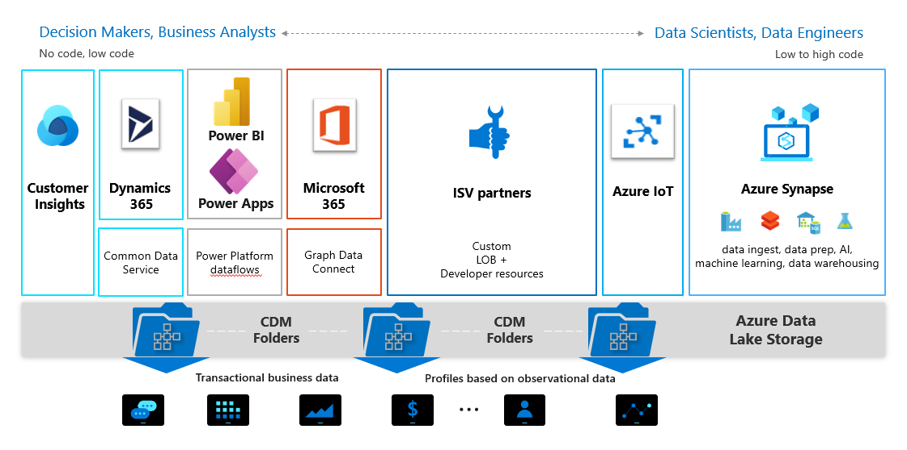
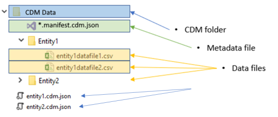

# Use the Common Data Model to optimize Azure Data Lake Storage Gen2

Data stored in accordance with the Common Data Model provides semantic consistency across apps and deployments. With the evolution of the Common Data Model metadata system, the model brings the same structural consistency and semantic meaning to the data stored in Microsoft Azure Data Lake Storage Gen2 with hierarchical namespaces and folders that contain schematized data in standard Common Data Model format. The standardized metadata and self-describing data in an Azure Data Lake facilitates metadata discovery and interoperability between data producers and data consumers such as Power BI, Azure Data Factory, Azure Databricks, and Azure Machine Learning.

The preceding graphic shows the wide spectrum of services and users who can contribute to and leverage data in Common Data Model folders in a data lake. The format of a shared folder helps each consumer avoid having to "relearn" the meaning of the data in the lake.

## Terminology

These terms are used throughout Common Data Model documentation.

| Concept | Definition |
|--|--|
|    Common Data Model folder       |    A folder in a data lake that conforms to specific, well-defined, and standardized metadata structures and self-describing data. These folders facilitate metadata discovery and interoperability between data producers and data consumers.    |
|   \*.manifest.cdm.json |    A metadata file in a folder in a Data Lake Storage Gen2 instance that follows the Common Data Model metadata format and potentially references other sub-Manifest for nested solutions. If this file exists in such a folder, it's a Common Data Model folder.  For more information, go to [Common Data Model: Introducing manifest](./cdm-manifest.md). |
|   model.json |    A metadata file in a folder in a Data Lake Storage Gen2 instance that follows the Common Data Model metadata format. If this file exists in such a folder, it's a Common Data Model folder.  For more information, go to [the metadata file (model.json) for the Common Data Model](./model-json.md). |
|    <*entity_name*>.cdm.json    |    A metadata file in the Common Data Model folder that contains the metadata about the specific entity, its attributes, semantic meanings of entity and attributes.  For an example, see the [**Account**](https://github.com/microsoft/CDM/blob/master/schemaDocuments/core/applicationCommon/Account.cdm.json) entity document on GitHub. |
|    Data producer    |    A service or app that creates data in Common Data Model folders in Azure Data Lake Storage Gen2.|
|    Data consumer    |    A service or app that consumes data in Common Data Model folders in Azure Data Lake Storage Gen2.|

## Common Data Model folders

Each Common Data Model folder contains these elements:

- The \*.manifest.cdm.json file

    The \*.manifest.cdm.json file contains information about the content of Common Data Model folder, entities comprising the folder, relationships  and links to underlying data files. The \*.manifest.cdm.json format allows for multiple manifests stored in the single folder providing an ability to scope data for different data consuming solutions for various personas or business perspectives. Each entity definition is in an individual file making managing, navigation and discoverability of entity metadata easier and more intuitive.

- The entity definition file

    The \*.cdm.json file contains the definition for each Common Data Model entity and location of data files for each entity.  

- The model.json file

    The model.json metadata file contains semantic information about entity records and attributes, and links to underlying data files. The existence of this file indicates compliance with the Common Data Model metadata format; the file might include standard entities that provide more built-in, rich semantic metadata that apps can leverage.

- Data files

    The data files in a Common Data Model folder have a well-defined structure and format (subfolders are optional, as this topic describes later), and are referenced in \*.manifest.cdm.json or in the model.json file. These files must be in .csv format, but we're working to support other formats.

The following diagrams show examples of a Common Data Model folder with \*.manifest.cdm.json and model.json. 

The model.json metadata file provides pointers to the entity data files throughout the Common Data Model folder.

## Data producers

A data producer is a service or application, such as Dynamics 365 or Power BI dataflows, that creates data in Common Data Model folders in Data Lake Storage Gen2. The data producer is responsible for creating the folder, the model.json file, and the associated data files. Because the data producer adds relevant metadata, each consumer can more easily leverage the data that's produced.

Each data producer stores its data in isolation from other data producers. The storage concept that isolates data producers from each other is a Data Lake Storage Gen2 file system.

## Folder organization

Data producers can choose how to organize the Common Data Model folders within their file system. You can create Common Data Model folders directly under the file system level, but for some services you might want to use subfolders for disambiguation or to better organize data as it's presented in your own product. The folder naming and structure should be meaningful for customers who access the data lake directly.

The following diagram shows how a data lake that data producers share can be structured. Each service (Dynamics 365, Dynamics 365 Finance, and Power BI) creates and owns its own file system. Depending on the experience in each service, subfolders might be created to better organize Common Data Model folders in the file system.

## Data consumers

Data consumers are services or applications, such as Power BI or Dynamics 365 Customer Insights, that read data in Common Data Model folders in Data Lake Storage Gen2. Other data consumers include Azure data-platform services (such as Azure Machine Learning, Azure Data Factory, and Azure Databricks) and turnkey software as a service (SaaS) applications (such as Dynamics 365 Sales Insights). A data consumer might have access to many Common Data Model folders to read content throughout the data lake. If a data consumer wants to write back data or insights that it has derived from a data producer, the data consumer should follow the pattern described for data producers above and write within its own file system.

## Authorization

Authorization is an important concept for both data producers and data consumers. Failure to set the right permissions for either scenario can lead to users' or services' having unrestricted access to all the data in the data lake.

Data Lake Storage Gen2 supports a variety of authentication schemes, but we recommend you use Azure Active Directory (Azure AD) Bearer tokens and access control lists (ACLs) because they give you more granularity in scoping permissions to resources in the lake. Full details about the available schemes are provided in [Security recommendations for Blob storage](/azure/storage/common/storage-security-guide).

### Azure AD OAuth Bearer tokens and POSIX ACLs

The driver acquires and refreshes Azure AD bearer tokens by using either the identity of the end user or a configured Service Principal. After a token is acquired, all access is authorized on a per-call basis by using the identity that's associated with the supplied token and evaluated against the assigned portable operating system interface (POSIX) ACL. This evaluation provides the authorized person or services full access to resources only within the scope for which they're authorized.

#### Authorizing data producers

Data producers require full create, read, update, and delete (CRUD) permissions to their file system, including the Common Data Model folders and files that they own. The identity of the data producer is given read and write permission to the specific file share that's associated with the data producer. This allows multiple data producers to easily share the same data lake without compromising security. In addition, it allows access to resources in the storage to be audited and individuals to be authorized to access Common Data Model folders.

#### Authorizing data consumers

Sharing Common Data Model folders with data consumers (that is, people and services who are meant to read the data) is simplified by using Azure AD OAuth Bearer tokens and POSIX ACLs. The only requirement is that you grant access to the Azure AD object of your choice to the Common Data Model folder. You should grant read-only access to any identity other than the data producer. This approach protects the integrity of the data that the producer generates and allows administrators to use audit logs to monitor who accesses the Common Data Model folder.

### Alternative forms of authorization

Storage Account Key or Shared Key authorization schemes are commonly used; these forms permit holders of the key to access all resources in the account. This path is the simplest, but limits your ability to share specific resources in the lake and doesn't allow administrators to audit who accessed the storage. [Security recommendations for Blob storage](/azure/storage/common/storage-security-guide) provides full details about the available schemes.
