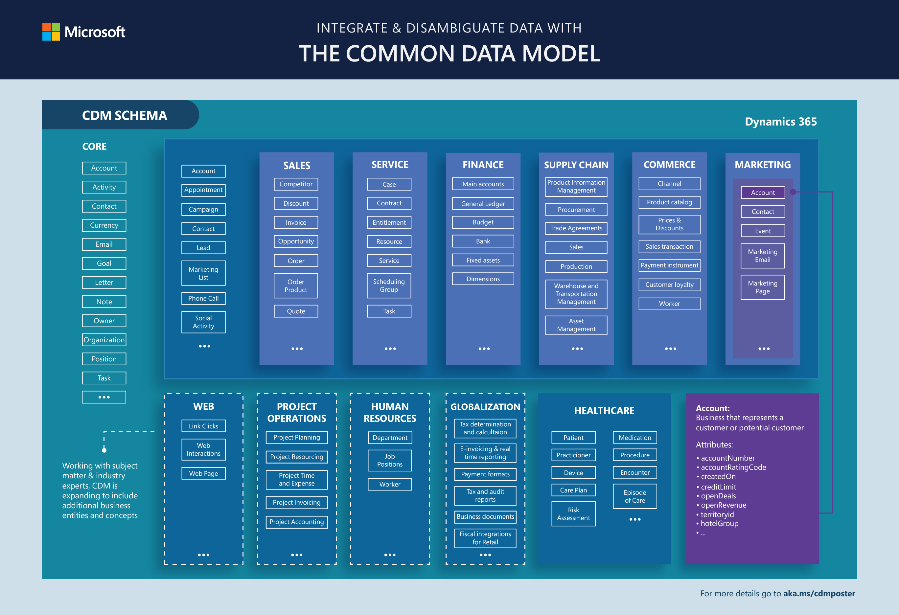

# The Common Data Model

If you’ve ever had to use data from multiple systems and applications together, you know that common data elements can save effort, streamline development, and enable faster analytics. Without being able to share and understand the same data easily, each application or data integration project requires a custom implementation, which can consume a lot of time, cost a lot of money, and require repeated effort.

The Common Data Model simplifies this process by providing a shared data language for business and analytical applications to use. The Common Data Model metadata system enables consistency of data and its meaning across applications and business processes (such as Power Apps, Power BI, Dynamics 365, and Azure), which store data in conformance with the Common Data Model.

In addition to the metadata system, the Common Data Model includes a set of standardized, extensible data schemas that Microsoft and its partners have published. This collection of predefined schemas includes entities, attributes, semantic metadata, and relationships. The schemas represent commonly used concepts and activities, such as **Account** and **Campaign**, to simplify the creation, aggregation, and analysis of data. This graphic shows some elements of the standard entities. More information: [Common Data Model repository on GitHub](https://aka.ms/cdmrepo)

More information: [Common Data Model poster](https://aka.ms/cdmposter)

## Why use the Common Data Model?

The Common Data Model simplifies data management and app development by unifying data into a known form and applying structural and semantic consistency across multiple apps and deployments. In other words, if your data is in the model, you can use it in many apps, streamline the creation or use of other apps to use that data, and easily build reports for each of those apps (or all of them). In addition, data integrators who bring data from a variety of systems can focus on landing the data in the Common Data Model, instead of building a different model for each app.

Imagine that you have three business apps – one each for materials, manufacturing, and sales. Often each app would be created independently, with different structures that represent an entity, such as **Account**, in nearly the same way (but not quite). With the Common Data Model, you could build your data in a standardized format (using the Common Data Model standard entities, attributes, and relationships), and then each app could use the same data as a basis. Of course, each app could have its own additional data and schemas, based on its functionality. But when it comes to development, your apps and reports could pull the common data elements quickly, cleanly, and with confidence.

And what about the need to create a fourth app? Your data is ready, in the Common Data Model schema, so your development efforts can concentrate on business logic, not data quagmires and sticky transformations.

In other words, the Common Data Model offers these benefits:

- **Structural and semantic consistency** across applications and deployments.

- **Simplified integration and disambiguation of data** that’s collected from processes, digital interactions, product telemetry, people interactions, and so on.

- **A unified shape** where data integrations can **combine existing enterprise data with other sources** and use that data holistically to develop apps or derive insights.

- **Ability to extend the schema and Common Data Model standard entities** to tailor the model to your organization.

You can use the Common Data Model to create data repositories that use the Common Data Model metadata system, and you can also transform your existing data into the Common Data Model standard schema. Either way, the efficiency that you get from standardization can expedite and streamline whatever you do next with your data.

## Who uses the Common Data Model?

A variety of customers, partners, and products use the Common Data Model, and all have the same goal of unifying data in a well-known form with semantic meaning.

- **App makers/developers**: Whether these users leverage code-based platforms or a low-code/no-code platform such as Power Apps or Power BI, they need to store and manage data for their apps.

- **Data integrators**: These users are responsible for bringing data from a variety of systems to make it accessible for apps to use.

Historically, the work to build an app has been tightly tied with data integration, but with the Common Data Model and the platforms that support it, the two can happen independently.

## The Common Data Model in action

Microsoft and its partners use the Common Data Model for their own apps and offerings and are building additional services and offerings
based on Common Data Model schemas. These examples show how organizations use the Common Data Model:

- **Common Data Service**, which supports Dynamics and Power Apps, stores data in conformance with the Common Data Model definition. In fact, many of the original business entities in the Common Data Model came from Dynamics offerings, such as Dynamics 365 for Sales and Dynamics 365 for Marketing.

- **Industries** such as healthcare are working closely with Microsoft to extend the Common Data Model to their specific business concepts, such as **Patient** and **Care Plan** through [Industry Accelerators](industry-accelerators.md). This extends the benefit of the Common Data Model standard entities to these verticals so that industry solutions interoperate more easily. 

- **Power BI Dataflows** allows you to ingest data into the Common Data Model form from a variety of sources such as Dynamics 365, Salesforce, Azure SQL Database, Excel, or SharePoint. Once you've connected and prepared your data, you can choose to map it to a Common Data Model standard entity or load it as a custom entity in Common Data Model form in Azure Data Lake Storage Gen2.

- **Azure Data Lake Storage Gen2** helps speed your transition from proof of concept to production by combining the power of a file system that's compatible with Hadoop, an integrated hierarchical namespace, and the massive scale and economy of Azure Blob Storage. The Common Data Model brings semantic consistency to data within the lake so that applications and services can interoperate more easily when data is stored in Common Data Model form.

## Next steps

[How to use the Common Data Model](use.md): Describes the Common Data Model in detail and discusses use cases for creating data in the model or transforming your existing data into the model.
[How to create Common Data Model schema documents](creating-schemas.md): Describes how to create custom Common Data Model entity schema documents.   
[Learn more about Industry Accelerators](industry-accelerators.md): Describes the effort around industry extensions and the solutions that Microsoft has already released.  
[The Common Data Model and Microsoft Azure Data Lake Storage Gen2](data-lake.md): Describes how putting data in Common Data Model form and storing it in Azure Data Lake Storage Gen2 helps services in the Azure ecosystem to exchange data.
