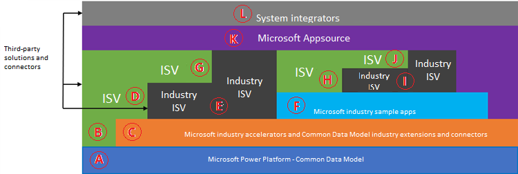

# Overview of industry accelerators

Common Data Model enables horizontal consistency for customers' business data, making it easier for them to create value from that data. However, many customers and partners want solutions and platforms that are tailored for their industry. Microsoft is working closely with representatives from various industries to make Common Data Model more relevant to them, by creating industry accelerators.

[Industry accelerators](https://community.dynamics.com/365/b/dynamics365isvsuccess/archive/2018/08/01/dynamics-365-brings-industry-focus-through-the-microsoft-power-platform-and-solution-accelerators) are foundational components within [Microsoft Power Platform](https://docs.microsoft.com/power-platform/) and Dynamics 365 that enable ISVs and other solution providers to quickly build industry vertical solutions. The accelerators extend Common Data Model to include new entities to support a data schema for concepts within specific industries. Microsoft is currently focused on delivering accelerators for the following industries, with others to come:

-	[Automotive](automotive-accelerator.md)
-	Financial services, including [banking](banking-accelerator.md) and [insurance](insurance-accelerator.md)
- [Healthcare](health-accelerator.md)
-	Education, including [higher education](hied-accelerator.md) and [K&ndash;12](edu-k12-accelerator.md)
-	[Nonprofit](nfp-accelerator.md)
-	[Manufacturing](manufacturing-accelerator.md)
- [Media and communications](media-accelerator.md)

## ISV opportunity view

Microsoft Power Platform combines with industry accelerators to create a unique opportunity for ISVs to provide solutions for different scenarios and levels of development. This image shows the opportunities for ISVs who build on top of the platform and the industry accelerators.

|           |            |
|-----------|------------|
| **A** | Common Data Model is the foundation on which the Microsoft Power Platform accelerators and other solutions are built or extended. |
| **B**, **C** | ISV solutions extend Common Data Model, as do industry accelerators from Microsoft and its partners.|
| **D**,&nbsp;**E**,&nbsp;**F** | ISVs, industry ISVs, and industry sample apps from Microsoft all extend the Microsoft industry accelerators.|
| **G** | ISVs further extend industry ISV solutions that were built on top of the Microsoft industry accelerator.|
| **H**, **I** | ISVs and industry ISVs further extend industry sample apps that were built on top of the Microsoft industry accelerator. |
| **J** | ISVs further extend industry ISV solutions that were built on top of the industry sample apps from Microsoft.|
| **K** | Accelerators&mdash;along with ISV, industry ISV, and industry sample app solutions&mdash;are made available on AppSource.|
| **L** | System integrators provide expertise for customer, ISV, and industry ISV solutions that were built on top of the Microsoft industry accelerators. System integrators can create industry vertical solution support and practices that can help customers directly build their own solutions and tools, or support ISV deliveries.|

As the image shows, from the bottom level on up through the stack, ISVs have multiple opportunities to deliver industry-focused apps and solutions. These opportunities exist whether you're building directly on Power Apps (Common Data Service) or Dynamics 365 apps. Each level further expands the opportunities at the next level up. The accelerators provide opportunities to rapidly build vertical, industry-focused apps, in addition to enabling system integrators to help scale and support these new apps and solutions.

## Additional accelerators

We continue to release new and updated accelerators for the industries identified earlier. Check out [our release plans](https://dynamics.microsoft.com/business-applications/product-updates/) for the most recent releases.

## Want to help?

If you're interested in talking with Microsoft about the industry accelerators, [sign up](https://aka.ms/cdmengage) to share your feedback, suggestions, and challenges.
