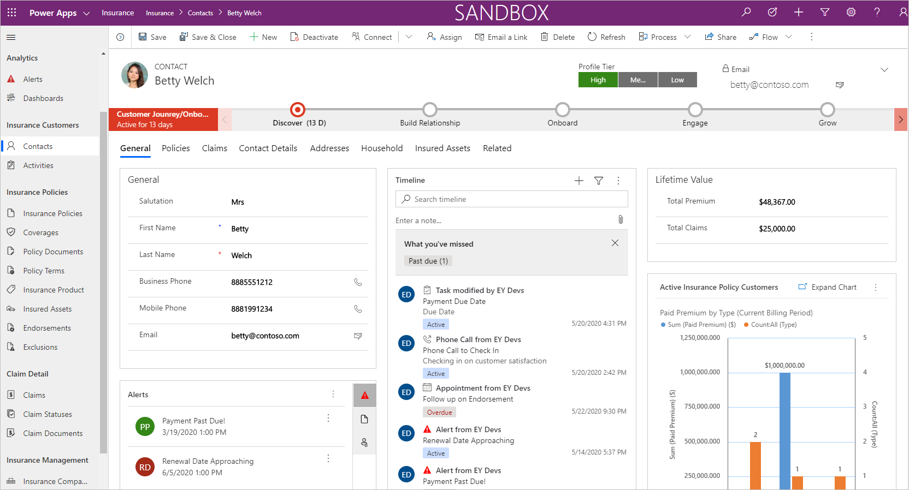
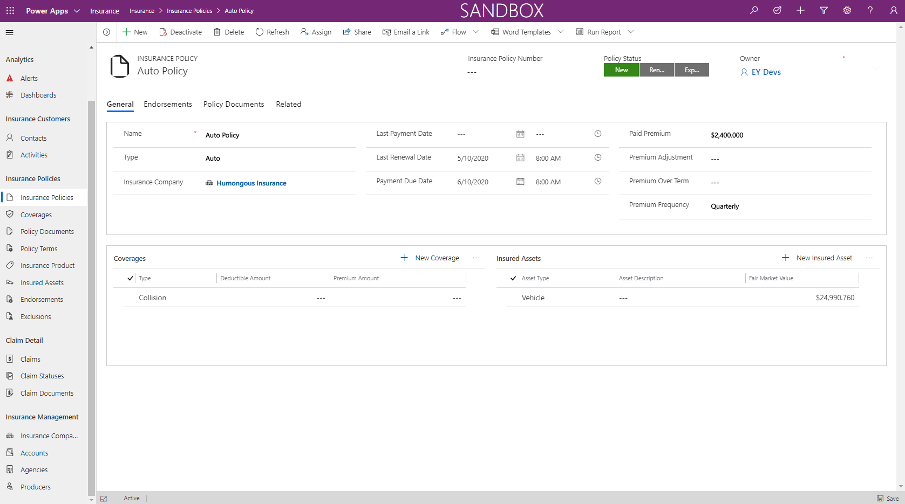
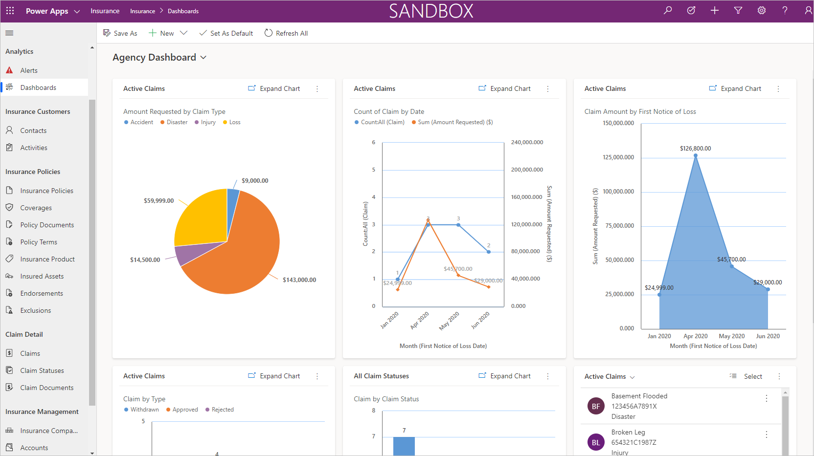

# Dynamics 365 Financial Services accelerator - Insurance (Preview)

[!INCLUDE cc-beta-prerelease-disclaimer]

The insurance component in the [Dynamics 365 Financial Services accelerator](https://appsource.microsoft.com/product/dynamics-crm/msfsi.bankingcommondatamodel?tab=Overview) expands Common Data Model and Microsoft Power Platform for the insurance industry. The insurance component includes data entities and attributes which span property, casualty, and life insurance, for both producer and agency management use cases. 

The insurance component includes prebuilt solutions, applications, and dashboards for producers and agents to experience and for optimizing agency operations. The insurance component integrates seamlessly with the Dynamics 365 Sales application to deliver differentiated policy holder experiences, including business processes such as quoting, issuing, and renewing policies, servicing claims, and recommending insurance products. Additionally, the insurance component can be used alongside the banking component in the Financial Services accelerator for scenarios and use cases where banking data might be useful.

Currently in preview, the goal of this release is to validate the insurance data model and ensure it addresses the use cases for Dynamics 365 customers and partners. 

The preview of the insurance component includes these features:

- New insurance entities in Microsoft Common Data Model, including concepts for insurance that span the insurance customer, producer, and agency. 
-	An insurance agent application and dashboard, addressing areas including policy management, claims, customer 360, customer onboarding, and insurance agent dashboards.
-	A [test drive experience](https://appsource.microsoft.com/product/dynamics-365/msfsi.bankingcommondatamodel?tab=Overview) through AppSource, including walkthrough and sample data.
-	A [package deployment solution](https://experience.dynamics.com/accelerators/). 

## Sitemap extensions

With the insurance component, insurance companies, intermediaries, brokers, agents, and agencies can optimize the customer experience, improve productivity, and gain insights. When you install the component, the environment is transforms into one specifically built for insurance and one that allows customers and partners to quickly build Power Apps, customize Dynamics 365, and build Power BI dashboards for the insurance industry.

The insurance data model is developed in collaboration with customers, partners, industry experts, and open initiatives to ensure interoperability.

## Entities and workflows

The insurance component provides nearly 30 new entities to support the needs of insurance customers and partners, spanning both producer and agency management scenarios: 

| | | |
|----------------- | -----------------|------------------|
|Insurance customer |Endorsement |Insurance company |
|Insurance policy |Insured asset |Agency |
|Insurance product |Claim |Producer |
|Coverage |Claim stages  |Producer license |
|Policy document |Claim document | Commission |
|Policy term |Claim contact | Adjuster |
|Exclusion |Deductible |Agency performance  |

## Forms and dashboards

The insurance component can be used with Power Platform or combined with the banking component or other Dynamics 365 entities to make it easier to build solutions. This section describes some of the apps, forms, views, and dashboards that demonstrate how the insurance component extends the Microsoft Common Data Model, Power Platform, and Dynamics 365. This component is in preview, the experiences may change when the component is generally available.

### Customer 360

### Insurance policy form

### Insurance agent dashboard

## Additional resources

- Test drive [the insurance component](https://appsource.microsoft.com/product/dynamics-crm/msfsi.bankingcommondatamodel?tab=Overview) on Microsoft AppSource as part of the Financial Services accelerator. There are no prerequisites for test drives.

- The Financial Services accelerator is provided under the open-source creative license and it is available on [GitHub](https://github.com/microsoft/Industry-Accelerator-FinancialServices).

- Get access to the [insurance preview](https://experience.dynamics.com/accelerators/), including the data model.  
