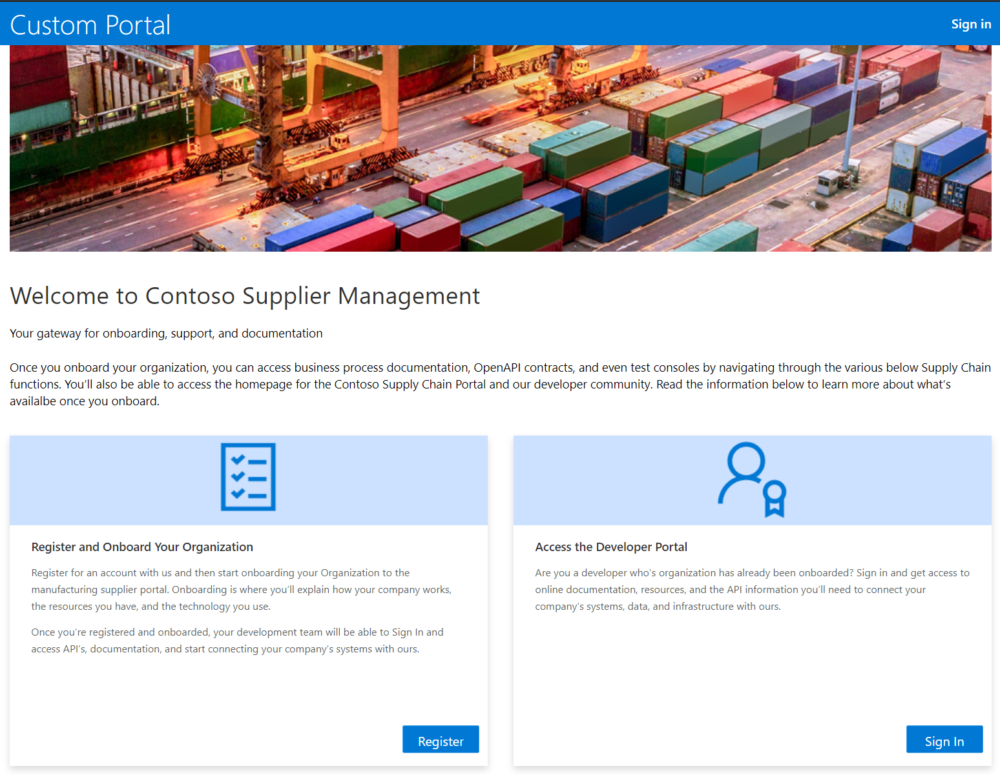
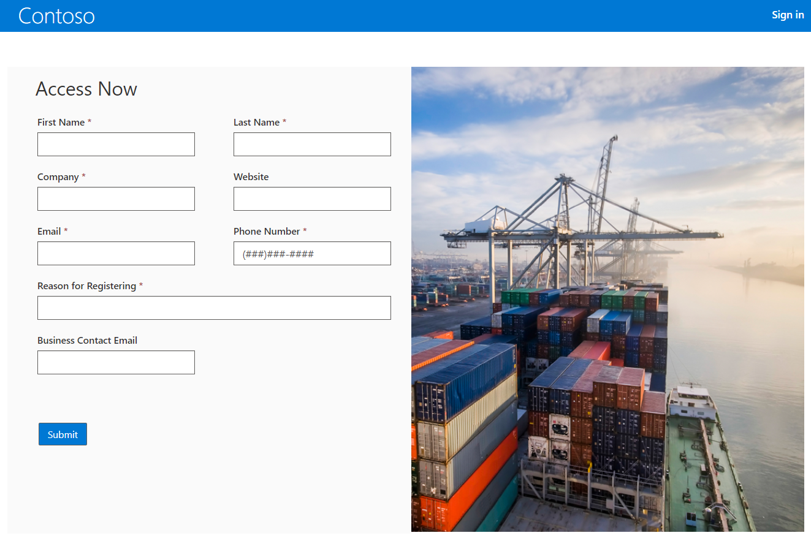
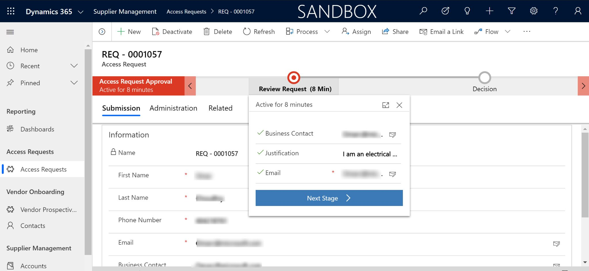
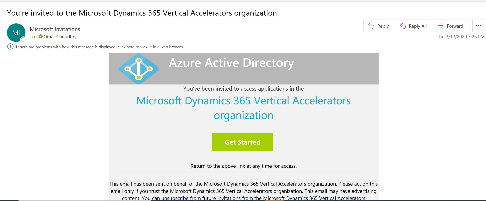
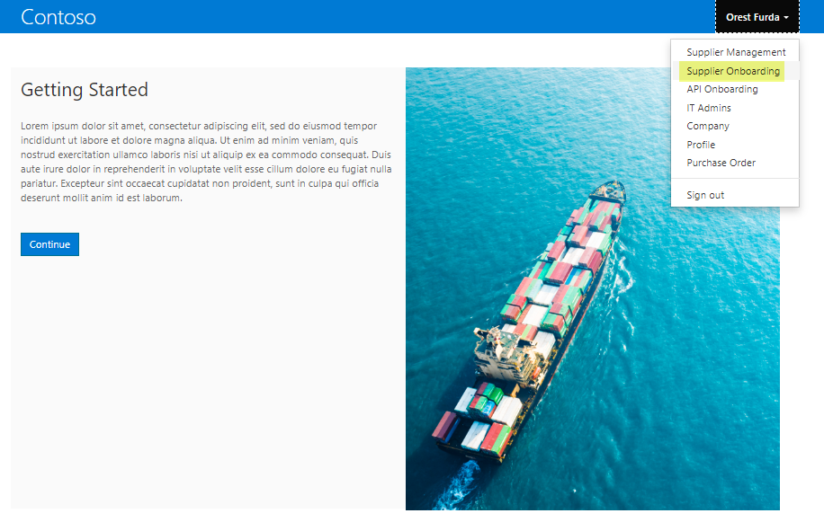
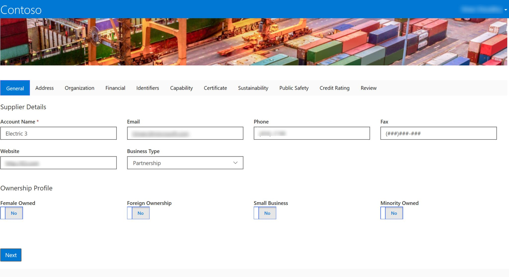
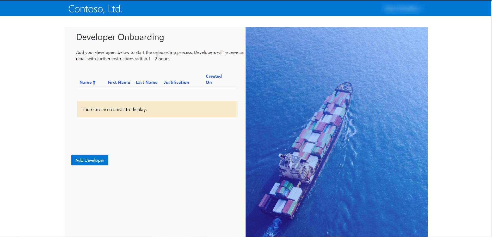
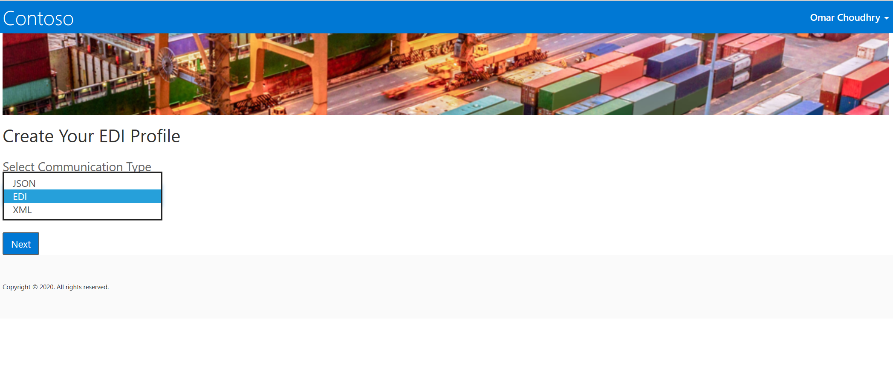
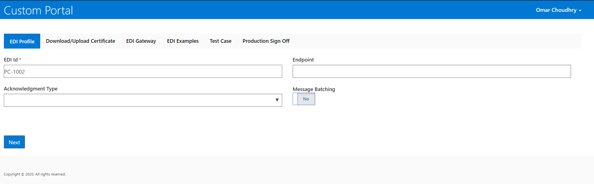
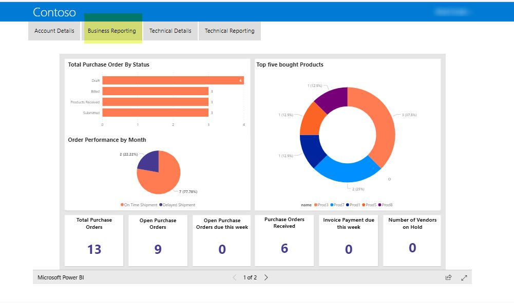

---

title: Dynamics 365 Manufacturing Accelerator (preview) | Microsoft Docs

description:  Develop manufacturing solutions with extensions to the Common Data Model.  Connect to built-in forms and Dynamics 365 Manufacturing Accelerator views.

author: MeenooRami
ms.service: common-data-model
ms.reviewer: v-dehaas
ms.topic: article
ms.date: 05/01/2020
ms.author: merami

---

# The Dynamics 365 Manufacturing Accelerator (Preview)

[!INCLUDE[cc-beta-prerelease-disclaimer](../includes/cc-beta-prerelease-disclaimer.md)]

## Overview

The Manufacturing Accelerator preview release enables manufacturers to quickly develop solutions or extend sample applications tailored to business needs.  This accelerator helps facilitate intelligent supplier relationship management and onboarding.

We provide a manufacturing data model, sample power portal, sample apps, automated templates, and Power BI dashboards. This creates a seamless role-based supplier qualification, API onboarding, and supplier management console experience. This accelerator helps manufacturing organizations to digitize this process within hours using our low-code no-code platform capabilities.

The accelerator includes the following features via Power Apps Portals:

- Enable new suppliers to contact a manufacturer
- Qualify a new supplier
- Enable API data integration onboarding
- Maintain and provide ongoing visibility into supplier transactions
- Maintain and provide ongoing visibility into API data exchange

The accelerator includes the following features via a model-driven app:

- Manage and approve access requests
- Manage and approve supplier requests
- Manage and track supplier health

The supplier relationship management scenario as part of the Manufacturing Accelerator puts the full strength of the Power Platform to use helping manufacturing organizations to optimize their supplier and sales relationships and more effectively enabling them to manage those important supplier relationships.

## Site-map extensions

The Manufacturing Accelerator can be used with Microsoft Dynamics 365, or independently using the core solution layer that is not dependent on Microsoft Dynamics 365. This independent solution layer can be used  to build model driven and canvas based Power Apps applications.

When the accelerator is installed into Dynamics 365, it enables you to optimize supplier operational processes including PO, expected receipts, and invoicing based on the IATI standard. You can also leverage the entire solution within Dynamics 365.

The manufacturing data model is developed in collaboration with partners, industry experts and open initiatives to ensure interoperability, and to accelerate supplier impact.

## Entities and workflows
This accelerator includes these entities to support the supplier relationship management scenario:

**Supplier Onboarding**|**Questionnaire Framework**|**Electronic Communication**|**Workflow**|**Process**|**Power automate**
:-----:|:-----:|:-----:|:-----:|:-----:|:-----:
Account|Question|Account Communication Configuration|Assign Supplier Web Role|Approval process|Add External User
Contact|Questionnaire Question| |Populate decision fields| | 
Access Request|Questionnaire Template| | | | 
Access Request Approval|Questionnaire Template Question| | | | 
Capability Type|Vendor Questionnaire| | | | 
Certification Type| | | | | 
Credit Rating| | | | | 
Department| | | | | 
Identifier| | | | | 
Product Classification| | | | | 
Vendor Capability| | | | | 
Vendor Certification| | | | | 

## Forms and dashboards

The Dynamics 365 Manufacturing Accelerator combines standard Dynamics 365 entities with customized entities to make it easier to build solutions. This section describes some of the forms, views, and dashboards that demonstrate the new entities and the data model.

The initial access request from a registration form is to initiate the conversation with a manufacturing organization regarding the intent to be a new supplier of parts or products. The accelerator includes an extensible model for manufacturing organization to enable Azure Active Directory authentication or replace this with any other authentication type:

The portal experience focuses on supporting two personas, a business development manager from a potential new supplier and the supplier IT administration team. If you are  seeking to be a new supplier then you start a new registration process. However, if you are currently an existing supplier and would like to get your development team connected you can do so via API data integration through the portal.

The model driven experience focuses on the Manufacturers administrative needs and where the procurement department largely manage the suppliers.

This section provides examples of the forms and dashboards that demonstrate the entities in the data model for the Accelerator.

## New supplier registration

The supplier management functionality of the Portal will allow new Suppliers to access the site, by clicking on the “Register” button to apply as a new Supplier and to proceed with the approval process.

> [!div class="mx-imgBorder"]
> 

After you select **Register**”, the supplier will need to fill out the basic information on a registration form to begin the approval process, as shown here:

> [!div class="mx-imgBorder"]
> 

Model driven app
The manufacturing organization reviews, and can approve or reject the new supplier’s request.

> [!div class="mx-imgBorder"]
> 

Upon approval, supplier receives an invitation link in email to complete the onboarding process.

> [!div class="mx-imgBorder"]
> 

## Dashboard

Here are some of the available standard predefined dashboard information. This view shows the status of specific suppliers functions:

> [!div class="mx-imgBorder"]
> 

## Supplier Qualification

Once approved the supplier can easily onboard within the portal. Select **Supplier Onboarding**, and then select **Continue**.

> [!div class="mx-imgBorder"]
> 

Now, the new approved supplier can add additional information about their company. They can also update their information later.

> [!div class="mx-imgBorder"]
> 

# API Onboarding
When you select **API Onboarding** from the drop-down menu on the main screen, the supplier can add their technical team for EDI transactions and setup.
 
> [!div class="mx-imgBorder"]
> 

Once the developer(s) have been approved, they will be able to enter the EDI interface information and the testing of transactions both inbound and out bound.

> [!div class="mx-imgBorder"]
> 
 
The basic information that the developer or supplier IT team needs to provide and the information they need to send message securely to the right API end point. There are multiple tabs, as in the view below. 

> [!div class="mx-imgBorder"]
> 

## Business partner dashboard

The supplier has a management experience with two dashboards included in the accelerator. This helps them understand the health of the relationship. These dashboards show open purchase orders and KPI’s around the health of the supplier’s relationship with the manufacturer:

> [!div class="mx-imgBorder"]
> 

## Additional resources

- Download the Dynamics 365 Manufacturing Accelerator from [AppSource](https://aka.ms/d365manuf).
- The manufacturing data model, solutions, data samples, Power BI examples, SDK extensions and more are provided as part of the open-source creative license and available on [Github](https://github.com/microsoft/Dynamics-365-Industry-Accelerators)
- Additional  [accelerators topics](https://community.dynamics.com/365/b/dynamics365isvsuccess/archive/2018/08/01/dynamics-365-brings-industry-focus-through-the-microsoft-power-platform-and-solution-accelerators).

## Connect and share feedback

Do you have feedback or need support? Connect with us at dynindaccsupport@microsoft.com.
