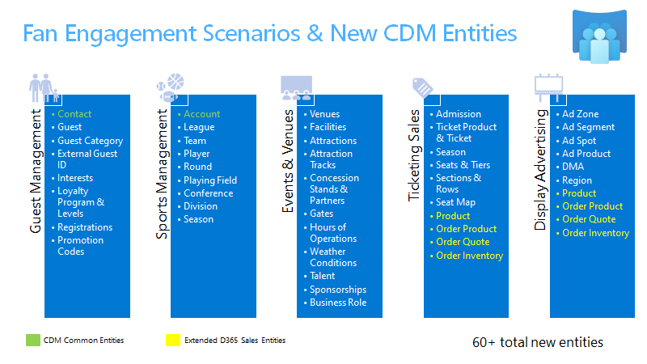

---

title: Dynamics 365 Media and Communications Accelerator (preview) | Microsoft Docs
description:  Develop media and communications solutions with extensions to Common Data Model. Connect to built-in forms and Dynamics 365 Media and Communications Accelerator views.
author: MeenooRami
ms.service: common-data-model
ms.reviewer: v-dehaas
ms.topic: article
ms.date: 05/01/2020
ms.author: merami

---

<!--Editor explanation: The style guide says not to use "the" with either CDM or Power Platform. It also says to always precede Power Platform with Microsoft. -->

# The Dynamics 365 Media and Communications Accelerator (Preview)

[!INCLUDE[cc-beta-prerelease-disclaimer](../includes/cc-beta-prerelease-disclaimer.md)]

The [Dynamics 365 Media and Communications Accelerator](https://aka.ms/d365media) expands Common Data Model and Microsoft Power Platform into the media and entertainment industries. Version 1 of the Media and Communications Accelerator includes data entities and attributes that center on the theme of “fan and guest engagement.” 

<!-- I changed "center around" to "focus on" below to avoid using center around in two consecutive sentences. Also, it should be "center on" rather than "around." -->

It includes prebuilt solutions that focus on event and venue management, sports management, ticketing and advertising sales, media sponsorships, and various guest interactions such as event registrations and the tracking of loyalty programs. The Media and Communications Accelerator also integrates seamlessly with the Dynamics 365 Sales application and includes fields, forms, views, and dashboards.

The accelerator includes the following features:
- An extension to Common Data Model to include concepts for fan engagement, including 60-plus new entity definitions and relationships.
- Five unique model-driven applications with new forms and dashboards that support data entry and data management: 
  - Event and venue management
  - Sports management
  - Ticket sales
  - Guest management
  - Display and advertising sales
- A solution that you can deploy and install from AppSource or GitHub.

## Site-map extensions

With the Dynamics 365 Media and Communications Accelerator, institutions can optimize fan engagement, improve interactions, profile and predict actions of their customers, and gain insights from analytics. When the accelerator is installed in Dynamics 365, the experience is transformed into one specifically built for operators of theme parks, sport venues, theaters, arenas, or other places for tourism, hospitality, business conferencing, or the arts. The goal is to allow such institutions to quickly build Power Apps and Power BI visualizations.

Media and entertainment institutions can build their business processes on top of the entities in the accelerator. The ribbon customizations contain entities to record ticketing products, sponsorships, events, venues, sport teams and leagues, and more. 

## Entities and workflows

This accelerator provides these new Common Data Model entities to support the needs of media and entertainment businesses:

<!-- The image uses the abbreviations CDM and D365, which is not OK, according to the style guide. Can the image be revised? -->

> [!div class="mx-imgBorder"]
> 

### Fan and guest management

<!-- I rearranged these in the order that they appear in the image. Do you want to add promotion codes to the list? -->

- Guest
- Guest category
- External guest IDs
- Interests
- Loyalty programs and levels
- Registrations

### Sports management

- League
- Team
- Player
- Player team history
- Round
- Playing field
- Conference
- Division
- Season

### Event and venue management

- Venues
- Facilities
- Attractions, attraction tracks, and attraction schedules
- Concession stands and partners
- Gates
- Hours of operations
- Weather conditions
- Talent
- Media assets and asset categories

### Ticket sales

- Tickets
- Admissions
- Seat maps, seat tiers, seats, sections and rows

### Advertising sales

<!-- What is or are Dmas? -->

- Sponsorships
- Ad zones
- Ad segments and ad segment groups
- Ad spots
- Dmas
- Regions
- Zip codes

## Forms and dashboards

The Dynamics 365 Media and Communications Accelerator combines standard Dynamics 365 entities with customized entities to make it easier to build solutions. This section describes some of the forms, views, and dashboards that demonstrate the new entities and the data model.

### Fan and guest management

> [!div class="mx-imgBorder"]
> 

<!-- There's a person's name and email in this image. Please be sure that they are approved by Microsoft for use. -->  

> [!div class="mx-imgBorder"]
> 

<!-- There's a person's name in this image as well (Martin Wahl). Please confirm it's OK to use. -->

> [!div class="mx-imgBorder"]
> 

> [!div class="mx-imgBorder"]
> 

The Media and Communications Accelerator is intended to help successfully drive the progression of a customer from an anonymous or casual guest toward becoming a deeply engaged fan, regular attendee, subscribing member or active member of a frequent buyer or loyalty program. The accelerator solution helps track that journey with the addition of the new “guest” and “loyalty program” entities, which can help eventually convert to leads and then customers and contacts.

### Events and venue management

From scheduling industry events such as conferences, concerts, sporting events, and art festivals, to planning all of the attractions, rides, speakers, and concession stands within a venue (such as theme parks, museums, or tourist sites), the media data entities enable powerful ways to activate and connect data gathered from and across your entire event and venue management spectrum.

> [!div class="mx-imgBorder"]
> 

> [!div class="mx-imgBorder"]
> 

> [!div class="mx-imgBorder"]
> 

> [!div class="mx-imgBorder"]
> 

<!-- This sports management section should come before the previous section on events and venue management because that's the order in which they are presented earlier in this topic. --> 

### Sports management

Key customer targets of the fan engagement scenarios within the Media and Communications Accelerator are sports leagues, teams, and organizations that can use the accelerator to manage and schedule their seasons, games, players, referees, scorers, and other key officials. The accelerator adds a number of sports-specific data entities and relationships that enable specific use cases for the sports industry.

> [!div class="mx-imgBorder"]
> 

<!-- This image uses the real address and phone number for the Microsoft Conference Center. Even though that info is publicly available, I don't know whether CELA is OK with that in an image. This should be checked out. -->

> [!div class="mx-imgBorder"]
> 

## Media product sales

### Ticketing and advertising sales

<!-- The word "productization" in the next paragraph seems awkward but I don't know what to replace it with. -->

The Media and Communications Accelerator can be used to easily build new product sales applications that help to promote, sell, and manage media-specific products like subscription services, ticketing, and advertising. New ticketing data entities include the ability to build reservations and seat management solutions through seat maps. They also enable the assignment and tracking of available and blocked seat inventory used within a venue, event, or individual attraction or conference session. That in turn allows for the productization and sales of individual, seasonal, or group tickets to those events. 

Similarly, you can build an application that enables the creation and sales of advertising display products. There's a key focus on  display messaging sales at a physical venue (digital billboards, scoreboards, and other signs spread across an arena or theme park). This includes the ability to specify ‘what, where, and when’ for display advertising, as well as to track and manage the sale and fulfillment of those advertisements and sponsorships.

<!-- I'm concerned about the name "Jimmy Dean" in the image - could be a trademarked name. Can it be replaced with something from the fictitious names list? -->

> [!div class="mx-imgBorder"]
> 

> [!div class="mx-imgBorder"]
> 

## Additional resources

<!-- Do you intend to add URLs to the following? -->

- Download the Dynamics 365 Media and Communications Accelerator from AppSource.
- The Media data model, solutions, data samples, Power BI examples, SDK extensions, and more are provided as part of the open-source creative license and available on GitHub.
- Additional topics about the accelerators.

## Connect and share feedback

- Do you have feedback or need support?  Connect with us at https://aka.ms/cdmengage 
