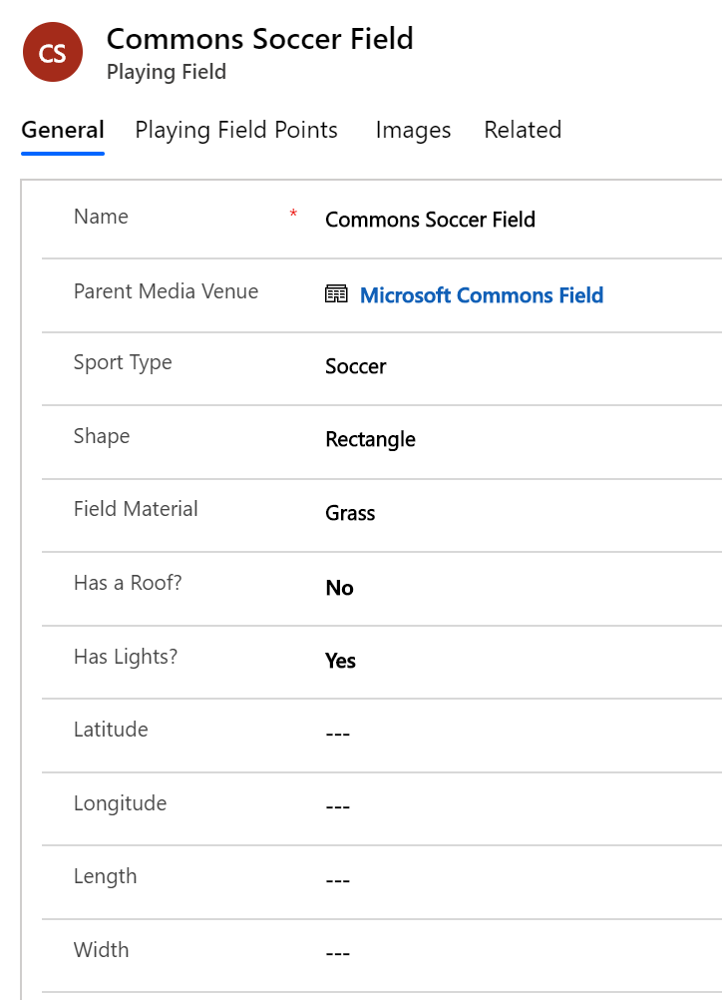

---

title: Dynamics 365 Media and Communications Accelerator (preview) | Microsoft Docs
description:  Develop media and communications solutions with extensions to Common Data Model. Connect to built-in forms and Dynamics 365 Media and Communications Accelerator views.
author: MeenooRami
ms.service: common-data-model
ms.reviewer: v-dehaas
ms.topic: article
ms.date: 05/01/2020
ms.author: merami

---

# The Dynamics 365 Media and Communications Accelerator (Preview)

[!INCLUDE[cc-beta-prerelease-disclaimer](../includes/cc-beta-prerelease-disclaimer.md)]

The [Dynamics 365 Media and Communications Accelerator](https://aka.ms/d365media) expands the Common Data Model and Power Platform into the media & entertainment industries. The V1 Media and Communications Accelerator includes data entities and attributes that center around the theme of “fan & guest engagement”. It includes pre-built solutions centered around event and venue management, sports management, ticketing and advertising sales, media sponsorships, and various guest interactions such as event registrations and the tracking of loyalty programs. The Media and Communications Accelerator also integrates seamlessly with the Dynamics 365 Sales application and includes fields, forms, views, and dashboards.
The accelerator includes the following features:
- An extension to the Common Data Model to include concepts for fan engagement, including 60+ new entity definitions and relationships.
- Five unique model-driven applications with new forms and dashboards that support data entry and data management: 
  - Event & venue management
  - Sports management,
  - Ticket sales
  - Guest management
  - Display & advertising sales
- A solution that you can deploy and install from AppSource or GitHub.

## Site-map extensions

With the Dynamics 365 Media and Communications Accelerator, institutions can optimize fan engagement, improve interactions, profile and predict actions of their customers, and gain insights from analytics. When the accelerator is installed in Dynamics 365, the experience is transformed into one specifically built for operators of theme parks, sport venues, theaters, arena, or other places for tourism, hospitality, business conferencing, or the arts. The goal is to allow such institutions to quickly build Power Apps and Power BI visualizations.

Media & entertainment institutions can build their business processes on top of the entities in the accelerator. The ribbon customizations contain entities to record ticketing products, sponsorships, events, venues, sport teams and leagues, and more. 

## Entities and workflows

This accelerator provides these new CDM entities to support the needs of media & entertainment businesses:

> [!div class="mx-imgBorder"]
> 

### Fan & guest management:

- Guest
- Guest category
- Interests
- Loyalty programs & levels
- External guest IDs
- Registrations

### Sports management:

- League
- Teams
- Players
- Player team history
- Round
- Playing field
- Conference
- Division
- Season

### Event & venue management:

- Venues
- Facilities
- Gates
- Attractions, attraction track & attraction schedules
- Concession stands & partners
- Media assets & asset categories
- Hours of operations
- Weather conditions
- Talent

### Ticket sales:

- Tickets
- Admissions
- Seat maps, seat tiers, seats, sections & rows

### Advertising sales:

- Sponsorships
- Ad zones
- Ad spots
- Ad segments & ad segment groups
- Dmas
- Regions
- Zip codes

## Forms and dashboards

The Dynamics 365 Media and Communications Accelerator combines standard Dynamics 365 entities with customized entities to make it easier to build solutions. This section describes some of the forms, views, and dashboards that demonstrate the new entities and the data model.

### Fan and guest management

> [!div class="mx-imgBorder"]
> 

> [!div class="mx-imgBorder"]
> 

> [!div class="mx-imgBorder"]
> 

> [!div class="mx-imgBorder"]
> 

The media and communications accelerator is intended to help successfully drive the progression of a customer from an anonymous/casual guest, toward becoming a deeply engaged fan, regular attendee, subscribing member or active member of a frequent buyer/loyalty program. The accelerator solution here helps track that journey with the addition of the new “guest” and “loyalty program” entities, which can help eventually convert to leads and then customers and contacts.

### Events and venue management

From scheduling industry events such as conferences, concerts, sporting events, art festivals, to planning all of the attractions, rides, speakers, and concession stands within a venue (theme park, museum, tourist site...), the media data entities enable powerful ways to activate and connect data gathered from and across your entire event and venue management spectrum.

> [!div class="mx-imgBorder"]
> 

> [!div class="mx-imgBorder"]
> 

> [!div class="mx-imgBorder"]
> 

> [!div class="mx-imgBorder"]
> 

### Sports management

A key customer target of the fan engagement scenarios within the Media and Communications Accelerator are sports leagues, teams, and organizations that can use the accelerator to manage and schedule their seasons, games, players, referees, scorers, and other key officials. The accelerator adds a number of sports-specific data entities and relationships that enable specific use cases for the sports industry.

> [!div class="mx-imgBorder"]
> 

> [!div class="mx-imgBorder"]
> 

> [!div class="mx-imgBorder"]
> 
## Media Product Sales

### Ticketing & Advertising Sales

The Media Accelerator can be used to easily build new product sales applications that help to promote, sell, and manage media-specific products like subscription services, ticketing, and advertising. New ticketing data entities include the ability to build reservations and seat management solutions through seat maps; to assign and track available and blocked seat inventory used within a venue, event, or individual attraction or conference session. Then, th subsequent productization and sales of individual, seasonal, or group tickets to those events. 

Similarly, you can build an application that enables the creation and sales of advertising display products. There's a key focus on  display messaging sales at a physical venue (digital billboards, scoreboards, other signs spread across an arena or theme park). This includes the ability to specify ‘what, where, and when’ for display advertising, as well as to track and manage the sale and fulfilment of those advertisements and sponsorships.

> [!div class="mx-imgBorder"]
> 

> [!div class="mx-imgBorder"]
> 

## Additional resources

- Download the Dynamics 365 Media and Communications Accelerator from AppSource.
- The Media data model, solutions, data samples, Power BI examples, SDK extensions, and more are provided as part of the open-source creative license and available on GitHub.
- Additional topics about the accelerators.

## Connect and share feedback

- Do you have feedback or need support?  Connect with us at https://aka.ms/cdmengage 
