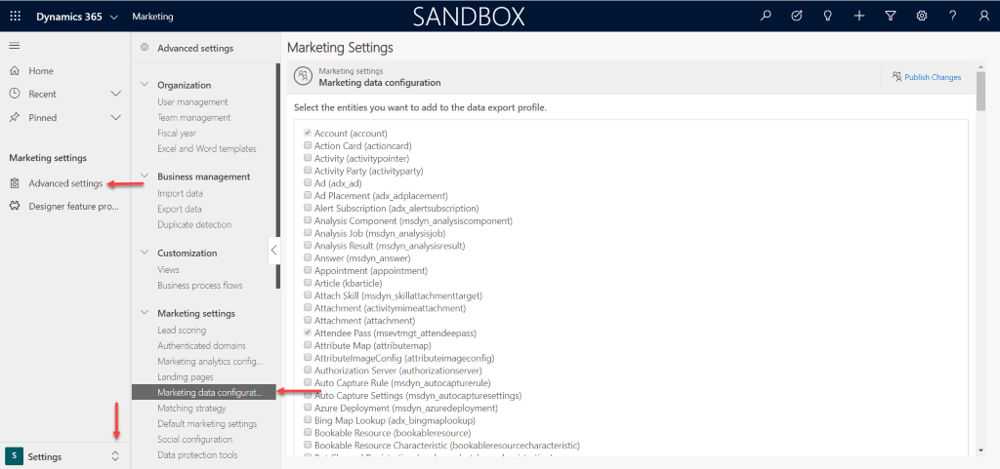
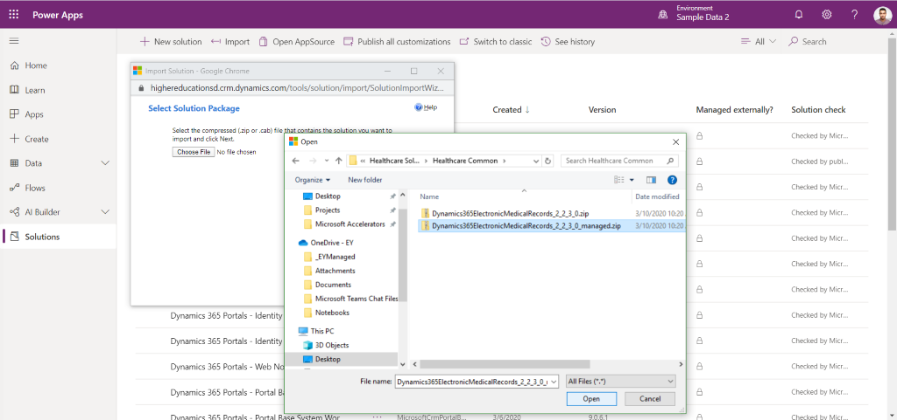

# Deploy and configure the Patient Scheduling and Screening Template

The Patient Scheduling and Screening Template requires some setup to meet your needs. This article provides step-by-step instructions for hospital IT admins or partners to deploy and configure the application for their organization. 

> [!NOTE]
> These instructions are divided into the individual use cases encompassed in the Patient Scheduling and Screening Template.

Estimated time to complete these steps: 35–40 minutes.

Download the files needed to install the solutions from [Dynamics 365 Health Accelerator v2.2.3.0](https://github.com/microsoft/Industry-Accelerator-Health/releases) on GitHub.

## Prerequisite Files 

- To import the main solutions, acquire the following managed solution files: 
  - Dynamics365ElectronicMedicalRecords_2_2_0_3_managed.zip 
  - MicrosoftDynamicsHealthcareCustomerService_3_0_3_0_managed.zip 
  - MicrosoftDynamics365PatientSegmentation_3_0_3_0_managed.zip 
  - SpatialSolution_1_4_0.zip
  - MicrosoftDynamicsHealthcareCrisisManagement_1_0_0_0_managed.zip)
  - CrisisManagementPortalDataPackage.zip
  - SampleDataPackage.zip
  - MarketingDataPackage.zip
- To import the additional solutions, you'll need the [Configuration Migration tool](https://docs.microsoft.com/powerapps/developer/common-data-service/download-tools-nuget) and the following data files: 
  - Configuration Migration tool folder 
  - Crisis Portal - DataPackage.zip 
  - Marketing Data Package - DataPackage.zip 

## Additional solutions 

To import, follow the steps in [Import additional solutions with the Configuration Migration tool](patient-scheduling-screening-template-deploy.md#import-additional-solutions-with-the-configuration-migration-tool), later. 

- Crisis Portal 
   1. Create a new portal using **Portal from blank** template. More information: [Create a portal](https://docs.microsoft.com/powerapps/maker/portals/create-portal).
   2. Use the Configuration Migration tool to import Crisis Portal: DataPackage.zip.
   3. **Import Outcome**: Successful after clearing all search history/cache.

- Marketing Data Package 
   1. The data package contains customer journeys, segments, and marketing emails entities.
   2. Use the Configuration Migration tool to import Marketing Data Package: DataPackage.zip.

## Omnichannel capabilities

For steps on how to create your Healthcare Bot in Azure, create a bot user in Dynamics 365 and embed the Healthcare Bot onto a portal. Refer to the Healthcare Bot and Omnichannel guide in the included documentation.  

### Dependencies 

- Omnichannel: Install Omnichannel in an environment following the instructions in [Provision Omnichannel for Customer Service](https://docs.microsoft.com/dynamics365/omnichannel/administrator/omnichannel-provision-license). Provisioning requires using an Admin account. You might need to perform the steps twice if it doesn't work the first time. The whole process takes about two hours.

- **Dynamics 365 Productivity Tools**: Install Productivity Tools in the environment through [Dynamics 365 Productivity Tools](https://appsource.microsoft.com/product/dynamics-365/mscrm.d365_productivity_tools?tab=Overview) on Appsource. The Productivity Tools require Omnichannel.

## Set up Healthcare Bot service

### Create your Healthcare Bot in Azure

1. Navigate to Azure Marketplace.

2. Sign in, and search for **Microsoft Healthcare Bot**.

3. Select **Create**.

4. Configure the appropriate name, subscription, resource group, and other settings.

5. Select **Subscribe**.

6. When the deployment completes, select **Go to Resource**.

7. Select **Configure Account**. When configuration completes, the bot should be ready.

You can find the URL for your bot by navigating to the bot in Azure and selecting **Browse**.

You can access the Healthcare Bot admin portal here: [Healthcare Bot admin portal](https://admin.healthbot.microsoft.com).

For more information, see [Create your first Healthcare Bot](https://docs.microsoft.com/healthbot/quickstart-createyourhealthcarebot).

### Enable Omnichannel for the bot

1. Navigate to [Healthcare Bot admin portal](https://admin.healthbot.microsoft.com).

2. Go to **Configuration > Conversation > Human handoff**.

3. Set **Dynamics 365 OmniChannel Bridge Messages** to **Enabled**, and then select **Save**.

### Obtain Bot ID

1. To get your Healthcare bot id, which you need later, navigate to the [Healthcare Bot management portal](https://us.healthbot.microsoft.com/account/ia_dev_healthcare-tunapir/scenarios/manage).

2. Go to **Integration > Channels**, and then enable the **Teams** channel if it isn't already enabled. Select **View** and copy the Bot ID. You will need it later.

If you've printed this page or copied it into a file, enter your Bot ID here:

**Bot ID: _____________________________**

### Create bot user in Dynamics 365

Before following this procedure, make sure you've installed Omnichannel for the Dynamics org you're using.

1. Navigate to the Dynamics org that contains the portal.

2. Go to **Settings > Security > Users**.

3. Select **New**, and select the **Application User** view for the form.

4. Select an appropriate username.

5. Create an **Application ID**. It must be a valid, non-expired application created in the Azure AD of the same tenant. It's not used by the bot, so it can be any application.
   a. Navigate to **Azure > Azure Active Directory > App Registrations**.
   b. Select **New registration**.
   c. Enter an appropriate name, and set it as **Microsoft only – Single tenant**.
   d. Select **Register**.
   e. Note the **Application (client) ID** and use that for the **Application ID** field.

6. In **Full Name**, enter a name to display on the chat widget.

7. Enter an email address in **Primary email**. It can be a dummy address, because it's not used.

8. Set **User type** to **Bot application user**.

9. In **Bot application ID**, enter the ID you saved earlier.

10. Select **Save**.

11. Go to **Manage roles**, give the user the role **Omnichannel agent**, and then select **OK**.

Fore more information, see the following procedures in [Dynamics 365 Omnichannel Integration](https://docs.microsoft.com/healthbot/omnichannel):

- [Add a bot user to the queue(s)](https://docs.microsoft.com/healthbot/omnichannel#add-a-bot-user-to-the-queues)
- [Set escalation rules](https://docs.microsoft.com/healthbot/omnichannel#set-escalation-rules)
- [Create a context variable](https://docs.microsoft.com/healthbot/omnichannel#create-a-context-variable)
- [Create routing rules](https://docs.microsoft.com/healthbot/omnichannel#create-routing-rules)
- [Escalate a conversation to a human agent](https://docs.microsoft.com/healthbot/omnichannel#escalate-a-conversation-to-a-human-agent)
- [End a conversation](https://docs.microsoft.com/healthbot/omnichannel#end-a-conversation)
- [Sample Custom Scenario for escalation](https://docs.microsoft.com/healthbot/omnichannel#sample-custom-scenario-for-escalation)

### Embed the Healthcare Bot onto a Portal

You shouldn't need to do this unless you want to perform specific testing with the Healthcare Bot and not connect through Omnichannel. Even in that case, you can test the bot directly in the scenario editor.

1. Obtain both the App secret and Web chat secret for the bot in the management portal under **Integration > Secrets** and save them for later.

   - Web chat secret:
   - App secret: 

2. Download the sample Healthbot container from [HealthBot Container Sample](https://github.com/Microsoft/HealthBotContainerSample/) on GitHub.

3. Unzip, npm install, and configure appropriately based on the [Health Bot Container Readme](https://github.com/microsoft/HealthBotContainerSample/blob/master/README.md) on GitHub to test to make sure you can connect to your Healthbot service with the secrets.

4. Deploy this application as an Azure App Service. For more information, see [Create a Node.js web app in Azure](https://docs.microsoft.com/azure/app-service/app-service-web-get-started-nodejs).

5. In the Azure App Service configuration, add the appropriate environment variables with the Web chat secret and App secret.

6. Test the Azure App Service URL to ensure that it runs.

   - Healthbot deployed URL:

For more information, see:

- [Embed a health bot instance in your application](https://docs.microsoft.com/healthbot/integrations/embed)
- [HealthBot Container Sample](https://github.com/Microsoft/HealthBotContainerSample/)

### How Omnichannel and Healthcare Bot work together

The flow is as follows:

1. You embed the Omnichannel bot (not Healthcare Bot) onto a site. For more information, see [Add a chat widget](https://docs.microsoft.com/dynamics365/omnichannel/administrator/add-chat-widget).

2. You set the bot up in Dynamics to route to the Healthcare Bot by default.

3. The Healthcare Bot now uses the Omnichannel bot to converse with the user.

4. The scenario or scenarios run via the Healthcare Bot configuration until the chat ends or an escalation occurs.

5. When an escalation occurs, it's passed back to Omnichannel with appropriate context variables set.

6. Omnichannel reruns the routing logic. Because there are context variables, you can configure Omnichannel to route this request to another queue that contains actual agents instead of a bot.

7. Agents can pick up the chat and continue chatting via Omnichannel.

### Install the COVID-19 Scenario templates into the Healthcare Bot

- COVID-19 Assessment
- COVID-19 FAQs - You will need a QnA Maker subscription key, which you can create here: [QnA Maker](https://portal.azure.com/#create/Microsoft.CognitiveServicesQnAMaker) 
- COVID-19 Metrics - You will need a LUIS Prediction key, which you can create by following the instructions in [Quickstart: Deploy an app in the LUIS portal](https://docs.microsoft.com/azure/cognitive-services/luis/)get-started-portal-deploy-app 

### Install Healthcare Bot scenario files

There are two scenario files located in the **Healthbot Scenarios** folder.

For more information about importing scenarios, see [Scenario Management](https://docs.microsoft.com/healthbot/scenario-authoring/scenario_management).

### Bot setup for Patient Scheduling and Screening

1. Go into the two scenarios you imported and ensure that the scenarios they call are referenced properly.

2. Modify the COVID-19 Assessment scenario as follows:
   1. Find the **Development note**.
   2. Delete it and replace it with **End Scenario With Result**.
   3. Set the return value to **AgentNeeded**.

3. In the Healthcare Bot, disable all Language models, except the following:
   - **COVID-19 Case Metrics**
   - **COVID-19 FAQs**

4. Create the following Language model and enable it:
   - Name: Crisis Assessment Model
   - Description: Same as above
   - Method: RegExp
   - Regular Expression: /(Assessment)/gi
   - Intent Mapping: CrisisAssessment -> crisis_assessment_entry

5. Create the following Language model and enable it:
   - Name: Crisis Talk To Agent Model
   - Description: same as above
   - Method: RegExp
   - Regular Expression: /(Agent)/gi
   - Intent Mapping: CrisisTalkToAgent -> crisis_talk_to_agent_entry

6. In Omnichannel, spin up a chat widget. Embed it into the portal. There will be an existing chat widget in the footer web template of the portal website, but you need to replace it with the one you create. For information about configuring a chat widget, see [Quickly configure a chat widget](https://docs.microsoft.com/dynamics365/omnichannel/administrator/configure-live-chat).

7. You will want to associate the **Crisis Agent Script** to the appropriate session for your chat. The default session to associate it to is called **Chat – Default session**. For informatio on how to associate an Agent Script to a session, see [Associate an agent script with a session template](https://docs.microsoft.com/dynamics365/omnichannel/administrator/agent-scripts#step-2-associate-an-agent-script-with-a-session-template). 

8. When you create queues and rules, one rule to note is **EscalateQueue**:

    - This text field is set to **COVID19AssessmentQueue** when the COVID-19 Assessment scenario determines a person may be at risk of having COVID-19, and it has been determined they need to speak with an agent.

    - This text field is set to **TalkToAgentQueue** when the user is forcing to talk to an agent that is not related to a scenario.

9. When escalation occurs from the Healthbot chat, there are several parameters that get passed back to Omnichannel. Up to 4 of these can be added to the agent window in the top right corner when a new chat has started (escalated). Below are the following values available: 
    - comment (string): Gives the agent an indication of why the user started the live chat
    - EscalateQueue (string): The queue name this user has been assigned to
    - ContactName (string)
    - ContactLocation (string)
    - ContactEmail (string)
    - ContactRiskFactor (string) 
    - High or Unknown 
    - ContactGender (string): male, female, or other 
    - ContactAge (number) 

### Patient segmentation capabilities

1. Marketing Application: From https://port.crm.dynamics.com/G/Applications/Index.aspx#, install **Dynamics 365 Marketing Application** in the environment. This may take up to three hours to complete, with frequent timeouts.
   
2. Update settings on Marketing entities: After the Marketing Application install completes, you must update two settings before you install this solution:
   1. Navigate to the newly installed Marketing Application.
   2. In the lower left-hand corner, change from **Marketing** to **Settings**. 
   3. Select **Advanced Settings > Marketing data configuration**.
      
   4. Check both **Condition (msemr_condition)** and **Procedure (msemr_procedure)**. 
   5. Scroll back up and select the **Publish Changes** button. 

## Manually import main solutions  

To manually import a main solution:

1. In [Power Apps](https://make.powerapps.com/home), select your environment, and then select **Solutions** in the left-hand navigation.

2. Select **Import** on the ribbon. 

3. Click **Choose File**, and then select the managed solution zip file.
    

4. Select **Open**. 

5. Select **Next** through all steps, and then select **Import**.
   > [!NOTE]
   > The Dynamics365ElectronicMedicalRecords solution may take up to an hour to install. The other solutions usually take a couple of minutes. 

## Import additional solutions with the Configuration Migration tool 

To import an additional solution using the Configuration Migration tool: 

1. Open the **Configuration Migration Tool** folder. Make sure the folder is on a desktop computer, so directory name will be short. 

2. Right-click **downloadlatest.ps1**, select **Run with Powershell**, enter **A**, select **ENTER**, and wait for it to complete. 

3. Open the new **Tools** folder, open **ConfigurationMigration**, and then run **DataMigrationUtility**. 

4. To import: 
   1. Select **Import Data**. 
   2. Connect to the org to import the data to. 
   3. Select the appropriate data zip file (should be named **DataPackage.zip**). 
   4. Perform the import.

## Issues and feedback

-   To report an issue with the Patient Scheduling & Screening sample app
    template, visit this
    [link](mailto:dynindaccsupport@microsoft.com?subject=Assistance%20for%20Health%20Care%20Accelerator%20from%20Appsource).

-   If you would like to engage with us to build on the accelerator, visit this [link](https://aka.ms/cdmengage).
