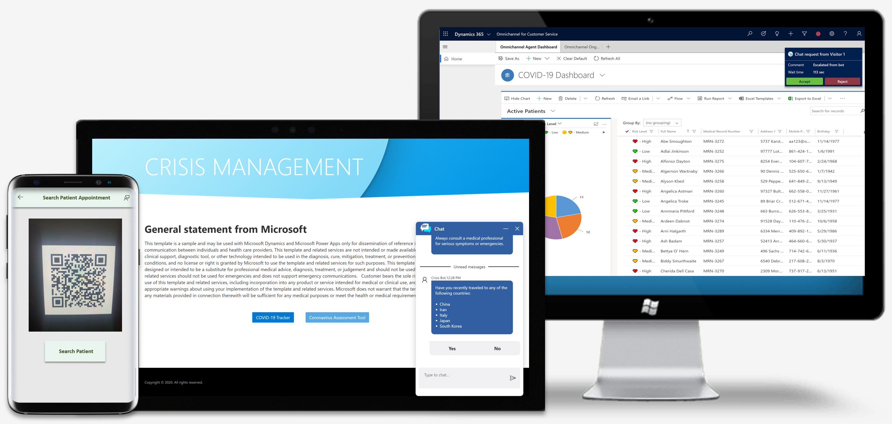

# Healthcare Accelerator Patient Scheduling and Screening Template

The Dynamics 365 Healthcare Accelerator Patient Scheduling and Screening Template enables healthcare organizations to address large volumes of anxious patients with higher efficiency. It provides access to a portal with information about COVID-19, an easy-to-use self-assessment tool for patients to find out if they are high-risk, and an automated process for booking and performing COVID-19 screening.

The solution is easily implemented, allowing quick scale and automation of crisis-specific workloads. The timely availability of this accelerator brings together a seamless workflow for patients, call center agents, clinical technicians, and providers, enabling them to meet the rapidly growing needs of assessment and testing. The Patient Scheduling and Screening Template is an easy-to-integrate solution that sits on top of an existing Patient Platform. 

The main components of the Patient Scheduling and Screening Template are:

- **Clinical data used for segmentation and triage**: Leverage patient population's historical clinical data to perform automated segmentation of high-risk patients.

- **Customer-branded Patient Portal and Self-Assessment tools**: The Healthbot COVID-19 Template infused into the portal serves as an intermediary, to automate high-level triage and stratification to determine if a patient is deemed high-risk and should be transferred to the call center agent for test scheduling.

- **Omnichannel tools for call center agents**: Leverage Omnichannel for Customer Service capabilities to provide next steps to high-risk patients, such as viewing previous clinical information, sending knowledge base articles, and booking screening appointments.

- **Automation of appointment booking and check-in with use of QR/Bar Codes**: Pre-built automation where patients can receive a notification with details of the appointment and an accompanying QR/Bar Code for entry at the testing center.

- **Purpose-built patient screening automation**: Purpose-built testing app to provide a quick and simple way of locating a patient and performing testing.

## Demo: Quick overview

Watch a quick overview of the Patient Scheduling and Screening Template.

**VIDEO**

## Licensing requirements

- Core Solution: Power Apps license
- Patient Outreach: Dynamics Marketing App
- Patient Triage: Microsoft Healthbot Service
- Omnichannel Call Center: Dynamics Customer Service App, Productivity Pack, Omnichannel for Customer Service

Contact your local Microsoft account representative for questions related to licensing.

For more information, see [Licensing overview for Power Platform](https://docs.microsoft.com/power-platform/admin/pricing-billing-skus).

## Issues and feedback

-   To report an issue with the Patient Scheduling & Screening sample app
    template, visit this
    [link](mailto:dynindaccsupport@microsoft.com?subject=Assistance%20for%20Health%20Care%20Accelerator%20from%20Appsource).

-   If you would like to engage with us to build on the accelerator, visit this [link](https://aka.ms/cdmengage).

## Next step

Deploy and configure the [Patient Scheduling and Screening Template](patient-scheduling-screening-template-deploy.md).

## Disclaimer

This app is a sample and may be used with Microsoft Power Apps for dissemination of reference information only. This app is not intended or made available for use as a medical device, clinical support, diagnostic tool, or other technology intended to be used in the diagnosis, cure, mitigation, treatment, or prevention of disease or other conditions, and no license or right is granted by Microsoft to use this app for such purposes. This app is not designed or intended to be a substitute for professional medical advice, diagnosis, treatment, or judgment and should not be used as such. Customer bears the sole risk and responsibility for any use of this app. Microsoft does not warrant that the app or any materials provided in connection therewith will be sufficient for any medical purposes or meet the health or medical requirements of any person.
