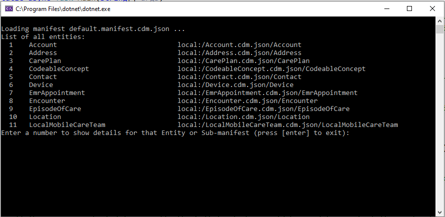
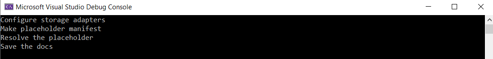
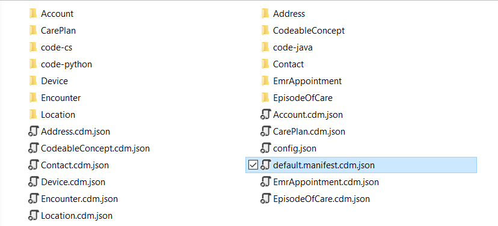

# How to use the Common Data Model samples

This article provides information about using the Common Data Model sample code.

## Sample location and structure

Sample code that demonstrates concepts and their use is available for C#
implementation at <https://github.com/microsoft/CDM/tree/master/samples>

Here you will find Visual Studio sample projects organized in separate folders.
There is also the [example-public-standards](https://github.com/microsoft/CDM/tree/master/samples/example-public-standards) folder that contains local
copy of Common Data Model standard entities and is referenced by the sample projects.

Within each samples folder, the files are organized as follows:

-   The **code-cs** folder contains the Visual Studio solution.

-   Set of JSON files with Common Data Model entity definitions

-   Set of folders that may contain empty sample data partition file in the CSV format


## Prerequisites for all samples

Every time we interact with Common Data Model, we interact with some persisted form of Common Data Model and need to register storage adapters which embed I/O logic for specific file-system implementations, such as local file-system or ADLSg2. 

Following is the sample code that sets up a configuration to use the local storage system where we need to provide paths to the schema documents on a local file system (some commonly used schema documents can be provided by using CDN/GitHub storage adapters):

```csharp
// Configure storage adapters and mount them to the corpus.

// We want our storage adapters to point at the local manifest location and at the example public standards.

string pathFromExeToExampleRoot = "../../../../../../";

// Storage adapter pointing to the target local manifest location.

cdmCorpus.Storage.Mount("local", new LocalAdapter(pathFromExeToExampleRoot +
"1-read-manifest"));

// 'local' is our default namespace.

// Any paths that start navigating without a device tag (ex. 'cdm') will just default to the 'local' namespace.

cdmCorpus.Storage.DefaultNamespace = "local";

// Storage adapter pointing to the example public standards.

// This is a sample 'cdm'; normally the Github adapter would be used to point at
the real public standards.

// Mount it as the 'cdm' device, not the default, so that we must use
"cdm:\<folder-path\>" to get there.

cdmCorpus.Storage.Mount("cdm", new LocalAdapter(pathFromExeToExampleRoot + "example-public-standards"));
```

## Explanation of C# sample code on how to use the new object model

### Read Manifest


In this sample, you will learn how to read the Common Data Model manifest with all entity
definitions, examine an entity, it's attributes and partitions.

1.  Under the **1-read-manifest/code-cs** folder, open the `read-manifest.sln` file.

1.  Run the project. You should see a console with the list of entities and
    corresponding schema locations.

    

1.  Type a number for a chosen entity and see the list of attributes and traits.

    


**How it works:**

The object model reads the content of the `default.manifest.cdm.json` file located at the root of the project folder. The relative path points at it from the location of the .exe file. For example, the location of the read manifest
executable is:

E:\cdm_sdk_test\CDM SDK\1-read-manifest\code-cs\read-manifest\bin\\Debug\netcoreapp2.1

The path to the folder with entities is specified as follows:

```csharp
string pathFromExeToExampleRoot = "../../../../../../";
```

Once it lists entities, it can be pointed at a specific entity and will parse JSON for that specific entity to get the entity attributes and traits.

Follow comments in the `Program.cs` file for each specific fragment for iterating
through entities, their attributes, traits and data partition locations.

### Create Manifest 


In this example, you will learn how to create a manifest with select number of pre-defined entities as well as corresponding partitions. 

1. Under the **2-create-manifest/code-cs** folder, open the `create-manifest.sln` file.

    

1.  Run the project. Monitor messages in the console as they are informative to
    what is going on.

    

1.  Look into your directory, it should have all files with entity definitions,
    manifest file and folders with empty csv files for data generated for you.

    

1.  There are few code fragments here. After configuring adapters, same as in
    the first sample, we create temporary manifest object, add specific entities of
    your choice. Note that you need to point at definitions for those entities.

    ```csharp
    // Add each declaration, this example is about medical appointments and care plans

    manifestAbstract.Entities.Add("Account",
    "cdm:/core/applicationCommon/foundationCommon/crmCommon/accelerators/healthCare/electronicMedicalRecords/Account.cdm.json/Account");

    manifestAbstract.Entities.Add("Address",
    "cdm:/core/applicationCommon/foundationCommon/crmCommon/accelerators/healthCare/electronicMedicalRecords/Address.cdm.json/Address");

    manifestAbstract.Entities.Add("CarePlan",
    "cdm:/core/applicationCommon/foundationCommon/crmCommon/accelerators/healthCare/electronicMedicalRecords/CarePlan.cdm.json/CarePlan");

    manifestAbstract.Entities.Add("CodeableConcept",
    "cdm:/core/applicationCommon/foundationCommon/crmCommon/accelerators/healthCare/electronicMedicalRecords/CodeableConcept.cdm.json/CodeableConcept");

    manifestAbstract.Entities.Add("Contact",
    "cdm:/core/applicationCommon/foundationCommon/crmCommon/accelerators/healthCare/electronicMedicalRecords/Contact.cdm.json/Contact");

    manifestAbstract.Entities.Add("Device",
    "cdm:/core/applicationCommon/foundationCommon/crmCommon/accelerators/healthCare/electronicMedicalRecords/Device.cdm.json/Device");

    manifestAbstract.Entities.Add("EmrAppointment",
    "cdm:/core/applicationCommon/foundationCommon/crmCommon/accelerators/healthCare/electronicMedicalRecords/EmrAppointment.cdm.json/EmrAppointment");

    manifestAbstract.Entities.Add("Encounter",
    "cdm:/core/applicationCommon/foundationCommon/crmCommon/accelerators/healthCare/electronicMedicalRecords/Encounter.cdm.json/Encounter");

    manifestAbstract.Entities.Add("EpisodeOfCare",
    "cdm:/core/applicationCommon/foundationCommon/crmCommon/accelerators/healthCare/electronicMedicalRecords/EpisodeOfCare.cdm.json/EpisodeOfCare");

    manifestAbstract.Entities.Add("Location",
    "cdm:/core/applicationCommon/foundationCommon/crmCommon/accelerators/healthCare/electronicMedicalRecords/Location.cdm.json/Location");

    // Add the temp manifest to the root of the local documents in the corpus.

    var localRoot = cdmCorpus.Storage.FetchRootFolder("local");

    localRoot.Documents.Add(manifestAbstract);
    ```

1.  The following fragment implements resolving entities (creating instances of
specific entities using their abstract definitions as well as foundation
definitions). After that, each entity is saved to the directory in corresponding
JSON file along with the eponymous folder with empty CSV partition file.

    ```csharp
    // Create the resolved version of everything in the root folder too

    Console.WriteLine("Resolve the placeholder");

    var manifestResolved = await
    manifestAbstract.CreateResolvedManifestAsync("default", "");

    // Add an import to the foundations doc so the traits about partitions will resolve nicely

    manifestResolved.Imports.Add("cdm:/foundations.cdm.json");
    ```

1. Follow comments in the `Program.cs` for each specific fragment.

### Customize Entities


1.  Under the **3-customize-entities/code-cs** folder, open the `customize-manifest.sln` file.

2.  Run the project.

This sample will load an existing manifest and add to it a new entity that is a
customized version of a standard entity. 

We will add the CareTeam entity, but first we will add the 'currentCity' attribute and give the new entity a new name 'MobileCareTeam'. This new definition becomes a local abstract description of an entity that is transformed from the logical definition into the concrete
definition per instructions on how to process references and relationships before being added to the manifest.

```csharp
// This method turns relative corpus paths into absolute ones in case we are in
// some sub-folders and don't know it

var manifest = await
cdmCorpus.FetchObjectAsync<CdmManifestDefinition>("default.folio.cdm.json");

Console.WriteLine("Define new extension");

// First we will make a new document right in the same folder as the manifest

var docAbs =
cdmCorpus.MakeObject<CdmDocumentDefinition>(CdmObjectType.DocumentDef,MobileCareTeam.cdm.json");
```

Next, import the Common Data Model description of the original so the symbols will resolve.

```csharp
// Import the Common Data Model description of the original so the definitions from the foundations document such as entityId will resolve

docAbs.Imports.Add("cdm:/core/applicationCommon/foundationCommon/crmCommon/accelerators/healthCare/electronicMedicalRecords/CareTeam.cdm.json",
null);

// We will make a new trait to identify things that are known to be temporary, used later

// In theory this would be defined somewhere central so it can be shared

var traitTemp = docAbs.Definitions.Add(CdmObjectType.TraitDef,"means.temporary") as CdmTraitDefinition;

// Extends the standard 'means' base trait

traitTemp.ExtendsTrait =
cdmCorpus.MakeObject<CdmTraitReference>(CdmObjectType.TraitRef, "means",true);

// Add a parameter for the expected duration in days

var param = cdmCorpus.MakeObject<CdmParameterDefinition>(CdmObjectType.ParameterDef,"estimatedDays");

// By not using "true" on the last arg, this becomes an real reference object
// in the json. go look at the difference from "means" when this is done

param.DataTypeRef =
cdmCorpus.MakeObject<CdmDataTypeReference>(CdmObjectType.DataTypeRef,
"integer");

param.DefaultValue = "30";

traitTemp.Parameters.Add(param);

// Make an entity definition and add it to the list of definitions in the document.

CdmEntityDefinition entAbs = docAbs.Definitions.Add(CdmObjectType.EntityDef, "MobileCareTeam") as CdmEntityDefinition;

// This entity extends the standard

// This function with 'true' will make a simple reference to the base

entAbs.ExtendsEntity =
cdmCorpus.MakeObject<CdmEntityReference>(CdmObjectType.EntityRef, "CareTeam", true);

// and we will add an attribute

CdmTypeAttributeDefinition attNew = cdmCorpus.MakeObject<CdmTypeAttributeDefinition>(CdmObjectType.TypeAttributeDef, "currentCity");

// The attribute is a type is 'City" this is one of the predefined semantic types in meanings.cdm.json

attNew.DataType = cdmCorpus.MakeObject<CdmDataTypeReference>(CdmObjectType.DataTypeRef, "city", true);

attNew.Description = "The current city where the mobile care team is working";

// also apply our fancy new 'temporary' trait. they stay in a city for 90 days on average

CdmTraitReference tr = cdmCorpus.MakeObject<CdmTraitReference>(CdmObjectType.TraitRef,"means.temporary");

tr.Arguments.Add("estimatedDays", "90");

attNew.AppliedTraits.Add(tr);

// Add attribute to the entity

entAbs.Attributes.Add(attNew);


// The entity abstract definition is done, add the document to the corpus in the root folder and then save that doc

cdmCorpus.Storage.FetchRootFolder("local").Documents.Add(docAbs);


//The next step is to remove all the guesswork out of decoding the entity shape by resolving it to a relational by reference shape.


Console.WriteLine("Make a local 'resolved' copy");

// Now resolve it

// Made the entity and document have a different name to avoid conflicts in this
folder

var entFlat = await entAbs.CreateResolvedEntityAsync("LocalMobileCareTeam");

// Now just add the pointer into our manifest.

Console.WriteLine("Add to manifest");

manifest.Entities.Add(entFlat);

// This function will update all of the fileStatus times in the manifest

// await manifest.RefreshFileStatus();

// Save the manifest along with linked definition files

await manifest.SaveAsAsync("default.manifest.cdm.json", true);
```


The result is the extended (customized) entity:

```JSON
{
    "jsonSchemaSemanticVersion":"0.9.0",
    "imports":[
       {
          "corpusPath":"cdm:/core/applicationCommon/foundationCommon/crmCommon/accelerators/healthCare/electronicMedicalRecords/CareTeam.cdm.json"
       }
    ],
    "definitions":[
       {
          "traitName":"means.temporary",
          "extendsTrait":"means",
          "hasParameters":[
             {
                "name":"estimatedDays",
                "defaultValue":"30",
                "dataType":{
                   "dataTypeReference":"integer"
                }
             }
          ]
       },
       {
          "entityName":"MobileCareTeam",
          "extendsEntity":"CareTeam",
          "hasAttributes":[
             {
                "name":"currentCity",
                "dataType":"city",
                "appliedTraits":[
                   {
                      "traitReference":"means.temporary",
                      "arguments":[
                         {
                            "name":"estimatedDays",
                            "value":"90"
                         }
                      ]
                   }
                ],
                "description":"The current city where the mobile care team is working"
             }
          ]
       }
    ]
 }
```

Follow comments in the `Program.cs` for each specific fragment.

### Create net new entity 

This sample is going to simulate the steps a tool would follow to
create a new manifest document in some user storage folder with two types of
entities:
- a net new entity
- an entity extended from some public standards.

> [!NOTE]
> To create a relationship from a new custom entity to an existing entity loaded from some public standards, we need to create an entity extended from the existing entity and add a relationship to the attribute of the new entity because we can't modify attributes from an abstract schema definition in the public standards.

This sample also creates a relationship from a net new entity to an existing
entity, and a relationship between two net new entities.

The steps are:

1. Configure adapters as with all sample projects

   ```csharp 
    // Make a corpus, the corpus is the collection of all documents and folders created or discovered while navigating objects and paths

    var cdmCorpus = new CdmCorpusDefinition();

    Console.WriteLine("configure storage adapters");

    // Configure storage adapters to point at the target local manifest location and at the fake public standards

    var pathFromExeToExampleRoot = "../../../../../../";

    cdmCorpus.Storage.Mount("local", new LocalAdapter(pathFromExeToExampleRoot + "6-create-net-new-entities"));

    cdmCorpus.Storage.DefaultNamespace = "local"; 
    
    // local is our default so any paths that start out navigating without a device tag will assume local

    // Example cdm, normally use the github adapter

    // Mount it as the 'cdm' device, not the default so must use "cdm:/folder" to get there

    cdmCorpus.Storage.Mount("cdm", new LocalAdapter(pathFromExeToExampleRoot + "example-public-standards"));
    ```

1. Create a temporary manifest object at the root of the corpus

    ```csharp
    // Make the temp manifest and add it to the root of the local documents in the corpus

    CdmManifestDefinition manifestAbstract = cdmCorpus.MakeObject<CdmManifestDefinition>(CdmObjectType.ManifestDef,"tempAbstract");

    // Add the temp manifest to the root of the local documents in the corpus

    var localRoot = cdmCorpus.Storage.FetchRootFolder("local");

    localRoot.Documents.Add(manifestAbstract, "TempAbstract.manifest.cdm.json");
    ```

1. Create two net new entities without extending any existing entity, create a relationship from one to the other, and add them to the manifest.

   ```csharp
    // Create the simplest entity - CustomPerson

    // Create the entity definition instance

    var personEntity = cdmCorpus.MakeObject<CdmEntityDefinition>(CdmObjectType.EntityDef, CustomPersonEntityName, false);

    // Add type attributes to the entity instance

    var personAttributeId = CreateEntityAttributeWithPurposeAndDataType(cdmCorpus,$"{CustomPersonEntityName}Id", "identifiedBy", "entityId");

    personEntity.Attributes.Add(personAttributeId);

    var personAttributeName = CreateEntityAttributeWithPurposeAndDataType(cdmCorpus,$"{CustomPersonEntityName}Name", "hasA", "string");

    personEntity.Attributes.Add(personAttributeName);

    // Add properties to the entity instance

    personEntity.DisplayName = CustomPersonEntityName;

    personEntity.Version = "0.0.1";

    personEntity.Description = "This is a custom entity created for the sample.";

    // Create the document which contains the entity

    var personEntityDoc = cdmCorpus.MakeObject<CdmDocumentDefinition>(CdmObjectType.DocumentDef,$"{CustomPersonEntityName}.cdm.json",  false);

    // Add an import to the foundations doc so the traits about partitions will resolve nicely

    personEntityDoc.Imports.Add(FoundationJsonPath);

    personEntityDoc.Definitions.Add(personEntity);

    // Add the document to the root of the local documents in the corpus

    localRoot.Documents.Add(personEntityDoc, personEntityDoc.Name);

    // Add the entity to the manifest

    manifestAbstract.Entities.Add(personEntity);
    ```

Follow the same code path to create another new entity.

1. Next is to create an entity that extends from the public standards, create a relationship from it to a net new entity, and add the entity to the manifest.

    ```csharp 
    // Create an entity which extends "Account" from the standard, it contains everything that "Account" has

    var extendedStandardAccountEntity = cdmCorpus.MakeObject<CdmEntityDefinition>(CdmObjectType.EntityDef, ExtendedStandardAccount, false);

    // This function with 'true' will make a simple reference to the base

    extendedStandardAccountEntity.ExtendsEntity = cdmCorpus.MakeObject<CdmEntityReference>(CdmObjectType.EntityRef, "Account",
    true);
    ```

1. Follow the code in the sample to fully define the extended entity similar
to the sample extending the standard entity

1. Make a 'resolved' version of each entity doc in our local folder. Call
`CreateResolvedManifestAsync` on our starting manifest. This will resolve
everything and find all of the relationships between entities for us. Check out the second example 2-create-manifest for more details. Save the new documents.

    ```csharp
    // Save as manifest.cdm.json

    await manifestResolved.SaveAsAsync($"{manifestResolved.ManifestName}.manifest.cdm.json", true);
    ```


As a result, you should have new entities created with logical definitions and resolved definitions in the **resolved** folder

Follow comments in the `Program.cs` for each specific fragment.
