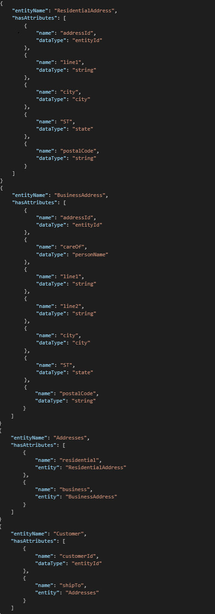
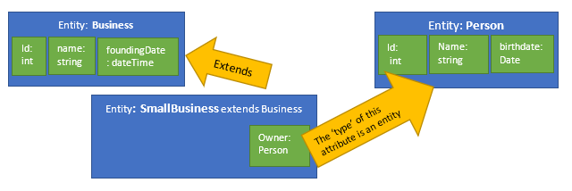
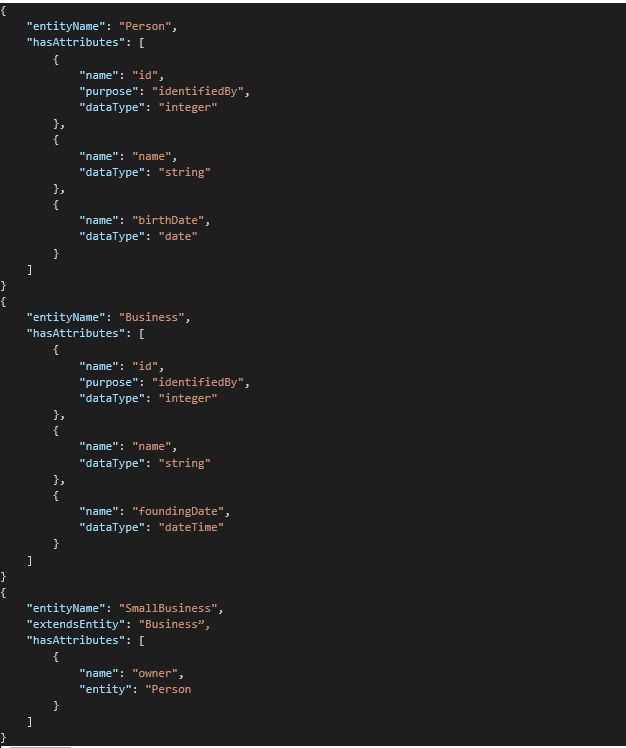
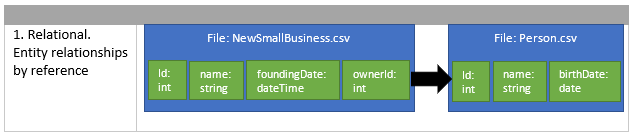
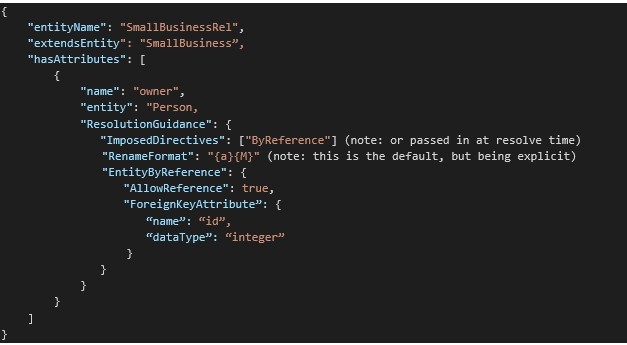
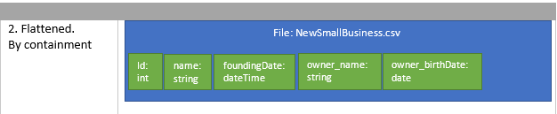
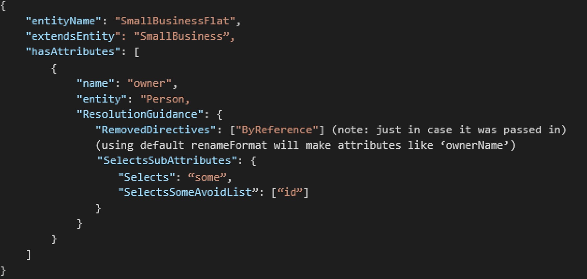
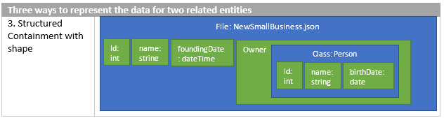

# Convert logical entities into resolved entities

To illustrate the concept of converting logical entities into resolved entities,
let's return to our Student entity example. Given the new, full definition of
Student, it will be a bit cumbersome to determine the final set of attribute
names and traits for the entity.

Common Data Model can create a "resolved" version of a logical entity that can
be navigated to or persisted into a document, to offer a much more concrete
depiction of an entity.

By default, the resolved entity for Student will result in:

1. entity: Student

    

1.  In addition to this entity shape, a section of the document contains an
    **attributeContext** graph with the following characteristics:

    1.  This graph explains the attributes and traits that were
        discovered.

    2.  It also lays out the inheritance chains that were followed, and the
        attribute groups and entity type attributes that were navigated.

    3.  Each attribute in the resolved entity from \#1 will contain a reference
        to the portion of the **attributeContext** context tree where it was
        discovered.

    4.  This structure can be used to re-create the inheritance and nesting
        relationships, if needed.

## The default resolution behavior

The set of attributes shown in the resolved entity example above represents the
default behavior of the object model for Common Data Model when it resolves
entities (by using the corpus.CreateResolvedEntityAsync API). Because the next
few sections of this article describe how and why one might want to override the
default behavior, let's first look at the default behavior:

1.  If the entity is extending another entity, the attributes from the base
    entity are taken "as-is," as a starting point. Taken as-is means these
    attributes were collected by using the rules in this list.

1.  Attributes are processed one at a time and in the order in which they were
    defined in the entity. This includes an attribute group reference or an
    entity type attribute.

1.  If a newly processed attribute results with a name that is a duplicate of an
    attribute that has already been collected, the attributes are merged. This
    means the traits of the newest attribute are added to the traits of the
    original attribute (or replaced if they're the same traits). Through this
    behavior, you can alter an attribute taken from a base entity by simply
    re-declaring it by using the same name and then setting new traits.

1.  Attributes from a referenced attributeGroup object will be collected as a
    set and then added one at a time (as is) to the accumulating set of
    attributes. In this way, the attribute group acts like a cut-and-paste macro
    for inserting sets of attributes that were defined elsewhere.

1.  Attributes from another entity (when used as the type of an attribute) are
    collected from that entity and then—to avoid name collisions—renamed by
    using the format *attributeMember*, where *attribute* is the name of the
    attribute that uses the entity as a type and *Member* is the name of the
    attribute that was taken from the sub-entity. In this way, using an entity
    as an attribute type can be thought of as using the entity as a complex
    (structured) data type.

## The three flavors of an entity definition

Informally speaking, there's only one "grammar" for describing entities:

<!-- image22 -->
 

By using this same grammar, however, it's possible to describe three
conceptually different kinds of entity definitions:

1.  A purely logical entity. This type of entity is used to communicate and
    share the meaning of an entity in a way that's independent of any particular
    storage layout of partition data. It conveys just the ideas:

    1.  Often uses entity inheritance with the **Extends** property to create
        logical groupings of shared concepts and to express a kind of lineage of
        metadata additions and specializations.

    2.  Uses semantically rich **dataType** and **Purpose** objects to encode
        the meanings, structure, constraints, and so on that are part of the
        logical definition of an attribute.

    3.  Uses attribute group references to pull in copies of common attribute
        definitions.

    4.  Uses entity typed attributes to express complex structure or to indicate
        a relationship that exists between entities.

    5.  Contains no resolution guidance sections.

1.  A resolved, or data layout–specific, entity. These are used to exactly
    describe the schema of specific data storage partitions. They are meant to
    be understood without needing to look things up, and as such, they have:

    1.  No entity inheritance.

    2.  No resolution guidance sections.

    3.  No use of **dataType** or **Purpose** objects.

    4.  No attribute group references that need to be pulled in.

    5.  Possibly some attribute groups that contain other attributes as a
        mechanism to express structure or nesting in a structured storage
        format.

    6.  All traits on the entity or the individual attributes explicitly listed
        (no inference needed).

    7.  Possibly an **AttributeContext** section that provides an explanation of
        the steps Common Data Model went through to transform a logical entity
        into a resolved entity.

1.  A "guidance" entity. These entities act as a set of instruction to the
    object model for how a set of logical entities should be arranged and
    manipulated to form one of the potentially resolved entities for the set.
    These entities are similar to the logical entity, with a few notable
    exceptions:

    1.  They inherit from a logical entity.

    2.  They contain resolution guidance sections for the inherited base entity
        and for any added attributes that give directions to the object model
        for how a resolved entity should be constructed.

In practice, logical entities and guidance entities might be combined into one
entity definition. This limits the flexibility for the ways to resolve the
logical entity.

## Directives, guidance, and the resulting resolved shapes

A key requirement for many users of the object model for Common Data Model is to
represent different optimal storage layouts from one semantic, logical model.
They need to store data in the form that works best for their system, relational
(for Power BI or SQL), denormalized and flattened (a flat file for use with
machine learning), or perhaps denormalized and structured (big data systems that
store graphs in JSON or Parquet, for instance). At the same time, they want to
build on and expose a shared semantic definition of entities and retain the
ability to transform data from one optimal shape into another.

### Deeper

When one entity uses another entity as an attribute type, there are several ways
that such a relationship can be considered and several ways that a particular
resolution of the entities can describe the stored records of data.

For instance, perhaps one entity should always be embedded directly into another
while a different use of the entity should always link with a foreign key.
Perhaps one entity links to many instances of the other entity (an array).

On the persisted data side, some systems might insist on always using foreign
key references instead of embedding entities while other systems might want to
store arrays of linked entities directly inline in the data of the main entity
(such as in a JSON document).

For example, here are three ways to represent a relationship between a small
business and the one person who's the owner of the business.

<!-- image24 -->
 

These three shapes of persisted data are consistent with this one statement of
the logical model:

<!-- image25 -->
 

The logical definition of these entities states that a SmallBusiness is also a
Business and it has an Owner who is a Person. This logical model can be
instructed to resolve in each of the three ways listed above:

1.  Take only the primary key from the Person entity (Id) and include it in the
    resolved SmallBusiness entity, while renaming it to OwnerId. This also
    assumes that the Person entity will be resolved into a separate flattened
    form.

1.  Take the name and birthdate attributes from the Person entity and embed them
    directly into the resolved SmallBusiness entity, while renaming them to
    OwnerName and OwnerBirthdate.

1.  Take the attributes from the Person entity and embed them in the
    SmallBusiness entity as a nested object (named Owner) that has the
    sub-attributes.

Each of these shapes is produced by combining some resolution guidance hints in
the entity definition (or moved to an independent guidance entity definition)
with a set of directives used as arguments to the createResolvedEntity API.

### Directives

The CreateResolvedEntity API takes an optional set of directives that can alter
the default behavior for how to handle the attributes that use another entity as
a type.

| Directive     | Behavior                                                                                                                                                                                                                                                                                                                                                                                                                                                                                                                                                             |
|---------------|----------------------------------------------------------------------------------------------------------------------------------------------------------------------------------------------------------------------------------------------------------------------------------------------------------------------------------------------------------------------------------------------------------------------------------------------------------------------------------------------------------------------------------------------------------------------|
| (none)        | The entity type of the attribute is treated like a complex data type. Individual members from the entity are renamed to disambiguate them and are added inline to the outer entity. If the attribute is marked to represent an array of values, the array will be expanded, and the sub-attributes will be repeated *n* times.                                                                                                                                                                                                                                        |
| referenceOnly | If the attribute is marked to allow for use by reference , instead of taking all attributes from the other entity, only the identifying attributes are taken and used as a foreign key. The taken attributes are renamed.                                                                                                                                                                                                                                                                                                                                            |
| Normalized    | Assumes that one-to-many relationships (that is, entity typed attributes that are marked to represent an array of values instead of a single instance) have a reference to the owning entity from the "many" side (the entity used as the type). It also assumes that many-to-many relationships are resolved by using a correlation entity that points toward this entity. Therefore, this directive avoids adding any information to this entity regarding a linked entity (a foreign key from the referenceOnly directive) that is also marked as being an array. |
| Structured    | Places resolved entity attributes into groups, thus avoiding the need to disambiguate names or repeat attributes in an array expansion. Using a structured directive produces a schema that must be interpreted by the consumer to look for embedded structures and arrays in their data. Because of the structured description (not relational), the normalized behavior of avoiding foreign keys for arrays is skipped.                                                                                                                                            |

If no directives are provided to CreateResolvedEntity, by default referenceOnly
and Normalized are used. This makes a relational resolved schema.

### Resolution guidance

To further clarify and illustrate the process that resolves logical entities
into a concrete attribute list, consider this example schema:

<!-- image26 -->
 

Holding in mind the **shipTo** entity attribute defined in the Customer entity
above, consider this pipeline of operations that's performed on the set of
attributes that result from the Addresses entity. (Note that for explanatory
purposes, this list describes every possible stage even though, in reality, not
all of them apply in all situations.) 

| Stage                         | Does                                                                                                                                                                                                                                                                                                                                                                                                                                                                                                                                 | Example                                                                                                                                                                                                                                  |
|-------------------------------|--------------------------------------------------------------------------------------------------------------------------------------------------------------------------------------------------------------------------------------------------------------------------------------------------------------------------------------------------------------------------------------------------------------------------------------------------------------------------------------------------------------------------------------|------------------------------------------------------------------------------------------------------------------------------------------------------------------------------------------------------------------------------------------|
| all source attributes         | Takes all attributes in the natural order from the source entity.                                                                                                                                                                                                                                                                                                                                                                                                                                                                    | The Addresses entity combines the Residential and Business Address entities into this list of attributes: [addressId, line1, city, ST, postalCode, careOf, line2]                                                                        |
| polymorphic factoring         | When a source entity is a combination of many other entities, the attributes of those entities will be combined and merged. The default meaning of the combination is AND; that is, the data values for one row of data are assumed to be from a combination of the domains of the sub-entities. In the case where an OR should be considered—that is, the data values for one row should be assumed to be from just one of the sub-entities at a time—this stage will mark the set appropriately.                                   | The schema will be written in a way to indicate that per record, one should expect values in either the attributes [addressId, line1, city, ST, postalCode] OR in the attributes [addressId, careOf, line1, line2, city, ST, postalCode] |
| take only an ordered set      | Selects out only attributes mentioned in a given list. Also, the input attributes are reordered to match the order in the list.                                                                                                                                                                                                                                                                                                                                                                                                      | Take (addressId, postalCode, line1, line2, poBox, careOf) produces [addressId, postalCode, line1, line2, careOf]                                                                                                                         |
| remove from a set             | Removes the listed attributes from the input set. All others pass through in their original order.                                                                                                                                                                                                                                                                                                                                                                                                                                   | Remove (line2, firstName, careOf) produces [addressId, postalCode, line1]                                                                                                                                                                |
| augment with supporting       | Adds a provided attribute to the set and adds a trait to the attribute indicating it was addedInSupportOf(input attribute).                                                                                                                                                                                                                                                                                                                                                                                                          | (breaking from the example for just this stage) Input attribute (statusCode) augment with supporting {statusCode_display} produces [statusCode, statusCode_display with addedInSupportOf(statusCode)]                                    |
| foreign key replacement       | Replace all input attributes with the provided attribute, and mark that new attribute as a link to the source entity.                                                                                                                                                                                                                                                                                                                                                                                                                | (back to the example set) Replace with foreignKey {addId} produces [addId with is.Linked.Identifier (Addresses on addressId, because of the polymorphic stage, this actually gets two links, one to each sub-entity) ]                   |
| indicate poly type            | For the case from stage 2 where a polymorphic OR is needed, this stage adds a specified attribute that's used to indicate the per-record type that matches one of the source entities.                                                                                                                                                                                                                                                                                                                                               | Indicate type with {‘addType’} results in [addId, addType with is.entity.type trait} ] this addType attribute's data values should indicate the kind of record to consider.                                                              |
| duplicate for array expansion | Makes *n* copies of every input attribute, and marks each temporarily with an ordinal.                                                                                                                                                                                                                                                                                                                                                                                                                                               | Copy from one to three results in [addId(1), addType(1), addId(2), addType(2), addId(3), addType(3)]                                                                                                                                     |
| Indicate count                | Adds a provided attribute to the set and marks it with a trait indicating that for each record, this attribute holds the count of array members that should be expected to contain data values.                                                                                                                                                                                                                                                                                                                                      | Indicate count with {addCount} results in [addId(1), addType(1), addId(2), addType(2), addId(3), addType(3), addCount with trait indicating it holds a count]                                                                            |
| Rename with format            | Renames each attribute in the input set by applying a provided format string. The format string can contain one instance each of the replacement indicators (‘{a}’ or ‘{A}’) for the (lowercase or uppercase first character) name of the containing attribute name (in our example, ‘shipTo’), (‘{m}’ or ‘{M}’) for the (lowercase or uppercase first character) name of the set member (like ‘line1’ or ‘addId’ and ‘{o}’ for the held ordinal of the attribute in the set. Examples are “{m}AsPartOf{A}”, “{a}{M}” or “{a}{M}{o}” | Rename with “{a}_{m}_{o}” produces [ shipTo_addId_1, shipTo_addType_1, shipTo_addId_2, shipTo_addType_2, shipTo_addId_3, shipTo_addType_3, shipTo_addCount]                                                                              |
| merge results                 | Any attributes in the set with identical names will be merged together; that is, one attribute will result with traits of all source attributes combined into one uniquely named set. Then, any resulting attributes from this pipeline will be merged in the same way into the final set of attributes for the outer entity that's being defined.                                                                                                                                                                                   | [ customerId, shipTo_addId_1, shipTo_addType_1, shipTo_addId_2, shipTo_addType_2, shipTo_addId_3, shipTo_addType_3, shipTo_addCount]                                                                                                     |

The example above was contrived to demonstrate each stage, but in most
situations these stages won't all occur. For a given attribute or base entity,
the settings in the associated resolution guidance structure—along with any
resolution directives that are supplied at resolution time—will interact with,
and trigger, stages.

| Stage                         | When applied                                                                                                                                                                                            | Reason/notes                                                                                                                                                                                                                                                                                                                                                                                                                                                                                                                                                                                                                                                 |
|-------------------------------|---------------------------------------------------------------------------------------------------------------------------------------------------------------------------------------------------------|--------------------------------------------------------------------------------------------------------------------------------------------------------------------------------------------------------------------------------------------------------------------------------------------------------------------------------------------------------------------------------------------------------------------------------------------------------------------------------------------------------------------------------------------------------------------------------------------------------------------------------------------------------------|
| all source attributes         | Always                                                                                                                                                                                                  |                                                                                                                                                                                                                                                                                                                                                                                                                                                                                                                                                                                                                                                              |
| polymorphic factoring         | SelectsSubAttributes.selects = “one”                                                                                                                                                                    | The referenced entity should be a container of other entity typed attributes.                                                                                                                                                                                                                                                                                                                                                                                                                                                                                                                                                                                |
| take only an ordered set      | SelectsSubAttributes.selects = “some”                                                                                                                                                                   | If set, the list of attribute names in the SelectsSubAttributes. SelectsSomeTakeNames array will be used to filter in and reorder the source attributes                                                                                                                                                                                                                                                                                                                                                                                                                                                                                                      |
| remove from a set             | SelectsSubAttributes.selects = “some”                                                                                                                                                                   | If set, the list of attribute names in the SelectsSubAttributes. SelectesSomeAvoidNames array will be used to filter out attributes.                                                                                                                                                                                                                                                                                                                                                                                                                                                                                                                         |
| augment with supporting       | An attribute definition in the addSupportingAttribute property will be added and will indicate that it supports the one other attribute in the set.                                                     | This stage is only applied to a single dataType attribute, not a set from an entity.                                                                                                                                                                                                                                                                                                                                                                                                                                                                                                                                                                         |
| foreign key replacement       | If EntityByReference.AllowReference = true AND (the “ByReference” directive is applied OR the depth of entities traversed in resolving the top entity is \> EntityByReference. ReferenceOnlyAfterDepth) | The default resolution guidance allows references and sets a maximum depth of five. The attribute definition stored in **EntityByReference. ForeignKeyAttribute** will be added in place of the input set. If none is specified, a default attribute named **id** is used.                                                                                                                                                                                                                                                                                                                                                                                   |
| indicate poly type            | SelectsSubAttributes.selects = “one”                                                                                                                                                                    | The attribute definition stored in the SelectsSubAttributes. SelectedTypeAttribute will be added to the set. If not set, a default attribute named “type” will be used.                                                                                                                                                                                                                                                                                                                                                                                                                                                                                      |
| duplicate for array expansion | Cardinality="many" and the structured directive isn't set, or the normalized directive is set                                                                                                           | The **StartingOrdinal** and **MaximumExpansion** properties in the Expansion structure control the number and ordinals or repeats. A structured directive builds a description that assumes array indicators are built into the storage system (like JSON doc or Parquet), so expanding the array isn't done. Note: The normalized directive assumes that entity-to-entity relationships are only modeled from the "many" side; that is, the referencing side of a relationship that points at one instance of another entity. For this reason, if normalized is the directive, the array expansion stage will instead *remove* all attributes from the set. |
| Indicate count                | If the duplicate for array stage is triggered                                                                                                                                                           | The attribute definition in the **Expansion.CountAttribute** property is added to the set.                                                                                                                                                                                                                                                                                                                                                                                                                                                                                                                                                                   |
| Rename with format            | Structured directive isn't given and a format is set in the **renameFormat** property.                                                                                                                  | Structured output creates groups for entity attributes, so renaming isn't needed to prevent name conflicts                                                                                                                                                                                                                                                                                                                                                                                                                                                                                                                                                   |
| merge results                 | Always                                                                                                                                                                                                  |                                                                                                                                                                                                                                                                                                                                                                                                                                                                                                                                                                                                                                                              |

### The ResolutionGuidance structure in detail

bool removeAttribute

If true, this attribute definition will be removed from the entity's final
resolved attribute list. This functionality has been moved to the
'selectsSomeAvoidList' property.

List\<string\> imposedDirectives

A list of strings, one for each 'directive' that should be always imposed at
this attribute definition.

List\<string\> removedDirectives

A list of strings, one for each 'directive' that should be removed if it was
previously imposed.

Common Data ModelTypeAttributeDefinition addSupportingAttribute

A guidance that this attribute definition should be added to the final set of
attributes and should be marked as 'supporting' the attribute that has the
guidance set on it.

string cardinality

If 'one', a single instance of the attribute or entity has been used. If 'many',
multiple instances have been used, in which case the 'expansion' properties will
describe the array enumeration to use when needed.

string renameFormat

Format specifier for generated attribute names. Might contain a single occurence
of ('{a} or 'A'), ('{m}' or '{M}'), and '{o}', for the base (a/A)ttribute name,
any (m/M)ember attributes from entities and array (o)rdinal. examples:
'{a}{o}.{m}' could produce 'address2.city', '{a}{o}' gives 'city1'. Using '{A}'
or '{M}' will uppercase the first letter of the name portions.

Parameters that control array expansion if inline repeating of attributes is
needed.

### Expansion

- int startingOrdinal

- The index to start counting from when an array is being expanded for a repeating set of attributes.

- int maximumExpansion

- The maximum number of times that the attribute pattern should be repeated.

- Common Data ModelTypeAttributeDefinition countAttribute

- The supplied attribute definition will be added to the entity to represent the total number of instances found in the data.

Parameters that control the use of foreign keys to reference entity instances instead of embedding the entity in a nested way.

### EntityByReference

- bool allowReference

- Whether a reference to an entity is allowed through the use of a foreign key to the entity.

- bool alwaysIncludeForeignKey

- If true, a foreign key attribute will be added to the entity even when the entity attribute is embedded in a nested way.

- int referenceOnlyAfterDepth

- After a given depth of non-reference nesting by using entity attributes, the 'referenceOnly' directive will be imposed.

- Common Data ModelTypeAttributeDefinition foreignKeyAttribute

- The supplied attribute definition will be added to the entity to hold a foreign key value for the referenced entity.

Used to indicate that this attribute selects either 'one' or 'all' of the
sub-attributes from an entity. If the 'structured' directive is set, this trait
causes resolved attributes to end up in groups rather than a flattened list.

### SelectsSubAttribute

- string selects

- Used to indicate either 'one' or 'all' sub-attributes selected.

- Common Data ModelTypeAttributeDefinition selectedTypeAttribute

- The supplied attribute definition will be added to the entity to hold a description of the single attribute that was selected from the sub-entity when 'one' is selected.

- List\<string\> selectsSomeTakeNames

- The list of sub-attributes from an entity that should be added.

- List\<string\> selectsSomeAvoidNames

- The list of sub-attributes from an entity that shouldn't be added.

## Revisiting the three examples

Recall this diagram of our simple logical entities:

<!-- image27 -->
 

By using the Common Data Model JSON grammar, these logical entities are expressed like this:

<!-- image28 -->
 

To resolve the SmallBusiness entity into this shape:

<!-- image29 -->
 

We can restate the SmallBusiness entity with some attribute guidance. This
creates a new entity that extends SmallBusiness. For clarity, we'll also give it
a new name.

<!-- image30 -->
 

To resolve the SmallBusiness entity into this shape:

<!-- image31 -->
 

We can restate the SmallBusiness entity with some attribute guidance.

 <!-- image32 -->
 

To resolve the SmallBusiness entity into this shape:

 <!-- image33 -->
 

We can simply resolve the logical entity with no added guidance, and use the
structured directive.

## The attribute promise

There are places in a Common Data Model entity or manifest document where one
must make a reference to an attribute from another entity. Examples include
describing one-to-many relationships in the manifest. Because the final set of
attributes for a logical entity can come from base entities or from embedded
entities, these references use a special path syntax called an attribute
promise. The promise takes the form:

[normal path up to the entity name]/(resolvedAttributes)/[expectedAttributeName]

When the object model is used to get a reference to one of these attribute
objects, the entity containing the attribute will be resolved by using the
current set of directives and the attribute will be located in the final
resolved set.

