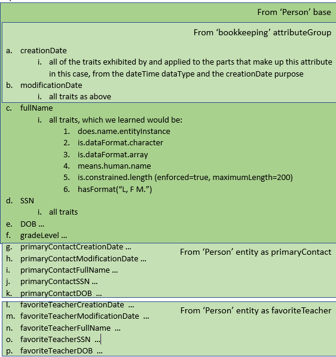
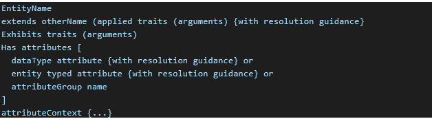
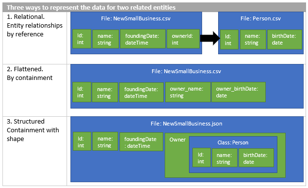
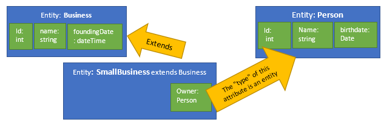

# Resolving a logical entity definition

A logical entity definition may reference (reuse) other object definitions to better organize or factor a data model.  For example, an entity may extend another entity, include entity-typed attributes, or include attribute groups.  Attributes may be defined by custom data types that extend other data types with trait references.  These referenced definitions may in turn reference other definitions.

The full definition of an entity requires that all these references be examined and resolved.  The Common Data Model object model can resolve a logical entity definition by following these references to create a resolved entity definition in which all the references are replaced by in-lined attribute definitions that use primitive data formats and trait references.  The resolved entity definition can then be used programmatically within the object model or written out as a new document.  When a CDM folder is created, the manifest contains only references to resolved entity definitions.

As a rule, when defining a data model it is best to create logical entity definitions and then use the CDM object model to resolve these rather than trying to create resolved entity definitions directly.  

To illustrate the concept of converting logical entities into resolved entities,
let's return to our Student entity example. Given the new, full definition of
Student, it will be a bit cumbersome to determine the final set of attribute
names and traits for the entity.

Common Data Model can create a "resolved" version of a logical entity that can
be navigated to or persisted into a document, to offer a much more concrete
depiction of an entity.

By default, the resolved entity for Student will result in:

1. entity: Student

    

1.  In addition to this entity shape, a section of the document contains an
    **attributeContext** graph with the following characteristics:

    1.  This graph explains the attributes and traits that were
        discovered.

    2.  It also lays out the inheritance chains that were followed, and the
        attribute groups and entity type attributes that were navigated.

    3.  Each attribute in the resolved entity from \#1 will contain a reference
        to the portion of the **attributeContext** context tree where it was
        discovered.

    4.  This structure can be used to re-create the inheritance and nesting
        relationships, if needed.

## The default resolution behavior

The set of attributes shown in the resolved entity example above represents the
default behavior of the object model for Common Data Model when it resolves
entities (by using the corpus.CreateResolvedEntityAsync API). Because the next
few sections of this article describe how and why one might want to override the
default behavior, let's first look at the default behavior:

1.  If the entity is extending another entity, the attributes from the base
    entity are taken "as-is," as a starting point. Taken as-is means these
    attributes were collected by using the rules in this list.

1.  Attributes are processed one at a time and in the order in which they were
    defined in the entity. This includes an attribute group reference or an
    entity type attribute.

1.  If a newly processed attribute results with a name that is a duplicate of an
    attribute that has already been collected, the attributes are merged. This
    means the traits of the newest attribute are added to the traits of the
    original attribute (or replaced if they're the same traits). Through this
    behavior, you can alter an attribute taken from a base entity by simply
    re-declaring it by using the same name and then setting new traits.

1.  Attributes from a referenced attributeGroup object will be collected as a
    set and then added one at a time (as is) to the accumulating set of
    attributes. In this way, the attribute group acts like a cut-and-paste macro
    for inserting sets of attributes that were defined elsewhere.

1.  Attributes from another entity (when used as the type of an attribute) are
    collected from that entity and then—to avoid name collisions—renamed by
    using the format *attributeMember*, where *attribute* is the name of the
    attribute that uses the entity as a type and *Member* is the name of the
    attribute that was taken from the sub-entity. In this way, using an entity
    as an attribute type can be thought of as using the entity as a complex
    (structured) data type.

## The three flavors of an entity definition


Informally speaking, there's only one "grammar" for describing entities:

<!-- image22 -->
 

By using this same grammar, however, it's possible to describe three
conceptually different kinds of entity definitions:

1.  A purely logical entity. This type of entity is used to communicate and
    share the meaning of an entity in a way that's independent of any particular
    storage layout of partition data. It conveys just the ideas:

    1.  Often uses entity inheritance with the **Extends** property to create
        logical groupings of shared concepts and to express a kind of lineage of
        metadata additions and specializations.

    2.  Uses semantically rich **dataType** and **Purpose** objects to encode
        the meanings, structure, constraints, and so on that are part of the
        logical definition of an attribute.

    3.  Uses attribute group references to pull in copies of common attribute
        definitions.

    4.  Uses entity typed attributes to express complex structure or to indicate
        a relationship that exists between entities.

    5.  Contains no resolution guidance sections.

1.  A resolved, or data layout–specific, entity. These are used to exactly
    describe the schema of specific data storage partitions. They are meant to
    be understood without needing to look things up, and as such, they have:

    1.  No entity inheritance.

    2.  No resolution guidance sections.

    3.  No use of **dataType** or **Purpose** objects.

    4.  No attribute group references that need to be pulled in.

    5.  Possibly some attribute groups that contain other attributes as a
        mechanism to express structure or nesting in a structured storage
        format.

    6.  All traits on the entity or the individual attributes explicitly listed
        (no inference needed).

    7.  Possibly an **AttributeContext** section that provides an explanation of
        the steps Common Data Model went through to transform a logical entity
        into a resolved entity.

1.  A "guidance" entity. These entities act as a set of instruction to the
    object model for how a set of logical entities should be arranged and
    manipulated to form one of the potentially resolved entities for the set.
    These entities are similar to the logical entity, with a few notable
    exceptions:

    1.  They inherit from a logical entity.

    2.  They contain resolution guidance sections for the inherited base entity
        and for any added attributes that give directions to the object model
        for how a resolved entity should be constructed.

In practice, logical entities and guidance entities might be combined into one
entity definition. This limits the flexibility for the ways to resolve the
logical entity.

## Directives, guidance, and the resulting resolved shapes


A key requirement for many users of the object model for Common Data Model is to
represent different optimal storage layouts from one semantic, logical model.
They need to store data in the form that works best for their system, relational
(for Power BI or SQL), denormalized and flattened (a flat file for use with
machine learning), or perhaps denormalized and structured (big data systems that
store graphs in JSON or Parquet, for instance). At the same time, they want to
build on and expose a shared semantic definition of entities and retain the
ability to transform data from one optimal shape into another.

### Deeper

When one entity uses another entity as an attribute type, there are several ways
that such a relationship can be considered and several ways that a particular
resolution of the entities can describe the stored records of data.

For instance, perhaps one entity should always be embedded directly into another
while a different use of the entity should always link with a foreign key.
Perhaps one entity links to many instances of the other entity (an array).

On the persisted data side, some systems might insist on always using foreign
key references instead of embedding entities while other systems might want to
store arrays of linked entities directly inline in the data of the main entity
(such as in a JSON document).

For example, here are three ways to represent a relationship between a small
business and the one person who's the owner of the business.

<!-- image24 -->
 


These three shapes of persisted data are consistent with this one statement of
the logical model:

<!-- image25 -->
 

The logical definition of these entities states that a SmallBusiness is also a
Business and it has an Owner who is a Person. This logical model can be
instructed to resolve in each of the three ways listed above:

1.  Take only the primary key from the Person entity (Id) and include it in the
    resolved SmallBusiness entity, while renaming it to OwnerId. This also
    assumes that the Person entity will be resolved into a separate flattened
    form.

1.  Take the name and birthdate attributes from the Person entity and embed them
    directly into the resolved SmallBusiness entity, while renaming them to
    OwnerName and OwnerBirthdate.

1.  Take the attributes from the Person entity and embed them in the
    SmallBusiness entity as a nested object (named Owner) that has the
    sub-attributes.

Each of these shapes is produced by combining some resolution guidance hints in
the entity definition (or moved to an independent guidance entity definition)
with a set of directives used as arguments to the createResolvedEntity API.

### Directives

The CreateResolvedEntity API takes an optional set of directives that can alter
the default behavior for how to handle the attributes that use another entity as
a type.

| Directive     | Behavior                                                                                                                                                                                                                                                                                                                                                                                                                                                                                                                                                             |
|---------------|----------------------------------------------------------------------------------------------------------------------------------------------------------------------------------------------------------------------------------------------------------------------------------------------------------------------------------------------------------------------------------------------------------------------------------------------------------------------------------------------------------------------------------------------------------------------|
| (none)        | The entity type of the attribute is treated like a complex data type. Individual members from the entity are renamed to disambiguate them and are added inline to the outer entity. If the attribute is marked to represent an array of values, the array will be expanded, and the sub-attributes will be repeated *n* times.                                                                                                                                                                                                                                        |
| referenceOnly | If the attribute is marked to allow for use by reference , instead of taking all attributes from the other entity, only the identifying attributes are taken and used as a foreign key. The taken attributes are renamed.                                                                                                                                                                                                                                                                                                                                            |
| Normalized    | Assumes that one-to-many relationships (that is, entity typed attributes that are marked to represent an array of values instead of a single instance) have a reference to the owning entity from the "many" side (the entity used as the type). It also assumes that many-to-many relationships are resolved by using a correlation entity that points toward this entity. Therefore, this directive avoids adding any information to this entity regarding a linked entity (a foreign key from the referenceOnly directive) that is also marked as being an array. |
| Structured    | Places resolved entity attributes into groups, thus avoiding the need to disambiguate names or repeat attributes in an array expansion. Using a structured directive produces a schema that must be interpreted by the consumer to look for embedded structures and arrays in their data. Because of the structured description (not relational), the normalized behavior of avoiding foreign keys for arrays is skipped.                                                                                                                                            |

If no directives are provided to CreateResolvedEntity, by default referenceOnly
and Normalized are used. This makes a relational resolved schema.

### Projection overview

The Projections feature provides a way to customize the definition of a logical entity by influencing how the entity is resolved by the object model.  For example, projections can be used, to selectively include or exclude attributes from a base entity, or to determine whether an entity attribute should be resolved by including attributes of the related entity inline or by including only foreign key attributes.  Attributes that are included can be grouped, reordered, and renamed, and additional meta data attributes can be introduced.  Projections allows you to define, or ‘project’, different derived data shapes from a common set of underlying logical entities.

The projections feature comprises a set of operations that can be used in an entity definition and which are evaluated by the object model during resolution.  While projection operations can be conditionally executed, it’s important to recognize that any projections included in an entity definition are integral to that entity definition and must be resolved by the object model.

#### Projections replaces Resolution Guidance

Previously, resolution guidance was used to instruct the Object Model how to resolve a given logical definition . Resolution guidance has pre-configured  and sometimes obscure behavior that varies depending on the directives provided which could cause the definitions to be resolved into a shape different than expected if not properly configured.Projections fully replaces resolution guidance and provides more flexibility when modeling logical definitions. To access the resolution guidance deprecated documentation refer to [this link](resolution-guidance.md).

#### The Projection Object

The structure of a  projection object  is shown below.

```json
{
  "source": <string> | <Projection> | <EntityDefinition>,
  "condition": <string>,
  "runSequentially": <bool>,
  "operations": List<Operations>
} 
```

A projection can be applied when extending an entity, on an entity typed attribute or on a data typed attribute.

Extending an entity:

```json
{
  "entityName": "Child",
  "extendsEntity": {
    "source": "Person",
    "operations": [ ... ] 
  }
}
```

Entity typed attribute:

```json
{
  "name": "child",
  "entity": {
    "source": "Parent",
    "operations": [ ... ]
  }
}
```

Data typed attribute:

```json
{
  "name": "name",
  "dataType": "string",
  "projection": {
    "operations": [ ... ]
  }
}
```

An easy way to disable the resolution guidance’s implicit behavior is to reference the entity definition using a projection object. There is no need to add operations here since the only required property on the projection is the source.

```json
{
  "name": "child",
  "entity": {
    "source": "Parent"
  }
}
```

While defining an entity attribute like below will use resolution guidance.

```json
{
  "name": "child",
  "entity": "Parent"
}
```

> Note: Using projections and resolution guidance on the same object will cause an error to be logged.

#### Source

The source of a projection specifies from where the input attributes come from. It can be set to a string, another projection, or an entity definition. The examples below refer to the “Person” entity defined in a “Person.cdm.json” document as shown here.

```json
{
    "entityName": "Person",
    "hasAttributes": [
        {
            "name": "name",
            "dataType": "string"
        },
        {
            "name": "age",
            "dataType": "integer"
        },
        {
            "name": "address",
            "dataType": "string"
        }
    ]
}
```

When the source is a text string, it is interpreted as the name of an entity currently in scope.   It works the same way that any other object reference in the Object Model would. In most cases it should be set with the entity name that you are trying to refer to, unless the entity is defined in a document imported with a moniker. In that case, the entity name should be preceded by the moniker name as shown below.

```json
imports: [
    {
        "corpusPath": "Person.cdm.json"
    }
]

...
{
    "source": "Person"
}
```

Using a moniker:

```json
imports: [
    {
    "corpusPath": "Person.cdm.json",
    "moniker": "Person_base",
    }
]

...
{
    "source": "Person_base/Person"
}
```

The source of a projection can also be another projection. In this scenario, the innermost projection will execute first then its output is provided as input to the outer projection.

```json
{ 
    "name": "PersonInfo", 
    "entity": {
        "operations": [
            {
                "$type": "renameAttributes",
                "renameFormat": "{a}{M}"
            }
        ],
        "source": { 
            "operations": [ 
                {
                    "$type": "renameAttributes", 
                    "renameFormat": "yearsOld", 
                    "applyTo": [ 
                        "age"
                    ]
                } 
            ],
            "source": "Person"
        }
    } 
}
```

In the example above, the inner projection containing a rename operation which renames the “age” attribute to “yearsOld” will run first. The output of that projection is used as input to the outer projection, which renames all the attributes with the format “{a}{M}”.

|Input|After inner projection|After outer projection|
|-|-|-|
|name|name|PersonInfoName|
|age|yearsOld |PersonInfoYearsOld|
|address|address|PersonInfoAddress|

Note that referencing either “age” or “yearsOld” in the outer projection yields the same attribute. Even though in the outer projection’s input set of attributes the attribute is named, “yearsOld”, you can still reference it as “age”. This works because the projections system keeps track of the changes applied to each attribute and can locate them based on previous states .

The third option is to use an inline  entity definition as the projection source. The entity definition here looks like any other entity definition, the only difference is that it is defined inline in the source property. This is particularly useful when dealing with a polymorphic entity  typed attribute as shown in the next example.

```json
{ 
    "name": "Contact",
    "isPolymorphicSource": true,
    "entity": {
        "source": {
            "entityName": "contactAt",
            "hasAttributes": [
                {
                    "name": "emailKind",
                    "entity": "Email"
                },
                {
                    "name": "phoneKind",
                    "entity": "Phone"
                }
            ]
        }
    } 
}
```

> Note: It is important to notice that, when applying a projection to a data typed attribute, the source property cannot be set. In this case, the input attribute is the attribute itself. Setting a source will cause the Object Model to log an error. If you need an attribute to reference an entity, use an entity typed attribute instead.

#### Condition

The condition property allows you to choose whether   the projection will execute or not. There   is a set of pre-defined tokens and operations that can be used to construct a condition.

Let us first have a look at the tokens table below.

|Name|Type|Description|
|-|-|-|
|always|Bool|Equivalent to “true”.|
|cardinality.maximum|Integer|The maximum cardinality set on the |attribute. Null if not set.
|cardinality.minimum|Integer|The minimum cardinality set on the |attribute. Null if not set.
|depth|Integer|The current depth of the entity. This number gets |increased by one when following an entity attribute.
|false|Bool|A token that always yield false.|
|isArray|Bool (directive)|True if the “isArray” directive is present on |the directives set.
|maxDepth|Integer|The maximum depth specified on the ResolveOptions  |object.
|noMaxDepth|Bool (directive)|True if the “noMaxDepth” directive is |present on the directives set.
|normalized|Bool (directive)|True if the “normalized” directive is |present on the directives set.
|referenceOnly|Bool (directive)|True if the “referenceOnly” directive is |present on the directives set.
|structured|Bool (directive)|True if the “structured” directive is |present on the directives set.
|true|Bool|A token that always yield true.|
|virtual|Bool (directive)|True if the “virtual” directive is present on |the directives set.

Along with the tokens there are a set of operators that are used to construct more complex conditions. The full set of operators are shown below.

|Name|Symbol|Example|
|-|-|-|
|And|&&|“normalized && referenceOnly”|
|Equal|==|“depth == 1”<br/>“structured == false”|
|Greater than|>|“cardinality.maximum > 1”|
|Greater than or equal|>=|“cardinality.maximum >= 2”|
|Less than|<|“depth < 3”|
|Less than or equal|<=|“depth <= 2”|
|Not|!|“!referenceOnly”|
|Not equal|!=|“depth != 1”<br/>“structured != true”|
|Or|\|\||“structured \|\| referenceOnly”|


The condition clause here looks very similar to a condition clause in many programming languages. You can combine multiple tokens and operators as well as group them between parentheses. For example:

" ((!normalized) || (cardinality.maximum <= 1) )  &&  (referenceOnly || noMaxDepth || (depth > maxDepth)) "

If during the execution the condition evaluates to true, then the operations will run. Each operation might also have additional conditions which will be evaluated before running each of them. On the other hand, if the condition evaluates to false, the operations are not executed, and the output of the projection will be the same set of attributes that came from the source.

```json
{
    "name": "PersonInfo",
    "entity": {
        "condition": "referenceOnly"
        "source": "Person",
        "operations": [
            {
                "$type": "excludeAttributes",
                "excludeAttributes": [
                    "address"
                ]
            }
        ]
    }
}
```

We would get either one of the resulting resolved PersonInfo, depending on if the condition evaluated to true or not:

|Condition = true <br /> (resolution directive = “referenceOnly”)|Condition = false <br /> (resolution directive != “referenceOnly”)|
|-|-|
|name|name|
|age|age|
||address|

#### Run Sequentially

By default, the value of the “runSequentially” property is false, meaning that all the operations will receive the same set of attributes that comes out of the source. If set to true, each operation receives as input the output of the previous operation. The first operation on the list always receives the attributes coming from the source. This behavior needs to be taken into consideration   when modeling your set of operations.  Let us analyze two examples to better understand how this flag affects the execution of the operations.

The first example is a projection with two replaceAsForeignKey operations. The replaceAsForeignKey operation receives a set of attributes as input and outputs a single foreign key attribute which is specified on the “replaceWith” property. To further understand the functioning of this operation, refer to its [documentation page](projections/replaceasforeignkey.md).

```json
{
    "name": "PersonInfo",
    "entity": {
        "source": "Person",
        "runSequentially": <bool>,
        "operations": [
            {
                "$type": "replaceAsForeignKey",
                "reference": "name",
                "replaceWith": {
                    "name": "nameFK",
                    "dataType": "entityId",
                }
            },
            {
                "$type": "replaceAsForeignKey",
                "reference": "address",
                "replaceWith": {
                    "name": "addressFK",
                    "dataType": "entityId",
                }
            }
        ]
    }
}
```

Running the above projection with the `runSequentially` flag set to false works as expected and generates two foreign key attributes `nameFK` and `addressFK`:

|Input|After operation #1|After operation #2|Output|
|-|-|-|-|
|name|nameFK||nameFK
|age||
|address||addressFK|addressFK|

If the `runSequentially` flag is true on the example above, the projection fails to execute. This happens because the second replaceAsForeignKey operation receives only the “nameFK” attribute outputted by the first operation, but it tries to reference the “address” attribute which does not exist on the input attribute set.

On the second example, there is a projection with two renameAttributes operations. The first renames `age` to `yearsOld` while the second renames `address` to `homePlace`.

```json
{
    "name": "PersonInfo",
    "entity": {
        "source": "Person",
        "runSequentially": <bool>,
        "operations": [
            {
                "$type": "renameAttributes",
                "renameFormat": "yearsOld", 
                "applyTo": [ 
                    "age"
                ] 
            },
            {
                "$type": "renameAttributes",
                "renameFormat": "homePlace", 
                "applyTo": [ 
                    "address"
                ] 
            }
        ]
    }
}
```

Depending on the value of the `runSequentially` property, this entity typed attribute   will resolve differently. Let us first check how it works with the default value “false”.

|Input|After operation #1|After operation #2|Output|
|-|-|-|-|
|name|name|name|name
|age|yearsOld|age|yearsOld
|address|address|homePlace|address|
||||age|
||||homePlace|

On the other hand, when the run sequentially flag is set to true, each operation will receive as input the output of the previous operation.

|Input|After operation #1|After operation #2|Output|
|-|-|-|-|
|name|name|name|name
|age|yearsOld|yearsOld|yearsOld
|address|address|homePlace|homePlace|

#### Operations

The main processing unit in projections is an operation. The operations can be combined to model complex manipulations of logical definitions.   All the operations share some common properties and are distinguished  by the `$type` property. 

```json
{
  "$type": <string>,
  "condition": <string>,
  "explanation": <string>,
  "sourceInput": <bool>
}
```

Apart from the common properties  , some operations might have extra properties. To further understand all the properties for each operation, refer to the operation documentation page.

The set of attributes that each operation receives by default is determined by the “runSequentially” property that is set at the projection level. If you need more granular control over this behavior you can use the “sourceInput” property. If set to true, the operation will receive the attributes coming from the source entity, otherwise, it will receive the attributes coming from the previous operation.

The table below contains a list of the supported operations, along with a brief description. You can access detailed documentation for each of the operations by clicking on their name  in the table below.

|$type  (name)|Description|
|-|-|
|[addAttributeGroup](projections/addattributegroup.md)|The result of this operation is the attribute group with all the input attributes inside it.|
|[addCountAttribute](projections/addcountattribute.md)|Adds a count attribute and marks it with the `is.linkedEntity.array.count` trait indicating that for each record, this attribute holds the count of array members that should be expected to contain data values.|
|[addSupportingAttribute](projections/addsupportingattribute.md)|Adds a supporting attribute to the set. Two traits will be added to the resulting attribute. The first trait, `is.addedInSupportOf`, links to the attribute is supports. The second trait, `is.virtual.attribute`, specifies that this is a virtual attribute .|
|[addTypeAttribute](projections/addtypeattribute.md)|When dealing with a polymorphic entity, this operation adds an attribute that is used to indicate the per-record type that matches one of the source entities. Ex.: given a polymorphic entity typed attribute named “contactAt” that points to Email or Phone. This attribute can either point to Email or Phone per-record. The type attribute is used to determine to which entity that record is pointing to.
|[arrayExpansion](projections/arrayexpansion.md)|Makes n copies of every input attribute and marks each temporarily with an ordinal .|
|[combineAttributes](projections/combineattributes.md)|Combines a set of attributes specified on the operation into one resulting attribute.|
|[excludeAttributes](projections/excludeattributes.md)|Removes the listed attributes from the input set and filter out the rest. All others pass through in their original order.|
|[includeAttributes](projections/includeattributes.md)|Selects only those attributes mentioned in the given list. The selected attributes are ordered as given in the list.|
|[renameAttributes](projections/renameattributes.md)|Renames each attribute in the input set by applying a provided format string. The format string can contain literal text  and one instance each of the replacement indicators (‘{a}’ or ‘{A}’) for the (lowercase or uppercase first character) name of the containing attribute name, (‘{m}’ or ‘{M}’) for the (lowercase or uppercase first character) name of the set member (like ‘line1’ or ‘addId’ and ‘{o}’ for the held ordinal of the attribute in the set. Examples are “{m}AsPartOf{A}”, “{a}{M}” or “{a}{M}{o}” |
|[replaceAsForeignKey](projections/replaceasforeignkey.md)|Replace all input attributes with a foreign key attribute. A `is.linkedEntity.identifier` trait will be added to the attribute linking the foreign key to an attribute on the source.|

