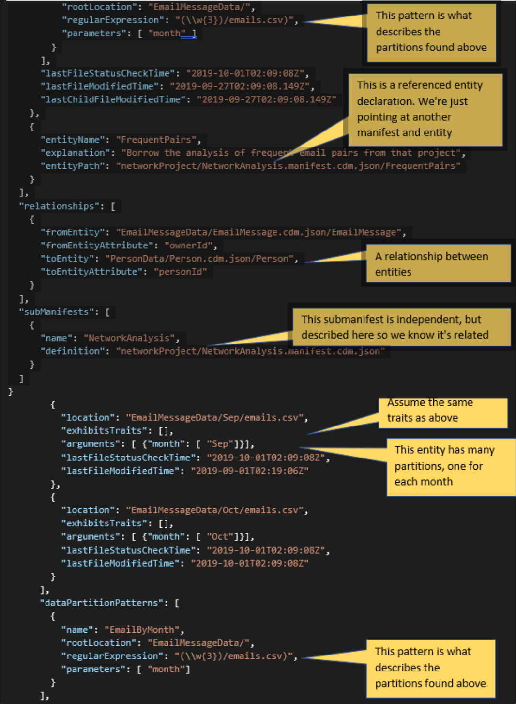

# The Manifest object

In a data lake, a *Common Data Model folder* is a collection—spread over subfolders or accounts—of the data files and schema description files that constitute a set of related entities. The entities have been organized for some purpose such as to back an application or perform analysis. This collection of related data is sometimes called a *solution*. A Common Data Model **Manifest** object and the document that contains it (\*.manifest.cdm.json) is an organizing document that acts as an entry point, a type of directory that points at the pieces making up a Common Data Model folder. The manifest describes a list of the entities in the solution, a document that gives a detailed schema description for each entity, a collection of partition data files for each entity, a list of the known relationships among entities, and potentially other **subManifest** objects that are nested solutions.

Those familiar with the model.json file and format for describing a Common Data Model folder will recognize the manifest as an equivalent, but expanded, concept. In fact, the object model for Common Data Model offers backward compatibility with the model.json format.

A manifest can also be used to organize purely abstract entity definitions as a way of sharing standard schemas. In this form (a *Common Data Model domain*), the manifest lists entities with schema documents, known relationships, and submanifests, but won't give partition data file locations for the entities.

One file folder might contain many manifest files. Each of them can present an alternate view or organization of the entities. These views might be used to hide, simplify, or focus the entities of a solution for different personas or to show different business perspectives. By convention, when multiple manifest files exist in a folder, one named default.manifest.cdm.json is used when no specific manifest name is specified.

A manifest document has this structure:

-   Version information

-   Imports

-   Manifest definition

    -   Entity list

        -   Local entity declaration

            -   Data partition list

            -   Data partition pattern list

            -   Incremental partition list

            -   Incremental partition pattern list

        -   Referenced entity declaration

    -   Relationship list

    -   Submanifest list

## Imports in a manifest

As described earlier, a manifest can import other file definition documents.
Because a manifest uses [Common Data Model traits](../sdk/logical-definitions.md#traits), usually the single import of the document cdm:/foundations.cdm.json is enough to get standard definitions for these traits.

## Shared concepts inside the manifest

The **Manifest** object and the objects it contains all share [some properties, collections, and abilities (methods in the object model)](../1.0om/api-reference/cdm/manifest.md#properties).


## Entity lists in a manifest

The list of entities in a manifest represent some joint context or purpose, such as the entities used for an application or data analysis project. Some of these entities are "owned" by the manifest; that is, the manifest knows the location of the schema definition files and all of the partition data files, and the owner of the manifest document is responsible for managing that set of data. A manifest can also simply "borrow" an entity that's owned by a different manifest. The application that owns the main manifest can write and maintain the data for the entities it owns, but can only act as a reader for the borrowed entities. These two types of entity listings are called the local entity declaration and the referenced entity declaration.

### Local entity declaration

For an entity that's owned by the manifest, the declaration describes the location of the schema document where details about the entity metadata can be found, the set of data partition files that contain the data records for the entity, and some file location hints that can be used to discover new data partitions. The declaration also has the shared features described later in the manifest section.

| Property / Method              | Description                                                                                                                                                                                                                                                                                                                                                                                                           |SDK|
|--------------------------------|-----------------------------------------------------------------------------------------------------------------------------------------------------------------------------------------------------------------------------------------------------------------------------------------------------------------------------------------------------------------------------------------------------------------------|---|
| entityName                     | The name of the owned entity                                                                                                                                                                                                                                                                                                                                                                                          |1.0|
| entityPath                     | A corpus path to the entity definition within its containing document—for example, local:/MyEntity.cdm.json/MyEntity. By convention, this entity definition should be the "resolved" form of a definition. [More information](./convert-logical-entities-resolved-entities.md). This is the default schema that should be used for any partition file that doesn't offer a specialized alternate schema.              |1.0|
| dataPartitions                 | The **dataPartitions** objects in this collection each describe the location, format, and perhaps specific details about one file that contains data records for the local entity.                                                                                                                                                                                                                                    |1.0|
| dataPartitionPatterns          | A **dataPartitionPatterns** object describes a search space over a set of files that can be used to infer or discover, and list, new data partition files. These patterns are used for situations where many new partition files are being regularly added in some structured way and finding or listing them individually is impractical.                                                                            |1.0|
| incrementalPartitions          | The **dataPartitions** objects in this collection each describe the location, format, and perhaps specific details about one file that contains incremental records for the local entity.                                                                                                                                                                                                                             |1.6|
| incrementalPartitionPatterns   | A **dataPartitionPatterns** object describes a search space over a set of files that can be used to infer or discover, and list, new incremental partition files. These patterns are used for situations where many new incremental partition files are being regularly added in some structured way and finding or listing them individually is impractical.                                                         |1.6|

### Data partition definitions in the dataPartitions collection

A **dataPartitionDefinition** object describes and points to one particular file of data for the entity. Common Data Model traits on this object give detailed information about the file format and parsing options. By default, the data should be interpreted by using the schema description indicated by the associated local entity declaration. However, because schemas can change over time and older files might have different content than newer files, the default entity schema can be overridden for a specific partition file.

The object model can generate data partition definitions at runtime by using a **dataPartitionPatterns** object. A property indicates whether the partition description was generated in memory or explicitly created and stored with the folder.

| Property / Method | Description                                                                                                                                                                                                                                                                                                                                                                                                   |SDK|
|-------------------|---------------------------------------------------------------------------------------------------------------------------------------------------------------------------------------------------------------------------------------------------------------------------------------------------------------------------------------------------------------------------------------------------------------|---|
| dataPartitionName | An optional name for the partition.                                                                                                                                                                                                                                                                                                                                                                           |1.0|
| Location          | The corpus path to the data file location and name.                                                                                                                                                                                                                                                                                                                                                           |1.0|
| Inferred          | Boolean. Set to **True** if the partition object was created using a **dataPartitionPatterns** object and only exists in the memory of the object model. If set to **False**, the partition information will be saved with the folder and will override any identical partitions that are inferred in the future.                                                                                             |1.0|
| IsIncremental     | Boolean. Set to **True** if the partition object contains the *[is.partition.incremental](./list-of-traits.md#ispartitionincremental)* trait.                                                                                                                                                                                                                                                                 |1.6|
| specializedSchema | An optional corpus path pointing to an entity definition within a containing document. The purpose of this document is to describe this partition as an override of the default shape of data that's normally taken from the **entitySchema** property for the entity declaration containing this partition.                                                                                                  |1.0|
| refreshTime       | A place for the application that owns the manifest to store a "refresh time" for the data in the file.                                                                                                                                                                                                                                                                                                        |1.0|
| Arguments         | A mapping from argument names to a value or values associated with that argument. An array of **dataPartitionArgument** objects that hold a set of name/value pairs. If the partition is generated from a **dataPartitionPatterns** object, these argument names will match the parameters specified on the pattern object and the values will be those discovered from the regular expression of the pattern.|1.0|

#### Data partition–specific traits

The **Traits** collection for a partition is used to hold partition-specific
settings and behaviors.

| Trait / parameter                                                                                      | Description                                                                                                                                                                                                                                          |foundations.cdm.json    |
|--------------------------------------------------------------------------------------------------------|------------------------------------------------------------------------------------------------------------------------------------------------------------------------------------------------------------------------------------------------------|------------------------|
| [is.partition.format.CSV](./list-of-traits.md#ispartitionformatcsv)| Indicates a text file with a fixed set of columns with column separators, text qualifiers, and so on.                                                                                                                                                |1.0                     |
| columnHeaders                                                                                          | **True** if the first row of the file contains names for the columns.                                                                                                                                                                                |1.0                     |
| csvStyle                                                                                               | Either *CsvStyle.QuoteAlways* or *CsvStyle.QuoteAfterDelimiter*. The default value is *Csv.QuoteAlways*.                                                                                                                                             |1.0                     |
| delimiter                                                                                              | The delimiter type in the CSV file.                                                                                                                                                                                                                  |1.0                     |
| quoteStyle                                                                                             | Either *QuoteStyle.Csv* or *QuoteStyle.None*. The default value is *QuoteStyle.Csv*, meaning that text values are delimited by quotation marks.                                                                                                      |1.0                     |
| [is.partition.format.parquet](./list-of-traits.md#ispartitionformatparquet)| The value is the file format settings of a partition parquet file.                                                                                                                                                                                   |1.0                     |
| [is.partition.culture](./list-of-traits.md#ispartitionculture)| The culture for data formats in the file.                                                                                                                                                                                                            |1.0                     |
| culture                                                                                                | The default value is **us-en**.                                                                                                                                                                                                                      |1.0                     |
| [is.partition.incremental](./list-of-traits.md#ispartitionincremental)| The base trait for describing incremental partitions and incremental partition patterns.                                                                                                                                                                                              |4.5                     |
| [is.partition.size](./list-of-traits.md#ispartitionsize)| The value is the file size of a partition file.                                                                                                                                                                                              |4.6                     |
| type                                                                                                   | The type for the incremental partition or incremental partition pattern objects. It can only be one of these values: Insert, Update, Delete, Upsert, and UpsertAndDelete.                                                                            |4.5                     |
| incrementPartitionPatternName                                                                          | If applying this trait to a partition object, this value is the associated partition pattern object's name. Otherwise, this trait should be applied to a partition pattern object, and this value should be the name of the partition pattern object.|4.5                     |

The following code snippet shows how a data partition and an incremental partition look like:

```json
"dataPartitions": [
   {
      "location": "FullData/2015/May/cohort001.csv",
      "arguments": [
         {
            "name": "year",
            "value": "2015"
         },
         {
            "name": "month",
            "value": "May"
         },
         {
            "name": "cohortNumber",
            "value": "001"
         }
      ],
      "lastFileStatusCheckTime": "2020-08-01T00:00:00.000Z",
      "lastFileModifiedTime": "2020-08-02T00:00:00.000Z"
   }
],
"incrementalPartitions": [
   {
      "location": "/IncrementalData/2018/8/15/Upserts/1.csv",
      "exhibitsTraits": [
         {
            "traitReference": "is.partition.incremental",
            "arguments": [
               {
                  "name": "type",
                  "value": "Upsert"
               },
               {
                  "name": "incrementPartitionPatternName",
                  "value": "UpsertPattern"

               }
            ]
         }
      ],
      "arguments": [
         {
            "name": "year",
            "value": "2018"
         },
         {
            "name": "month",
            "value": "8"

         },
         {
            "name": "day",
            "value": "15"
         },
         {
            "name": "upsertPartitionNumber",
            "value": "1"
         }
      ],
      "lastFileStatusCheckTime": "2020-08-01T00:00:00.000Z",
      "lastFileModifiedTime": "2020-08-02T00:00:00.000Z"
   }
]
```

### Data partition patterns

An entity declaration can specify one or more **dataPartitionPatterns** objects, one for each search pattern that can be used to discover and describe partition files. In the object model for Common Data Model, using a pattern might result in dynamically discovered **dataPartitions** objects in the **dataPartitions** collection.

| Property / Method | Description                                                                                                                                                                                                                                                                                                                                                                                                                         |SDK|
|-------------------|-------------------------------------------------------------------------------------------------------------------------------------------------------------------------------------------------------------------------------------------------------------------------------------------------------------------------------------------------------------------------------------------------------------------------------------|---|
| rootLocation      | A corpus path that acts as the starting location from which the patterns mentioned in the **regularExpression** property should be matched, or from which the object model should start when searching for inferred data partitions.                                                                                                                                                                                                |1.0|
| regularExpression | A regular expression that can contain (capture) subexpressions for the folders and files to seek. This regular expression should describe locations relative to the location given in the **rootLocation** property. All captured values should have corresponding names supplied in the parameters list, in the same order.                                                                                                        |1.0|
| globPattern       | A glob pattern that matches against the set of files and folders. The glob pattern can be used as an alternative to **regularExpression** and should also describe locations relative to the location given in the **rootLocation** property. The set of supported glob pattern characters can be found [here](../1.0om/api-reference/cdm/datapartitionpattern.md).                                                                 |1.0|
| Parameters        | An array of strings that give names for the replacement values extracted from the regular expression. The order of the strings corresponds to the order of (replacement) capture expressions in the regular expression. If a data partition pattern is used to generate inferred partitions, each resulting inferred partition will have a collection of arguments corresponding to these parameter names and the values discovered.|1.0|
| specializedSchema | Optional. A corpus path pointing to an entity definition. The path will be used for the **specializedSchema** property for any partitions generated from this pattern. Used when the partition data will have a different schema than the schema that's the default for the containing entity.                                                                                                                                      |1.0|
| IsIncremental     | Boolean. Set to **True** if the partition pattern object contains the *[is.partition.incremental](./list-of-traits.md#ispartitionincremental)* trait.                                                                                                                                                                                                                                                                               |1.6|

The following examples show the interplay of **rootLocation**, **regularExpression**, and **Parameters**.

#### All CSV files in a specific folder

Make a partition for each Customer CSV data file sitting in the Customer/dataFiles/ folder (relative to the folder where the manifest document exists). Assume there are no subdirectories.

Customer/dataFiles/august.csv

Customer/dataFiles/last-year.csv

Customer/dataFiles/last-year.csv.**backup** (Not matched)

| rootLocation        | regularExpression | explained                                               | parameters  |
|---------------------|-------------------|---------------------------------------------------------|-------------|
| Customer/dataFiles/ | .+\\.csv\$        | One or more of any character, followed by only **.csv** | None needed |

#### All CSV files in structured folders with information in the file path

Extract the year, month, and cohort number from the file paths, and make them arguments.

dataFiles/**2016**/June/cohort001.csv

dataFiles/2016/**June**/cohort002.csv

dataFiles/2017/April/cohort**001**.csv

dataFiles/2017/May/cohort001.csv

| rootLocation | regularExpression                     | explained                                                                                                       | parameters                      |
|--------------|---------------------------------------|-----------------------------------------------------------------------------------------------------------------|---------------------------------|
| dataFiles/   | (\\d{4})/(\\w+)/ cohort(\\d+)\\.csv\$ | Capture four digits / Capture a word / Capture one or more digits after the word **cohort** but before **.csv** | *Year*, *month*, *cohortNumber* |

#### All files in any subfolder

Extract the file name extension.

dataFiles/2016/June/cohort001.csv

dataFiles/2016/June/backups/cohort002.csv

dataFiles/2017/April/cohort001.**txt**

dataFiles/2017/May/cohort001.csv.**save**

| rootLocation | regularExpression | explained                                                                | parameters  |
|--------------|-------------------|--------------------------------------------------------------------------|-------------|
| dataFiles/   | .+\\.(\\w+)\$     | One or more characters followed by only a period (.) and a captured word | *extension* |

The following code snippet shows how a data partition pattern and an incremental partition pattern look like:

```json
"dataPartitionPatterns": [
   {
      "name": "sampleDataPartitionPattern",
      "explanation": "/ capture 4 digits / capture a word / capture one or more digits after the word cohort but before .csv",
      "rootLocation": "FullData",
      "regularExpression": "/(\\d{4})/(\\w+)/cohort(\\d+)\\.csv$",
      "parameters": [
         "year",
         "month",
         "cohortNumber"
      ],
      
      "lastFileStatusCheckTime": "2020-08-01T00:00:00.000Z"
   }
],
"incrementalPartitionPatterns": [
   {
      "name": "UpsertPattern",
      "rootLocation": "/IncrementalData",
      "regularExpression": "/(.*)/(.*)/(.*)/Upserts/(\\d+)\\.csv$",
      "parameters": [
         "year",
         "month",
         "day",
         "upsertPartitionNumber"
      ],
      "exhibitsTraits": [
         {
            "traitReference": "is.partition.incremental",
            "arguments": [
               {
                  "name": "type",
                  "value": "Upsert"
               }
            ]
         }
      ],
      "lastFileStatusCheckTime": "2020-08-01T00:00:00.000Z"
   }
]
```

A detailed sample code that demonstrates usage of data partition pattern and incremental partition pattern is available for C# and Java implementation at https://github.com/microsoft/CDM/tree/master/samples/7-search-partition-pattern.

#### Order of processing partitions and handling conflicts

Because one entity can have many partition patterns that use different root locations and different regular expressions, it's possible for the same files to be found by multiple partition patterns. It's also possible for a found partition to conflict with one of the "non-inferred" (that is, explicitly listed) partitions for the entity. When a conflict occurs, the following rules determine which argument values and specialized schema will apply to the new inferred partition.

1.  Inferred partitions will never overwrite an existing, non-inferred partition on the same entity.

2.  The last pattern processed will take precedence.

### Referenced entity declaration

The reference to an entity owned by a different manifest is nothing more than a name and a location.

| Property / Method | Description                                                                                                                                             |
|-------------------|---------------------------------------------------------------------------------------------------------------------------------------------------------|
| entityName        | The name of the referenced entity.                                                                                                                      |
| entityPath        | A corpus path to the entity declaration within the referenced manifest document, for example remote:/otherSolution/default.manifest.cdm.json/ThatEntity |

## The subManifest object

When a set of related manifests forms a logical hierarchy, the hierarchy can be described by using **subManifest** objects. A **Manifest** object can indicate a list of submanifests. A submanifest might be an independent solution, but often the entities in a submanifest are "aware of" (that is, they're extensions of or built upon) the entities in the manifests that are parents of the submanifest.

A manifest has a collection of manifest declarations named **subManifests**.

| Property / Method | Description                                                        |
|-------------------|--------------------------------------------------------------------|
| Definition        | The corpus path to the submanifest’s \*.manifest.cdm.json document |

## Entity relationships

A manifest might contain a list of the known entity-to-entity relationships involving entities in the manifest. When data is stored in a data lake in relational form—where different entities are stored in separate sets of data partitions—these relationships are expressed in the data through foreign key references in one entity's partition data that match primary key values from another entity's data.

These entity-to-entity relationship descriptions can be extracted from an external metadata repository and stored in the manifest through automation, or simply listed in the document through other means. As an alternative, the object model for Common Data Model offers functions that analyze the logical metadata of the entities in the corpus and populates the discovered relationships for a manifest.

Currently, only single attribute relationships are supported. All relationships are modeled from the "many" side to the "one" side; that is, from the referencing entity to the one referenced record in another entity. A many-to-many relationship is modeled from the intersection entity, which correlates two many-to-one relationships.

| Property                                                                 | Description                                                                                                                                                                                                        |
|--------------------------------------------------------------------------|--------------------------------------------------------------------------------------------------------------------------------------------------------------------------------------------------------------------|
| fromEntity                                                               | A corpus path to the document or entity on the "many" side of the relationship.                                                                                                                                    |
| fromEntityAttribute                                                      | The name of the referencing attribute, a foreign key.                                                                                                                                                              |
| toEntity                                                                 | A corpus path to the document or entity on the "one" side of the relationship.                                                                                                                                     |
| toEntityAttribute                                                        | The name of the referenced attribute, often the primary key of that entity.                                                                                                                                        |
| name                                                                     | The name of the relationship.                                                                                                                                                                                      |
| exhibitsTraits                                                           | The collection of traits that is initially applied to the purpose object in the referencing attribute, and then is elevated to the relationship as relationship meanings.                                          |
| Corpus.CalculateEntityGraph(ICommon Data ModelManifestDef rootManifest); | Causes the corpus to calculate and cache knowledge about all of the entity-to-entity relationships found in the logical entity descriptions for the given manifest, and all of the submanifests that it indicates. |
| Manifest. PopulateManifestRelationships()                                | The manifest will use the graph of relationships held in the corpus to create the set of relationship descriptions for any entity that's on either the "one" side or the "many" side of a known relationship.      |

## File status check and modification times

The **Manifest** object and the objects it contains collect and report information about the times when files they reference have been modified.

| Property / Method         | Description                                                                                                                                                                                                                                                                   |
|---------------------------|-------------------------------------------------------------------------------------------------------------------------------------------------------------------------------------------------------------------------------------------------------------------------------|
| LastFileStatusCheckTime   | The last time that the status of files and child objects was checked. This is set directly by using application logic or indirectly by the **fileStatusCheck** method.                                                                                                        |
| LastFileModifiedTime      | The last time reported from the file system about any modifications or saving of a file.                                                                                                                                                                                      |
| LastChildFileModifiedTime | The latest time reported by any of child objects about their file status check times. Because the **fileStatusCheck** method can be called on individual objects and individual files can be updated at different times, this property helps locate the latest changed child. |

The meaning of these times and the scope of the status check method depend on the specific object being checked. After CDM SDK version 1.6, two new optional parameters have been added in FileStatusCheckAsync() API: *[PartitionFileStatusCheckType](../1.0om/api-reference/cdm/partitionfilestatuschecktype.md)* and *[CdmIncrementalPartitionType](../1.0om/api-reference/cdm/cdmincrementalpartitiontype.md)* which allow users to have better control of which data partition updates should be performed.

| Object                      | fileStatusCheck                                                                                       |SDK|
|-----------------------------|-------------------------------------------------------------------------------------------------------|---|
| Manifest                    | Checks the manifest, all entity declarations, and all submanifests.                                   |1.0|
| Local entity                | Checks the schema documents, and all data partitions and patterns for the entity.                     |1.0|
| Referenced entity           | Checks the status of the remote manifest document.                                                    |1.0|
| dataPartition               | Checks the file indicated by the data partitions.                                                     |1.0|
| dataPartitionPattern        | Causes evaluation of the data partition pattern search and the creation of new data partitions.       |1.0|
| incrementalPartition        | Checks the file indicated by the incremental partitions.                                              |1.6|
| incrementalPartitionPattern | Causes evaluation of the data partition pattern search and the creation of new incremental partitions.|1.6|
| SubManifest                 | Checks the files of submanifests.                                                                     |1.0|

## Manifest example document

The following manifest document demonstrates each of the abovementioned capabilities for the **Manifest** object.

 

```json
{
   "manifestName":"MySolution",
   "jsonSchemaSemanticVersion":"0.9.0",
   "imports":[
      {
         "corpusPath":"cdm:/foundations.cdm.json"
      }
   ],
   "lastFileStatusCheckTime":"2019-10-01T02:09:08Z",
   "lastFileModifiedTime":"2019-10-01T02:09:08Z",
   "lastChildFileModifiedTime":"2019-10-01T02:09:08Z",
   "entities":[
      {
         "entityName":"Person",
         "entitySchema":"PersonData/Person.cdm.json/Person",
         "dataPartitions":[
            {
               "location":"PersonData/all-people.csv",
               "exhibitsTraits":[
                  {
                     "traitReference":"is.partition.format.CSV",
                     "arguments":[
                        {
                           "name":"columnHeaders",
                           "value":"true"
                        },
                        {
                           "name":"delimiter",
                           "value":","
                        }
                     ]
                  }
               ]
            }
         ]
      },
      {
         "entityName":"EmailMessage",
         "entityPath":"EmailMessageData/EmailMessage.cdm.json/EmailMessage",
         "dataPartitions":[
            {
               "location":"EmailMessageData/Sep/emails.csv",
               "exhibitsTraits":[

               ],
               "arguments":[
                  {
                     "month":[
                        "Sep"
                     ]
                  }
               ],
               "lastFileStatusCheckTime":"2019-10-01T02:09:08Z",
               "lastFileModifiedTime":"2019-09-01T02:19:06Z"
            },
            {
               "location":"EmailMessageData/Oct/emails.csv",
               "exhibitsTraits":[

               ],
               "arguments":[
                  {
                     "month":[
                        "Oct"
                     ]
                  }
               ],
               "lastFileStatusCheckTime":"2019-10-01T02:09:08Z",
               "lastFileModifiedTime":"2019-10-01T02:09:08Z"
            }
         ],
         "dataPartitionPatterns":[
            {
               "name":"EmailByMonth",
               "rootLocation":"EmailMessageData/",
               "regularExpression":"(\\\\w{3})/emails.csv)",
               "parameters":[
                  "month"
               ]
            }
         ],
         "lastFileStatusCheckTime":"2019-10-01T02:09:08Z",
         "lastFileModifiedTime":"2019-09-27T02:09:08.149Z",
         "lastChildFileModifiedTime":"2019-09-27T02:09:08.149Z"
      },
      {
         "entityName":"FrequentPairs",
         "explanation":"Borrow the analysis of frequent email pairs from that project",
         "entityPath":"networkProject/NetworkAnalysis.manifest.cdm.json/FrequentPairs"
      }
   ],
   "relationships":[
      {
         "fromEntity":"EmailMessageData/EmailMessage.cdm.json/EmailMessage",
         "fromEntityAttribute":"ownerId",
         "toEntity":"PersonData/Person.cdm.json/Person",
         "toEntityAttribute":"personId"
      }
   ],
   "subManifests":[
      {
         "name":"NetworkAnalysis",
         "definition":"networkProject/NetworkAnalysis.manifest.cdm.json"
      }
   ]
}
```


## Learn more

- Common Data Model [fundamentals](fundamentals.md)
- Common Data Model [logical definitions](logical-definitions.md)

