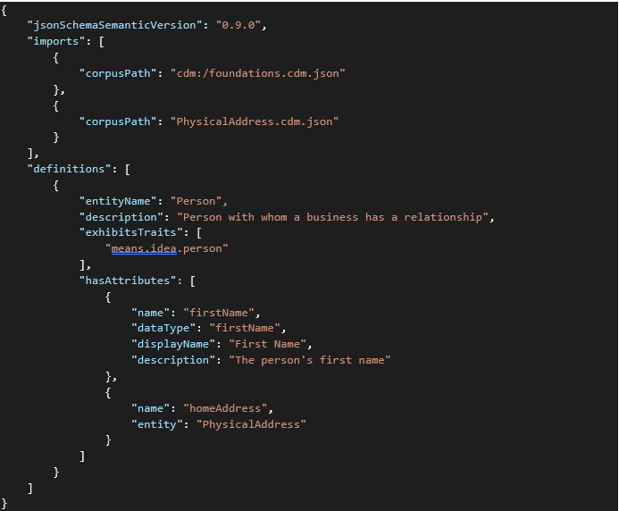
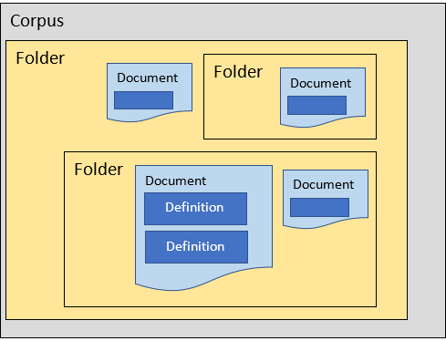
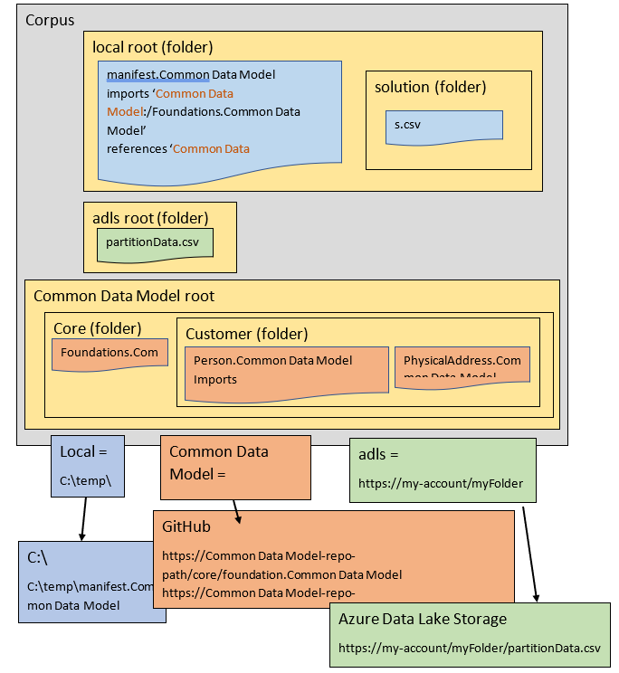

# A few technical details to help with the rest

Before digging into the details of the Common Data Model language and object model, here are some important up-front notes.

## JSON documents


The shape and meaning of Common Data Model entities and the description for the
arrangement of data in a folder are expressed in JSON structures that are stored
in a set of documents. The schema for describing and validating the allowable
JSON objects that these documents can contain is what we call the “language” of
Common Data Model.

For example, Person.cdm.json contains the following:

<!-- image2 -->
 

## The corpus

The top-level object of the object model is called a *corpus*. A corpus holds
the hierarchy of folders containing the related and interlinked documents
referenced or created during a session of Common Data Model operations.

<!-- image2 -->
 

Corpus paths

The definition of an object in Common Data Model might make references to other
documents in the corpus or to other objects within other documents. These
references are formed into *corpus paths*. A corpus path might be relative to
the current document or it might be an absolute reference to another document in
a specific location in the corpus. Although a corpus path often overlaps with
folder and document names in a file storage location, the path is actually a
route through the objects that exist in the object model under a corpus. The
form of a full corpus path is:

storage:/folderPath/folderPath/documentName/definitionName/subObject

The *storage* label can be thought of like a hard drive; that is, a name given
to a storage system abstraction. The labels are registered with the corpus by
the Common Data Model program and associated with configured storage adapters.
For instance, the label **cdm:** is reserved to mean the storage adapter that
accesses the standard documents from the root of our public GitHub site. The
**local:** label is often used to access the documents under a particular folder
on a local hard drive, while the **adls:** label might point to a folder in a
storage account. The following diagram illustrates the relationship among these
folders and locations.

<!-- image3 -->
 

When you use the object model for Common Data Model to get the object from the
corpus path local:/manifest.cdm, the local adapter reads from the c:\\temp\\
folder.

After it’s loaded, this document object can cause the listed imports and
references to also be loaded from the appropriate storage adapter.

Note that any relative corpus paths are assumed to be relative to the document
in which they’re found, and therefore are assumed to come from the same adapter
source.

The *folderPath* labels in the corpus path identify the folder objects that have
been created or discovered. The *documentName* label identifies the document
object in a folder that has the same name as the file that was loaded. The
*definitionName* and *subObject* labels identify the top-level object defined in
the document, and then any objects within that top-level object.

## Version information


Both the schema definition files (\*.cdm.json) and the folder manifest files
(\*.manifest.cdm.json) start with a reference to the JSON schema document that
will validate the content of these files and the version number of the object
model for Common Data Model (and JSON schema) that validates, loads, and
produces the shape of the objects described in the document. After version 1.0,
the object model for Common Data Model will remain backward-compatible within
major versions. So version 1.9 of the object model will be able to read a
version 1.1 document.

## Common, standard definition documents


The following table lists the documents that are included in almost all
practical uses of the object model for Common Data Model.

| Document             | Contents                                                                                                                                                                                              |
|----------------------|-------------------------------------------------------------------------------------------------------------------------------------------------------------------------------------------------------|
| primitives.cdm.json  | The root definitions of most objects and types. The definitions in this document are used by the object model for Common Data Model internally as a part of interpreting other objects.               |
| meanings.cdm.json    | Most of the shared semantic meanings for describing metadata.                                                                                                                                         |
| foundations.cdm.json | Building blocks of standards, expressed in the object model for Common Data Model itself, for how to represent certain important ideas like lists of localized text, lookup tables, and foreign keys. |

## Imports


Both the schema definition files (\*.cdm.json) and the entity manifest files
(\*.manifest.cdm.json) allow importing other definition documents that can be
found within the same corpus (that is, within a corpus path). When document A
imports document B, any of the objects defined in document B (or any of the
objects that were first imported into document B!) can be referenced by name as
if they were actually defined in document A.

For example, MyDefinitions.cdm.json defines two custom Common Data Model data
types, as shown in the following excerpt:

```json
{
   "jsonSchemaSemanticVersion":"0.9.0",
   "imports":[
      {
         "corpusPath":"cdm:/foundations.cdm.json"
      }
   ],
   "definitions":[
      {
         "dataTypeName":"thingName",
         "description":"The name of a thing",
         "extends":"string",
         "exhibitsTraits":[
            "means.identity.name"
         ]
      },
      {
         "dataTypeName":"personFullName",
         "description":"The full name of a person",
         "extends":"thingName",
         "exhibitsTraits":[
            "means.idea.person"
         ]
      }
   ]
}
```

Because **thingName** is defined in the same document as **personFullName**, the
definition of **thingName** can be referenced in a simple way. Also, because the
Common Data Model:/foundations.cdm.json document is imported, these new custom
data types can reference concepts like **string** and **means.identity.name**.

In the same folder, a new document named MyEntity.cdm.json defines a simple
Common Data Model entity named Person, as shown in the following excerpt:

```json
{
   "jsonSchemaSemanticVersion":"0.9.0",
   "imports":[
      {
         "corpusPath":"MyDefinitions.cdm.json"
      }
   ],
   "definitions":[
      {
         "entityName":"Person",
         "description":"Person with whom a business has a relationship",
         "hasAttributes":[
            {
               "name":"name",
               "dataType":"personFullName",
               "description":"The person's full name"
            },
            {
               "name":"id",
               "dataType":"entityId"
            }
         ]
      }
   ]
}
```

Because it imported MyDefintions.cdm.json, this new document can reference the
symbols for **personFullName** *and* any symbols from the foundations.cdm.json
document, such as **entityId**.

Sometimes it's necessary to import documents that contain objects with names
that conflict directly with names that are being defined in the new document.
This occurs when an entity inherits from a base entity to add some new
attributes, but wants to use the same entity name. To avoid a conflict, a
"moniker" can be given to temporarily disambiguate the imported object. Using
our example above, if MyDefintions.cdm.json was imported with a moniker of
**mine**, the reference **mine/personFullName** would need to be used to
reference the data type **personFullName** defined in that document.

In a case where objects are imported from many documents and monikers aren't
used, and the documents contain duplicate definitions for the same symbolic
name, whichever definition of the object was imported last "wins."

## Learn more

- Common Data Model [manifest definitions](manifest.md)
