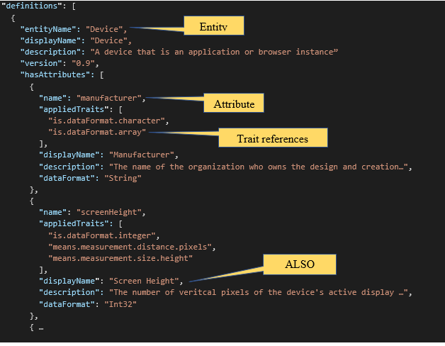
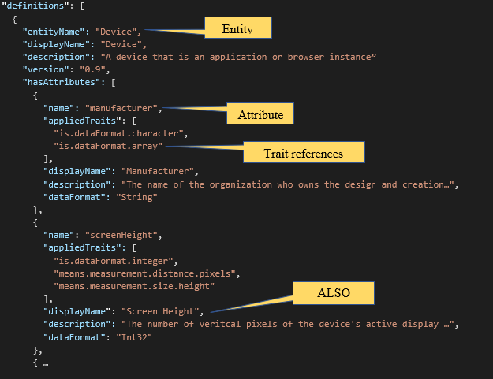
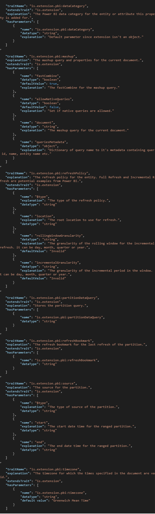
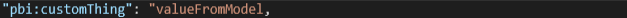
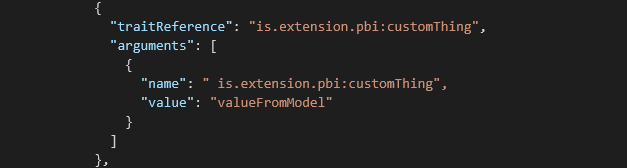
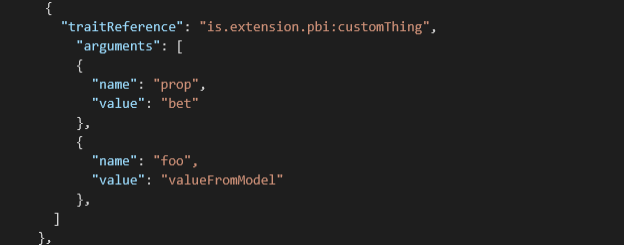
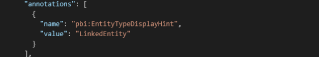
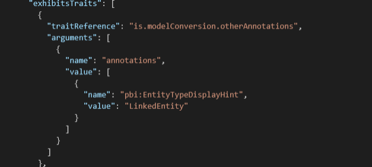
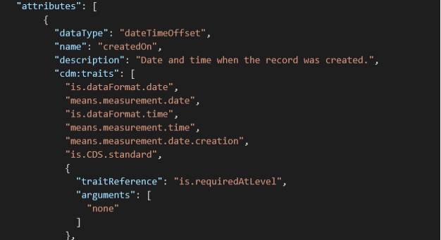

# Trait concepts and use cases - a detailed overview of 'traits' for representing dataTypes

## Summary

This guidance is intended to explain the concepts and use cases of CDM traits including how CDM standard traits are described, how they represent the format of stored data values, and explains the translation (via the CDM SDK) and equivalence of traits when converting to or from the previous representation of CDM folders (referred to as the model.json file format).

For reference, the current form for representing CDM metadata is called the 'manifest' format which encompasses several critical enhancements over the more limited model.json format.  The CDM manifest format encompasses several critical enhancements over the more limited model.json format, and is documented at <https://docs.microsoft.com/en-us/common-data-model/cdm-manifest>.

For detailed information on the model.json document format please refer to <https://docs.microsoft.com/en-us/common-data-model/model-json>.

## What are Traits

'Traits' are the fundamental mechanism in the CDM metadata grammar for describing the data format, semantic meaning, specifications, etc. for entities, attributes and other objects such as partitions or manifests.

In fact, when an Entity is in the 'resolved' form, that is, when it is being used to map out the specific layout of data records, an Entity object may be nothing more than a named collection of references to Traits along with a list of Attributes where each Attribute is nothing more than a named collection of references to Traits.

For example:

You may notice that there are some properties on the Entity and Attributes that do not look like Trait references, but rest assured, the helper properties like displayName, description and dataFormat are representing some hidden trait values. These traits still exist in the CDM object model and can be accessed as Traits instead of property values.

The string like "means.measurement.distance.pixels" are referred to as 'Trait References' because each one of them corresponds to a Trait object that is defined (perhaps in another document) in the CDM system. Using the CDM object model, these "strings" are actually TraitReference objects that can be queried to fetch the underlying TraitDefinition

The following example shows what Trait Definitions look like in a CDM definition document.

Of note from this example:

1. By convention, trait names describe the meaning and domain of the trait using a word.word.word format. As part of the convention, the first word is either a namespace identifier (for custom extensions) or the verb "is", "does", "has" or "means"

2. A best practice is to give traits an explanation making it clear when or where they should be applied.

3. Traits can be defined as extensions of a base trait. This creates an inheritance hierarchy that allows for mixing specific and general expressions of meaning. For example if means.measurement.distance extends means.measurement and means.measurement.temperature also extends means.measurement, then any object that exhibits either of the more specific traits for distance or temperature can also be seen to have the means.measurement trait (useful for searching or grouping)

4. Traits can define a set of named parameters that give additional details about the trait or a setting, etc.

5. Trait parameters have a name and explanation, can be required or optional, can have default values and have an expected data type

6. The dataType for a trait parameter can be any of the dataTypes defined in the CDM system.

7. In this example, because the base trait parameter for 'units' is set to 'Meters', when any other object has this means.measurement.distance.meters trait applied to it, the units argument will always be 'Meters'.

8. A defined trait, such as means.measurement can then be applied or used by making a reference to the defined trait.

    i.  An example of a 'simple' trait reference is the use of 'means.measurement' as the base or extendedTrait for the means.measurement.distance trait.

    ii.  A structured reference to a trait, as in the object shown which describes the base trait for means.measurement.distance.meters allows for the setting of trait arguments for that specific use of the trait.

    iii.  The supplied trait arguments correspond to the defined trait parameters, including the trait parameters that may be inherited from a base trait.

    iv.  A trait argument can be a simple string value. This assumes that values are set on parameters in the order they are defined, starting from the 'deepest' base trait on up.

    v.  Another way to specify trait arguments is with name and value pairs in an object.

    vi.  Trait arguments for 'simple' values are always expressed as strings, even if the trait parameter has a dataType of integer, boolean, etc.

    vii.  Trait argument values for complex types like attributes or entities can be objects.

    viii. Maintaining a standard naming convention simplifies collections of traits into understandable and standard semantic groups. Standard semantics include: 

    | Trait base collection | Description | Example |
    |-------|-----------|-------------|
    | is | *the actual value, format or shape of the data object or attribute* | *the "is.dataFormat.array" attribute is a string with an array of characters* |
    | does | *how the data object or attribute affects or contributes to another attribute* | *the "does.haveDefault" attribute indicates if a default value is required, present or applied* |
    | has | *describes the characteristic or shape of an attribute* | *the "has.format("L, F M")" attribute specifies the acceptable data format, in this case **L**astname **,** **F**irstname **M**iddlename* |
    | means | *what the data object or attribute relates to or represents* | *the "means.location.city" attribute is the location having a city name* |
 

## Trait specifics

| Property / Method | Description |
|---|---|
| traitName | The name of the trait |
| extendsTrait | A trait reference to a trait of which this trait extends. This trait will inherit all parameters from the base trait |
| parameters | A list of parameters (below) for holding values or settings with the trait |
| elevated | Beyond the scope of this document |
 

## 

## Trait parameters

| Property / Method | Description |
|---|---|
| name | A unique name for the parameter. This name can be used to set argument values when referencing traits |
| defaultValue | A default value for the parameter that will be used if no corresponding arguments are set |
| dataTypeRef | A CDM dataType describing the meaning and shape of the values that can be represented by this parameter |
| required | If True, the object model will report an error if a trait is being referenced and no value has been set as an argument for this trait |
 

## 

### Ascribing traits (overriding exhibited trait behavior)

Traits can be part of the definition of an object or can be attached to a particular reference to an object.

When an entity or other object is defined in CDM, part of its definition can be the set of traits that the object will 'exhibit' meaning that any time the object is used by reference, it will have those traits.

In Attribute definitions and in the places where a CDM object is used by reference, additional traits may be 'applied'. These additional traits will sit along with the object's exhibited traits. Applying a trait on an object reference overrides the parameter values of the identically named trait that is 'exhibited' by the object.

## CDM Traits, dataTypes, the dataFormat property and relationship to the older model.json dataType enumeration.

There are a set of CDM traits that express aspects of the 'format' of a data value in a storage agnostic way.

| Trait Name | Description |
|---|---|
| is.dataFormat.integer | A whole number |
| is.dataFormat.floatingPoint | An approximation of a number with optional whole, fractional and power of 10 parts |
| is.dataFormat.character | An encoded text character |
| is.dataFormat.byte | A byte of data |
| is.dataFormat.boolean | True or False |
| is.dataFormat.numeric | A fixed precision floating point number that may have precision and scale |
| is.dataFormat.time | A representation of a time of day |
| is.dataFormat.date | A representation of a calendar date |
| is.dataFormat.timeOffset | a representation of a timezone offset |
| is.dataFormat.guid | A representation of a 128 bit globally unique identifier |
| is.dataFormat.big | A modifier. Indicates the 'doubled' size of some numeric values |
| is.dataFormat.small | A modifier, indicates the 'half' size of some numeric values |
| is.dataFormat.array | A modifier, the base format is repeated sequentially |
 

### dataTypes

A CDM **dataType** is an object that represents a collection of traits. All dataTypes should indicate the dataFormat traits but can also add additional semantic information.

The primitive dataTypes in CDM are

| dataType Name | Traits |
|---|---|
| integer | is.dataFormat.integer |
| float | is.dataFormat.floatingPoint |
| decimal | is.dataFormat.numeric.shaped (extends is.dataFormat.numeric) |
| boolean | is.dataFormat.boolean |
| byte | is.dataFormat.byte |
| binary | is.dataFormat.byte, is.dataFormat.array |
| char | is.dataFormat.character, is.dataFormat.array |
| string | is.dataFormat.character, is.dataFormat.array |
| smallInteger : extends 'integer' | is.dataFormat.integer, is.dataFormat.small |
| bigInteger : extends 'integer' | is.dataFormat.integer, is.dataFormat.big |
| double : extends 'float' | is.dataFormat.float, is.dataFormat.big |
| guid : extends 'string' | is.dataFormat.guid, is.dataFormat.character, is.dataFormat.array |
| date | is.dataFormat.date |
| time | is.dataFormat.time |
| dateTime | is.dataFormat.date, is.dataFormat.time |
| dateTimeOffset :extends 'dateTime' | is.dataFormat.date, is.dataFormat.time, is.dataFormat.timeOffset |
 

An example of a more meaningful dataType is 'city' which extends 'string' and adds the 'means.location.city' trait.

### dataFormat

Since dealing with the set of 'is.dataFormat' traits that might originate from various semantic dataTypes can be awkward, the CDM system converts these traits into a first class property on the Attribute object called the dataFormat. The dataFormat is computed from the traits found on the attribute. dataFormat values correlate with the intrinsic dataTypes listed above

The best practice is to use a semantically rich dataType in your entity definition. However, it is possible to explicitly set the dataFormat property to one of the enumeration values and doing so will add the associated traits to the attribute.

| dataFormat | Traits |
|---|---|
| Unknown | No combination of traits could be recognized |
| Int16 | is.dataFormat.integer, is.dataFormat.small |
| Int32 | is.dataFormat.integer |
| Int64 | is.dataFormat.integer, is.dataFormat.big |
| Float | is.dataFormat.float |
| Double | is.dataFormat.float, is.dataFormat.big |
| Guid | is.dataFormat.character, is.dataFormat.array, is.dataFormat.guid |
| String | is.dataFormat.character, is.dataFormat.array |
| Char | is.dataFormat.character |
| Byte | is.dataFormat.byte |
| Binary | is.dataFormat.byte, is.dataFormat.array |
| Time | is.dataFormat.time |
| Date | is.dataFormat.date |
| DateTime | is.dataFormat.date, is.dataFormat.time |
| DateTimeOffset | is.dataFormat.date, is.dataFormat.time, is.dataFormat.timeOffset |
| Boolean | is.dataFormat.date |
| Decimal | is.dataFormat.date |
| Json | is.dataFormat.character, is.dataFormat.array, means.content.text.JSON |
  

### model.json types

When converting to / from the model.json persistence format for a CDM entity, the following conversion takes place:

| Source dataFormat | model.json dataType | Destination dataFormat |
|-------------------|---------------------|------------------------|
| Unknown           | unclassified        | Unknown                |
| Byte              | unclassified        | Unknown                |
| Binary            | unclassified        | Unknown                |
| Int16             | int64               | Int64                  |
| Int32             | int64               | Int64                  |
| Int64             | int64               | Int64                  |
| Float             | double              | Double                 |
| Double            | double              | Double                 |
| Guid              | guid                | Guid                   |
| String            | string              | String                 |
| Char              | string              | String                 |
| Time              | time                | Time                   |
| Date              | date                | Date                   |
| DateTime          | dateTime            | DateTime               |
| DateTimeOffset    | dateTimeOffset      | DateTimeOffset         |
| Boolean           | boolean             | Boolean                |
| Decimal           | decimal             | Decimal                |
| Json              | json                | Json                   |
 

## Standard Traits

The standard definition documents for CDM (primitives.cdm.json, foundations.cdm.json and meanings.cdm.json (located at <https://github.com/microsoft/CDM/tree/master/schemaDocuments>) contain a number of pre-defined standard traits that should be used or extended to help create a shared understanding of metadata from different systems. These standard traits define data formats, data shapes, usage guidance and restrictions, semantic meanings, and structural information about the relationships within the entity itself.

For more explanation, consider the following examples:

| Trait Name | Description |
|---|---|
| is.dataFormat.integer | Part of the dataFormat set of traits, indicates that the attribute represents whole numbers. |
| means.identity.entityId | Set for an attribute that holds an identifier (primary key) value for an entity |
| is.required | |
| is.CDM.entityVersion | Holds the version number for the schema of an Entity |
| is.localized.displayedAs | The "Display Name" for an attribute or entity. Holds a table of language specifics strings. |
| is.correlatedWith | Indicates that the values found in the tagged attribute are correlated with the values from another indicated attribute. | 
| means.calendar.dayOfWeek | Part of the Calendar trait set. indicates the day of the week. Note that the data values could be "Mon, Tues" or 0,1,2 and this trait is still valid. Another trait like dataFormat.integer indicates the data shape. |
| means.demographic.maritalStatus | Marital status, such an attribute may also (with other traits) be constrained to a specific list or enum of possible values. |
| means.formatting.font.size | |
| means.idea.product | Could be used on an entity that holds product information. |
| means.location.city | Contains the name of a city |
| means.measurement.distance.inches | Inches but also measurement and measurement of distance. |
| means.identity.person.fullName | The full name of a person |
 

The full set of standard traits can be broken down into these groups/documents

| Document/Group | Description |
|-------------------------|-------------------------|
| primitives.cdm.json | Fundamental traits used by the CDM system internally. Basic building blocks of data formats |
| foundations.cdm.json | Key concepts that CDM entities use to express ideas like 'localized display names', and 'enumerations of values' |
| Meanings documents: | All of the standard 'meanings' documents hold semantic traits and dataTypes |
| Meanings Concepts  (meanings.concepts.cdm.json) | Business concepts and objects: means.idea.product, means.idea.schedule, means.category, means.relationship |
| Meanings Identity  (meanings.identity.cdm.json) | Semantics about identifying things and people. Means.identity.barCode, means.identity.person.fullName, means.identity.tickerSymbol |
| Meanings Calendar  (meanings.calendar.cdm.json) | Describing the parts of fiscal and other calendars: means.calendar.day, means.calendar.weekOfYear, means.calendar.ISO8601 |
| Meanings Measurement  (meanings.measurement.cdm.json) | Measurement of physical and other dimensions. Means.measurement.density, means.measurement.sequence, means.measurement.currency.revenue, means.measurement.duration.hours |
| Meanings Formats  (meanings.formats.cdm.json) | Color, font, ordering. |
| Meanings Demographics  (meanings.demographics.cdm.json) | Age, gender, income level. Means.demographics.birthDate |
| Meanings Location  (meanings.location.cdm.json) | Address and locations. Means.location.address.street means.location.latitude, means.location.geo.boundary.left |
| Meanings Privacy  (meanings.privacy.cdm.json) | Data Subject actions, Identifiability, category, usage and consent requirements. Privacy.dataCategory.endUser.feedback, privacy.dataUsage.research, privacy.consent.optIn |
| structural | Is.hidden, is.ordered, means.content.text.XML |
 

## Traits in the CDM object model

When working with objects such as Entities, Attributes, Partitions, etc. the CDM object model largely follows the concepts one sees in the persisted JSON documents. The objects have a property of type CdmCollection&lt;CdmTraitReference&gt; called 'appliedTraits' or 'exhibitedTraits' that contains a set of trait references. A Trait Reference can be queried for the definition object (fetchObjectDefintion) if needed. Each trait reference may contain a collection of arguments. These are the arguments that supply values to any defined Trait parameters. An API call using 'FetchFinalTraitArguments' will return a map from argument names to the 'final' values of each parameter when considering the inheritance hierarchy of the Trait, any default values for parameters and any argument values that have been set along the way.

Consult the CDM object model documentation and sample code projects for details on how to work with traits in code.

## Traits in model.json

The model.json file format was the initial version of the format describing CDM folders. The CDM manifest format is the new version to accommodate additional requirements and covers a superset of functionality of model.json. The CDM SDK available in multiple languages provides automatic forward- (and backward-) translation between the metadata formats. The reference specification for manifest is publicly available here: <https://docs.microsoft.com/en-us/common-data-model/cdm-manifest>

When the CDM SDK is used to open a model.json document, it will be converted into a manifest object with references to EntityDefinitions. When a **pbi:dataCategory** custom extension is encountered on an entity or attribute, it will be automatically translated into the equivalent CDM standard semantic trait and that trait will be attached to the converted CDM entity or attribute. 

### Automatic translation to standard traits of specific PBI custom extensions 

A set of pbi custom extensions will be translated into well-known traits. The best way to explain the correlation may be to simply describe the traits:

### Other custom extensions ("pbi" or other prefix)

Other custom extension encountered in the model.json will be turned into matching traits on the CDM object.

1. The new trait extends from the "is.extension" trait.

2. The trait is named to match the custom extension.
3. If the custom extension has a value that is an intrinsic type, like 'string', then the trait is given one parameter having the same name as the trait and the intrinsic typed value is assigned to that parameter.

4. If the custom extension has a value that is a structured object, then the trait is given one parameter for each named member of the custom extension's object type.

For example,

becomes

while

turns into

### Translation of annotations

Annotation in the model.json will also be turned into Traits like so:

model.json has:

The CDM object exhibits this trait:

Of course saving a CDM manifest as a model.json using the SDK will run these trait to extension and trait to annotation conversion in reverse.

However, there will be CDM traits that have no equivalent representation in the model.json form. These traits will show up as cdm: custom extensions. For instance:

Shows an attribute definition in a model.json that holds a cdm:traits custom extension with an array of the persisted trait references one would also see in the equivalent EntityDefinition.
