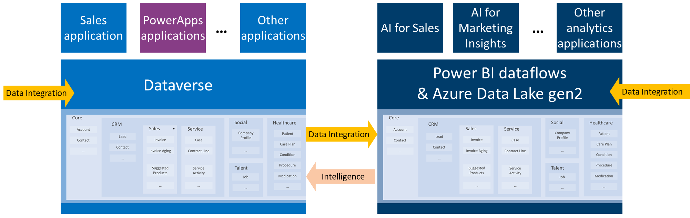

# How to use the Common Data Model
<!--note from editor: Because this is a "How to" topic, the headings need to be task-oriented. -->
With the Common Data Model, you can structure your data to represent concepts and activities that are commonly used and well understood. You can query that data, reuse it, and interoperate with other businesses and apps that use the same format. <!--This strategy matches that of, for example, manufacturers who produce AA batteries that fit in most remote controls.--> The Common Data Model defines the size and shape of a **Contact**, for example, so that your app developers and business partners can parse that data and build your apps (or interoperate with other people's apps) with agility and confidence. <!--The Common Data Model is an open-source definition of standard entities and a metadata system that enable consistency of data and its meaning across apps and business processes.-->

<!--note from editor: Is Common Data Service required on the back end? By saying "Today", I take it that even though Common Data Model definitions are open to "any service or application," there's just this one service so far that actually does use them. This is possibly a very ignorant observation; it's something that even after a week of reading this content, I still can't be sure of.-->
Today, the Common Data Model is used within Common Data Service, which supports Dynamics 365, Power Apps, and the data-preparation capabilities in Power BI dataflows to create schematized files in Azure Data Lake. The Common Data Model definitions are open and available to any service or application that wants to use them.
<!--note from editor: This graphic has quite a few branding issues. Also, I'm not sure what those arrows are saying.-->

You can use the Common Data Model in multiple applications and platforms:
<!--note from editor: I got lost here. Either this list should introduce the rest of the topic, or the rest of the topic should be rewritten so it covers the items in this list. My rewrite of these headings is undoubtedly not good:
* Perform quick data integration by using Power Query Online
* Jump-start Common Data Service app development
* Ingest data by using Power BI dataflows
* Optimize data exchange in the Azure Data Lake
-->
<!--
- **Bring your data together in Common Data Service**: You can use Common Data Service to bring your data together in the standardized format of the Common Data Model and quickly create powerful apps. The data can then be managed in Microsoft apps and services such as Dynamics 365, Power Apps, Power Automate, Power BI, or your own custom apps.

- **Extend Common Data Model standard entities**: The Common Data Model is extensible, so you can extend existing entities or create entities that are specific to your organization. These entities can relate back to the Common Data Model standard entities so that your app can more easily leverage the full power of the platform.

- **Create your own repositories of data with Azure Data Lake Storage Gen2**: You can build repositories of data that adhere to the schema of the Common Data Model, and you can connect to those data sources by using Microsoft data connectors. Then you can build custom, line-of-business apps that use or share your data in the Common Data Model, regardless of where the data originated or resides.

- **Quickly derive and distribute insights using Power BI**: You can use advanced data-preparation services with Power BI dataflows to load data into Common Data Model form, including templates that map into Common Data Model standard entities. Then you can create report-generating apps that automatically pull your data from the Common Data Model into customized insights for individuals and groups in your organization.
-->

Microsoft continues to extend the Common Data Model in concert with many partners and subject-matter experts so that more industries, such as healthcare, can benefit from the Common Data Model and the platforms that support it.

<!--note from editor: How is this for a task-oriented heading?-->
## Perform quick data integration by using Power Query Online

Both platforms <!--note from editor: What are both platforms? Common Data Service and Power BI dataflows?-->that currently support the Common Data Model also offer data-integration experiences through Power Query Online, which lets users bring in data from a variety of sources, transform it if necessary, and then map it to standard entities in the Common Data Model or create custom entities. Power Query Online leverages the same visual, self-service data-prep experience as Power Query within Excel and Power BI Desktop, so existing users can ramp up quickly.

<!--note from editor: Does this section merit a list of additional resources, or will this be enough information?-->

<!--note from editor: Task-oriented, but maybe not accurate?-->
## Jump-start Common Data Service app development

By using Common Data Service, you can jump-start app development <!--note from editor: Is this what "jump-start apps" means?--> by using the Common Data Model with business logic, security, and integration already built in. The platform provides these benefits:

- **Leverage packaged business applications**: Many Microsoft Dynamics 365 solutions and third-party apps are built on top of (or at least leverage) Common Data Service. When your data is structured according to the Common Data Model, you can take advantage of those packaged applications.

- **Gain access to customized solutions**: Developers who understand and work with data in the Common Data Model format have created an ecosystem of extensions and complete apps. <!--note from editor: You don't need a cross-reference here when there's a list of them directly below.--><!--For more information, see [Introduction to solutions](https://docs.microsoft.com/powerapps/developer/common-data-service/introduction-solutions).-->

Whatever your intent, using the Common Data Model structures your data in a common format so that you can use, share, and analyze it more easily.

### Resources for Common Data Service

- [What is Common Data Service?](https://docs.microsoft.com/powerapps/maker/common-data-service/data-platform-intro)
- [Add data to an entity in Common Data Service by using Power Query](https://docs.microsoft.com/powerapps/maker/common-data-service/data-platform-cds-newentity-pq)
- [Introduction to solutions](https://docs.microsoft.com/powerapps/developer/common-data-service/introduction-solutions)
- [Build a model-driven app](https://docs.microsoft.com/powerapps/maker/model-driven-apps/model-driven-app-overview)
- [Build a canvas app](https://docs.microsoft.com/powerapps/maker/canvas-apps/getting-started)
- [Create a flow that uses Common Data Service](https://docs.microsoft.com/flow/common-data-model-intro)

## Ingest data by using Power BI dataflows

You can use the dataflows feature of Power BI to ingest data into the Common Data Model format from Dynamics 365, Salesforce, Azure SQL Database, Excel, SharePoint, or another source. You create and manage dataflows in app workspaces by using the Power BI service. After you've connected and prepared your data, you can choose to map it to a Common Data Model standard entity or load it as a custom entity in the Common Data Model form in Azure Data Lake Storage Gen2.

<!--
> [!NOTE]
> The dataflows functionality is in preview and subject to change and updates prior to general availability.
-->

<!--note from editor: Suggest deleting, or at least rewriting so it doesn't sound like a commercial.-->
<!--
Similar to how spreadsheets handle recalculations for all affected formulas, dataflows manage changes for an entity or data element on your behalf, automating updates, and alleviating what used to be tedious and time-consuming logic checks for even a basic data refresh. With dataflows and a few clicks, analysts and report creators can handle tasks that once required data scientists to oversee (and many hours or days to complete).
-->

Organizations can incorporate dataflows to suit their needs in these ways:

- Customize standard entities and create their own.
- Create dataflows programmatically with custom definition files (model.json).
- Leverage powerful Azure products such as Azure Machine Learning, Azure Databricks, and Azure Data Factory.
- Add CSV data from Azure Blob storage.
- Enjoy more storage, more frequent refreshes, incremental refresh, and computed and linked entities with Power BI Premium.

### Resources for Power BI

- [Self-service data prep in Power BI](https://docs.microsoft.com/power-bi/service-dataflows-overview)
- [Creating and using dataflows in Power BI](https://docs.microsoft.com/power-bi/service-dataflows-create-use)
- [Connect to data created by Power BI dataflows in Power BI Desktop](https://docs.microsoft.com/power-bi/desktop-connect-dataflows)
- [Developer resources for Power BI dataflows](https://docs.microsoft.com/power-bi/service-dataflows-developer-resources)

## Optimize data exchange in the Azure Data Lake

[Azure Data Lake Storage Gen2](data-lake.md) is designed specifically for enterprises to run large-scale analytics workloads in the cloud. A wide variety of applications and services can easily access data in this format, but each consumer must understand the meaning of the data before it can provide value. The Common Data Model simplifies this process by providing a metadata system that describes the data and standard entities to which producers can map..

### Resources for the Common Data Model and Azure Data Lake Storage Gen2

- [Introduction to Azure Data Lake Storage Gen2](https://docs.microsoft.com/azure/storage/blobs/data-lake-storage-introduction)
- [Power BI and Azure Data Services dismantle data silos and unlock insights](https://aka.ms/cdmadsblog)
- [Common Data Model and Azure Data Services Integration (tutorial)](https://github.com/Azure-Samples/cdm-azure-data-services-integration/blob/master/Tutorial/CDM-Azure-Data-Services-Integration-Tutorial.md)
