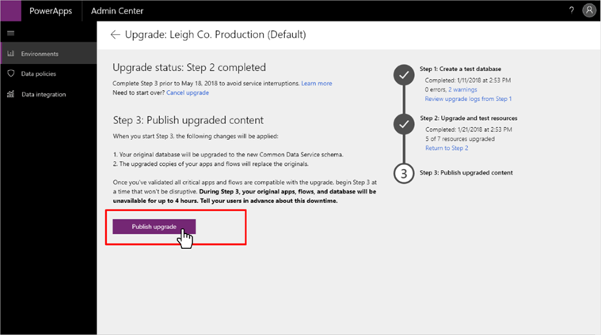

# Step 3: Complete the upgrade process for your existing database to CDS for Apps

After you have upgraded and verified your apps and flows, its time to complete
the database upgrade.

## Complete the upgrade

This is the final step in the process and initiates a complete upgrade of the
database. This step involves downtime of the database, including the apps and
flows associated with it. Expect this step to take several hours, depending on
the size of your database.   

To complete the database upgrade, an environment administrator must go to the
[PowerApps admin center](https://admin.powerapps.com/) and select **Publish
upgrade**. 

## Errors and resolutions

This section provides information about possible errors you might see during this step, and how to resolve it.

|Error  |Description and resolution  |
|--|--|
|Errors to migrate From CDM PositionWorkerAssignment to CDS2 cdm_positionworkerassignmentmaps, exported record count 17 but imported record count 0, error count 17|The overall data upgrade has completed but we encountered an error while upgrading this entity due to which either one or more records failed to upgrade. These records will not be available to you in CDS for Apps. Please create a support ticket if you need the missing data extracted from previous version of CDS.|
|CdsUpgradeInternalFailure . The CDS upgrade process has encountered an error. The tracking id for this request was \<value> |We encountered an error due to which Upgrade has failed. You may retry the step.| 
|Can't find XRM ID for user with oid \<value> when assigning to role \<value> (source role \<value>) in environment \<value>|The user with AAD Object Id {0} wasn’t synced to the upgraded CDS instance yet, so the role assignment to role {1} can’t be migrated for that user. Unless the user is deleted or disabled in the AAD tenant, you can assign the necessary role manually once the user is synced (which can take up to a couple of days).  To find the user with AAD Object Id {0}, you can go to the following URL: `<base CDS URL>/api/data/v9.0/systemusers()?$select=fullname&$filter=azureactivedirectoryobjectid%20eq%20{0}` and look at the value of the fullname property.  To find which role has the ID {1}, you can go to the following URL: `<base CDS URL>/api/data/v9.0/roles({1})?$select=name` and look at the value of the name property.  You can then use the security tab in the Admin portal to assign the user to the role.
