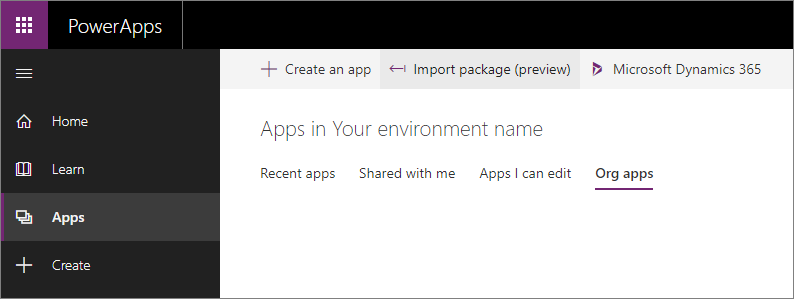
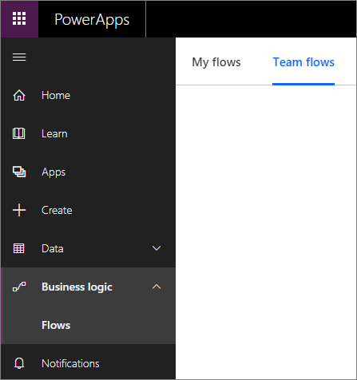

# Delete your previous version Common Data Service environment

Now that the new Common Data Service for Apps upgrade is available you can choose one of the following:

<!-- Mostly same content found in introduction-upgrade-cds.md -->
- Upgrade your previous version of CDS to CDS for Apps.
    - This is the best option to preserve any apps or flows that use the previous version of CDS.
    - More information: [Overview of the upgrade process](../upgrade-overview.md).
- Wait for the capability to delete your previous version CDS database, then create a new CDS for Apps database in the existing environment.
    - We are working to provide a method to simply delete your previous version CDS database without deleting the environment.
    - This method will work with your default environment.
    - This method will not attempt to upgrade any existing apps of flows using the previous version CDS database.
- Delete the non-default environment that contains your previous version CDS database and create a new CDS for Apps environment.
    - If you have no existing apps or flows using the previous version CDS database, or you don't care to preserve these apps and flows, you can get access to a new environment and add a CDS for Apps database to the new environment.
    - This does not work for your default environment.
    - The rest of this topic describes how to do this.

For a non-default environment, if you don't have any important business data in your CDS database and you have no other Apps or Flows created for the environment, you can choose to simply delete the entire environment and request a new environment with a  CDS for Apps database. If you were just evaluating the previous version of CDS, this may be the easiest option for you.

> [!WARNING]
> Deleting an environment will delete all Apps and Flows defined for the environment. If you want to preserve the Apps and Flows, you must upgrade your environment.

> [!NOTE]
>  - You must be a tenant administrator to perform these steps.
>  - You cannot delete the default environment.

## Step 1 : Verify that the environment is for the previous version of CDS

1. Go to [https://admin.powerapps.com/environments](https://admin.powerapps.com/environments) to view a list of the environments available to you.

2. Select a non-default environment and open it. An environment with the previous version of CDS will look like this:

    

    You will find the following tabs: 

    - **Details**
    - **Security**
    - **Resources**
    - **Database**

    Environments using CDS for Apps will not have a **Database** tab and they will have an **Environment type** value set to **Dynamics365Instance**

## Step 2 : Verify that the environment has no Apps or Flows you want to keep

1. Go to [https://web.powerapps.com/environments/](https://web.powerapps.com/environments/) and select the non-default environment that you confirmed contains the previous version CDS database in the previous step. 

2. Expand **Apps** and verify that there are no apps that you want to keep.

    > [!IMPORTANT]
    > Make sure you check each of the app lists:
    > 
    > - Recent apps
    > - Shared with me
    > - Apps I can edit
    > - Org apps

    

3. Expand **Business logic** > **Flows** and verify that there are no flows you want to keep.

    > [!IMPORTANT]
    > Make sure you check both **My flows** and **Team flows**

    

## Step 3 : Delete the environment

1. Go back to [https://admin.powerapps.com/environments](https://admin.powerapps.com/environments) and select the non-default environment you want to delete.

2. In the top right corner, click the **Delete** icon.

    

    > [!NOTE]
    > You cannot delete a default environment

## Step 4: Create a new CDS for Apps environment

Follow the instructions in [Create an environment](/powerapps/administrator/create-environment) to create a new environment with a CDS for Apps database.