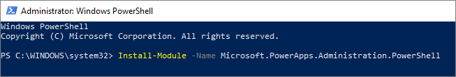
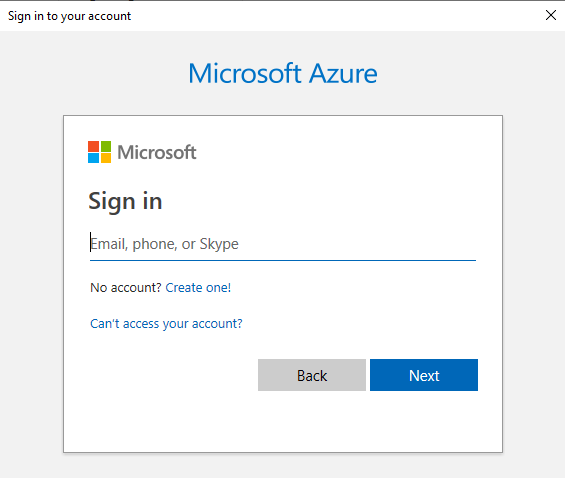
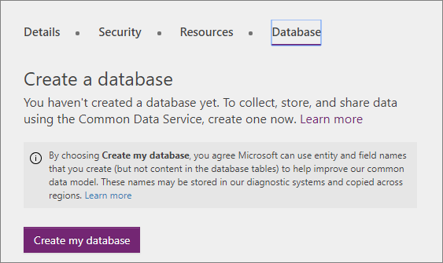

# Delete your previous version Common Data Service database 

If you don't have any important data in the previous version CDS database, you can simply delete it and then add a new CDS for Apps database.

You can do this using a new `Remove-LegacyCDSDatabase` PowerShell cmdlet provided with the [PowerApps cmdlets for administrators](/powerapps/administrator/powerapps-powershell#powerapps-cmdlets-for-administrators-preview)

> [!NOTE]
> If you aren't comfortable using PowerShell, you can contact PowerApps support and request that they delete your database for you.

This topic will describe the steps required to install the PowerShell scripts and run the `Remove-LegacyCDSDatabase` PowerShell cmdlet. For more information on other cmdlets you can use, see [PowerShell support for PowerApps (preview)](/powerapps/administrator/powerapps-powershell).

## Step 1: Get your environment and database ids

When you run the `Remove-LegacyCDSDatabase` cmdlet you will need to pass in two parameters:

- `EnvironmentName` : The GUID value that is the name for the environment
- `DatabaseId` : The GUID value that is the name for the database

You can get these values from the URL in the admin portal using the following steps:

1. Open the admin portal ([https://admin.powerapps.com](https://admin.powerapps.com))
1. Navigate to the environment that has the previous version CDS database you want to delete.
1. Click **Import resources** in the top right corner.

    

1. Look at the URL in your browser. It should look something like this:

```
https://admin.powerapps.com/environments/24939e57-927a-4267-8cb1-d53d195bcc9e/namespaces/8854e4f4-2ae4-4b74-b3cc-496a6d4584c2/import
```

- The value between `environments/` and `/namespaces` is the `EnvironmentName`
- The value between `namespaces/` and `/import` is the `DatabaseId`

Copy these values since you will need them when you edit the script to run the  the `Remove-LegacyCDSDatabase` cmdlet in [Step 3: Edit and run script](#step-3-edit-and-run-script)

## Step 2: Open PowerShell and install PowerShell module

1. Open a PowerShell command window (as administrator)

    1. Press the **Windows** key or click **Start**.
    1. Type `Windows PowerShell`
    
        

    1. Select the **Run as Administrator** option.
    1. Click **Yes** in the **User Account Control** dialog.

        A PowerShell window will open.

1. Install the administration PowerShell module
    1. Copy this command: `Install-Module -Name Microsoft.PowerApps.Administration.PowerShell`
    1. Paste the command into the PowerShell window and press **enter**.

        

    When installing the module, you may get the following prompts:

        ```powershell
        NuGet provider is required to continue
        PowerShellGet requires NuGet provider version '2.8.5.201' or newer to interact with NuGet-based repositories. The NuGet
        provider must be available in 'C:\Program Files\PackageManagement\ProviderAssemblies' or
        'C:\Users\you\AppData\Local\PackageManagement\ProviderAssemblies'. You can also install the NuGet provider by
        running 'Install-PackageProvider -Name NuGet -MinimumVersion 2.8.5.201 -Force'. Do you want PowerShellGet to install
        and import the NuGet provider now?
        [Y] Yes  [N] No  [S] Suspend  [?] Help (default is "Y"):
        ```

    Type `Y` to continue

        ```powershell
        Untrusted repository
        You are installing the modules from an untrusted repository. If you trust this repository, change its
        InstallationPolicy value by running the Set-PSRepository cmdlet. Are you sure you want to install the modules from
        'PSGallery'?
        [Y] Yes  [A] Yes to All  [N] No  [L] No to All  [S] Suspend  [?] Help (default is "N"):
        ```

    Type `Y` to continue

## Step 3: Edit and run script

1. Copy the following script and paste it into NotePad or whatever text editor you prefer.

    ```powershell
    $EnvironmentName = "<paste your EnvironmentName value here>"
    $DatabaseId = "<paste your DatabaseId value here>"
    # Will prompt you for account credentials
    Add-PowerAppsAccount
    # Run the command to delete the database
    Remove-LegacyCDSDatabase -EnvironmentName $EnvironmentName -DatabaseId $DatabaseId
    ```

1. Edit the script to set the `$EnvironmentName` and `$DatabaseId` variables with the GUID values you got from [Step 1: Get your environment and database ids](#step-1-get-your-environment-and-database-ids).

1. Copy the edited script and paste it into the PowerShell command window you opened in [Step 2: Open PowerShell and install PowerShell module](#step-2-open-powershell-and-install-powershell-module)

1. Press **Enter** to run the script.

1. Enter your account credentials in the dialog that opens.

    

If the script runs successfully you should see output similar to the following:

```powershell
StatusCode        : 204
StatusDescription : No Content
Content           : {}
RawContent        : HTTP/1.1 204 No Content
                    Pragma: no-cache
                    Strict-Transport-Security: max-age=31536000; includeSubDomains
                    x-ms-request-id: westus:3a26c2f4-1505-49e5-9db2-70260fe00a26
                    x-ms-correlation-request-id: 3a...
Headers           : {[Pragma, no-cache], [Strict-Transport-Security, max-age=31536000; includeSubDomains],
                    [x-ms-request-id, westus:3a26c2f4-1505-49e5-9db2-70260fe00a26], [x-ms-correlation-request-id,
                    3a26c2f4-1505-49e5-9db2-70260fe00a26]...}
RawContentLength  : 0
```

It should return a `StatusCode` value of `204` when it runs successfully.

When your return to view the database using the admin portal [https://admin.powerapps.com](https://admin.powerapps.com), you will see the following option to create a new database:



## Troubleshooting

This list contains potential issues you may encounter when you run the script.

### Invalid EnvironmentName or DatabaseId

The following error occurs if the GUID values you captured for the environment and namespace are not valid. You should double-check the values and try again.

```powershell
StatusCode              : NotFound
StatusDescription       : Not Found
IsMutuallyAuthenticated : False
Headers                 : {Pragma, Strict-Transport-Security, x-ms-request-id, x-ms-correlation-request-id...}
SupportsHeaders         : True
ContentType             : application/json; charset=utf-8
CharacterSet            : utf-8
LastModified            : 12/19/2018 4:48:24 PM
ProtocolVersion         : 1.1
ResponseUri             : https://api.cds.microsoft.com/providers/Microsoft.CommonDataModel/namespaces/...?api-version=2016-11-01&$filter=environment eq '...'
Method                  : GET
IsFromCache             : False
```