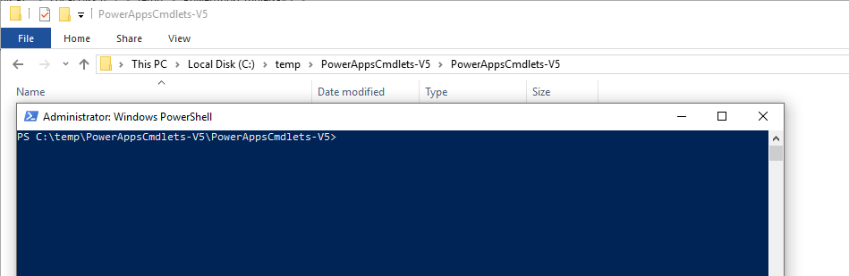

# Delete your previous version Common Data Service database 

If you don't have any important data in the previous version CDS database, you can simply delete it and then add a new CDS for Apps database.

You can do this using a new `Remove-LegacyCDSDatabase` PowerShell cmdlet provided with the [PowerApps cmdlets for administrators](/powerapps/administrator/powerapps-powershell#powerapps-cmdlets-for-administrators-preview)

This topic will describe the steps required to install the PowerShell scripts and run the `Remove-LegacyCDSDatabase` PowerShell cmdlet. For more information on other cmdlets you can use, see [PowerShell support for PowerApps (preview)](/powerapps/administrator/powerapps-powershell).

## Step 1: Get your environment and database ids

When you run the `Remove-LegacyCDSDatabase` cmdlet you will need to pass in two parameters:

- `EnvironmentName` : The GUID value that is the name for the environment
- `DatabaseId` : The GUID value that is the name for the database

You can get these values from the URL in the admin portal using the following steps:

1. Open the admin portal [https://admin.powerapps.com](https://admin.powerapps.com)
1. Navigate to the environment that has the previous version CDS database you want to delete.
1. Click **Import resources** in the top right corner.

    

1. Look at the URL in your browser. It should look something like this:

```
https://admin.powerapps.com/environments/24939e57-927a-4267-8cb1-d53d195bcc9e/namespaces/8854e4f4-2ae4-4b74-b3cc-496a6d4584c2/import
```

- The value between `environments/` and `/namespaces` is the `EnvironmentName`
- The value between `namespaces/` and `/import` is the `DatabaseId`

Copy these values since you will need them when you edit the script to run the  the `Remove-LegacyCDSDatabase` cmdlet in [Step 3: Edit and run script](#step-3-edit-and-run-script)

## Step 2: Install scripts and open PowerShell

1. Download the [PowerShell scripts file](https://go.microsoft.com/fwlink/?linkid=2006349).

1. Unzip the file into a folder. The default folder name will be `PowerAppsCmdlets-V5` and it will have a sub-folder also named `PowerAppsCmdlets-V5`.

    For example you could extract the files to a `C:\temp\` folder and the files will be in `C:\temp\PowerAppsCmdlets-V5\PowerAppsCmdlets-V5`

1. Open a PowerShell command window (as administrator) in the sub-folder that contains the scripts.

    There are many ways to do this. If you are already familar, use whatever method you like. If you haven't done this before, here is one method:

    1. While viewing the `PowerAppsCmdlets-V5` sub-folder, select the Windows Explorer **File** tab.
    1. Select **Open Windows PowerShell** > **Open Windows PowerShell as administrator**.
    
        

    1. Click **Yes** in the **User Account Control** dialog.
    1. A PowerShell window will open. It should look something like this:

        

## Step 3: Edit and run script

1. Copy the following script and paste it into NotePad or whatever text editor you prefer.

    ```powershell
    $EnvironmentName = "<paste your EnvironmentName value here>"
    $DatabaseId = "<paste your DatabaseId value here>"
    Set-ExecutionPolicy -ExecutionPolicy RemoteSigned -Force
    Import-Module .\Microsoft.PowerApps.Administration.PowerShell.psm1 -Force
    Import-Module .\Microsoft.PowerApps.PowerShell.psm1 -Force
    dir . | Unblock-File
    # Will prompt you for account credentials
    Add-PowerAppsAccount
    # Run the command to delete the database
    Remove-LegacyCDSDatabase -EnvironmentName $EnvironmentName -DatabaseId $DatabaseId
    ```

1. Edit the script to set the `$EnvironmentName` and `$DatabaseId` variables with the GUID values you got from [Step 1: Get your environment and database ids](#step-1-get-your-environment-and-database-ids).

1. Copy the edited script and paste it into the PowerShell command window you opened in [Step 2: Install scripts and open PowerShell](#step-2-install-scripts-and-open-powershell)

1. Press **Enter** to run the script.
1. Enter your account credentials in the dialog that opens.

    

If the script runs successfully you should see output similar to the following:

```powershell
StatusCode        : 204
StatusDescription : No Content
Content           : {}
RawContent        : HTTP/1.1 204 No Content
                    Pragma: no-cache
                    Strict-Transport-Security: max-age=31536000; includeSubDomains
                    x-ms-request-id: westus:189b620e-89b4-44fd-98c5-dfd79b2d6be5
                    x-ms-correlation-request-id: 18...
Headers           : {[Pragma, no-cache], 
                    [Strict-Transport-Security, max-age=31536000; includeSubDomains],
                    [x-ms-request-id, westus:189b620e-89b4-44fd-98c5-dfd79b2d6be5], 
                    [x-ms-correlation-request-id, 189b620e-89b4-44fd-98c5-dfd79b2d6be5]
                    ...}
RawContentLength  : 0
```
It should return a `StatusCode` value of `204`.

## Troubleshooting

This list contains potential issues you may encounter when you run the script

### TODO Error condition 1

TODO: Like invalid id values or something