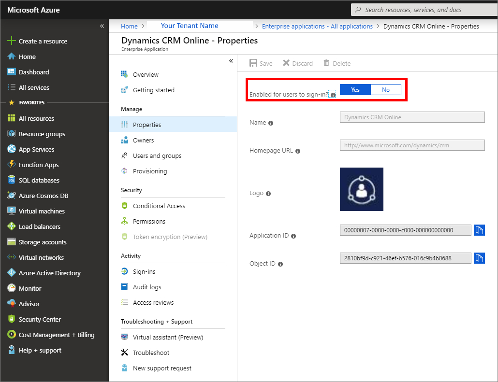
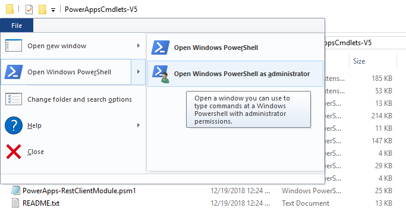
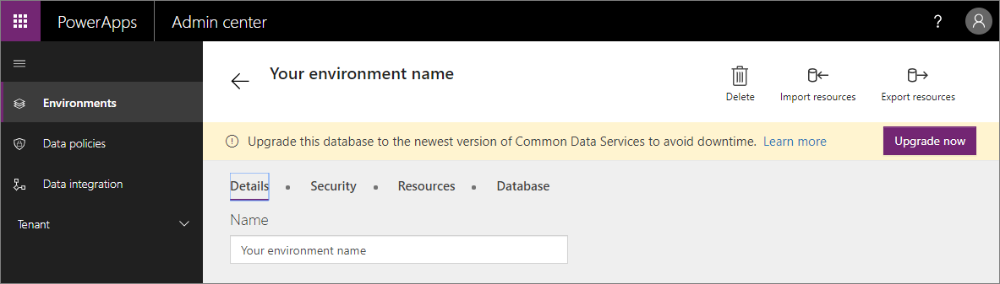
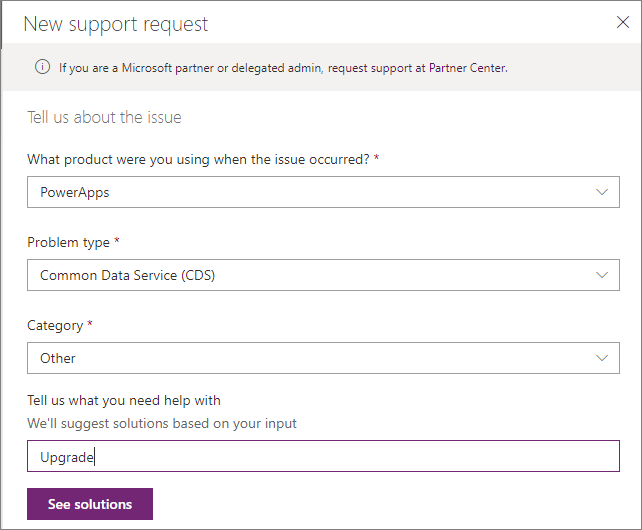
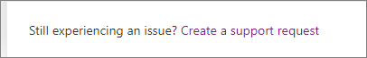
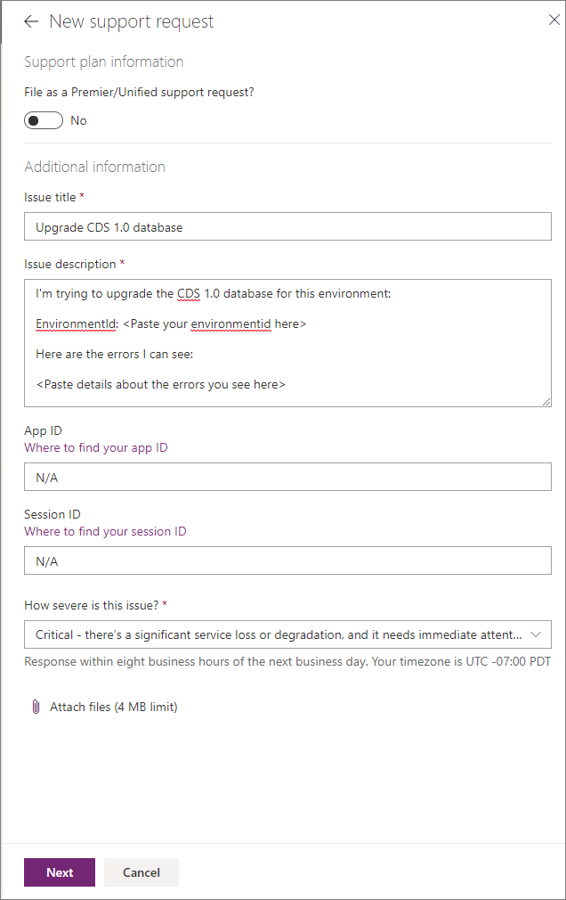

# Errors and resolutions

This section provides information about possible errors you might see during upgrade steps and how to resolve them.

|Example Error  |Description and resolution  |
|--|--|
|Errors to migrate From CDM `ExampleEntityName` to CDS2 `cdm_exampleentityname`, exported record count 17 but imported record count 0, error count 17|The overall data upgrade has completed but we encountered an error while upgrading this entity due to which either one or more records failed to upgrade. This error can occur in Step 1 and Step 3.<br/><br/>**If this error occurs during Step 1**: Be advised that this may impact your testing of apps and flows but it does not represent the final stage of the migration. You may not get this error or exactly the same missing data in Step 3.<br/><br/>**Tip**: If you get this error in Step 1, you may want to review the consistency of the data in your previous version of CDS database.<br/><br/>**If this error occurs during Step 3**: These records will not be available to you in CDS for Apps.  Please create a support ticket if you need the missing data extracted from previous version of CDS.|
|`CdsUpgradeInternalFailure` . The CDS upgrade process has encountered an error. The tracking id for this request was \<value> |We encountered an error due to which Upgrade has failed. You may retry the step.| 
|Can't find XRM ID for user with oid \<value> when assigning to role \<value> (source role \<value>) in environment \<value>|The user with AAD Object Id {0} wasn’t synced to the upgraded CDS instance yet, so the role assignment to role {1} can’t be migrated for that user. Unless the user is deleted or disabled in the AAD tenant, you can assign the necessary role manually once the user is synced (which can take up to a couple of days).<br/><br/>To find the user with AAD Object Id {0}, you can go to the following URL:<br/>`<`[Base CDS Url](#base-cds-url)`>/api/data/v9.0/systemusers()?$select=fullname&$filter=azureactivedirectoryobjectid%20eq%20{0}`<br/>and look at the value of the fullname property.<br/><br/>To find which role has the ID {1}, you can go to the following URL:<br/>`<`[Base CDS Url](#base-cds-url)`>/api/data/v9.0/roles({1})?$select=name`<br/>and look at the value of the name property.<br/><br/>You can then use the security tab in the Admin portal to assign the user to the role.|

## Deleting test databases

Any test databases created during step 1 will automatically be deleted 2 days after the upgrade succeeds. You don't need to delete them.

If one or more upgrade attempts fail, the test databases will remain until the upgrade finally succeeds.

## Base CDS Url

Some troubleshooting step includes instructions to query the CDS for apps Web API, a RESTful Odata endpoint.

You can get data in JSON format by executing `HTTP GET` requests using the address bar of your browser, or by using other tools such as [Postman](https://www.getpostman.com/).

To do this, you will need to know the base url for your environment. This base URL will typically look something like this `https://org97209.crm.dynamics.com` where `org97209` is the name of the CDS for Apps environment. The value `crm` is for North America. Other regions will have different values. More information: [Web API URL](/powerapps/developer/common-data-service/webapi/compose-http-requests-handle-errors#web-api-url-and-versions)

> [!TIP]
> If you type the URL in your browser, the JSON data can be difficult to read because it isn't formatted. There are many online JSON formatting tools you can use. Simply copy the results from your browser to a site like [JSON Formatter](https://jsonformatter.curiousconcept.com/) and it will add formatting to make the JSON easier to read.

More information: [Use Postman with Web API](/dynamics365/customer-engagement/developer/webapi/use-postman-web-api)

## No environments visible

If you go to the [PowerApps admin center](https://admin.powerapps.com/) as described in [Start the database upgrade process](start-upgrade-process.md#start-the-database-upgrade-process) and you cannot see any environments, it may be that you don't have the required PowerApps Plan 2 license.

> [!IMPORTANT]
> You are not required to purchase a PowerApps Plan 2 license. A trial license will be sufficient for you to complete the upgrade process.

Go to [https://powerapps.microsoft.com/pricing/](https://powerapps.microsoft.com/pricing/) and request a PowerApps Plan 2 license. A free trial should be enough to provide the privileges you will need to complete the upgrade steps. 

## Enable Application

The upgrade cannot proceed when Azure Active Directory (AAD) tenant is configured to disable the Dynamics CRM Online application. Common Data Service for Apps is the same application as Dynamics CRM Online. Both applications have the same Application ID: `00000007-0000-0000-c000-000000000000`.

You can enable the Dynamics CRM Online application using the Azure Portal or using PowerShell

### Using Azure Portal

1. Navigate to https://portal.azure.com and log-in using an account with administrator privileges.
1. Select **Azure Active Directory** and navigate to **Enterprise applications - All applications**.
1. Search for `Dynamics CRM Online` and open the application.
1. Select **Properties**.
1. If the **Enabled for users to sign-in?** option is set to **No**, change it to **Yes**.

   

### Using PowerShell

1. Open a PowerShell command window (as administrator)

    1. Press the **Windows** key or click **Start**.
    1. Type `Windows PowerShell`
    
        

    1. Select the **Run as Administrator** option.
    1. Click **Yes** in the **User Account Control** dialog.

        A PowerShell window will open.

1. Install the administration PowerShell module
    1. Type this command: `Install-Module AzureAD`
    1. If you get the following `Untrusted respository` notification, enter `y` to accept.

      ```powershell
      Untrusted repository
      You are installing the modules from an untrusted repository. If you trust this repository, change its
      InstallationPolicy value by running the Set-PSRepository cmdlet. Are you sure you want to install the modules from
      'PSGallery'?
      [Y] Yes  [A] Yes to All  [N] No  [L] No to All  [S] Suspend  [?] Help (default is "N"):
      ```

 1. Type this command: `Connect-AzureAD` and you will be prompted for credentials to connect.
 1. Copy and paste this command: `$sp = Get-AzureADServicePrincipal -Filter "AppId eq '00000007-0000-0000-c000-000000000000'"`
 1. Copy and paste this command: `Set-AzureADServicePrincipal -ObjectId $sp.ObjectId -AccountEnabled $True`
 1. Now you can re-try the upgrade. If this doesn't work, you can also completely re-set the principal to make sure it is in the proper state. Copy and paste this command:

    ```powershell
    $appId = "00000007-0000-0000-c000-000000000000"
    Get-AzureADServicePrincipal -Filter "AppId eq '00000007-0000-0000-c000-000000000000'" | Remove-AzureADServicePrincipal
    New-AzureADServicePrincipal -AppId $appId
    ```

## Self-service signup plan is required

Upgrade can be blocked for some environments when individual user sign-up is blocked on the Azure Active Directory (AAD) for the tenant. This seems to be frequently disabled for educational institutions because they don't want to allow students to sign up for trials.

In order for some CDS 1.0 databases to be upgraded, the setting that controls this will need to be enabled while the upgrade is occurring. It can be set back to the original setting when the upgrade is complete.

To change this setting you need to use PowerShell.

1. Open a PowerShell command window (as administrator)

    1. Press the **Windows** key or click **Start**.
    1. Type `Windows PowerShell`
    
        

    1. Select the **Run as Administrator** option.
    1. Click **Yes** in the **User Account Control** dialog.

        A PowerShell window will open.

1. Install the administration PowerShell module
    1. Type this command: `Install-Module MSOnline`
    1. If you get the following `Untrusted respository` notification, enter `y` to accept.

      ```
      Untrusted repository
      You are installing the modules from an untrusted repository. If you trust this repository, change its
      InstallationPolicy value by running the Set-PSRepository cmdlet. Are you sure you want to install the modules from
      'PSGallery'?
      [Y] Yes  [A] Yes to All  [N] No  [L] No to All  [S] Suspend  [?] Help (default is "N"):
      ```

 1. Type this command: `Connect-MsolService` and you will be prompted for credentials to connect.
 1. Copy and paste the following command: `Get-MsolCompanyInformation | fl AllowAdHocSubscriptions`.
 1. This will tell you whether the current setting is `true` or `false`. If it is `false`, you can change the setting to `true` using the following command: `Set-MsolCompanySettings -AllowAdHocSubscriptions $true`.

    > [!NOTE]
    > The `AllowAdHocSubscriptions` flag is used to control several user capabilities in your organization, including the ability for users to sign up for the Azure Rights Management Service. Changing this flag affects all of these capabilities.

1. After the upgrade is completed, you should change this setting back using the same steps and the following command: `Set-MsolCompanySettings -AllowAdHocSubscriptions $false`.

## Open a support ticket

Use the following procedure to create a support ticket related to the upgrade to CDS for Apps

You will need to have the `environmentid` value for the environment where the database exists (or existed). This is included in the URL when you view the environment in your browser.

The `environmentid` is found in the URL here: `https://admin.powerapps.com/environments/<environmentid>/details` when you are viewing the environment:



> [!NOTE]
> If you can download any error log files, please download them and be prepared to upload them with your support ticket.

To open a support ticket:

1. Go to [https://admin.powerplatform.microsoft.com](https://admin.powerplatform.microsoft.com) and select **Help + support**.
    > [!NOTE]
    > Your environments with CDS 1.0 databases will not appear in the environments list here.
1. Click  **New support request**.

1. Use the following values to complete the form


    |Field  |Value  |
    |---------|---------|
    |Product |PowerApps|
    |Problem type|Common Data Service (CDS)|
    |Category|Other|
    |Topic|Upgrade CDS 1.0 database|

    

1. Click **See solutions**.
    > [!NOTE]
    > Don't expect to find links to content that will help you with upgrade here.
1. Below the links to content, at the bottom of the form, look for this:

    

1. Click **Create a support request**. This will display the following form:

    

    - Make sure the Issue title is *Upgrade CDS 1.0 database*.
    - Enter the details about your upgrade in the **Issue description**.
    - It is not important to include **App ID** or **Session ID** values for issues related to upgrades.
    - Set the severity as **Critical**
    - Attach any error logs you have downloaded.

    > [!IMPORTANT]
    > Make sure you include the `environmentid` value within the issue description

1. Click **Next** and enter information about how to contact you.
1. Click **Submit** to create the support ticket.