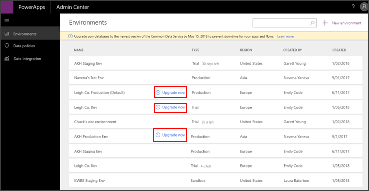
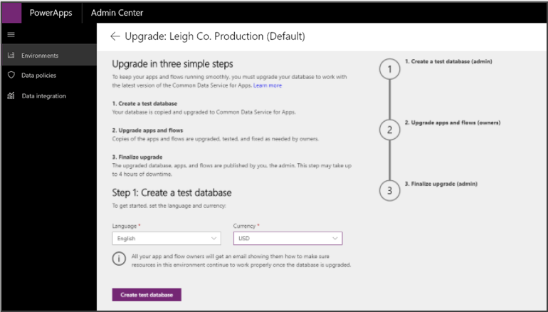
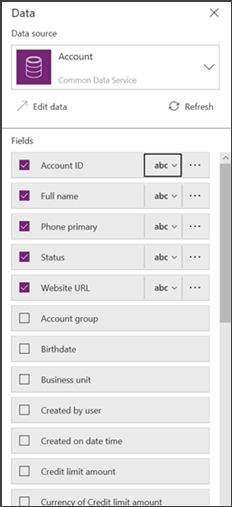
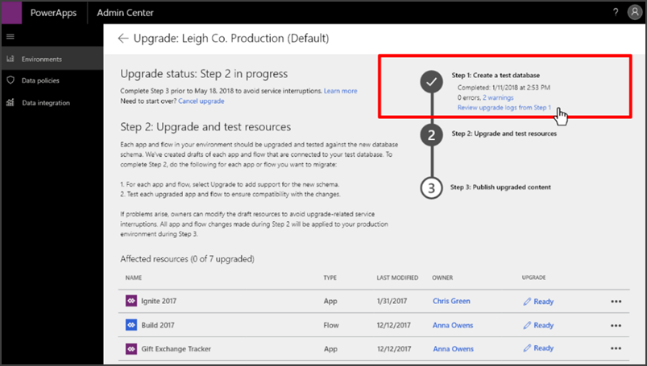

# Step 1: Start upgrade process for your existing database to CDS for Apps

To use the new features in CDS for Apps, the Environment Administrator must
update their existing database that was created with the previous version of
CDS. 

## FAQs: Before upgrading your database 

These are some frequently asked questions (FAQs) before upgrading your database.

- [Which databases do I need to upgrade?](#which-databases-do-i-need-to-upgrade)
- [How long will this take?](#how-long-will-this-take)
- [Can I cancel the upgrade process once it’s initiated?](#can-i-cancel-the-upgrade-process-once-its-initiated)
- [Will there be any downtime of the database or apps in production during the upgrade?](#will-there-be-any-downtime-of-the-database-or-apps-in-production-during-the-upgrade-process)

### Which databases do I need to upgrade? 

- Databases on the previous version of CDS. 

- Databases containing vital data for your organization. 

You do not need to upgrade test environments and databases created while trying
out the product. Any databases that you choose not to upgrade will eventually be
deleted.

We recommend first upgrading a test or trial database (on the previous version
of CDS) to familiarize yourself with the process before upgrading your
production database.

### How long will this take?

The whole upgrade is a 3 step process. Step 2 depends on the apps and flows that must be updated and tested. Time will vary and is up to you.

Steps 1 & 3 are automated and will require *at least* 4 hours.

The first step creates a test database and should provide some indication of how long the final upgrade in the 3rd step will require. There is no visual indicator of the progress during either step. You should note the duration of step 1 as an indicator of the amount of downtime in step 3.

### Can I cancel the upgrade process once it’s initiated? 

No, you cannot cancel the upgrade process for a database once you initiate it.
It’s important that you read through this entire document and understand the
process before initiating the upgrade. 

> [!IMPORTANT]
> Once you start the upgrade process you must not delete the database. This will leave your environment in an inconsistent state. If you choose to abandon the upgrade process after you have started, contact support for assistance.

### Will there be any downtime of the database or apps in production during the upgrade? 

The upgrade process consists of three steps as described later. Only the third
step involves downtime for the database as well as the apps and flows connecting
to it. We encourage admins to communicate to users when step 3 is planned to be executed.

> [!TIP]
> You can get an approximate duration of the downtime in step 3 by capturing the amount of time for step 1.
> 
> Note the time when you start step 1. When step 1 completes it will provide the time it completed. Compare the difference. This represents a minimum amount of downtime you can expect in step 3. Step 3 may be slightly longer under some circumstances.

## Start the database upgrade process

To start upgrading your database to the latest CDS for Apps: 

1.  If you’re an environment Administrator, go to the [PowerApps admin
    center](https://admin.powerapps.com/), and in the left navigation pane,
    select **Environments**.

    > [!IMPORTANT]
    > See [No environments visible](errors-resolutions.md#no-environments-visible) if you don't see a list of environments.

    Environments that have a database on the previous version of CDS have **Upgrade now** listed next to them. 

    

2.  On the **Upgrade** page, select the language and currency of the database,
    and then select **Create test database**.  

    

    > [!NOTE]
    > It may take several hours to create the test database. There is no progress bar. The spinning icon for the first step indicates is is running.
    >
    > You might want to start this in the afternoon and check it the next day to see how it went.
    > 
    > When you start step 1, note the time. When step 1 is completed you will be able to see the time it completed. This duration will give you an estimate for how long step 3 will require.

    A test database with the latest version of CDS for Apps is created. You can view the schema of the new database during the creation process, as shown in the following example. 

    

After the test database is created, the environment looks like the following:  

## Next step

Verify that the apps and flows are working as expected with the test database on
the latest version of CDS for Apps. 

You can view all changes that occurred during creation of the test database, including any errors that occurred while copying data from the original database to the test database.  

If you encounter any errors, see [Errors and resolutions](errors-resolutions.md) for information to help troubleshooting.

> [!div class="nextstepaction"]
> [Step 2: Upgrade and verify your apps and flows](upgrade-verify-apps-flows.md)
