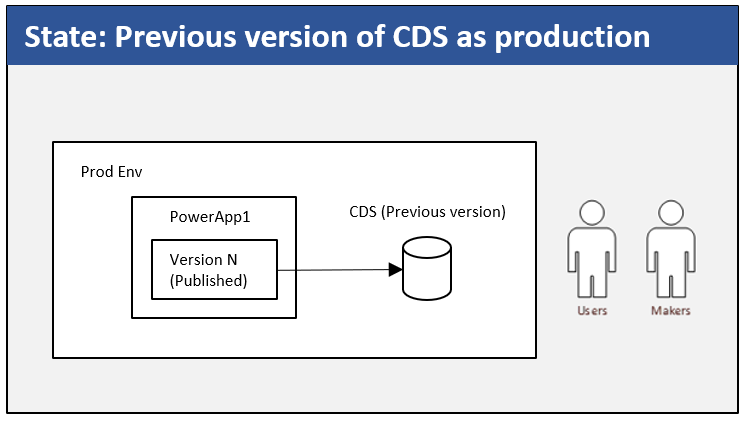
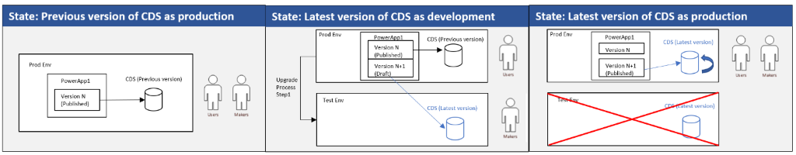

# Overview of the upgrade process

The upgrade from previous version of CDS to CDS for Apps is a three-step process.

The following graphic depicts an environment containing the previous version of
the CDS database with apps and flows connecting to it prior to upgrading:  

-   The environment might contain apps and flows created by makers in your
    organization. 

-   Some of the apps that connect to the database are published and shared with
    various users in the organization. A version of each app is published. 

## Step 1: Start the database upgrade process

An environment Administrator initiates this step from the [PowerApps Admin
center](https://admin.powerapps.com/). 

-   A new test database (using the new CDS for Apps) is created and contains the
    data copied over from the current database. The schema of the latest version
    of CDS for Apps is different than the previous version, so it’s critical
    that you confirm that the data transferred correctly.  

-   The existing database (on the previous version of CDS) remains as is; there
    are no changes made to it. 

-   Apps and flows connecting to the existing database continue to work without
    any interruption. 

-   The process creates a copy of apps and flows, which connect to the test
    database running on CDS for Apps.  

At the end of the Step 1, the environment looks like this:  

More information: [Step 1: Start upgrade process for your existing database to CDS for Apps](start-upgrade-process.md)

## Step 2: Upgrade and verify the apps and flows to work with test database

In step 1, a copy of the apps and flows connecting to the current
database is created and connected to the test database. In this step, app and
flow makers verify that the apps and flows are working as expected with CDS for
Apps.  

-   App and flow makers are notified by email to verify their apps and flows. 

-   If there are any issues with the copy of apps and flows, the makers are
    provided the summary of errors that they need to fix. 

-   Administrators and makers should contact PowerApps and Microsoft Flow
    Support if they’re unable to resolve an issue. 

-   After verifying their apps and flows, the makers inform the administrator
    that the apps and flows are working as expected.  

-   After receiving confirmation that all apps and flows are working as
    expected, the administrator can then proceed to the final upgrade step (Step
    3). 

More information: [Step 2: Upgrade and verify your apps and flows](upgrade-verify-apps-flows.md)

## Step 3: Complete the database upgrade

During this step, the database is upgraded to the latest version. This is the
final step; the process is irreversible at this point.  

-   Expect downtime of the database during this step.  

-   After this step is completed successfully, you can use the functionality and
    features available with the latest release of CDS for Apps.  

-   Apps and flows will now work with the latest version of the database.

-   The test database is deleted. 

More information: [Step 3: Complete the upgrade process for your existing database to CDS for Apps](complete-upgrade-process.md)

## Next step

[What to expect on upgrading to CDS for Apps](what-to-expect.md)