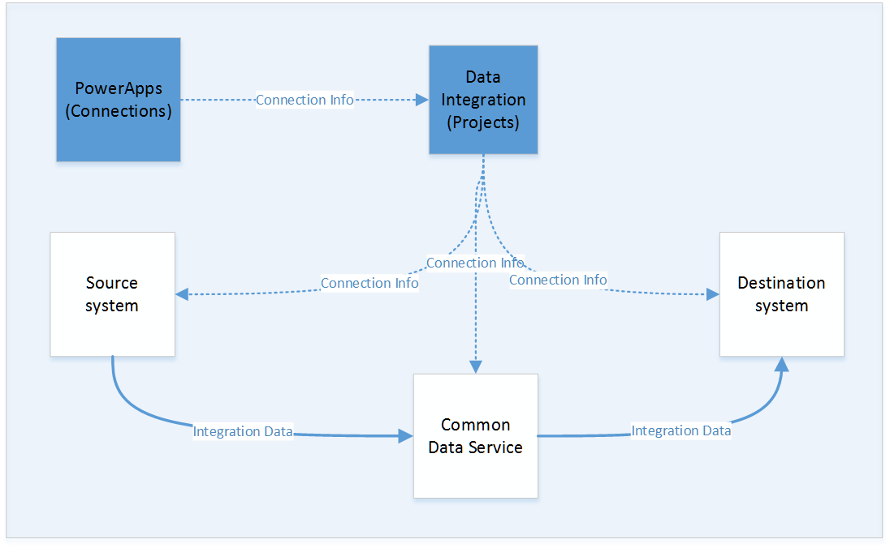
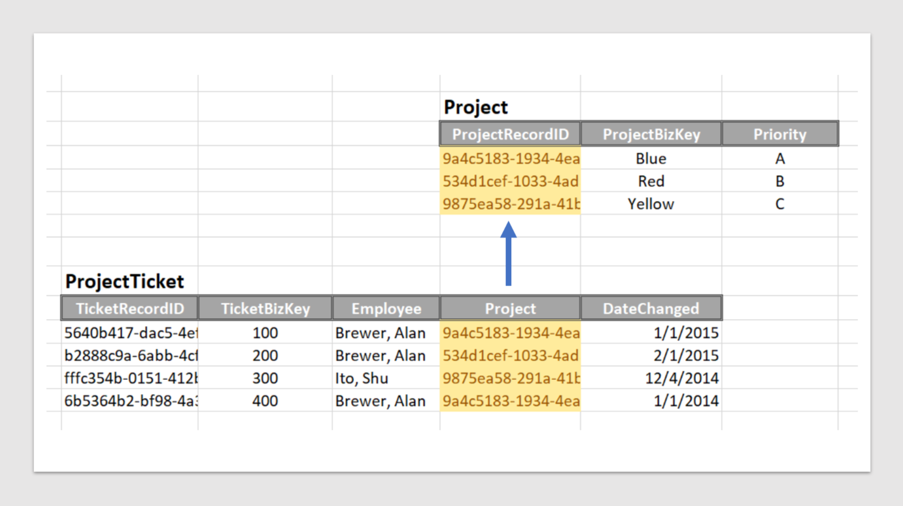
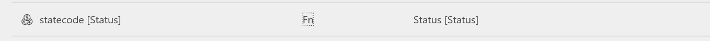
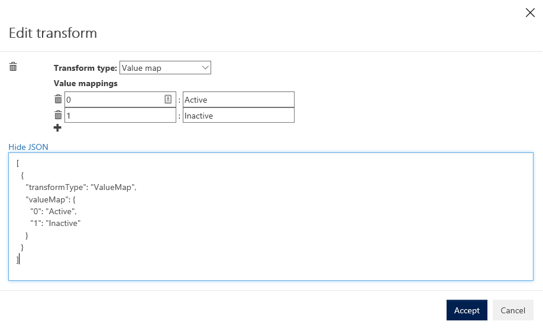

# Dynamics 365 Data Integration

[!INCLUDE ]

The Dynamics 365 Data Integration feature enables the flow of data between Dynamics 365 for Sales, Dynamics 365 for Finance and Operations Enterprise Edition, and other products through Common Data Service. For example, customer information in Microsoft Dynamics 365 for Sales can flow to Microsoft Dynamics 365 for Finance and Operations Enterprise Edition. You don’t have to manually move the data or use a third-party data integration tool. This document describes the capabilities, usage guidelines, and current limitations of the Data Integration feature, particulary with respect to the prospect-to-cash scenario.

> [!NOTE]
> The Data Integration feature is available to customers who have Dynamics 365 for Finance and Operations.

# Concepts

Before you use the Data Integration feature, you should be aware of some important concepts. The following illustration shows the main services and relationships that are involved in Data Integration.

## Connections

Before you can work with a Data Integration project, you must provision a connection for each system that you intend to work with in the Microsoft PowerApps portal. You then reference those connections in a Data Integration project. Connections are stored in a Common Data Service environment. However, they operate above environments. The Data Integration projects use a connection that is stored in an environment to move data into and out of other systems, and into and out of an environment. Data doesn’t have to move into or out of the same environment as the connection.

When you provision a connection on the PowerApps site, unlike other connection services, you aren’t asked to select a specific instance of your target system. The connections on the PowerApps site just pair your Active Directory credentials with a target system. Later, when you specify a connection in a project, you will select from your set of accessible data set instances.

Any connection you create in an environment where you have environment administrator privileges will be available to you in the data integrator. One common mistake is to provision connections in the "<MyCompany> (default)" environment - where you may have access, but not environment administrative rights. 

## Data Integration

The Data Integration feature is currently available as a tab in the [PowerApps Admin Center](http://admin.powerapps.com). It is also available in the [Business platform admin center](https://admin.businessplatform.microsoft.com). 

## Projects

Projects enable the flow of data between systems. A project is a list of one or more tasks. Each task identifies a mapping between a source entity and a Common Data Service entity, and then, optionally, a mapping between the Common Data Service entity and a destination entity. Mappings indicate which fields map to which other fields. They also specify default values and value maps. Tasks are run in the order in which they appear in the project task list.

## Connection sets

**Connection sets** are a collection of two more connections, organization mapping information, and integration keys that can be reused among projects. You may start using a connection set for development and then switch to a different one for production. One key piece of information that is stored with a connection set is organization unit mappings. These are mappings between the Operations’ legal entity (or Company) and the Common Data Service organizations and Sales’ organization or business units. You may store multiple organization mappings in a connection set. Later on, when you use a connection set you will choose which specific organization mapping you want for a given project.

### Integration keys

**Integration keys** are the keys the Data Integrator uses to join entities that should also be part of the integration task. For example, in the diagram shown below, each project ticket is associated with a project. (Projects are named “Blue”, “Red”, or “Yellow”.) 

In this example, the data that should flow to the destination is not the GUID record id (ProjectRecordID) in the Project table, but rather the values of “Blue”, “Red”, or “Yellow” which are in the ProjectBizKey column.  Sometimes the Data Integrator can either provide or automatically discover the business key for a related table. If not, you will need to identify the business key in the related table as part of the connection set your project is using in the **Integration keys** tab. When you first create a connection set this tab is empty. Entities will appear in a list in this tab once you identify them for use in a project.

Fields from related tables will show in the Data Integration task as (transactionEntityField).(fieldFromRelatedTable). Using the example above, if you want to map ProjectBizKey field when you are mapping ProjectTicket fields, then you will choose the Project.ProjectBizkey field from the drop down. You can easily find all of the integration keys associated with foreign keys in a table by typing “.” (a period) in the search field of the drop down.

### Organizations 

**Organizations** are organizational units that scope the data in your integration task. For example, in Dynamics 365 for Finance and Operations Enterprise Edition you supply a legal entity or company.  In Dynamics 365 for Sales you specify either the root business unit (the organization which corresponds to the instance) or business units below the root level. For the Common Data Service you must specify an organization. Organizations in the Common Data service are stored in the Organization entity. You can see the values there by using the PowerApps Maker portal to find the Organization entity and inspecting its data.  If an organization record does not exist, you must create one to use the Data integrator.  (See below for instructions on how to do this.)

## Transformations 

We currently provide several types of transformations.  You should inspect the transformations that we provide as part of a template and make sure that they are appropriate for your integration project. Visit all sides of mappings: source to the Common Data Service, and the Common Data Service to destination. On a mapping page, note that on each row that maps a field, in the middle **Map Type** column, there is either an equal sign (**=**) or **Fn**. **Fn** indicates that a function, or transformation, has been applied. Click the equal or Fn symbol to create or edit a transformation. 

### Default

Default values are values that are filled into a destination field when no source field value is available. Use default values for fields that are required on the destination entity when you have no corresponding source field. 

### Truncate
 
Truncate will terminate a string to the length of the destination target. Numeric values (such as from Decimal to Integer) are automatically truncated.

### Value map

Value maps define how values that are present in one entity should be mapped to values in the other entity.  Eventually, you will be able to specify more complex transformations and filters on the data. 

Currently, the default values and transforms are in JavaScript Object Notation (JSON) format. However, the format will likely change over time.

The following example shows a default value.  If you want to supply both a map and a default value, leave a blank on the right column and supply a value on the right side. 

### Country region code

This transformation is used to convert address values into a format that can be used on the destination fields.

## Synchronization

A task within a Data Integration project synchronizes data in one direction.  This means that a task can pull Account/Customer data from, for instance, Dynamics 365 for Sales and push to Dynamics 365 for Finance and Operations Enterprise Edition and then a second project can pull Product or Invoice or other data from Dynamics 365 for Finance and Operations Enterprise Edition and push it to Dynamics 365 for Sales.  So, while there is single source, we can move data from different systems to each other.  This is how the Prospect to Cash scenario is enabled. 

## Business keys

The predefined templates assume synchronization based on a business key. (Sometimes called a natural key.) A business key is a key that the business wants to enforce uniformly across multiple systems (for example, both Dynamics 365 for Sales and Dynamics 365 for Finance and Operations Enterprise Edition). For example, a car rental company uses a car’s vehicle identification number (VIN) as a unique way to identify cars across all its internal systems. As another example, many Microsoft Dynamics customers might want to use the same customer ID for a customer in both Dynamics 365 for Sales and Dynamics 365 for Finance and Operations Enterprise Edition. We designed the Data Integration feature so that customers can use a business key across multiple systems.

By default, Dynamics 365 for Sales doesn’t require a business key. To enable business keys, we will provide a Dynamics 365 for Sales solution. After you import the solution into your Dynamics 365 for Sales system, the Data Integration projects will work. In general, we will augment Dynamics 365 for Sales either by using an existing field or by creating a new column for the business key. In the case of the Dynamics 365 for Sales entity that we want to synchronize with the Dynamics 365 for Finance and Operations Enterprise Edition entity, we use the **Account.Account Number** field in Dynamics 365 for Sales, and make it both required and unique. You're responsible for making sure that there is a valid customer identification value in the **Account.Account Number** field in Dynamics 365 for Sales. If there is no value in this field, we won’t synchronize the records from Dynamics 365 for Sales to Dynamics 365 for Finance and Operations Enterprise Edition.

Additionally, data in Dynamics 365 for Finance and Operations Enterprise Edition is only guaranteed to be unique with a combination of legal entity and the key of an entity. If you wish to integrate data from Dynamics 365 for Finance and Operations Enterprise Edition to Dynamics 365 for Sales, then the data you synchronize should be unique independent of Legal entity as well in same way we require data to be unique in Dynamics 365 for Sales.

Eventually, we will enable Data Integration that doesn’t require business keys. Instead, mapping tables will be used.

## Consent

When you create a new project, we ask you for explicit consent, because we are moving data between systems. There are two areas of concern:

+ Data from a high-compliance system (such as Dynamics 365 for Sales) might be brought into a less-compliant system (such as the Common Data Service or Dynamics 365 for Finance and Operations Enterprise Edition).
+ Data might be moved between regional data centers, such as North America and Europe.

Be sure to read the **Privacy Notice and Consent** page carefully, and make sure that the correct people give consent. We won’t create a project unless consent is given. We record the consent in our log files.

## Project Creation

Once you provide consent, the system leaves you in a state where you can simply run the project by choosing Run.  However, you should first inspect the mapping in the task to make sure that the values will be mapped as you expect. Make any adjustments that are required to help guarantee that the data will flow correctly. Pay special attention to default values and value maps. In this topic, we outline specific default values and value maps for several of the key entities that enable the prospect-to-cash scenario.

## Running a project

Once you have inspected the mappings and made other adjustments you can just run the project,   However, you have several options on how to run a project. You can: 

1. Run a project on demand by choosing the "Run" button.
2. Re-run a project with all of the data by choosing the "..." menu at the right of a project on the project list.  Then choose "Run project with all data".
3. Schedule a project to run on a recurring basis. Click on a project to see project details.  Then, choose the "Scheduling" tab.  On this page you can schedule project runs up to the granularity of a minute.  You can provide a start date and time.  If you do not provide an end date or time, the project will continue to run indefinitely.

## Monitoring a project run

The **Execution History** tab provides a dashboard where you can currently view a list of current and previous project runs. If you click a project run, you can view detailed progress information as the Data Integration project moves data along the paths from source to destination.

# Preparing the Common Data Service

In a production Common Data Service database, organization records should already exist. Then, in your integration project, you just need to specify which organization you want to use. However, if you are just testing the Data integrator or if you want to prepare a Common Data Service for more general use, you may need to delete all of the sample data. To do this:

1. Go to the [PowerApps site](https://web.powerapps.com).
2. On the left, choose **Common Data Service**. This will expand the list of items below.
3. Then, choose **Entities**. This will open the Entities list page.
4. In the upper right, there is a “**...**” menu.  Select it and you should see a drop-down which includes “Clear all data”.
5. Choose **Clear all data**. This will clear all data in your database.

If you are starting with an empty database, you will need to create an organization record for every organization you want to integrate with data. To do this:

1. Go to the [PowerApps site](https://web.powerapps.com).
2. On the left, choose **Common Data Service**. This will expand the list of items below.
3. In the entity list, find the **Organization** entity. (The fast way is to use the search control.)
4. In the details page for the Organization entity choose to “**Open in Excel**.”
5. When the Excel spreadsheet opens, choose to “**Enable Editing**.”
6. Add an Organization row in the spreadsheet.  Use the “**Microsoft PowerApps Office Data Connector Add-in** to help you put in the required fields.  It shows a star “\*” by all required fields.  And, you can simply choose legal values right in the add-in. 
7. Choose to **Publish** back into CDS. (The command is located in the bottom of the Data Connector Add-in.)
8. Double check that the record was written by selecting the Data tab in the PowerApps site.

# Running a Data Integration project

## Prerequisites

## System requirements 

You must have either:

+ Microsoft Dynamics 365 for Finance and Operations, Enterprise edition July 2017 update with Platform update 8 (App 7.2.11792.56024 w/ Platform 7.0.4565.16212). Support for App 7.1 will be added with a hotfix.
Or,
+ Dynamics 365 Sales, Enterprise Edition. The integration solution is compatible with Microsoft Dynamics 365 Customer Engagement Version 1612 (8.2.1.207) (DB 8.2.1.207) online.

And, you must also have:
+ An environment in the Common Data Service. The environment must have a database for integration and you must be an environment administrator for that database.

## Integration solutions
+ [Prospect to Cash integration solution for CRM](https://mbs.microsoft.com/customersource/Global/365Enterprise/downloads/product-releases/MD365FNOPENTProspectToCash). 

For more information on configuring a Prospect to cash scenario, see [Prospect to cash](https://docs.microsoft.com/en-us/dynamics365/unified-operations/supply-chain/sales-marketing/prospect-to-cash).

> [!NOTE]
> If you worked with the data integration feature prior to general availabity, delete all old connections and projects.

## Custom entities
If you have a custom entity in Dynamics 365 for Sales, you do not have to do anything.  

If you have a custom entity in Dynamics 365 for Finance and Operations Enterprise Edition, you must turn on Change Tracking. To do this:
1. Choose **System Administration** > **Data Management IT** > **Data Entities**.
2. Select your custom entity.
3. Enable change tracking from the menu.

Also, then refresh the entity list. Even if you have previously enabled change tracking. Go to Data Management > Framework parameters > Entity settings and choose to Refresh the entity list.

## Dynamics 365 accounts

You will need an account that has read and write privileges for the systems you want to integrate data with.

### Dynamics 365 for Sales account

You should add a role to the organization which the integration user will use to access (read/write) entity records.  It needs the following privileges for entities: 

To read data from Sales:
+ **Read** with deep access for any entity that is included in a Data Integration project as a source.
+ **Read** with deep access for any entity that is a partner in a relationship with an entity that is included in a Data Integration project as a source.

To write data to Sales:
+ **Create/Read/Write/Delete/Append/Append To/Assign/Share/Reparent** with deep access for any entity that is included in a Data Integration project as a destination.  Share is not strictly required at this time but may be required in the future. Reparent is only needed for some entities, but it is probably easier simply to allow it on all synced-in entities.
+ **Read/Append** To with deep access for any entity that is a partner in a relationship with an entity that is included in a Data Integration project as a source.

The default team of the business unit that records are synced into in the connection set (that is, the default team of the business unit in the connection set) must have a read privilege to the entities which are going to be owned by it (that is, all entities which are to be synced in the project.) Consequently, the team must be assigned a role which has at least read access to those entities which are synced into it.  Since team members inherit roles assigned to teams, it is desirable to use a separate low-privilege role for this purpose (that is, of allowing read privilege for the team so that the team can own the synced records).

### Dynamics 365 for Finance and Operations Enterprise Edition

Ensure that 

+ You have an account in Operations with a role that enables read access to the entities you are pulling data from and write access for the entities you will push into Operations.   
+ Your Dynamics 365 for Finance and Operations Enterrprise Edition is enabled for batch processing.  

## Create connections

You must create a PowerApps connection for each system that you will work with.

1. Go to the [PowerApps site](https://web.powerapps.com).
2. Click **Connections**. The **Connections** page shows all the connections that you’ve provisioned. If you don’t yet have the connections that are required for your Data Integration project, you must create a new connection.
3. Click **New connection**.
4. In the list of connection types that PowerApps can work with, select a connection type. For example, if you’re working with Dynamics 365 for Sales, select **Dynamics 365**. Then, in the dialog box, enter your identity and access credentials.
5. On the PowerApps site, on the **Entities** tab, you should see a list of standard entities. If you don’t see a list of standard entities, you must create a Common Data Service environment and database.

## Navigate to the Data Integration feature

To work with the Data Integration feature, follow these steps.

1. Open the [PowerApps Admin Center](https://admin.powerapps.com). The **Data Integration** tab should appear in the left navigation pane. 
2. Click the **Data Integration** tab. The **Data Integration projects (Technical Preview)** page should appear. If you’re just starting to use the feature, you should see a **New Project** link that you can use to create a new project.

## Create a connection set

Before you create a project, you must first create a connection set. To create a connection set:

1. From the main project page by choosing the **Connection Set** tab.
2. Select **New connection set** and provide a Connection Set name.  
  >[!NOTE]
  > Connection set names may only contain alphaNumeric characters at this point in time.  No special characters.  No whitespace characters.  This is a temporary limitation that will be removed in the future. 
3. Provide a **connection to a service** such as Dynamics 365 for Sales.
4. Select an Environment.
5. Provide an **Environment** for the Common Data Service (where you want the integration data to land.)

  > [!NOTE]
    > You are likely not done at this point.  It is legal to create a connection set that only has two connections.  This is for connections that are only pushing data into the Common Data Service. If you want data to move between Sales to Operations (or vice versa) then take the next step of adding a **third connection**. If not, you are done at this point

6. Add a third connection for a destination such as to Dynamics 365 for Finance and Operations Enterprise Edition.
7. Provide **Organization** mappings.  These are the organizational units (such as legal entity or company or business unit) that will shape or refine the data you integrate across the systems.

  > [!NOTE]
  > You may want to add additional organization mappings so that the same connection set may be used with different business unit combinations. However, you can do this later by simply adding them to the connection set, once created.

8. Choose to **Create** your connection set. 

## Create a new project

To create a new project, follow these steps.

1. Click the **New Project** link in the upper-right corner, or click the link that is provided on the page. The **New Data Integration** wizard starts.
2. Enter a name for the project.  
 > [!NOTE]
    > Project names may only contain alphaNumeric characters at this point in time.  No special characters.  No whitespace characters.  This is a temporary limitation that will be removed in the future. 

3. Select a predefined project template to create a base project that you can run directly. (Eventually, you will be able to customize the project before you run it. However, project customization isn’t yet supported.)
4. Choose Next.
5. Select a connection set. Here you choose your connection set for your project. This will show the connections you have previously provided.
6. Choose Next.
7. Choose the Organization mapping you want for this project.
8. Acknowledge the Privacy Notice and Consent form by choosing “Create.”  This will create your project.

## Customize a project with new tasks

1. In a project choose **Add task** in the upper right hand corner of the project screen. This will bring up the Add task dialog.
2. Provide the name of the task, the entities in Dynamics 365 for Sales, Operations, and the Common Data Service. This will create a new task in your project.

## Customize an existing mapping  

If a mapping between entities is incorrect or incomplete, you can change the mapping.

1. Select the attribute. A drop-down list becomes available, where you can select a different attribute.
2. Select the attribute to use.

## Create a new mapping 

If your project does not have all of the attributes you wish to map, you can add a new mapping. 

1. Choose **Add mapping**. On a mapping screen, choose **Add mapping**.  This will add a new line at the bottom of the map table.
2. Select the attributes you wish to map.
3. Select the attribute for each source that you want to add.

## Run a project

To run a project, click **Sync Now** in the upper-right corner. After a project has started synchronization, click the **Scheduling** tab to monitor the progress of the project.

# Common errors and debugging your project

Below is a checklist of items you can use to make sure things are working correctly.

## Connections

### Connections not showing in in the data integrator

Connections created in any environment will show up in the data integrator. However, you must be an admin on the environment where you create the connection. A common error is to create a connection on the <MyCompany> (default) environment when you do not have administration privileges on that environment. You must have administrative privileges on the environment you create connections in so that they are available in the Data Integrator.

Make sure you have appropriate authority on environments where you create connections so they will show up.

### Connection set not showing in create new project

If you create a connection set to a single service (Dynamics 365 for Sales or Dynamics 365 for Finance and Operations Enterprise Edition) and then the Common Data Service, and if you then choose a template that requires three connections, you will not see your connection set in the choose a connection set dropdown. And, if it's the only connection set you have created you won't see any connection sets at all. You will not be able to proceed past that step in the Create Project Wizard. You can, however, use a connection set with three connections with a template that requires only two - as long as the template's required sources are in the connection set.

Make sure the connections in your connection set matches the connections in the template you are going to use.

### No source entities on the left hand side of a mapping page when moving data from Dynamics 365 for Finance and Operations Enterprise Edition to CDS

In Dynamics 365 for Finance and Operations, Refresh the entity list. Go to Data Management > Framework parameters > Entity settings and choose to Refresh the entity list. 

