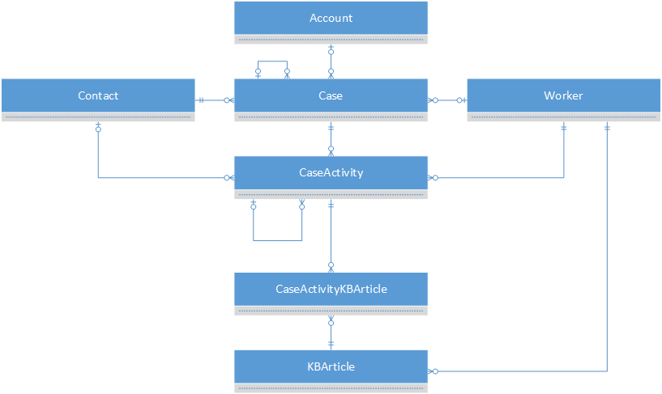

# Customer service entities

The customer service entities manage issues from your customers, including tracking, escalation, and documentation.

## Customer service ERD

## Customer service reference

[Customer service reference](entity-tables/customer-service.md "Customer Service Reference")
