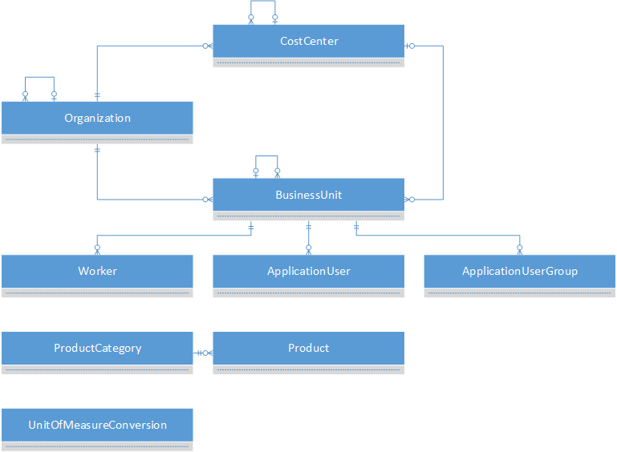

# Foundation entities

The foundation entities are used to drive other entities in the Common Data Model. They contain information that is relevant to nearly every other entity functional group.

## Foundation ERD

## Foundation reference

[Foundation reference](entity-tables/foundation.md "Foundation reference")
