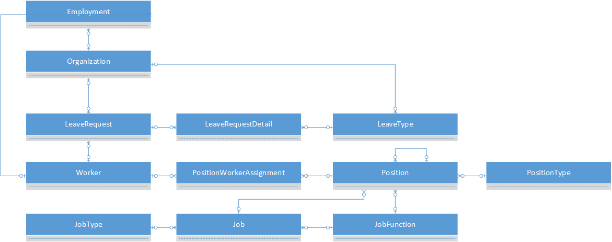

# Human resources entities

The human resources entities let you manage employment information, jobs, leaves, and positions.

## Human resources ERD

## Human resources reference

[Human resources reference](entity-tables/human-resources.md)
