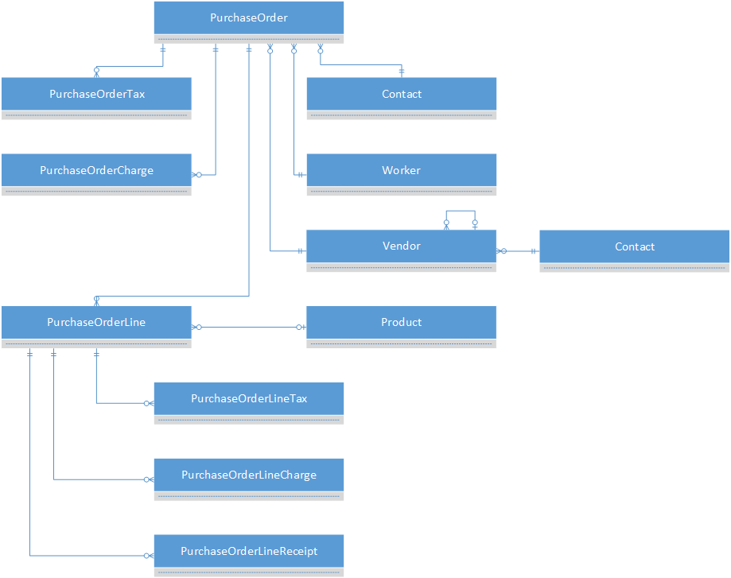
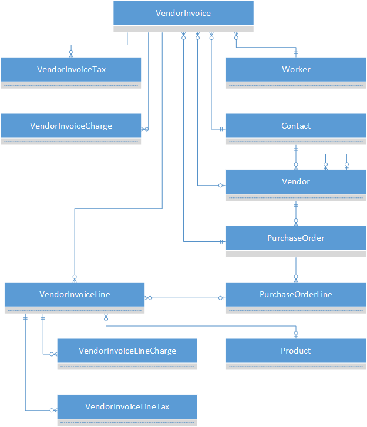

# Purchasing entities

[!INCLUDE ]

The purchasing entities let you create purchasing solutions and track vendor invoices.

## Purchase order ERD

## Vendor invoice ERD

## Reference

[Purchasing reference](entity-tables/purchasing.md "Purchasing reference")
