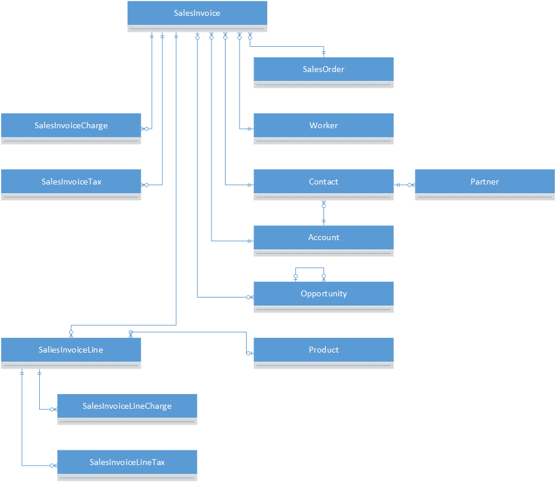
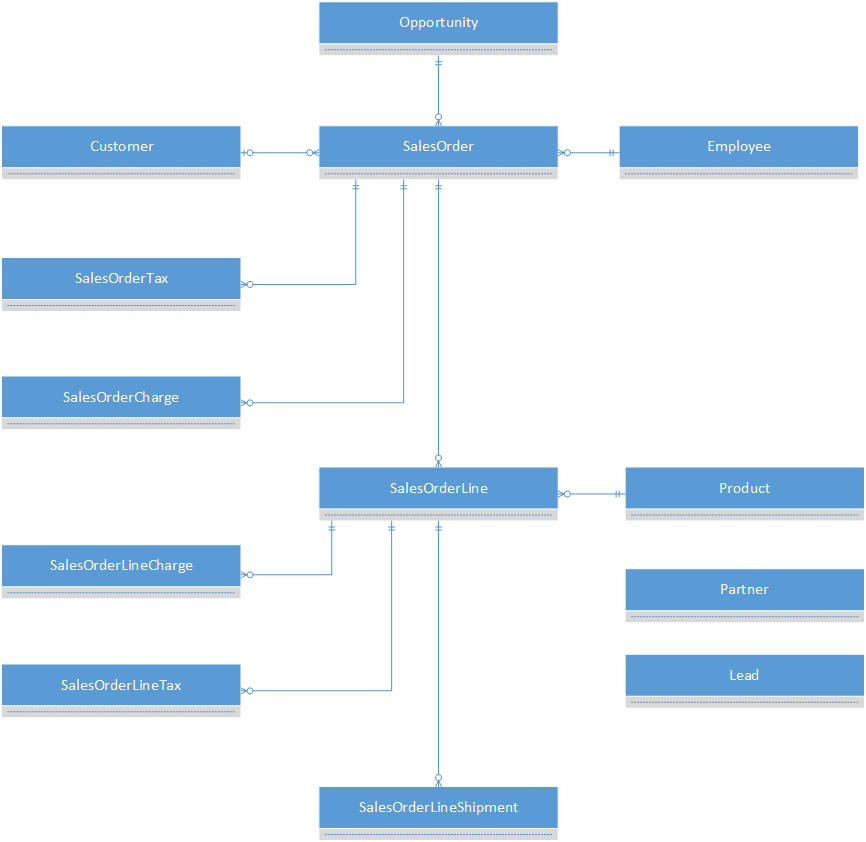
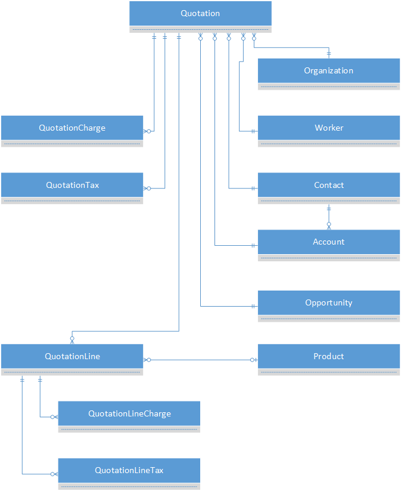
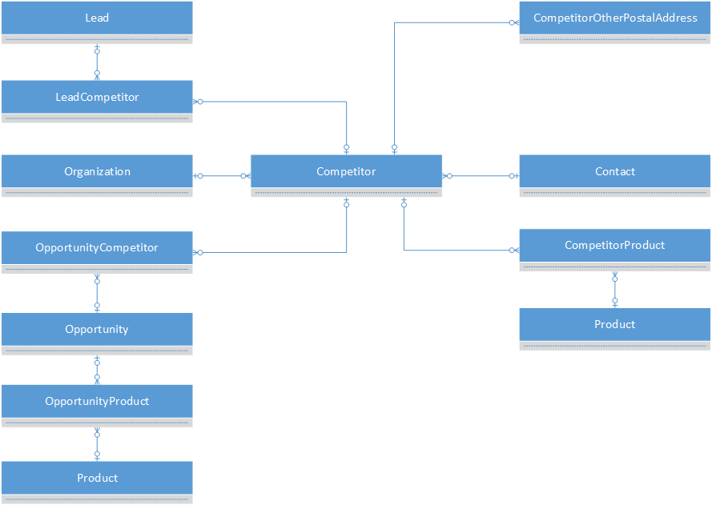
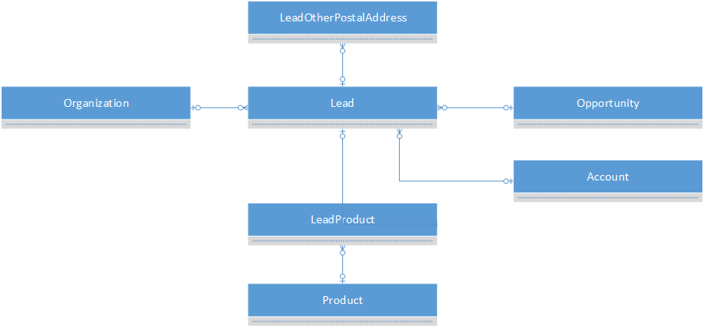

# Sales entities

[!INCLUDE ]

The sales entities let you create end-to-end sales solutions, from tracking leads and opportunities, to following through with contacts, to accepting and delivering orders, to sending invoices.

## Sales invoice ERD

## Sales order ERD

The sales order is modeled with a header, lines, and deliveries. The delivery enables a single line item to be broken up into shipments to different locations. For example, out of 100 items of a specific product, 60 items are shipped to one location, and 40 items are shipped to another location.

## Quotation ERD

## Competitor ERD

## Lead ERD

## Reference

[Sales reference](entity-tables/sales.md "Sales reference")
