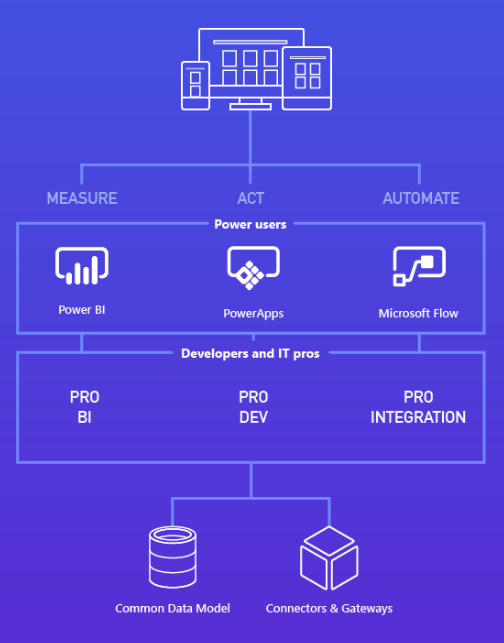

# Common Data Model overview

At the core of the  Common Data Service is the Common Data Model.  The Common Data Model comes pre-populated with many business entities that are useful across a variety of business and application domains.  These entities can be used by apps built atop the Common Data Service via PowerApps or the CDS SDK, or by the integration capabilities that the Common Data Service provides customers.  The Common Data Model is fully extensible - you can add fields to any of the entities that come with the Common Data Service, or create your own. The benefit of the Common Data Model is that applications can work against data without needing to explicitly know where that data is coming from.  

The Common Data Model provides a rich and productive development platform though the following features: 

* __Common Data Model__ – The Common Data Model is a library of entities that represent the most commonly used entities across business and productivity applications. The library is organized for simplicity and rapid discoverability. Typical solutions will revolve around core elements of enterprise data – for example, a worker, an account, a product, or a vendor. Applications across the enterprise will drive updates to that data. The Common Data Model is implemented to simplify the challenges of data management.
* __Data import__ – You can quickly and easily import data from your existing systems. The Common Data Service rapidly establishes trusted connections for IT-managed tenants. The trusted connections continually synchronize the data between your existing systems and your platform solutions.
* __Simple, but rich__ – The Common Data Model balances the richness to be useful and the simplicity to be usable. 
* __Extensibility__ – You can extend the entities without breaking data sharing with other apps. 
* __Robustness__ – Because you can depend on common entities, you can build reusable components that are bound to the entities. The Common Data Model includes a design for extensibility and versioning that protects your development investment.
* __Unification__ – Your solutions can connect information from productivity platforms with data from business applications. For example, you can connect a calendar appointment or a Microsoft Outlook task with a sales opportunity. The Common Data Service connects through standard interfaces, such as the Microsoft Graph application programming interface (API), and maps entities to the productivity platform objects to enable the join relationships with business data.

Additionally, the Common Data Service provides several key capabilities over the Common Data Model including:

* __Build apps with PowerApps__ - For information about creating apps with the Common Data Service and PowerApps, see [Understand entities in the Common Data Service](https://powerapps.microsoft.com/tutorials/data-platform-intro/ "Understand entities in the Common Data Service").
* __Build apps with the CDS SDK__ – Pro Developers and Independent Software Vendors can create applications using PowerApps or with the CDS SDK.  Read more about the CDS SDK [here](cds-sdk-home-page.md)
* __Automate business processes with Flow__ - For information about creating a flow that uses the Common Data Service, see [Create a flow that uses the Common Data Service](https://flow.microsoft.com/documentation/common-data-model-intro/ "Create a flow that uses the Common Data Service").
* __Security__ – The Common Data Service manages access to data in the database and conforms to the security models of the enterprise.  Read more about Common Data Service Security [here](security-home-page.md) 
<!--* __Microsoft Office 365 integration__ – In addition to unifying cloud data silos for analysis, the Common Data Model provides a uniform model that is used to surface data to the Office 365 substrate, and that conforms to application data security models. //-->

<!-- //-->

## Download the documentation
To download the Common Data Service documentation as a single file, see [Microsoft Common Data Model, Entity Reference](http://download.microsoft.com/download/8/9/5/8956ED58-A9B0-40DF-8CB0-BC13AD8DB6E2/CDMEntityReference.docx "Microsoft Common Data Model, Entity Reference").
