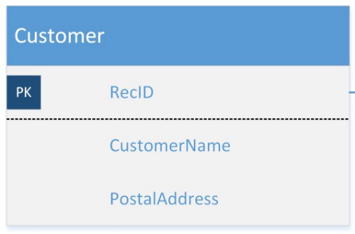
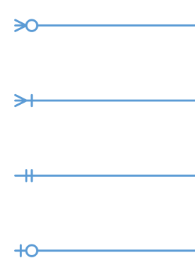

# Entity relationships and lookup fields

[!INCLUDE ]

## Entity relationship diagrams

For each entity group, there is an entity relationship diagram (ERD) that describes the entities and their relationships with each other. An entity is described by an entity object.

Relationships are specified by crow’s foot connectors between entities. Each end of the connector is one of the following.

Diagram | Description
--- | ---
 | Zero or more Example: A company has zero or more business units.  One or more Example: A sales order has one or more order lines.  One and only one Example: A sales order is associated with exactly one customer.  Zero or one Example: A postal address is associated with, at most, one country or region.

The following ERD shows a greatly simplified diagram for a sales order. The interpretation of this model is as follows:
* Each sales order is associated with one and only one customer.
* A customer has zero or more sales orders.
* A sales order consists of one or more sales order lines.
* Each sales order line is associated with one and only one sales order.
* Each sales order line lists one and only one product.
* A product can appear on multiple sales order lines, both within a sales order and across sales orders.

The connectors in the ERD also specify which fields are used as the lookup fields between entities. For example, the __Customer__ field in the SalesOrder entity is a lookup of the __RecordID__ field in the Customer entity. Note that the lookup is not on the __CustomerID__ field.

## Referential integrity
Referential integrity is implemented on lookup fields to help guarantee that associations between rows in entities are valid. The value of the lookup field (also known as a foreign key) in any referencing entity must always refer to a valid row in the referenced entity (by way of the primary key in the referenced entity). In the common data model, the following rules are applied to maintain referential integrity:
* The value of a lookup field must match the primary key of a row in the lookup entity. For example, you cannot associate a sales order line with a non-existent sales order.
* Cascading delete: If a row in the referenced entitiy is deleted, all the associated rows in the referencing entity are deleted. As an example, in the common data model, if a SalesOrder row is deleted, the corresponding SalesOrderCharge, SalesOrderTax, and SalesOrderLine rows are deleted. If a SalesOrderLine row is deleted, corresponding SalesOrderLineTax and SalesOrderLineCharge rows are deleted. The cascading delete rule applies to all entities in a header-line composition.
* Restricted delete: You cannot delete a row in the referenced entity if it has associated rows in the referencing entity. As an example, in the common data model, if you try to delete a Product row, and the Product row is referenced in a SalesOrderLine row, then Product delete will be restricted (blocked). This is called a lookup pattern, and restricted delete is applied to all lookup patterns.

Referential integrity is maintained when data is added or imported into the common data model. If primary keys do not exist, they are created. If you attempt to import data that would break referential integrity, the import will fail.

## Header-line composition
The header-line composition pattern is implemented on the following entity pairs.
* Sales Order and Sales Order Line
* Purchase Order and Purchase Order Line
* Sales Invoice and Sales Invoice Line
* Supplier Invoice and Supplier Invoice Line
* Case and Case Activity

Using Sales Order as an example, the combination of the sales order header (Sales Order entity) and its associated sales order line items (Sales Order Line entity) compose the entire sales order. When a sales order is deleted, all the associated sales order line items are deleted. Note that any customer associated with the sales order is not deleted, even though the sales order is associated with a customer. The entity schema allows a Customer row to exist even if there is no sales order associated with that customer.
