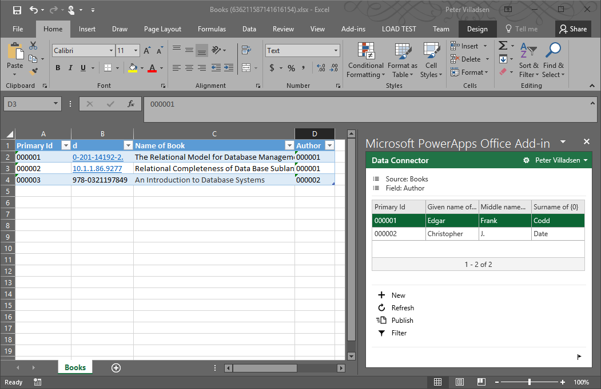

<properties
	pageTitle="Set up relationships | Microsoft PowerApps"
	description="Setting up relationships."
	services="powerapps"
	documentationCenter="na"
	authors="pvillads"
	manager="kfend"
	editor=""
	tags=""/>

<tags
   ms.service="powerapps"
   ms.devlang="na"
   ms.topic="article"
   ms.tgt_pltfrm="na"
   ms.workload="na"
   ms.date="02/13/2017"
   ms.author="kfend"/>

# Set up relationships

When you want to represent data in a relational database, you must determine the data schema by defining the types of your fields, and how your entities relate to each other. Typically, data becomes much more interesting when it is linked to other data through relationships. Creating successful data models is part art and part science. In this topic we will explain how to create 1 to Many relationships in the maker portal.

Let's say you were defining entities to represent authors and the books they write. Clearly, an author can have more than one book to his credit, which is what is known as a 1:Many relationship. In this topic we will not explore the problems involved in managing more complicated cases of mapping more than one author to one or more books, what is colloquially known as a Many to Many relationship.

## Create an Author entity
Let’s start by creating an entity called **Author** in your environment. Make sure that you choose the name of entities judiciously, as there is no way to rename them once they are created. For more information about entities, see [Understand entities in the common data service](https://powerapps.microsoft.com/en-us/tutorials/data-platform-intro/).

Enter the entity display name and description. For the purpose of our scenario, we need the name of the author, so create a field called **Name** of the type **PersonName**. The field does not need to be unique, but it should be required. REquirement options are set in the **Properties** window. Next, add a Date of Birth field called **DOB** with the type, **Date**. You can easily identify the author in a powerapp by adding the **Name** field to the **Default lookup** field group, .

When you added your fields, you may have noticed that the system automatically created a few fields for you. One of these is called Primary Id, of type Autonumber. If you select this field, you can see in the properties pane that this field is unique, i.e. each value is guaranteed to be used only once in this entity. You do not need to manage these values yourself; the system will assign a new value every time you add a new record to the entity. This is what is often called the entity’s _primary key_.

## Add some data to the Author entity
Let’s take a moment to actually get some data into this entity. One easy way to do this is to use the “Open in Excel” button available on the entity page. Press that icon, and wait for Excel to start and do load the PowerApps add-in. For this discussion it seems appropriate the focus on the fathers of relational databases, so we will add

| Primary Id | Given name of Name | Middle name of Name	| Surname of Name | Date of Birth |
| ----------:| -------------------| --------------------| ----------------| -------------:|
000001	| Edgar	| Frank | Codd | 1923-08-19 |
000002	| Christopher |	J. | Date | |

Notice how the values for the Primary ID field are automatically calculated when the data is published (by pressing the “publish” icon on the left hand side, in the PowerApps add-in window). At this point we have data in our entity! If you want to check, you can go to the Data tab on the entity (press Refresh if you have to): The two eminent founders of relational database theory should show up in the table.

## Add the Book entity
So far so good. Now is the time to create the entity that deals with the works that the authors wrote. For this we will create an entity called Book, with a field called Title (that is required) and a field called ISBN (also required). Again, the system will create a Primary ID field that is guaranteed to be unique. While you can argue that the ISBN field is unique for every published book, the field will be also serve for identifying academic papers, and there is no guarantee of uniqueness of those identifying numbers. Feel free to add additional fields, like date of publication and synopsis.

## Linking the two entities
We have created the two entities, but we have not yet linked them to model that there exists a relationship between them. Let’s establish that relationship by opening the Book entity again, and navigating to the Relationship tab. Here we can set up the related entity, which ofcourse is the Author entity. Note that the relationship is always set up on the child entity, i.e. the N part of the 1:N relationship.

If you go back to the Book entity, you will see that adding the relationship to the Author entity resulted in the system adding a new field. The field is called Author\_, i.e. the name of the parent entity with an underscore character appended to it. This field has a special type called Lookup. This is  what is known as the _foreign key_. Imagine there is an author that has the value of its primary key equal to 1234. The relationship between the author and his books is enforced by the fact that the books that are written by that author has the foreign key field, i.e. the Author_ field in this case, set to that value. This is the glue that ties together the book and the author.

Now we will add some books written by the authors, just do demostrate how the foreign key works with the primary key. Select the book entity again, and press the Excel button. After a little while, excel will be ready, showing the fields you defined.

Again, you don't need to worry about the primary ID field; it will be populated when the data is published back to the database. Let's fill in the rest of the fields. Start with the ISBN and Name of Book fields: 

| Primary Id | ISBN | Name of Book | Author |
| ----------:|------| -------------| -------|
|            | 0-201-14192-2| The Relational Model for Database Management   |        |
|            | 10.1.1.86.9277 | Relational Completeness of Data Base Sublanguages | |  
|            | 978-0321197849 | An Introduction to Database Systems	| |

The author field is the foreign key, that maps back to the primary key in the Author entity. When Excel has the cells in this column selected, it will conveniently show the primary keys in that entity in the pane on the right hand side,as shown below:

	

You just have to select the row to get the Author field updated.

At this point you can easily create a powerapp that you can use when you are in the bookstore wanting to stock up on great books. The powerapps designer will do all the heavy lifting for you if you ask it to create the app based on the definition of the two entities and their relationships. You can find more information about that process here: [create an app that uses an entity](data-platform-create-app.md).

