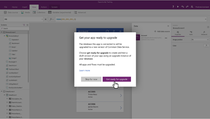
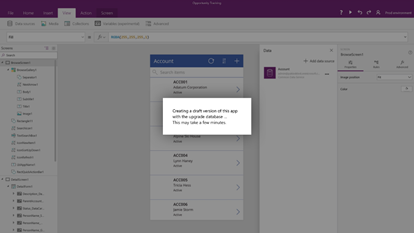
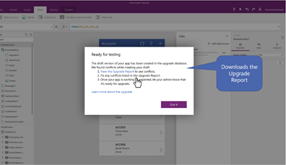

# Step 2: Upgrade and verify your apps and flows to work with new CDS for Apps database

The following users are sent an email asking them to verify that their apps and
flows are working as expected with the test version (CDS for Apps) of the
database. 

-   App and flow owners (creators) who have apps and flows that connect to the
    database. 

-   Users who have edit permissions on the apps. 

> [!NOTE]
> Emails are not sent to security groups. An administrator should
[determine](https://docs.microsoft.com/en-us/powerapps/administrator/admin-manage-apps)
from the PowerApps admin center whether any security groups have edit
permissions on an app, and then reach out to those users separately.

Here is a sample email that users receive: 

## Step 2.1: Upgrade and verify your apps (PowerApps maker)

The email asking to verify apps lists all the apps in the environment where the
user has edit permissions.

> [!]IMPORTANT]
> App makers play a key role of updating and verifying the apps and should work
closely with admins. 

1.  If you select an app, it opens in PowerApps Studio, and prompts you to
    upgrade the app.

    - If you select to upgrade the app, a draft copy of the app is created and
        connected to the test database with the latest version of CDS for Apps.

        

    - If you select **Skip for now**, you’ll be prompted again to upgrade the app
    the next time you (or anyone who has edit permissions) open the app for
    editing. If you’re editing the app when the environment administrator starts
    the upgrade processes, it’s highly recommended that you save and publish
    your ongoing work and then select the option to upgrade the app. The draft
    copy of the app is created from the last published version and updated for
    the new schema.

        

1.  When the draft copy is created and connected to the test database, there can
    be errors and issues. Here are examples of the updates made to the app: 

    -   The connector connects to the test database instead of the previous-version
    database. 

    -   Formulas and other elements are updated to reflect changes in entity names. 

    These changes are “best effort” in that the draft copy might still not work with the test database. App makers must correct all the errors in the app and can, as this graphic shows, download an upgrade report that lists the errors.

    

    Warning signs indicate all the errors, including any that existed before the upgrade. 

    

1.  After correcting the errors, save the app. 

    

1.  Run the app and verify that it works as required.  

> [!NOTE]  
> You can’t publish the draft copy of the app yourself. During step 3 of the upgrade process, when the test database (to which the draft copy of the app connects) is deployed to production, the draft copy of the app is automatically published along with it.

## Step 2.2: Upgrade and verify your flows (Flows maker)

The email asking you to verify your flows lists all the flows that need
attention.

To make the flow-upgrade process seamless, you will find that the affected flows
have already been cloned and prefixed with the word "[Upgraded]". To ensure that
your flows are upgraded correctly, do the following:

1.  Navigate to the **Microsoft Flow Portal** and select the environment in
    which your CDS database is being upgraded.

2.  Edit the "[Upgraded]" flow to ensure that the flow definition looks
    functionally accurate and matches logic of your existing flow. If needed,
    make the necessary changes and save your flow.

3.  Test and validate your flow. Ensure that your flow runs successfully and
    performs the functional tasks that you'd expect it to, on a successful run.

After the database upgrade is complete, delete the old flows and if needed
remove the “[Upgraded]” prefix from the new flow.

> [!NOTE]
> You will receive an email informing you that the upgrade process is complete.

## Next step

